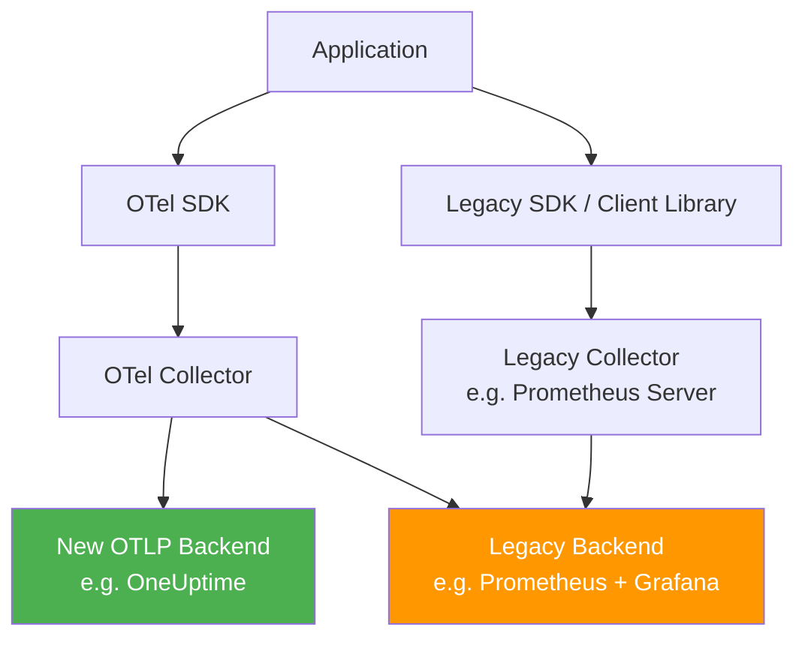

# How to Run Dual Telemetry Pipelines During a Gradual Migration

Author: [nawazdhandala](https://www.github.com/nawazdhandala)

Tags: OpenTelemetry, Migration, Telemetry Pipelines, Observability, Prometheus, Collector

Description: Learn how to run parallel telemetry pipelines during a migration from legacy monitoring to OpenTelemetry, ensuring zero data loss and continuous observability throughout the transition.

---

Migrating your observability stack is not something you do over a weekend. Whether you are moving from Prometheus, Jaeger, Zipkin, or a proprietary vendor to OpenTelemetry, the safest path is to run both systems in parallel until you have full confidence in the new pipeline. This approach, sometimes called dual-write or dual-pipeline, ensures you never lose visibility into your systems during the transition.

This guide covers the architecture, configuration, and operational practices for running dual telemetry pipelines during a gradual migration.

## Why Dual Pipelines?

The core problem with any monitoring migration is trust. Your existing system has dashboards, alerts, runbooks, and institutional knowledge built around it. Switching to a new pipeline overnight means your on-call team loses their familiar tools right when they might need them most.

Running dual pipelines solves this by keeping the old system fully operational while you build confidence in the new one. You can compare data between the two systems, migrate dashboards incrementally, and cut over team by team.



In this architecture, both pipelines receive data from the application. The OpenTelemetry Collector serves as the bridge, capable of forwarding data to both the new and legacy backends simultaneously.

## Strategy 1: Collector-Level Dual Export

The simplest approach is to configure the OpenTelemetry Collector to export to both backends. This works well when you have already adopted the Collector as your central collection point.

```yaml
# collector-config.yaml: dual export for metrics
receivers:
  otlp:
    protocols:
      grpc:
        endpoint: 0.0.0.0:4317
      http:
        endpoint: 0.0.0.0:4318

  # Continue scraping existing Prometheus targets
  prometheus:
    config:
      scrape_configs:
        - job_name: "app-services"
          scrape_interval: 15s
          kubernetes_sd_configs:
            - role: pod

processors:
  batch:
    timeout: 10s
    send_batch_size: 500

  # Add resource attributes to identify the collection path
  resource:
    attributes:
      - key: telemetry.pipeline
        value: "otel-collector"
        action: upsert

exporters:
  # New OTLP backend
  otlp/new:
    endpoint: "oneuptime.example.com:4317"
    tls:
      insecure: false

  # Legacy Prometheus remote write
  prometheusremotewrite/legacy:
    endpoint: "http://prometheus.internal:9090/api/v1/write"
    resource_to_telemetry_conversion:
      enabled: true

service:
  pipelines:
    # Single pipeline that exports to both destinations
    metrics:
      receivers: [otlp, prometheus]
      processors: [batch, resource]
      exporters: [otlp/new, prometheusremotewrite/legacy]
```

The Collector receives metrics from both OTLP-instrumented services and Prometheus-scraped endpoints, then exports to both backends. This is the most common dual-pipeline pattern because it requires no changes to application code.

## Strategy 2: Application-Level Dual Instrumentation

Sometimes you need both the OpenTelemetry SDK and a legacy client library running in the same application process. This is typical early in a migration when you are rewriting instrumentation code incrementally.

Here is an example in Python where both the Prometheus client and OpenTelemetry SDK coexist:

```python
# dual_metrics.py
# Both libraries can run side by side in the same process

from prometheus_client import Counter as PromCounter, start_http_server
from opentelemetry import metrics
from opentelemetry.sdk.metrics import MeterProvider
from opentelemetry.sdk.metrics.export import PeriodicExportingMetricReader
from opentelemetry.exporter.otlp.proto.grpc.metric_exporter import OTLPMetricExporter

# --- Legacy Prometheus instrumentation ---
# This counter serves data on the /metrics endpoint for Prometheus scraping
prom_requests = PromCounter(
    "http_requests_total",
    "Total HTTP requests",
    ["method", "status"],
)

# --- New OpenTelemetry instrumentation ---
# Configure the OTel SDK to push metrics via OTLP
exporter = OTLPMetricExporter(endpoint="localhost:4317", insecure=True)
reader = PeriodicExportingMetricReader(exporter, export_interval_millis=30000)
provider = MeterProvider(metric_readers=[reader])
metrics.set_meter_provider(provider)

meter = metrics.get_meter("my-service")
otel_requests = meter.create_counter(
    "http.server.request.count",
    description="Total HTTP requests",
)

def handle_request(method, status):
    """Record a request in both systems during the migration period."""
    # Legacy: increment Prometheus counter
    prom_requests.labels(method=method, status=status).inc()

    # New: increment OpenTelemetry counter
    otel_requests.add(1, {"http.method": method, "http.status_code": status})

# Start the Prometheus metrics server on port 9090
start_http_server(9090)
```

This approach has more overhead since you are recording every metric twice, but it gives you the most granular control over the migration. You can migrate one metric at a time and remove the Prometheus call once you have verified the OTel version matches.

## Strategy 3: Separate Pipeline Paths

For organizations with many teams and services, you can run completely independent pipelines and let each team migrate on their own schedule:

```yaml
# collector-config.yaml: separate pipelines per signal origin
receivers:
  # New services sending OTLP
  otlp:
    protocols:
      grpc:
        endpoint: 0.0.0.0:4317

  # Legacy services still exposing Prometheus format
  prometheus:
    config:
      scrape_configs:
        - job_name: "legacy-services"
          scrape_interval: 15s
          static_configs:
            - targets: ["legacy-svc-1:9090", "legacy-svc-2:9090"]

processors:
  batch/new:
    timeout: 10s
  batch/legacy:
    timeout: 10s

exporters:
  otlp/new_backend:
    endpoint: "oneuptime.example.com:4317"
  prometheusremotewrite/legacy_backend:
    endpoint: "http://prometheus.internal:9090/api/v1/write"

service:
  pipelines:
    # Pipeline for services already on OpenTelemetry
    metrics/new:
      receivers: [otlp]
      processors: [batch/new]
      exporters: [otlp/new_backend]

    # Pipeline for legacy Prometheus services
    # Still exports to OTLP backend for comparison
    metrics/legacy:
      receivers: [prometheus]
      processors: [batch/legacy]
      exporters: [otlp/new_backend, prometheusremotewrite/legacy_backend]
```

This configuration uses named pipelines to keep the data paths separate. Legacy services continue to be scraped and their metrics are sent to both backends. New services that already speak OTLP go straight to the new backend. As teams migrate their services, you move targets from the legacy pipeline to the new one.

## Validating Data Consistency

Running dual pipelines is only useful if you actually compare the data. Here are practical ways to verify consistency:

**1. Compare metric counts**: Query both backends for the same metric over the same time range. The values should be close, though small differences are expected due to timing and aggregation boundaries.

```promql
# In Prometheus: total requests in the last hour
sum(increase(http_requests_total[1h]))

# In your OTLP backend: same query using the equivalent metric
# The exact syntax depends on your backend
sum(increase(http.server.request.count[1h]))
```

**2. Use the Collector's internal metrics**: The Collector exposes metrics about its own operation. Monitor these to ensure both export paths are healthy:

```yaml
# Enable telemetry on the collector itself
service:
  telemetry:
    metrics:
      # The collector exposes its own metrics on this address
      address: 0.0.0.0:8888
      level: detailed
```

Key metrics to watch include `otelcol_exporter_sent_metric_points` and `otelcol_exporter_send_failed_metric_points` for each exporter.

**3. Build comparison dashboards**: Create a side-by-side dashboard that shows the same data from both backends. This makes it easy to spot discrepancies and builds team confidence in the new system.

## Managing the Cutover

Once you have validated the new pipeline, the cutover process should be gradual:

1. **Start with non-critical alerts**. Duplicate alert rules in the new backend and let them fire in parallel for a few weeks. Compare alert timing and accuracy.
2. **Migrate dashboards per team**. Let each team rebuild their dashboards in the new system and verify them against the old ones.
3. **Switch on-call to the new system**. Once a team trusts their new dashboards and alerts, they can start using the new system as their primary source.
4. **Remove legacy exporters**. After a team has been running on the new system for a comfortable period (two to four weeks is common), remove the legacy export path from the Collector configuration.
5. **Decommission the legacy backend**. Once all teams have migrated, shut down the old monitoring infrastructure.

## Handling Traces and Logs

The same dual-pipeline approach works for traces and logs. Here is a configuration that exports traces to both Jaeger (legacy) and an OTLP backend (new):

```yaml
exporters:
  otlp/new:
    endpoint: "oneuptime.example.com:4317"

  # Legacy Jaeger backend
  jaeger:
    endpoint: "jaeger-collector.internal:14250"
    tls:
      insecure: true

service:
  pipelines:
    traces:
      receivers: [otlp]
      processors: [batch]
      exporters: [otlp/new, jaeger]
```

The pattern is identical. The Collector acts as the fan-out point, sending the same data to multiple destinations.

## Cost and Performance Considerations

Dual pipelines double your telemetry egress and storage costs. Here are ways to manage the impact:

- **Use sampling for traces**: Apply tail sampling in the Collector to reduce trace volume in the new backend while keeping full fidelity in the legacy system (or vice versa).
- **Reduce export frequency for the legacy path**: If your legacy system only needs data for fallback, you can batch more aggressively on that export path.
- **Set a time limit**: Agree upfront on a migration timeline. Open-ended dual pipelines tend to become permanent, which defeats the purpose.
- **Monitor Collector resource usage**: Dual export increases the Collector's CPU and memory consumption. Make sure your Collector instances are sized appropriately.

## Conclusion

Running dual telemetry pipelines is the safest way to migrate from a legacy monitoring stack to OpenTelemetry. The OpenTelemetry Collector's ability to receive data from multiple sources and export to multiple destinations makes it the natural hub for this kind of migration. Start with collector-level dual export, validate the data, migrate team by team, and decommission the old system once everyone is comfortable. The extra operational cost of running two systems is well worth the confidence it provides.
