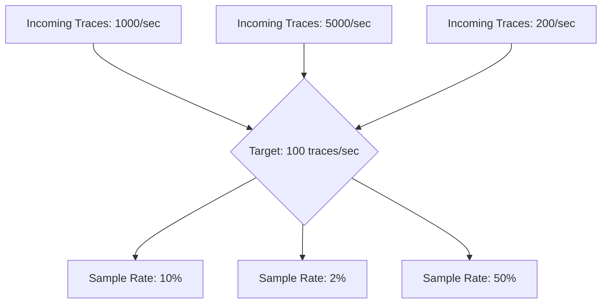

# How to Implement Dynamic Sampling Rates That Scale with Traffic to Control Costs

Author: [nawazdhandala](https://www.github.com/nawazdhandala)

Tags: OpenTelemetry, Sampling, Cost Control, Traffic Management

Description: Implement dynamic trace sampling in OpenTelemetry that automatically adjusts rates based on traffic volume to keep costs predictable.

Static sampling rates break under variable traffic. If you set a 10% sampling rate tuned for normal traffic, a 5x traffic spike during a sale event means 5x the telemetry cost. Conversely, during low-traffic periods, 10% sampling might not capture enough data to be useful for debugging.

Dynamic sampling solves this by adjusting the sampling rate in response to current traffic volume. The goal is to maintain a roughly constant number of sampled traces per time window, regardless of how much traffic you are handling.

## How Dynamic Sampling Works

The core idea is simple: instead of sampling a fixed percentage of traces, you target a fixed number of traces per second (or per minute). As traffic increases, the sampling percentage decreases. As traffic drops, the percentage increases.



## Using the Probabilistic Sampler with a Controller

The OpenTelemetry Collector's `probabilistic_sampler` processor supports a fixed sampling percentage. To make it dynamic, you need a control loop that periodically recalculates the rate and updates the Collector configuration.

First, here is the baseline Collector config with probabilistic sampling:

```yaml
# otel-collector-config.yaml
# Baseline config with probabilistic sampling
# The sampling_percentage will be updated dynamically by the controller

receivers:
  otlp:
    protocols:
      grpc:
        endpoint: 0.0.0.0:4317

processors:
  probabilistic_sampler:
    # This value gets overridden by the dynamic controller
    sampling_percentage: 10

exporters:
  otlp:
    endpoint: "backend:4317"
    tls:
      insecure: true

service:
  pipelines:
    traces:
      receivers: [otlp]
      processors: [probabilistic_sampler]
      exporters: [otlp]
```

## Building the Dynamic Sampling Controller

The controller queries the Collector's internal metrics to determine current throughput, calculates the appropriate sampling rate, and updates the config. Here is a Python implementation:

```python
# dynamic_sampler.py
# Adjusts the OTel Collector's sampling rate based on current traffic volume
# Runs as a sidecar or cron job alongside the Collector

import requests
import yaml
import time
import subprocess
import os

# Configuration
TARGET_TRACES_PER_SECOND = 100     # How many traces/sec you want to keep
MIN_SAMPLING_RATE = 1.0            # Never sample less than 1%
MAX_SAMPLING_RATE = 100.0          # Can go up to 100% during low traffic
PROMETHEUS_URL = "http://localhost:8888"  # Collector's internal metrics
CONFIG_PATH = "/etc/otelcol/config.yaml"
CHECK_INTERVAL_SECONDS = 30

def get_current_throughput():
    """Query the Collector's internal metrics for current span throughput."""
    query = "rate(otelcol_receiver_accepted_spans[1m])"
    resp = requests.get(
        f"{PROMETHEUS_URL}/api/v1/query",
        params={"query": query}
    )
    results = resp.json()["data"]["result"]
    if not results:
        return 0
    # Sum across all receivers
    return sum(float(r["value"][1]) for r in results)

def calculate_sampling_rate(current_throughput):
    """Calculate the sampling percentage to hit the target trace rate."""
    if current_throughput <= 0:
        return MAX_SAMPLING_RATE

    ideal_rate = (TARGET_TRACES_PER_SECOND / current_throughput) * 100
    # Clamp between min and max
    return max(MIN_SAMPLING_RATE, min(MAX_SAMPLING_RATE, ideal_rate))

def update_collector_config(new_rate):
    """Update the Collector config file with the new sampling rate."""
    with open(CONFIG_PATH, "r") as f:
        config = yaml.safe_load(f)

    current_rate = config["processors"]["probabilistic_sampler"]["sampling_percentage"]

    # Only update if the rate changed by more than 1%
    if abs(current_rate - new_rate) < 1.0:
        return False

    config["processors"]["probabilistic_sampler"]["sampling_percentage"] = round(new_rate, 1)

    with open(CONFIG_PATH, "w") as f:
        yaml.dump(config, f, default_flow_style=False)

    return True

def reload_collector():
    """Send SIGHUP to the Collector to reload config without restart."""
    os.system("kill -HUP $(pgrep otelcol-contrib)")

def main():
    print(f"Dynamic sampler started. Target: {TARGET_TRACES_PER_SECOND} traces/sec")
    while True:
        throughput = get_current_throughput()
        new_rate = calculate_sampling_rate(throughput)
        updated = update_collector_config(new_rate)

        if updated:
            reload_collector()
            print(f"Throughput: {throughput:.0f}/sec - Sampling rate updated to {new_rate:.1f}%")
        else:
            print(f"Throughput: {throughput:.0f}/sec - Rate unchanged at {new_rate:.1f}%")

        time.sleep(CHECK_INTERVAL_SECONDS)

if __name__ == "__main__":
    main()
```

## Tail Sampling with Rate Limiting

An alternative approach uses the Collector's `tail_sampling` processor combined with rate-based policies. Tail sampling makes decisions after seeing the complete trace, so it can make smarter choices about what to keep.

```yaml
# otel-collector-config.yaml
# Tail sampling with rate limiting to cap trace volume

processors:
  tail_sampling:
    decision_wait: 10s
    num_traces: 50000
    policies:
      # Always keep traces with errors regardless of traffic volume
      - name: errors-always
        type: status_code
        status_code:
          status_codes:
            - ERROR

      # Always keep slow traces (latency over 2 seconds)
      - name: slow-traces
        type: latency
        latency:
          threshold_ms: 2000

      # Rate-limit everything else to a fixed number per second
      - name: rate-limited-baseline
        type: rate_limiting
        rate_limiting:
          spans_per_second: 500

      # Composite policy: combine all the above
      - name: composite
        type: composite
        composite:
          max_total_spans_per_second: 1000
          policy_order: [errors-always, slow-traces, rate-limited-baseline]
          composite_sub_policy:
            - name: errors-always
              percent_allocation: 40
            - name: slow-traces
              percent_allocation: 30
            - name: rate-limited-baseline
              percent_allocation: 30
```

This configuration guarantees that error traces and high-latency traces are prioritized, while normal traces are rate-limited to a predictable volume.

## Deploying the Controller as a Kubernetes Sidecar

If you run the Collector in Kubernetes, deploy the dynamic sampler as a sidecar container sharing the config volume:

```yaml
# k8s-collector-deployment.yaml
# Deploy the OTel Collector with a dynamic sampling sidecar

apiVersion: apps/v1
kind: Deployment
metadata:
  name: otel-collector
spec:
  template:
    spec:
      volumes:
        - name: collector-config
          configMap:
            name: otel-collector-config
      containers:
        - name: collector
          image: otel/opentelemetry-collector-contrib:latest
          args: ["--config=/etc/otelcol/config.yaml"]
          volumeMounts:
            - name: collector-config
              mountPath: /etc/otelcol

        - name: dynamic-sampler
          image: your-registry/dynamic-sampler:latest
          env:
            - name: TARGET_TRACES_PER_SECOND
              value: "200"
            - name: CHECK_INTERVAL_SECONDS
              value: "30"
          volumeMounts:
            - name: collector-config
              mountPath: /etc/otelcol
```

## Choosing Your Target Rate

Your target traces per second depends on your debugging needs and budget. A reasonable starting point:

- **Small team (< 10 services)**: 50-100 traces/sec
- **Medium team (10-50 services)**: 200-500 traces/sec
- **Large team (50+ services)**: 1000-5000 traces/sec

Monitor your sampled data to make sure you still capture enough error traces and slow requests. If your error detection rate drops after enabling dynamic sampling, increase the target or add priority rules for error traces as shown in the tail sampling config above.

The key benefit of dynamic sampling is cost predictability. Your telemetry bill becomes a function of your target rate, not your traffic volume. During Black Friday or a traffic surge, your costs stay flat while your sampling percentage adjusts automatically.
