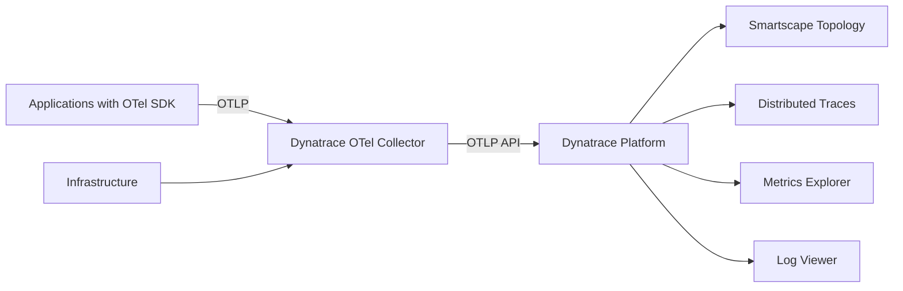
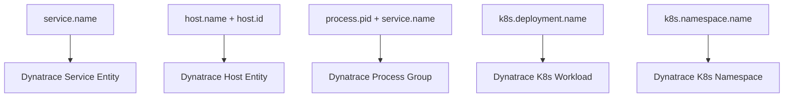

# How to Use Dynatrace Distribution of OpenTelemetry Collector

Author: [nawazdhandala](https://www.github.com/nawazdhandala)

Tags: OpenTelemetry, Dynatrace, Observability, Monitoring, APM, Cloud

Description: A hands-on guide to deploying and configuring the Dynatrace Distribution of OpenTelemetry Collector for traces, metrics, and logs ingestion.

---

Dynatrace offers its own distribution of the OpenTelemetry Collector that is designed to work with the Dynatrace platform. It includes the Dynatrace-specific OTLP exporter configuration, resource detection for Dynatrace entities, and pre-built settings that align telemetry data with Dynatrace's data model and topology.

If you are a Dynatrace customer looking to bring in OpenTelemetry data, this distribution simplifies the integration. Let's go through the setup, configuration, and how it compares to using the upstream collector with Dynatrace's OTLP API.

## How Dynatrace Handles OpenTelemetry

Dynatrace has a native OTLP API endpoint, which means any OTel Collector (upstream or Dynatrace distribution) can send data to Dynatrace using the standard OTLP exporter. The Dynatrace distribution adds optimizations and defaults on top of this.



Dynatrace uses its Smartscape topology model to automatically map incoming OTel data to services, hosts, and processes. The Dynatrace distribution helps ensure the right resource attributes are present for this mapping to work.

## Installing the Dynatrace Distribution

### Docker

Run the Dynatrace distribution in a container:

```bash
# Run the Dynatrace OTel Collector
docker run -d \
  --name dt-otel-collector \
  -e DT_ENDPOINT=https://your-environment.live.dynatrace.com/api/v2/otlp \
  -e DT_API_TOKEN=your-api-token \
  -p 4317:4317 \
  -p 4318:4318 \
  -v ./dt-config.yaml:/etc/otelcol/config.yaml \
  ghcr.io/dynatrace/dynatrace-otel-collector/dynatrace-otel-collector:latest \
  --config /etc/otelcol/config.yaml
```

### On Linux

Download and install the binary:

```bash
# Download the Dynatrace OTel Collector for Linux
curl -L -o dt-otel-collector.tar.gz \
  https://github.com/Dynatrace/dynatrace-otel-collector/releases/latest/download/dynatrace-otel-collector-linux-amd64.tar.gz

tar -xzf dt-otel-collector.tar.gz
sudo mv dynatrace-otel-collector /usr/local/bin/

# Run with your config file
dynatrace-otel-collector --config /etc/otelcol/dt-config.yaml
```

### Kubernetes with Helm

Deploy on Kubernetes:

```bash
# Add the Dynatrace Helm repository
helm repo add dynatrace https://raw.githubusercontent.com/Dynatrace/dynatrace-otel-collector/main/helm
helm repo update

# Install the Dynatrace OTel Collector
helm install dt-otel-collector dynatrace/dynatrace-otel-collector \
  --namespace monitoring \
  --create-namespace \
  --set dynatrace.apiToken=your-api-token \
  --set dynatrace.endpoint=https://your-env.live.dynatrace.com/api/v2/otlp
```

## Basic Configuration

Here is a complete configuration for sending all signal types to Dynatrace:

```yaml
# Dynatrace OTel Collector configuration
# Routes traces, metrics, and logs to Dynatrace via OTLP

receivers:
  # Accept OTLP from instrumented apps
  otlp:
    protocols:
      grpc:
        endpoint: 0.0.0.0:4317
      http:
        endpoint: 0.0.0.0:4318

processors:
  # Batch telemetry for efficient ingestion
  batch:
    timeout: 10s
    send_batch_size: 1000

  # Limit memory usage
  memory_limiter:
    check_interval: 1s
    limit_mib: 512
    spike_limit_mib: 128

  # Detect environment resources for Dynatrace entity mapping
  # This is important for Smartscape topology
  resourcedetection:
    detectors: [system, env, ec2, gcp, azure, docker]
    override: false

  # Make sure required resource attributes are present
  # Dynatrace needs these for proper entity creation
  resource:
    attributes:
      - key: service.name
        from_attribute: service.name
        action: upsert
      - key: deployment.environment
        value: production
        action: upsert
      - key: dt.security_context
        value: "otel-collector"
        action: upsert

exporters:
  # Send to Dynatrace using OTLP HTTP
  # Dynatrace exposes an OTLP API at /api/v2/otlp
  otlphttp/dynatrace:
    endpoint: "${DT_ENDPOINT}"
    headers:
      Authorization: "Api-Token ${DT_API_TOKEN}"

service:
  pipelines:
    traces:
      receivers: [otlp]
      processors: [memory_limiter, resourcedetection, resource, batch]
      exporters: [otlphttp/dynatrace]
    metrics:
      receivers: [otlp]
      processors: [memory_limiter, resourcedetection, resource, batch]
      exporters: [otlphttp/dynatrace]
    logs:
      receivers: [otlp]
      processors: [memory_limiter, resourcedetection, resource, batch]
      exporters: [otlphttp/dynatrace]
```

## Dynatrace API Token Permissions

The API token needs specific scopes for each signal type. Here are the required scopes:

```
Traces:    openTelemetryTrace.ingest
Metrics:   metrics.ingest
Logs:      logs.ingest
```

Create the token in your Dynatrace environment under Settings > Integration > Dynatrace API.

## Host Monitoring with the Dynatrace Distribution

Collect infrastructure metrics and send them to Dynatrace:

```yaml
receivers:
  # Collect host metrics for infrastructure monitoring
  hostmetrics:
    collection_interval: 30s
    scrapers:
      cpu:
        metrics:
          system.cpu.utilization:
            enabled: true
      memory:
        metrics:
          system.memory.utilization:
            enabled: true
      disk:
      filesystem:
      network:
      load:
      paging:

  # Prometheus scraping for application metrics
  prometheus:
    config:
      scrape_configs:
        - job_name: 'my-app'
          scrape_interval: 30s
          static_configs:
            - targets: ['localhost:9090']

processors:
  batch:
    timeout: 10s

  resourcedetection:
    detectors: [system, env]
    system:
      hostname_sources: ["os"]
      resource_attributes:
        host.id:
          enabled: true
        host.name:
          enabled: true
        os.type:
          enabled: true

  # Cumulative to delta conversion
  # Dynatrace works best with delta temporality for certain metrics
  cumulativetodelta:
    include:
      match_type: strict
      metrics:
        - system.cpu.time
        - system.disk.io
        - system.disk.operations
        - system.network.io

exporters:
  otlphttp/dynatrace:
    endpoint: "${DT_ENDPOINT}"
    headers:
      Authorization: "Api-Token ${DT_API_TOKEN}"

service:
  pipelines:
    metrics:
      receivers: [hostmetrics, prometheus]
      processors: [resourcedetection, cumulativetodelta, batch]
      exporters: [otlphttp/dynatrace]
```

## Kubernetes Deployment

Full Kubernetes DaemonSet configuration for the Dynatrace distribution:

```yaml
# dt-otel-configmap.yaml
apiVersion: v1
kind: ConfigMap
metadata:
  name: dt-otel-config
  namespace: monitoring
data:
  config.yaml: |
    receivers:
      otlp:
        protocols:
          grpc:
            endpoint: 0.0.0.0:4317
          http:
            endpoint: 0.0.0.0:4318

      kubeletstats:
        collection_interval: 30s
        auth_type: serviceAccount
        endpoint: "https://${env:NODE_NAME}:10250"
        insecure_skip_verify: true
        metric_groups:
          - node
          - pod
          - container

    processors:
      batch:
        timeout: 10s
        send_batch_size: 2048

      memory_limiter:
        check_interval: 5s
        limit_mib: 400
        spike_limit_mib: 100

      k8sattributes:
        auth_type: serviceAccount
        extract:
          metadata:
            - k8s.pod.name
            - k8s.namespace.name
            - k8s.deployment.name
            - k8s.node.name
            - k8s.pod.uid
          labels:
            - tag_name: app.label.team
              key: team
              from: pod

      resourcedetection:
        detectors: [env, system]

      # Enrich with Dynatrace entity attributes
      resource/dt:
        attributes:
          - key: k8s.cluster.name
            value: "${env:CLUSTER_NAME}"
            action: upsert

    exporters:
      otlphttp/dynatrace:
        endpoint: "${env:DT_ENDPOINT}"
        headers:
          Authorization: "Api-Token ${env:DT_API_TOKEN}"

    service:
      pipelines:
        traces:
          receivers: [otlp]
          processors: [memory_limiter, k8sattributes, resourcedetection, resource/dt, batch]
          exporters: [otlphttp/dynatrace]
        metrics:
          receivers: [otlp, kubeletstats]
          processors: [memory_limiter, k8sattributes, resourcedetection, resource/dt, batch]
          exporters: [otlphttp/dynatrace]
        logs:
          receivers: [otlp]
          processors: [memory_limiter, k8sattributes, resourcedetection, resource/dt, batch]
          exporters: [otlphttp/dynatrace]
---
apiVersion: apps/v1
kind: DaemonSet
metadata:
  name: dt-otel-collector
  namespace: monitoring
spec:
  selector:
    matchLabels:
      app: dt-otel-collector
  template:
    metadata:
      labels:
        app: dt-otel-collector
    spec:
      serviceAccountName: dt-otel-collector
      containers:
        - name: collector
          image: ghcr.io/dynatrace/dynatrace-otel-collector/dynatrace-otel-collector:latest
          args: ["--config", "/conf/config.yaml"]
          env:
            - name: DT_ENDPOINT
              value: "https://your-env.live.dynatrace.com/api/v2/otlp"
            - name: DT_API_TOKEN
              valueFrom:
                secretKeyRef:
                  name: dynatrace-otel-secret
                  key: api-token
            - name: NODE_NAME
              valueFrom:
                fieldRef:
                  fieldPath: spec.nodeName
            - name: CLUSTER_NAME
              value: "my-cluster"
          ports:
            - containerPort: 4317
            - containerPort: 4318
          volumeMounts:
            - name: config
              mountPath: /conf
          resources:
            requests:
              cpu: 200m
              memory: 256Mi
            limits:
              cpu: 500m
              memory: 512Mi
      volumes:
        - name: config
          configMap:
            name: dt-otel-config
```

## Smartscape Entity Mapping

For Dynatrace to correctly map OTel data to Smartscape entities (services, hosts, processes), certain resource attributes must be present:



Make sure your instrumentation or collector processors set these attributes. The `resourcedetection` processor handles most of them automatically, but `service.name` must come from your application's OTel SDK configuration.

## Dynatrace ActiveGate as a Proxy

In some environments, you send data through Dynatrace ActiveGate instead of directly to the cluster endpoint. The OTLP endpoint on ActiveGate looks different:

```yaml
# Sending through ActiveGate instead of directly to the cluster
exporters:
  otlphttp/dynatrace-ag:
    endpoint: "https://your-activegate:9999/e/your-env-id/api/v2/otlp"
    headers:
      Authorization: "Api-Token ${DT_API_TOKEN}"
    tls:
      # If ActiveGate uses a self-signed certificate
      insecure_skip_verify: false
      ca_file: /etc/ssl/certs/activegate-ca.pem
```

## Dual Export Configuration

Send data to Dynatrace and another backend:

```yaml
exporters:
  # Primary: Dynatrace
  otlphttp/dynatrace:
    endpoint: "${DT_ENDPOINT}"
    headers:
      Authorization: "Api-Token ${DT_API_TOKEN}"

  # Secondary: OneUptime
  otlphttp/oneuptime:
    endpoint: "https://otlp.oneuptime.com"
    headers:
      x-oneuptime-token: "${ONEUPTIME_TOKEN}"

service:
  pipelines:
    traces:
      receivers: [otlp]
      processors: [resourcedetection, batch]
      exporters: [otlphttp/dynatrace, otlphttp/oneuptime]
    metrics:
      receivers: [otlp]
      processors: [resourcedetection, batch]
      exporters: [otlphttp/dynatrace, otlphttp/oneuptime]
```

## Dynatrace Distribution vs Upstream Collector

| Feature | Dynatrace Distribution | Upstream Contrib |
|---------|----------------------|-----------------|
| Smartscape mapping | Optimized | Manual attribute config |
| Resource detection | Dynatrace-aware | Generic |
| OTLP export to DT | Pre-configured | Manual endpoint + auth |
| ActiveGate support | Built-in | Manual TLS config |
| Delta conversion | Pre-configured | Manual setup |
| Non-DT exporters | Limited | Full contrib set |
| Support | Dynatrace support | Community |
| Release testing | Against DT platform | Community testing |

## When to Use the Dynatrace Distribution

Choose the Dynatrace distribution when:

- Dynatrace is your primary observability platform
- You want Smartscape entity mapping to work correctly without manual tuning
- You are deploying on Kubernetes and want tested Helm charts
- You have a Dynatrace support contract

The upstream collector with the OTLP HTTP exporter pointed at Dynatrace works well too. Since Dynatrace accepts standard OTLP, the main advantage of the Dynatrace distribution is pre-configured defaults and testing against the Dynatrace platform. If you are comfortable configuring the resource attributes and OTLP endpoint yourself, the upstream collector is a fine choice.
