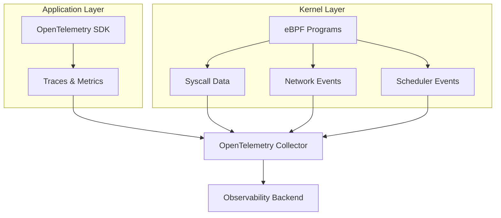
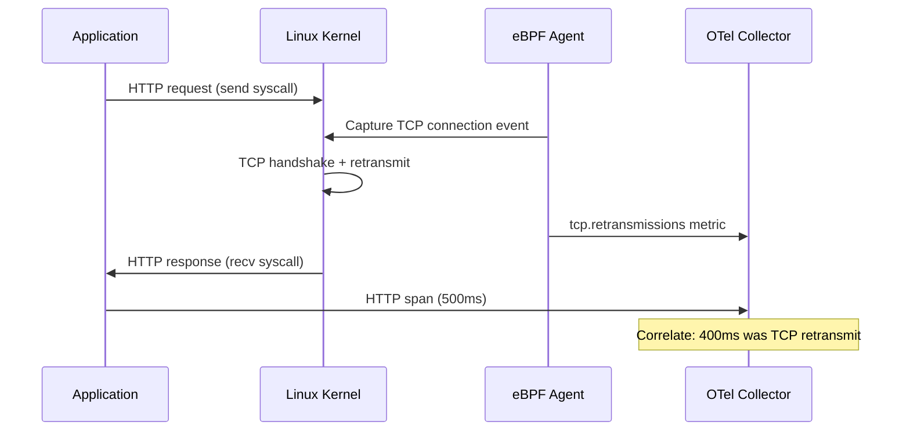

# How to Use eBPF with OpenTelemetry for Kernel-Level Observability

Author: [nawazdhandala](https://www.github.com/nawazdhandala)

Tags: OpenTelemetry, eBPF, Kernel, Observability, Linux, Networking, Performance

Description: Learn how to combine eBPF with OpenTelemetry to gain kernel-level observability for network traffic, syscalls, and system performance without modifying application code.

---

> eBPF lets you run sandboxed programs inside the Linux kernel without modifying kernel source code or loading kernel modules. When combined with OpenTelemetry, it gives you deep visibility into system-level behavior that application instrumentation simply cannot reach.

Traditional OpenTelemetry instrumentation works at the application level. You add SDKs to your code, instrument your frameworks, and collect traces and metrics from your business logic. But what about the time your request spends in the kernel's TCP stack? What about DNS resolution delays, disk I/O scheduling, or context switch overhead? These are invisible to application-level instrumentation.

eBPF bridges this gap by letting you attach tiny programs to kernel events and feed that data into your OpenTelemetry pipeline. This guide shows you how to set it up.

---

## How eBPF and OpenTelemetry Complement Each Other

Application instrumentation and kernel instrumentation serve different purposes. Together, they provide complete visibility across the entire stack.



Application instrumentation tells you that an HTTP request to your database took 500ms. eBPF tells you that 400ms of that was spent waiting for a TCP retransmission due to packet loss on the network interface. Without both pieces of information, you would be blaming your database query when the real culprit is the network.

---

## Setting Up eBPF-Based Auto-Instrumentation

One of the most practical uses of eBPF with OpenTelemetry is automatic instrumentation without touching application code. Projects like Beyla (from Grafana) and OpenTelemetry's own eBPF instrumentation agent can detect HTTP, gRPC, and database calls by observing kernel-level network events.

First, deploy the eBPF agent as a DaemonSet in your Kubernetes cluster:

```yaml
# ebpf-agent-daemonset.yaml
# This deploys an eBPF-based OpenTelemetry agent on every node
# It automatically discovers and instruments all running services
apiVersion: apps/v1
kind: DaemonSet
metadata:
  name: otel-ebpf-agent
  namespace: monitoring
spec:
  selector:
    matchLabels:
      app: otel-ebpf-agent
  template:
    metadata:
      labels:
        app: otel-ebpf-agent
    spec:
      hostPID: true
      hostNetwork: true
      containers:
        - name: ebpf-agent
          image: ghcr.io/open-telemetry/opentelemetry-ebpf-instrumentation:latest
          securityContext:
            # eBPF programs need elevated privileges to attach to kernel hooks
            privileged: true
            capabilities:
              add:
                - SYS_ADMIN
                - SYS_PTRACE
                - NET_ADMIN
          env:
            # Tell the agent where to send telemetry data
            - name: OTEL_EXPORTER_OTLP_ENDPOINT
              value: "http://otel-collector.monitoring:4317"
            # Automatically detect and instrument HTTP and gRPC services
            - name: OTEL_EBPF_PROTOCOLS
              value: "http,grpc,sql"
            # Set the sampling rate to reduce overhead on busy nodes
            - name: OTEL_EBPF_SAMPLE_RATE
              value: "50"
          volumeMounts:
            # Mount debugfs for eBPF tracepoint access
            - name: debugfs
              mountPath: /sys/kernel/debug
            # Mount the cgroup filesystem for process tracking
            - name: cgroup
              mountPath: /sys/fs/cgroup
      volumes:
        - name: debugfs
          hostPath:
            path: /sys/kernel/debug
        - name: cgroup
          hostPath:
            path: /sys/fs/cgroup
```

This DaemonSet attaches eBPF programs to kernel tracepoints on every node. It watches for TCP connections, HTTP request/response patterns, and SQL wire protocol messages. When it detects these, it creates OpenTelemetry spans and sends them to your collector.

---

## Writing Custom eBPF Programs for OpenTelemetry

For deeper kernel-level observability, you can write custom eBPF programs that capture specific system events and export them as OpenTelemetry metrics. Here is an example using `bpftrace` syntax to track TCP retransmissions and export them as OTLP metrics:

```python
#!/usr/bin/env python3
# tcp_retransmit_otel.py
# This script uses BCC (BPF Compiler Collection) to track TCP retransmissions
# and exports them as OpenTelemetry metrics

from bcc import BPF
from opentelemetry import metrics
from opentelemetry.sdk.metrics import MeterProvider
from opentelemetry.exporter.otlp.proto.grpc.metric_exporter import OTLPMetricExporter
from opentelemetry.sdk.metrics.export import PeriodicExportingMetricReader

# Define the eBPF program that hooks into the TCP retransmit function
# This runs inside the kernel and fires every time a TCP segment is retransmitted
bpf_program = """
#include <net/sock.h>
#include <net/tcp_states.h>
#include <bcc/proto.h>

// Data structure passed from kernel to userspace
struct retransmit_event {
    u32 pid;
    u32 saddr;
    u32 daddr;
    u16 sport;
    u16 dport;
    u8 state;
};

BPF_PERF_OUTPUT(retransmit_events);

// Attach to the tcp_retransmit_skb kernel function
// This fires every time the kernel retransmits a TCP segment
int trace_retransmit(struct pt_regs *ctx, struct sock *sk) {
    struct retransmit_event event = {};

    event.pid = bpf_get_current_pid_tgid() >> 32;
    event.saddr = sk->__sk_common.skc_rcv_saddr;
    event.daddr = sk->__sk_common.skc_daddr;
    event.sport = sk->__sk_common.skc_num;
    event.dport = sk->__sk_common.skc_dport;
    event.state = sk->__sk_common.skc_state;

    retransmit_events.perf_submit(ctx, &event, sizeof(event));
    return 0;
}
"""

# Set up the OpenTelemetry metrics pipeline
exporter = OTLPMetricExporter(endpoint="http://otel-collector:4317", insecure=True)
reader = PeriodicExportingMetricReader(exporter, export_interval_millis=10000)
provider = MeterProvider(metric_readers=[reader])
metrics.set_meter_provider(provider)

meter = metrics.get_meter("ebpf.tcp")

# Create a counter metric for TCP retransmissions
# This will appear in your dashboard alongside application metrics
retransmit_counter = meter.create_counter(
    name="tcp.retransmissions",
    description="Number of TCP retransmissions observed at the kernel level",
    unit="1",
)

# Load and attach the eBPF program
b = BPF(text=bpf_program)
b.attach_kprobe(event="tcp_retransmit_skb", fn_name="trace_retransmit")

# Process events from the kernel and record them as OTel metrics
def handle_event(cpu, data, size):
    event = b["retransmit_events"].event(data)
    retransmit_counter.add(1, {
        "net.src.port": str(event.sport),
        "net.dst.port": str(event.dport),
        "tcp.state": str(event.state),
    })

b["retransmit_events"].open_perf_buffer(handle_event)

print("Tracking TCP retransmissions... Ctrl+C to stop")
while True:
    b.perf_buffer_poll()
```

This program attaches to the `tcp_retransmit_skb` kernel function and fires every time a TCP retransmission happens. Each event is converted into an OpenTelemetry counter metric with source port, destination port, and TCP state as attributes. You can then alert on spikes in retransmissions or correlate them with application latency increases.

---

## Tracking DNS Resolution with eBPF

DNS resolution is a common source of mysterious latency in microservices. Application-level instrumentation often misses it because DNS happens in the standard library before your HTTP client even connects. eBPF can capture every DNS lookup at the kernel level:

```python
# dns_latency_otel.py
# Track DNS resolution latency using eBPF and export as OpenTelemetry histograms

from bcc import BPF
from opentelemetry import metrics
from opentelemetry.sdk.metrics import MeterProvider
from opentelemetry.exporter.otlp.proto.grpc.metric_exporter import OTLPMetricExporter
from opentelemetry.sdk.metrics.export import PeriodicExportingMetricReader

# eBPF program that hooks into getaddrinfo to measure DNS resolution time
bpf_program = """
#include <uapi/linux/ptrace.h>

// Store the start timestamp when getaddrinfo is called
BPF_HASH(start_times, u32, u64);

// Called when getaddrinfo() is entered
int trace_getaddrinfo_entry(struct pt_regs *ctx) {
    u32 pid = bpf_get_current_pid_tgid() >> 32;
    u64 ts = bpf_ktime_get_ns();
    start_times.update(&pid, &ts);
    return 0;
}

// Structure to pass timing data to userspace
struct dns_event {
    u32 pid;
    u64 duration_ns;
    char comm[16];
};

BPF_PERF_OUTPUT(dns_events);

// Called when getaddrinfo() returns
int trace_getaddrinfo_return(struct pt_regs *ctx) {
    u32 pid = bpf_get_current_pid_tgid() >> 32;
    u64 *start = start_times.lookup(&pid);
    if (start == 0) return 0;

    struct dns_event event = {};
    event.pid = pid;
    event.duration_ns = bpf_ktime_get_ns() - *start;
    bpf_get_current_comm(&event.comm, sizeof(event.comm));

    dns_events.perf_submit(ctx, &event, sizeof(event));
    start_times.delete(&pid);
    return 0;
}
"""

# Set up OpenTelemetry metrics
exporter = OTLPMetricExporter(endpoint="http://otel-collector:4317", insecure=True)
reader = PeriodicExportingMetricReader(exporter, export_interval_millis=10000)
provider = MeterProvider(metric_readers=[reader])
metrics.set_meter_provider(provider)

meter = metrics.get_meter("ebpf.dns")

# Histogram to track the distribution of DNS resolution times
# Bucket boundaries are chosen to highlight slow DNS lookups
dns_histogram = meter.create_histogram(
    name="dns.resolution.duration",
    description="Time spent resolving DNS names at the kernel level",
    unit="ms",
)

b = BPF(text=bpf_program)
b.attach_uprobe(name="c", sym="getaddrinfo", fn_name="trace_getaddrinfo_entry")
b.attach_uretprobe(name="c", sym="getaddrinfo", fn_name="trace_getaddrinfo_return")

def handle_dns_event(cpu, data, size):
    event = b["dns_events"].event(data)
    duration_ms = event.duration_ns / 1_000_000
    dns_histogram.record(duration_ms, {
        "process.name": event.comm.decode("utf-8", errors="replace"),
        "process.pid": str(event.pid),
    })

b["dns_events"].open_perf_buffer(handle_dns_event)

print("Tracking DNS resolution latency... Ctrl+C to stop")
while True:
    b.perf_buffer_poll()
```

---

## Correlating eBPF Data with Application Traces

The most valuable setup is one where kernel-level eBPF data appears alongside your application traces. You can achieve this by having your eBPF agent inject span context into the events it captures, or by using timestamp-based correlation in your observability backend.



The Collector can enrich eBPF-generated spans with resource attributes like pod name, namespace, and node name by looking up the source PID in the Kubernetes API. This is how the eBPF agent automatically discovers which service is running in which pod.

---

## Production Considerations

eBPF programs run inside the kernel, so you need to be thoughtful about safety and overhead:

1. **Kernel version requirements**: Most eBPF features require Linux kernel 4.14 or newer. For full BTF (BPF Type Format) support, you need kernel 5.2 or later. Check your kernel version with `uname -r`.

2. **Security permissions**: eBPF programs need `CAP_SYS_ADMIN` or `CAP_BPF` (kernel 5.8+). In Kubernetes, this means running your agent with elevated privileges.

3. **CPU overhead**: Well-written eBPF programs add less than 1% CPU overhead. Avoid eBPF programs that run on every syscall entry. Instead, attach to specific tracepoints relevant to your observability goals.

4. **Verification safety**: The kernel's eBPF verifier checks every program before loading it. This prevents infinite loops, out-of-bounds memory access, and other unsafe operations. If the verifier rejects your program, it is protecting your system.

5. **Map sizes**: eBPF maps (hash tables, arrays) consume kernel memory. Set reasonable limits on map sizes to prevent memory exhaustion.

Start with the auto-instrumentation eBPF agent for immediate value, and add custom eBPF programs only when you need visibility into specific kernel-level behavior. The combination of eBPF and OpenTelemetry gives you observability from the application layer all the way down to the kernel, without blind spots.
