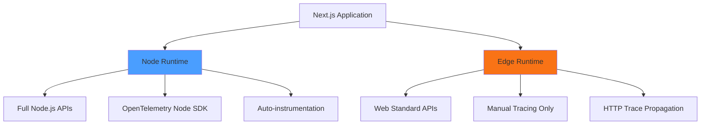
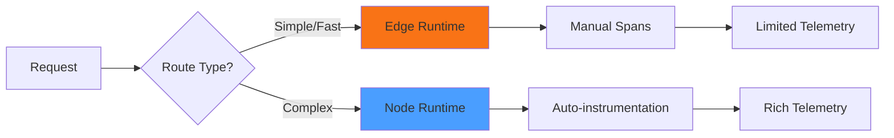

# How to Handle Edge Runtime vs Node Runtime for OpenTelemetry in Next.js

Author: [nawazdhandala](https://www.github.com/nawazdhandala)

Tags: OpenTelemetry, Next.js, Edge Runtime, Node Runtime, JavaScript, Serverless

Description: Understanding the differences between Edge and Node runtimes in Next.js and how to implement OpenTelemetry instrumentation that works across both environments.

Next.js supports two distinct server-side runtimes: the traditional Node.js runtime and the lightweight Edge runtime. Each has different capabilities, constraints, and APIs. OpenTelemetry instrumentation needs to account for these differences because the standard Node.js SDK doesn't work in Edge environments.

The Edge runtime is a minimal JavaScript environment designed for low-latency responses at the network edge. It lacks many Node.js APIs, including the file system, native modules, and some networking capabilities. This fundamentally changes how you implement observability.

## Understanding Runtime Differences

The Node.js runtime runs on traditional servers with full access to Node.js APIs. It supports all OpenTelemetry packages, automatic instrumentation, and complex SDK configurations.

The Edge runtime executes in a V8 isolate with Web Standard APIs. Think of it as running in a browser environment on the server. It supports fetch, Web Streams, and other web-standard features, but not Node.js-specific modules like `fs`, `net`, or `child_process`.



## Detecting the Runtime

Next.js provides runtime information through environment variables. Use this to conditionally load OpenTelemetry code:

```typescript
// instrumentation.ts
export async function register() {
  const runtime = process.env.NEXT_RUNTIME;

  if (runtime === 'nodejs') {
    // Full OpenTelemetry SDK with auto-instrumentation
    await initializeNodeRuntime();
  } else if (runtime === 'edge') {
    // Lightweight manual instrumentation only
    await initializeEdgeRuntime();
  }
}

async function initializeNodeRuntime() {
  const { NodeSDK } = await import('@opentelemetry/sdk-node');
  const { getNodeAutoInstrumentations } = await import('@opentelemetry/auto-instrumentations-node');
  const { OTLPTraceExporter } = await import('@opentelemetry/exporter-trace-otlp-http');

  // Standard Node.js SDK setup
  const sdk = new NodeSDK({
    traceExporter: new OTLPTraceExporter(),
    instrumentations: [getNodeAutoInstrumentations()],
  });

  sdk.start();
}

async function initializeEdgeRuntime() {
  // Edge runtime requires a different approach
  // We'll implement this next
  console.log('Edge runtime detected, using manual instrumentation');
}
```

The `NEXT_RUNTIME` environment variable is automatically set by Next.js based on your route configuration.

## Implementing OpenTelemetry in Edge Runtime

The Edge runtime cannot use the standard OpenTelemetry Node SDK. Instead, you need the web-compatible packages:

```bash
npm install @opentelemetry/api \
  @opentelemetry/sdk-trace-web \
  @opentelemetry/exporter-trace-otlp-http \
  @opentelemetry/resources \
  @opentelemetry/semantic-conventions
```

Create an Edge-compatible tracer provider:

```typescript
// lib/otel-edge.ts
import { WebTracerProvider } from '@opentelemetry/sdk-trace-web';
import { OTLPTraceExporter } from '@opentelemetry/exporter-trace-otlp-http';
import { Resource } from '@opentelemetry/resources';
import { SEMRESATTRS_SERVICE_NAME } from '@opentelemetry/semantic-conventions';
import { BatchSpanProcessor } from '@opentelemetry/sdk-trace-base';

let provider: WebTracerProvider | null = null;

export function getEdgeTracerProvider() {
  if (provider) {
    return provider;
  }

  // Create a resource that identifies this service
  const resource = new Resource({
    [SEMRESATTRS_SERVICE_NAME]: 'nextjs-edge',
  });

  // Initialize the web tracer provider
  provider = new WebTracerProvider({
    resource,
  });

  // Configure OTLP exporter for edge runtime
  const exporter = new OTLPTraceExporter({
    url: process.env.OTEL_EXPORTER_OTLP_ENDPOINT || 'http://localhost:4318/v1/traces',
  });

  // Use batch processor to reduce export overhead
  provider.addSpanProcessor(new BatchSpanProcessor(exporter));

  return provider;
}
```

The key difference is using `WebTracerProvider` instead of `NodeSDK`. This provider works with Web Standard APIs available in the Edge runtime.

## Configuring Routes for Different Runtimes

Next.js lets you specify which runtime each route uses. This is critical for OpenTelemetry because it determines which instrumentation approach to use:

```typescript
// app/api/node-route/route.ts
// This route uses Node.js runtime (default)

export async function GET() {
  // Automatic instrumentation works here
  const data = await fetch('https://api.example.com/data');
  return Response.json(await data.json());
}
```

```typescript
// app/api/edge-route/route.ts
// This route uses Edge runtime (explicit configuration)

export const runtime = 'edge';

import { trace } from '@opentelemetry/api';
import { getEdgeTracerProvider } from '@/lib/otel-edge';

export async function GET() {
  // Manual instrumentation required
  const tracer = getEdgeTracerProvider().getTracer('edge-route');

  return await tracer.startActiveSpan('edge-get-request', async (span) => {
    span.setAttribute('runtime', 'edge');

    const data = await fetch('https://api.example.com/data');
    const result = await data.json();

    span.end();
    return Response.json(result);
  });
}
```

The `export const runtime = 'edge'` declaration tells Next.js to use the Edge runtime for this route.

## Automatic vs Manual Instrumentation

In Node runtime, automatic instrumentation captures HTTP requests, database queries, and more without manual span creation:

```typescript
// app/api/products/route.ts
// Node runtime - automatic instrumentation

export async function GET() {
  // This fetch is automatically traced
  const response = await fetch('https://api.example.com/products');

  // This database query is automatically traced
  const products = await db.product.findMany();

  return Response.json(products);
}
```

In Edge runtime, you must manually create spans for operations you want to trace:

```typescript
// app/api/products-edge/route.ts
export const runtime = 'edge';

import { trace } from '@opentelemetry/api';
import { getEdgeTracerProvider } from '@/lib/otel-edge';

export async function GET() {
  const tracer = getEdgeTracerProvider().getTracer('products');

  return await tracer.startActiveSpan('get-products', async (span) => {
    // Manually instrument fetch
    const fetchSpan = tracer.startSpan('fetch-external-api');
    const response = await fetch('https://api.example.com/products');
    const data = await response.json();
    fetchSpan.end();

    span.setAttribute('product.count', data.length);
    span.end();

    return Response.json(data);
  });
}
```

This manual approach gives you control but requires more code.

## Trace Context Propagation Across Runtimes

When requests move between Edge and Node runtimes, maintain trace context to keep distributed traces connected:

```typescript
// middleware.ts (Edge runtime)
export const runtime = 'edge';

import { trace, context, propagation } from '@opentelemetry/api';
import { NextResponse } from 'next/server';
import type { NextRequest } from 'next/server';
import { getEdgeTracerProvider } from '@/lib/otel-edge';

export function middleware(request: NextRequest) {
  const tracer = getEdgeTracerProvider().getTracer('middleware');
  const span = tracer.startSpan('edge-middleware');

  // Extract incoming trace context
  const incomingContext = propagation.extract(context.active(), request.headers);

  // Process request within the extracted context
  return context.with(incomingContext, () => {
    span.setAttribute('http.url', request.url);

    // Inject trace context into response headers
    const response = NextResponse.next();
    const headers: Record<string, string> = {};

    propagation.inject(context.active(), headers);
    Object.entries(headers).forEach(([key, value]) => {
      response.headers.set(key, value);
    });

    span.end();
    return response;
  });
}
```

This ensures traces flow correctly even when requests traverse multiple runtimes.

## Shared Tracing Utilities

Create helper functions that work in both runtimes:

```typescript
// lib/tracing.ts
import { trace, Span, SpanStatusCode } from '@opentelemetry/api';

export async function traceAsync<T>(
  tracerName: string,
  spanName: string,
  fn: (span: Span) => Promise<T>,
  attributes?: Record<string, string | number>
): Promise<T> {
  const tracer = trace.getTracer(tracerName);

  return await tracer.startActiveSpan(spanName, async (span) => {
    if (attributes) {
      Object.entries(attributes).forEach(([key, value]) => {
        span.setAttribute(key, value);
      });
    }

    try {
      const result = await fn(span);
      span.setStatus({ code: SpanStatusCode.OK });
      return result;
    } catch (error) {
      span.recordException(error as Error);
      span.setStatus({
        code: SpanStatusCode.ERROR,
        message: (error as Error).message,
      });
      throw error;
    } finally {
      span.end();
    }
  });
}
```

Use this helper in both runtime contexts:

```typescript
// Works in Node runtime
export async function GET() {
  return traceAsync('api', 'get-data', async (span) => {
    const data = await fetchData();
    span.setAttribute('data.count', data.length);
    return Response.json(data);
  });
}

// Also works in Edge runtime
export const runtime = 'edge';

export async function GET() {
  return traceAsync('api-edge', 'get-data-edge', async (span) => {
    const data = await fetchData();
    span.setAttribute('data.count', data.length);
    return Response.json(data);
  });
}
```

## Performance Implications

Edge runtime trades functionality for performance. Understanding the trade-offs helps you choose the right runtime:

**Edge Runtime:**
- Sub-millisecond cold start times
- Global distribution for low latency
- Limited to manual instrumentation
- No automatic middleware/database tracing
- Ideal for: Authentication, redirects, header manipulation

**Node Runtime:**
- Hundreds of milliseconds cold start
- Regional deployment
- Full auto-instrumentation
- Complete OpenTelemetry SDK features
- Ideal for: Complex business logic, database operations, third-party integrations



## Middleware Considerations

Middleware always runs in Edge runtime by default. This affects instrumentation:

```typescript
// middleware.ts
import { trace } from '@opentelemetry/api';
import { getEdgeTracerProvider } from '@/lib/otel-edge';

// Middleware runs in Edge runtime, no export statement needed
export function middleware(request: NextRequest) {
  // Must use Edge-compatible tracing
  const tracer = getEdgeTracerProvider().getTracer('middleware');

  return tracer.startActiveSpan('middleware', (span) => {
    span.setAttribute('path', request.nextUrl.pathname);

    const response = NextResponse.next();

    span.end();
    return response;
  });
}
```

You cannot use Node.js-specific OpenTelemetry packages in middleware, even if your routes use Node runtime.

## Debugging Runtime Issues

When traces don't appear, verify you're using the correct SDK for each runtime:

```typescript
// instrumentation.ts
export async function register() {
  console.log('Runtime:', process.env.NEXT_RUNTIME);

  if (process.env.NEXT_RUNTIME === 'nodejs') {
    console.log('Initializing Node.js OpenTelemetry SDK');
    try {
      await initializeNodeRuntime();
      console.log('Node.js SDK initialized successfully');
    } catch (error) {
      console.error('Failed to initialize Node.js SDK:', error);
    }
  } else if (process.env.NEXT_RUNTIME === 'edge') {
    console.log('Initializing Edge-compatible OpenTelemetry');
    try {
      await initializeEdgeRuntime();
      console.log('Edge runtime initialized successfully');
    } catch (error) {
      console.error('Failed to initialize Edge runtime:', error);
    }
  }
}
```

Check your server logs to confirm which initialization path executes.

## Hybrid Approach for Production

Most production applications use both runtimes strategically:

```typescript
// app/api/auth/route.ts
// Fast authentication check in Edge runtime
export const runtime = 'edge';

export async function POST(request: Request) {
  const tracer = getEdgeTracerProvider().getTracer('auth');

  return await tracer.startActiveSpan('authenticate', async (span) => {
    const { token } = await request.json();

    // Quick token validation
    const isValid = await validateToken(token);

    span.setAttribute('auth.valid', isValid);
    span.end();

    return Response.json({ valid: isValid });
  });
}
```

```typescript
// app/api/users/route.ts
// Complex database operations in Node runtime
// Node runtime is default, no export needed

export async function GET() {
  // Auto-instrumentation captures database queries
  const users = await db.user.findMany({
    include: {
      posts: true,
      comments: true,
    },
  });

  return Response.json(users);
}
```

This hybrid approach optimizes for both performance and observability.

## Environment-Specific Configuration

Configure different behavior for development vs production:

```typescript
// instrumentation.ts
export async function register() {
  const runtime = process.env.NEXT_RUNTIME;
  const isDevelopment = process.env.NODE_ENV === 'development';

  if (runtime === 'nodejs') {
    await initializeNodeRuntime({
      // More verbose instrumentation in development
      instrumentations: isDevelopment ? 'all' : 'essential',
    });
  } else if (runtime === 'edge') {
    await initializeEdgeRuntime({
      // Enable debug logging in development
      debug: isDevelopment,
    });
  }
}
```

## Common Pitfalls

**Importing Node.js packages in Edge routes:**
```typescript
// This will fail at runtime
export const runtime = 'edge';

import { NodeSDK } from '@opentelemetry/sdk-node'; // Error!
```

**Forgetting to initialize Edge tracer provider:**
```typescript
// This creates spans that never export
export const runtime = 'edge';

import { trace } from '@opentelemetry/api';

export async function GET() {
  const tracer = trace.getTracer('test'); // No provider initialized!
  // Spans created but not exported
}
```

**Assuming automatic instrumentation in Edge:**
```typescript
// This fetch is NOT automatically traced in Edge runtime
export const runtime = 'edge';

export async function GET() {
  const data = await fetch('https://api.example.com/data'); // No automatic span
  return Response.json(data);
}
```

## Testing Across Runtimes

Create test utilities that verify instrumentation in both contexts:

```typescript
// __tests__/tracing.test.ts
import { InMemorySpanExporter, SimpleSpanProcessor } from '@opentelemetry/sdk-trace-base';
import { WebTracerProvider } from '@opentelemetry/sdk-trace-web';

describe('Tracing', () => {
  it('should create spans in Edge runtime', () => {
    const exporter = new InMemorySpanExporter();
    const provider = new WebTracerProvider();
    provider.addSpanProcessor(new SimpleSpanProcessor(exporter));

    const tracer = provider.getTracer('test');
    const span = tracer.startSpan('test-span');
    span.end();

    const spans = exporter.getFinishedSpans();
    expect(spans).toHaveLength(1);
    expect(spans[0].name).toBe('test-span');
  });
});
```

## Conclusion

Handling both Edge and Node runtimes requires understanding their fundamental differences and choosing the appropriate OpenTelemetry approach for each. Node runtime offers rich automatic instrumentation with the full SDK, while Edge runtime requires manual instrumentation with web-compatible packages.

The key is recognizing that no single OpenTelemetry setup works for both runtimes. Design your architecture to use Edge runtime for simple, latency-sensitive operations and Node runtime for complex logic that benefits from automatic instrumentation. This hybrid approach gives you the best of both worlds: low latency where it matters and comprehensive observability where you need it.
