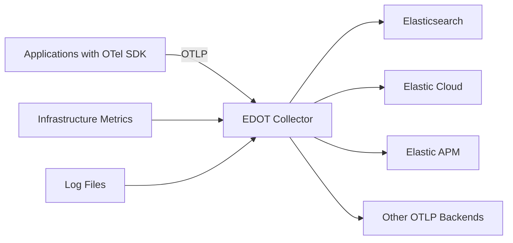
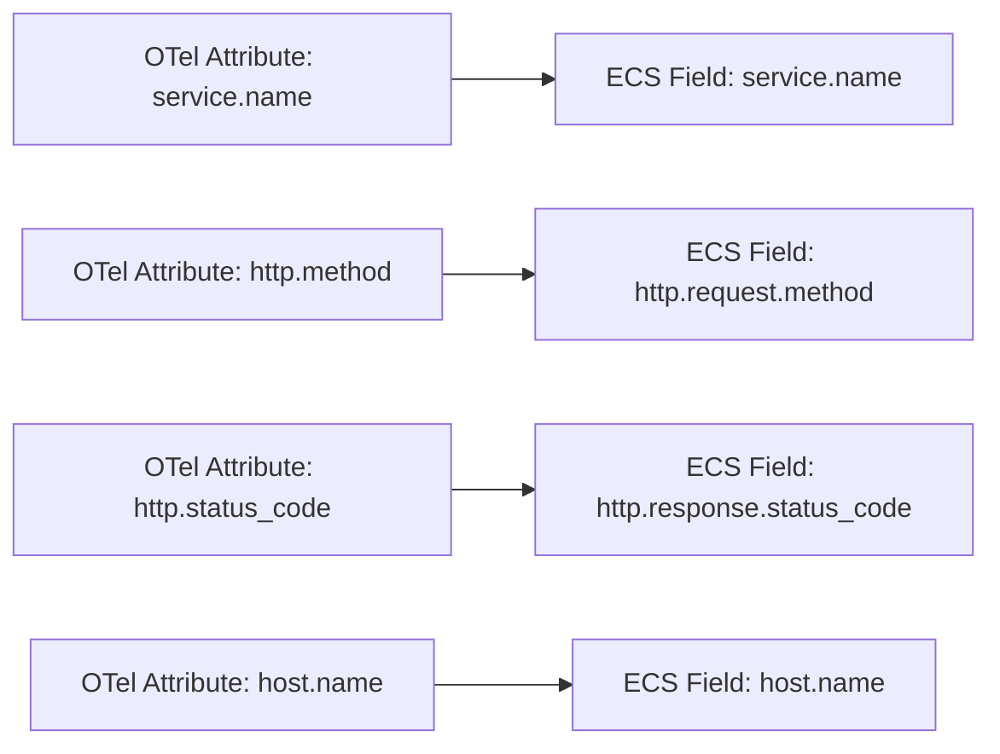

# How to Use Elastic Distribution of OpenTelemetry Collector

Author: [nawazdhandala](https://www.github.com/nawazdhandala)

Tags: OpenTelemetry, Elastic, Elasticsearch, Observability, APM, Monitoring

Description: Step-by-step guide to deploying the Elastic Distribution of OpenTelemetry Collector with practical examples for sending traces, metrics, and logs to Elastic.

---

Elastic has embraced OpenTelemetry as a first-class ingestion path for their observability platform. The Elastic Distribution of the OpenTelemetry Collector (EDOT Collector) is a curated build that bundles the components needed to send telemetry data to Elasticsearch and Elastic Cloud. It replaces the need to run Elastic APM Server separately for many use cases.

This post walks you through setting up the EDOT Collector, configuring it for different signal types, and understanding how it differs from the upstream OTel Collector.

## What EDOT Collector Includes

The Elastic distribution packages specific components optimized for the Elastic Stack:

- **Elasticsearch Exporter** for sending data directly to Elasticsearch
- **Elastic APM integration** for trace correlation with Elastic APM
- **Pre-configured processors** for Elastic Common Schema (ECS) compatibility
- **Elastic-specific resource detection** for cloud and container environments



## Installing the EDOT Collector

### Using Docker

The fastest way to get started is with Docker:

```bash
# Pull and run the Elastic distribution of the OTel Collector
docker run -d \
  --name edot-collector \
  -p 4317:4317 \
  -p 4318:4318 \
  -v ./otel-config.yaml:/etc/otelcol/config.yaml \
  docker.elastic.co/beats/elastic-otel-collector:latest \
  --config /etc/otelcol/config.yaml
```

### On Linux

Download the binary directly from Elastic's releases:

```bash
# Download the EDOT Collector for Linux
curl -L -o edot-collector.tar.gz \
  https://artifacts.elastic.co/downloads/beats/elastic-otel-collector/elastic-otel-collector-linux-amd64.tar.gz

# Extract and move to a standard location
tar -xzf edot-collector.tar.gz
sudo mv elastic-otel-collector /usr/local/bin/

# Run with your config
elastic-otel-collector --config /etc/otelcol/config.yaml
```

### On Kubernetes with Helm

Deploy EDOT Collector on Kubernetes:

```bash
# Add the Elastic Helm repository
helm repo add elastic https://helm.elastic.co
helm repo update

# Install the EDOT Collector
helm install edot-collector elastic/elastic-otel-collector \
  --namespace monitoring \
  --create-namespace \
  --set config.exporters.elasticsearch.endpoints=["https://elasticsearch:9200"] \
  --set config.exporters.elasticsearch.api_key="your-api-key"
```

## Basic Configuration

Here is a straightforward configuration that sends all three signal types to Elasticsearch:

```yaml
# EDOT Collector configuration for sending traces, metrics, and logs to Elasticsearch
receivers:
  # Accept OTLP data from instrumented applications
  otlp:
    protocols:
      grpc:
        endpoint: 0.0.0.0:4317
      http:
        endpoint: 0.0.0.0:4318

  # Collect host-level metrics
  hostmetrics:
    collection_interval: 30s
    scrapers:
      cpu:
      memory:
      disk:
      network:
      filesystem:

  # Read log files from disk
  filelog:
    include:
      - /var/log/apps/*.log
    operators:
      - type: json_parser
        timestamp:
          parse_from: attributes.timestamp
          layout: "%Y-%m-%dT%H:%M:%S.%LZ"

processors:
  # Batch telemetry for efficient bulk indexing into Elasticsearch
  batch:
    timeout: 5s
    send_batch_size: 1024

  # Transform resource attributes to match Elastic Common Schema
  resource:
    attributes:
      - key: deployment.environment
        value: production
        action: upsert

  # Detect cloud and host resources automatically
  resourcedetection:
    detectors: [system, env, docker, ec2, gcp, azure]
    override: false

exporters:
  # Send everything to Elasticsearch
  elasticsearch:
    endpoints: ["https://your-elasticsearch:9200"]
    api_key: "your-base64-encoded-api-key"
    logs_index: "logs-otel-default"
    traces_index: "traces-apm-default"
    metrics_index: "metrics-otel-default"
    mapping:
      mode: ecs

service:
  pipelines:
    traces:
      receivers: [otlp]
      processors: [resourcedetection, resource, batch]
      exporters: [elasticsearch]
    metrics:
      receivers: [otlp, hostmetrics]
      processors: [resourcedetection, resource, batch]
      exporters: [elasticsearch]
    logs:
      receivers: [otlp, filelog]
      processors: [resourcedetection, resource, batch]
      exporters: [elasticsearch]
```

## Sending to Elastic Cloud

If you are using Elastic Cloud instead of a self-managed Elasticsearch cluster, the config is similar but uses the Cloud ID:

```yaml
# Configuration for Elastic Cloud
exporters:
  elasticsearch:
    # Use your Elastic Cloud endpoint directly
    endpoints: ["https://my-deployment.es.us-central1.gcp.cloud.es.io:9243"]
    api_key: "your-api-key-from-kibana"
    mapping:
      mode: ecs
    # Adjust bulk indexing settings for cloud
    flush:
      bytes: 5000000
      interval: 5s
    retry:
      enabled: true
      max_requests: 3
```

## Elastic Common Schema Mapping

One of the key features of the EDOT Collector is automatic mapping to Elastic Common Schema (ECS). This means your OTel data gets translated into the field names that Elastic's pre-built dashboards and alerts expect.



The `mapping.mode: ecs` setting in the Elasticsearch exporter handles this translation. Without it, the raw OTel attributes would be indexed as-is, which works but means Elastic's built-in dashboards would not pick them up automatically.

## Advanced Configuration: APM Correlation

To get full APM correlation in Kibana (where you can jump from a trace to related logs and metrics), you need to make sure certain attributes are present:

```yaml
processors:
  # Make sure all telemetry includes the fields Elastic APM needs for correlation
  resource:
    attributes:
      - key: service.name
        from_attribute: service.name
        action: upsert
      - key: service.version
        from_attribute: service.version
        action: upsert
      - key: deployment.environment
        value: "production"
        action: upsert

  # Add trace context to logs for trace-to-log correlation
  # This adds trace_id and span_id to log records
  attributes:
    actions:
      - key: trace.id
        from_attribute: trace_id
        action: upsert
      - key: span.id
        from_attribute: span_id
        action: upsert
```

## Kubernetes DaemonSet Configuration

Here is a full DaemonSet setup for collecting telemetry from a Kubernetes cluster:

```yaml
# edot-collector-daemonset.yaml
apiVersion: v1
kind: ConfigMap
metadata:
  name: edot-collector-config
  namespace: monitoring
data:
  config.yaml: |
    receivers:
      otlp:
        protocols:
          grpc:
            endpoint: 0.0.0.0:4317
          http:
            endpoint: 0.0.0.0:4318

      # Scrape kubelet metrics from every node
      kubeletstats:
        collection_interval: 30s
        auth_type: serviceAccount
        endpoint: "https://${env:NODE_NAME}:10250"
        insecure_skip_verify: true

    processors:
      batch:
        timeout: 5s
        send_batch_size: 2048

      memory_limiter:
        check_interval: 5s
        limit_mib: 400
        spike_limit_mib: 100

      k8sattributes:
        extract:
          metadata:
            - k8s.pod.name
            - k8s.namespace.name
            - k8s.deployment.name
            - k8s.node.name
            - k8s.pod.uid

      resourcedetection:
        detectors: [env, system]

    exporters:
      elasticsearch:
        endpoints: ["https://elasticsearch:9200"]
        api_key: "${env:ELASTIC_API_KEY}"
        mapping:
          mode: ecs

    service:
      pipelines:
        traces:
          receivers: [otlp]
          processors: [memory_limiter, k8sattributes, resourcedetection, batch]
          exporters: [elasticsearch]
        metrics:
          receivers: [otlp, kubeletstats]
          processors: [memory_limiter, k8sattributes, resourcedetection, batch]
          exporters: [elasticsearch]
        logs:
          receivers: [otlp]
          processors: [memory_limiter, k8sattributes, resourcedetection, batch]
          exporters: [elasticsearch]
---
apiVersion: apps/v1
kind: DaemonSet
metadata:
  name: edot-collector
  namespace: monitoring
spec:
  selector:
    matchLabels:
      app: edot-collector
  template:
    metadata:
      labels:
        app: edot-collector
    spec:
      serviceAccountName: edot-collector
      containers:
        - name: collector
          image: docker.elastic.co/beats/elastic-otel-collector:latest
          args: ["--config", "/conf/config.yaml"]
          env:
            - name: NODE_NAME
              valueFrom:
                fieldRef:
                  fieldPath: spec.nodeName
            - name: ELASTIC_API_KEY
              valueFrom:
                secretKeyRef:
                  name: elastic-credentials
                  key: api-key
          ports:
            - containerPort: 4317
            - containerPort: 4318
          volumeMounts:
            - name: config
              mountPath: /conf
          resources:
            requests:
              cpu: 200m
              memory: 256Mi
            limits:
              cpu: 500m
              memory: 512Mi
      volumes:
        - name: config
          configMap:
            name: edot-collector-config
```

## Dual Export: Elastic and Another Backend

You can send data to both Elastic and another OTLP backend:

```yaml
exporters:
  # Primary: Elasticsearch
  elasticsearch:
    endpoints: ["https://elasticsearch:9200"]
    api_key: "your-api-key"
    mapping:
      mode: ecs

  # Secondary: Any OTLP-compatible backend
  otlphttp/secondary:
    endpoint: "https://otlp.oneuptime.com"
    headers:
      x-oneuptime-token: "your-token"

service:
  pipelines:
    traces:
      receivers: [otlp]
      processors: [batch]
      # Send traces to both Elastic and OneUptime
      exporters: [elasticsearch, otlphttp/secondary]
```

## EDOT vs Upstream Collector

| Feature | EDOT Collector | Upstream Contrib |
|---------|---------------|-----------------|
| ECS mapping | Built-in and tested | Manual configuration |
| Elastic APM correlation | Optimized | Requires manual setup |
| Elasticsearch exporter | Pre-configured | Available in contrib |
| Kibana dashboards | Compatible out of box | Manual mapping needed |
| Release testing | Against Elastic Stack | Community testing |
| Non-Elastic exporters | Limited set | Full contrib set |
| Support | Elastic subscription | Community |

## When to Use EDOT

Choose the EDOT Collector when:

- Elasticsearch or Elastic Cloud is your primary observability backend
- You want ECS field mapping to work automatically
- You need Elastic APM correlation between traces, logs, and metrics in Kibana
- You have an Elastic subscription and want vendor support

If you are using Elasticsearch alongside other backends, the upstream contrib collector with the Elasticsearch exporter works fine too. You just need to configure ECS mapping manually.
