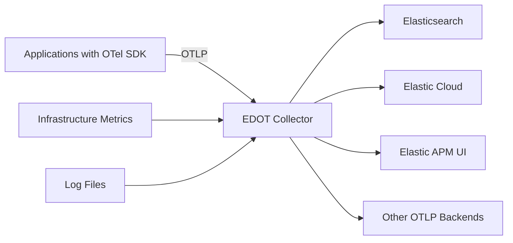
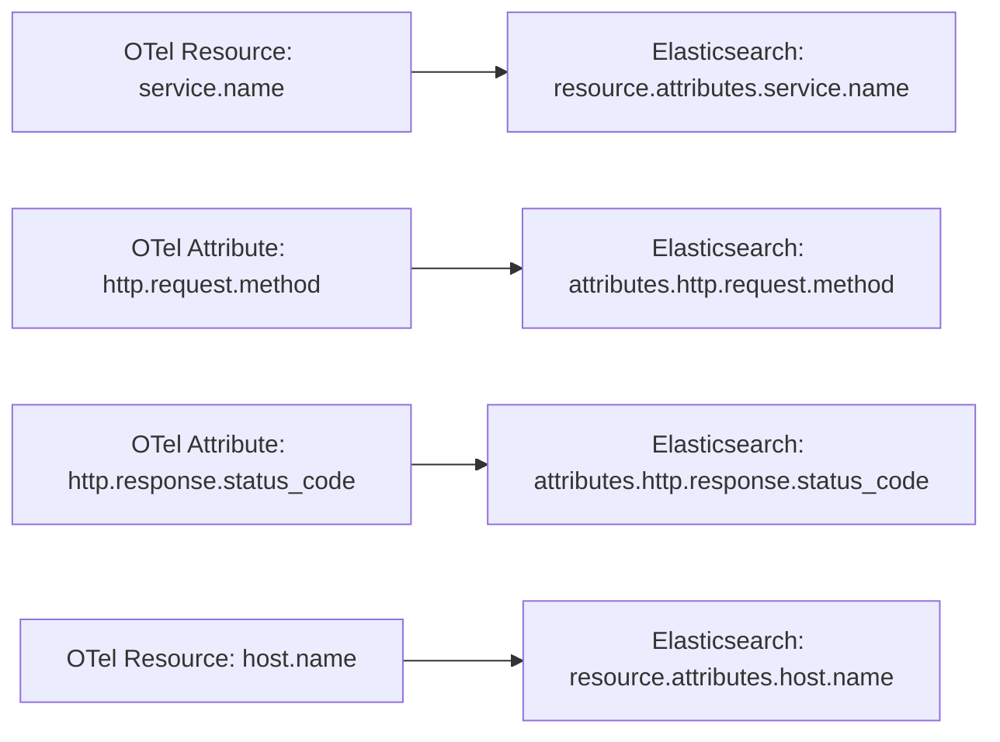

# How to Use Elastic Distribution of OpenTelemetry Collector

Author: [nawazdhandala](https://www.github.com/nawazdhandala)

Tags: OpenTelemetry, Elastic, Elasticsearch, Observability, APM, Monitoring

Description: Step-by-step guide to deploying the Elastic Distribution of OpenTelemetry Collector with practical examples for sending traces, metrics, and logs to Elastic.

---

Elastic has embraced OpenTelemetry as a first-class ingestion path for their observability platform. The Elastic Distribution of the OpenTelemetry Collector (EDOT Collector) is a curated build that bundles the components needed to send telemetry data to Elasticsearch and Elastic Cloud. It replaces the need to run Elastic APM Server separately for many use cases.

This post walks you through setting up the EDOT Collector, configuring it for different signal types, and understanding how it differs from the upstream OTel Collector.

## What EDOT Collector Includes

The Elastic distribution packages specific components optimized for the Elastic Stack:

- **Elasticsearch Exporter** for sending data directly to Elasticsearch
- **Elastic APM processor and connector** for trace enrichment and APM metrics
- **OTel-native mapping and Elastic data stream routing** for Elasticsearch
- **Resource detection and Kubernetes enrichment** for cloud and container environments


```mermaid
flowchart LR
    A[Applications with OTel SDK] -->|OTLP| B[EDOT Collector]
    C[Infrastructure Metrics] --> B
    D[Log Files] --> B
    B --> E[Elasticsearch]
    B --> F[Elastic Cloud]
    B --> G[Elastic APM UI]
    B --> H[Other OTLP Backends]
```

## Installing the EDOT Collector

### Using Docker

The fastest way to get started is with Docker:

```bash
# Pull and run the Elastic distribution of the OTel Collector

docker run -d \
  --name edot-collector \
  -p 4317:4317 \
  -p 4318:4318 \
  -v ./otel-config.yaml:/etc/otelcol/config.yaml \
  docker.elastic.co/elastic-agent/elastic-otel-collector:9.4.2 \
  --config /etc/otelcol/config.yaml
```

### On Linux

Download the binary directly from Elastic's releases:

```bash
# Download the EDOT Collector for Linux
curl -L -o edot-collector.tar.gz \
  https://artifacts.elastic.co/downloads/beats/elastic-agent/elastic-agent-9.4.2-linux-x86_64.tar.gz

# Extract and move to a standard location
tar -xzf edot-collector.tar.gz
sudo mv elastic-agent-9.4.2-linux-x86_64/otelcol /usr/local/bin/otelcol

# Run with your config
otelcol --config /etc/otelcol/config.yaml
```

### On Kubernetes with Helm

Deploy EDOT Collector on Kubernetes:

```bash
# Add the OpenTelemetry Helm repository
helm repo add open-telemetry https://open-telemetry.github.io/opentelemetry-helm-charts
helm repo update

# Install the EDOT Collector
helm install edot-collector open-telemetry/opentelemetry-collector \
  --namespace monitoring \
  --create-namespace \
  --set mode=daemonset \
  --set image.repository="docker.elastic.co/elastic-agent/elastic-otel-collector" \
  --set image.tag="9.4.2" \
  --set config.exporters.elasticsearch.endpoint="https://elasticsearch:9200" \
  --set config.exporters.elasticsearch.api_key="your-api-key"
```

## Basic Configuration

Here is a straightforward configuration that sends all three signal types to Elasticsearch:

```yaml
# EDOT Collector configuration for sending traces, metrics, and logs to Elasticsearch
receivers:
  # Accept OTLP data from instrumented applications
  otlp:
    protocols:
      grpc:
        endpoint: 0.0.0.0:4317
      http:
        endpoint: 0.0.0.0:4318

  # Collect host-level metrics
  hostmetrics:
    collection_interval: 30s
    scrapers:
      cpu:
      memory:
      disk:
      network:
      filesystem:

  # Read log files from disk
  filelog:
    include:
      - /var/log/apps/*.log
    operators:
      - type: json_parser
        timestamp:
          parse_from: attributes.timestamp
          layout: "%Y-%m-%dT%H:%M:%S.%LZ"

processors:
  # Batch telemetry for efficient bulk indexing into Elasticsearch
  batch:
    timeout: 5s
    send_batch_size: 1024

  # Add environment metadata to all telemetry
  resource:
    attributes:
      - key: deployment.environment
        value: production
        action: upsert

  # Detect cloud and host resources automatically
  resourcedetection:
    detectors: [system, env, docker, ec2, gcp, azure]
    override: false

exporters:
  # Send everything to Elasticsearch
  elasticsearch:
    endpoint: "https://your-elasticsearch:9200"
    api_key: "your-api-key"
    mapping:
      mode: otel

service:
  pipelines:
    traces:
      receivers: [otlp]
      processors: [resourcedetection, resource, batch]
      exporters: [elasticsearch]
    metrics:
      receivers: [otlp, hostmetrics]
      processors: [resourcedetection, resource, batch]
      exporters: [elasticsearch]
    logs:
      receivers: [otlp, filelog]
      processors: [resourcedetection, resource, batch]
      exporters: [elasticsearch]
```

## Sending to Elastic Cloud

If you are using Elastic Cloud instead of a self-managed Elasticsearch cluster, the config is similar but can use the Cloud ID:

```yaml
# Configuration for Elastic Cloud
exporters:
  elasticsearch:
    cloudid: "your-elastic-cloud-id"
    api_key: "your-api-key-from-kibana"
    mapping:
      mode: otel
    # Adjust bulk indexing settings for cloud
    sending_queue:
      enabled: true
      batch:
        max_size: 5000000
        flush_timeout: 5s
    retry:
      enabled: true
      max_retries: 2
```

## OpenTelemetry Mapping

One of the key features of the EDOT Collector is OTel-native mapping for Elasticsearch. This means your OTel data is stored in Elastic's preferred OpenTelemetry schema and routed to Elastic data streams.


```mermaid
flowchart LR
    A["OTel Resource: service.name"] --> B["Elasticsearch: resource.attributes.service.name"]
    C["OTel Attribute: http.request.method"] --> D["Elasticsearch: attributes.http.request.method"]
    E["OTel Attribute: http.response.status_code"] --> F["Elasticsearch: attributes.http.response.status_code"]
    G["OTel Resource: host.name"] --> H["Elasticsearch: resource.attributes.host.name"]
```

The `mapping.mode: otel` setting in the Elasticsearch exporter selects this mapping. It is the default in current Elasticsearch exporter versions used by EDOT. The exporter still supports `ecs`, but EDOT does not officially support configuring that mode and Elastic plans automatic mode selection in a future release.

## Advanced Configuration: APM Correlation

To get full APM correlation in Kibana (where you can jump from a trace to related logs and metrics), include the Elastic APM processor and connector for traces, and make sure application logs include OpenTelemetry trace context:

```yaml
receivers:
  otlp:
    protocols:
      grpc:
        endpoint: 0.0.0.0:4317
      http:
        endpoint: 0.0.0.0:4318

connectors:
  elasticapm: {}

processors:
  batch:
    timeout: 5s
    send_batch_size: 1024

  # Enrich trace data for Elastic APM UI features
  elasticapm: {}

  # Make sure all telemetry includes the fields Elastic APM needs
  resource:
    attributes:
      - key: deployment.environment
        value: "production"
        action: upsert

exporters:
  elasticsearch/otel:
    endpoint: "https://elasticsearch:9200"
    api_key: "${env:ELASTIC_API_KEY}"
    mapping:
      mode: otel

service:
  pipelines:
    traces:
      receivers: [otlp]
      processors: [batch, elasticapm]
      exporters: [elasticapm, elasticsearch/otel]
    metrics/aggregated-otel-metrics:
      receivers: [elasticapm]
      processors: [batch]
      exporters: [elasticsearch/otel]
    logs:
      receivers: [otlp]
      processors: [resource, batch]
      exporters: [elasticsearch/otel]
```

## Kubernetes DaemonSet Configuration

Here is a full DaemonSet setup for collecting telemetry from a Kubernetes cluster:

```yaml
# edot-collector-daemonset.yaml
apiVersion: v1
kind: ServiceAccount
metadata:
  name: edot-collector
  namespace: monitoring
---
apiVersion: rbac.authorization.k8s.io/v1
kind: ClusterRole
metadata:
  name: edot-collector
rules:
  - apiGroups: [""]
    resources: ["pods", "namespaces", "nodes"]
    verbs: ["get", "list", "watch"]
  - apiGroups: [""]
    resources: ["nodes/stats", "nodes/proxy"]
    verbs: ["get"]
---
apiVersion: rbac.authorization.k8s.io/v1
kind: ClusterRoleBinding
metadata:
  name: edot-collector
roleRef:
  apiGroup: rbac.authorization.k8s.io
  kind: ClusterRole
  name: edot-collector
subjects:
  - kind: ServiceAccount
    name: edot-collector
    namespace: monitoring
---
apiVersion: v1
kind: ConfigMap
metadata:
  name: edot-collector-config
  namespace: monitoring
data:
  config.yaml: |
    receivers:
      otlp:
        protocols:
          grpc:
            endpoint: 0.0.0.0:4317
          http:
            endpoint: 0.0.0.0:4318

      # Scrape kubelet metrics from every node
      kubeletstats:
        collection_interval: 30s
        auth_type: serviceAccount
        endpoint: "https://${env:NODE_NAME}:10250"
        insecure_skip_verify: true

    processors:
      batch:
        timeout: 5s
        send_batch_size: 2048

      memory_limiter:
        check_interval: 5s
        limit_mib: 400
        spike_limit_mib: 100

      k8sattributes:
        extract:
          metadata:
            - k8s.pod.name
            - k8s.namespace.name
            - k8s.deployment.name
            - k8s.node.name
            - k8s.pod.uid

      resourcedetection:
        detectors: [env, system]

      elasticapm: {}

    connectors:
      elasticapm: {}

    exporters:
      elasticsearch/otel:
        endpoint: "https://elasticsearch:9200"
        api_key: "${env:ELASTIC_API_KEY}"
        mapping:
          mode: otel

    service:
      pipelines:
        traces:
          receivers: [otlp]
          processors: [memory_limiter, k8sattributes, resourcedetection, batch, elasticapm]
          exporters: [elasticapm, elasticsearch/otel]
        metrics/aggregated-otel-metrics:
          receivers: [elasticapm]
          processors: [memory_limiter, batch]
          exporters: [elasticsearch/otel]
        metrics:
          receivers: [otlp, kubeletstats]
          processors: [memory_limiter, k8sattributes, resourcedetection, batch]
          exporters: [elasticsearch/otel]
        logs:
          receivers: [otlp]
          processors: [memory_limiter, k8sattributes, resourcedetection, batch]
          exporters: [elasticsearch/otel]
---
apiVersion: apps/v1
kind: DaemonSet
metadata:
  name: edot-collector
  namespace: monitoring
spec:
  selector:
    matchLabels:
      app: edot-collector
  template:
    metadata:
      labels:
        app: edot-collector
    spec:
      serviceAccountName: edot-collector
      containers:
        - name: collector
          image: docker.elastic.co/elastic-agent/elastic-otel-collector:9.4.2
          args: ["--config", "/conf/config.yaml"]
          env:
            - name: NODE_NAME
              valueFrom:
                fieldRef:
                  fieldPath: spec.nodeName
            - name: ELASTIC_API_KEY
              valueFrom:
                secretKeyRef:
                  name: elastic-credentials
                  key: api-key
          ports:
            - containerPort: 4317
            - containerPort: 4318
          volumeMounts:
            - name: config
              mountPath: /conf
          resources:
            requests:
              cpu: 200m
              memory: 256Mi
            limits:
              cpu: 500m
              memory: 512Mi
      volumes:
        - name: config
          configMap:
            name: edot-collector-config
```

## Dual Export: Elastic and Another Backend

You can send data to both Elastic and another OTLP backend:

```yaml
exporters:
  # Primary: Elasticsearch
  elasticsearch:
    endpoint: "https://elasticsearch:9200"
    api_key: "your-api-key"
    mapping:
      mode: otel

  # Secondary: Any OTLP-compatible backend
  otlphttp/secondary:
    endpoint: "https://otlp.oneuptime.com"
    headers:
      x-oneuptime-token: "your-token"

service:
  pipelines:
    traces:
      receivers: [otlp]
      processors: [batch]
      # Send traces to both Elastic and OneUptime
      exporters: [elasticsearch, otlphttp/secondary]
```

## EDOT vs Upstream Collector

| Feature | EDOT Collector | Upstream Contrib |
|---------|---------------|-----------------|
| OTel mapping for Elastic | Default and tested | Available through exporter configuration |
| Elastic APM enrichment | Elastic APM processor and connector included | Requires a custom build for Elastic-specific components |
| Elasticsearch exporter | Included in the distribution | Available in contrib |
| Kibana OTel assets | Automatic asset installation when available | Assets may require manual setup |
| Release testing | Against Elastic Stack | Community testing |
| Non-Elastic exporters | Limited set | Full contrib set |
| Support | Elastic subscription | Community |

## When to Use EDOT

Choose the EDOT Collector when:

- Elasticsearch or Elastic Cloud is your primary observability backend
- You want OTel-native mapping and Elastic data stream routing
- You need Elastic APM correlation between traces, logs, and metrics in Kibana
- You have an Elastic subscription and want vendor support

If you are using Elasticsearch alongside other backends, the upstream contrib collector with the Elasticsearch exporter works fine too. You just need to account for the Elastic-specific APM components and asset setup that EDOT includes.
