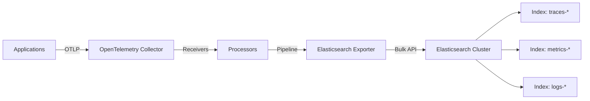

# How to Configure the Elasticsearch Exporter in the OpenTelemetry Collector

Author: [nawazdhandala](https://www.github.com/nawazdhandala)

Tags: OpenTelemetry, Collector, Exporters, Elasticsearch, Observability, Logs, Traces

Description: Learn how to configure the Elasticsearch exporter in OpenTelemetry Collector to send telemetry data to Elasticsearch clusters with authentication, TLS, and index management.

The OpenTelemetry Collector provides a powerful Elasticsearch exporter that enables you to send traces, metrics, and logs directly to your Elasticsearch cluster. This integration is particularly valuable for organizations already using the Elastic Stack for search and analytics, allowing them to leverage their existing infrastructure for observability data.

## Understanding the Elasticsearch Exporter

The Elasticsearch exporter is part of the OpenTelemetry Collector contrib distribution. It sends telemetry data to Elasticsearch using the Bulk API, which provides efficient batch processing of documents. The exporter supports various authentication methods, TLS configuration, and flexible index management strategies.

When you send telemetry data to Elasticsearch, each signal type (traces, metrics, logs) can be routed to different indices with customizable naming patterns. This allows you to organize your observability data according to your retention policies and query patterns.

## Architecture Overview

The following diagram illustrates how the Elasticsearch exporter fits into your telemetry pipeline:



## Prerequisites

Before configuring the Elasticsearch exporter, ensure you have:

- OpenTelemetry Collector Contrib distribution installed
- An Elasticsearch cluster (version 7.x or 8.x)
- Network connectivity between the Collector and Elasticsearch
- Appropriate credentials for authentication (if required)

## Basic Configuration

Here is a minimal configuration for the Elasticsearch exporter that sends data to a local Elasticsearch instance:

```yaml
# Basic Elasticsearch exporter configuration
exporters:
  elasticsearch:
    # Elasticsearch endpoint(s)
    endpoints:
      - http://localhost:9200

    # Index name for traces
    traces_index: traces

    # Index name for logs
    logs_index: logs

receivers:
  otlp:
    protocols:
      grpc:
        endpoint: 0.0.0.0:4317
      http:
        endpoint: 0.0.0.0:4318

processors:
  batch:
    timeout: 10s
    send_batch_size: 1024

service:
  pipelines:
    traces:
      receivers: [otlp]
      processors: [batch]
      exporters: [elasticsearch]
    logs:
      receivers: [otlp]
      processors: [batch]
      exporters: [elasticsearch]
```

This basic setup connects to Elasticsearch without authentication and writes traces to the `traces` index and logs to the `logs` index.

## Authentication Configuration

Production Elasticsearch deployments typically require authentication. The exporter supports multiple authentication mechanisms.

### Basic Authentication

For username and password authentication:

```yaml
exporters:
  elasticsearch:
    endpoints:
      - https://elasticsearch.example.com:9200

    # Basic authentication credentials
    auth:
      authenticator: basicauth

    # Index configuration
    traces_index: otel-traces
    logs_index: otel-logs

    # Discovery mode helps with cluster node discovery
    discover:
      on_start: true

# Configure the basic authenticator
extensions:
  basicauth/elasticsearch:
    client_auth:
      username: elastic
      password: ${ELASTICSEARCH_PASSWORD}

service:
  extensions: [basicauth/elasticsearch]
  pipelines:
    traces:
      receivers: [otlp]
      processors: [batch]
      exporters: [elasticsearch]
```

### API Key Authentication

For API key-based authentication:

```yaml
exporters:
  elasticsearch:
    endpoints:
      - https://elasticsearch.example.com:9200

    # API key authentication
    headers:
      Authorization: "ApiKey ${ELASTICSEARCH_API_KEY}"

    traces_index: otel-traces
    logs_index: otel-logs
```

## Advanced Index Management

Elasticsearch excels at time-series data management. Configure dynamic index names with date patterns for better data lifecycle management:

```yaml
exporters:
  elasticsearch:
    endpoints:
      - https://elasticsearch.example.com:9200

    auth:
      authenticator: basicauth

    # Dynamic index names with date patterns
    # Creates indices like: traces-2026-02-06
    traces_index: traces-%{2006-01-02}
    logs_index: logs-%{2006-01-02}

    # Index settings applied when creating new indices
    index:
      # Number of primary shards
      number_of_shards: 3

      # Number of replica shards
      number_of_replicas: 2

    # Mapping configuration
    mapping:
      # Deduplicate spans with the same span ID
      dedup: true

      # Mode for handling span events
      mode: ecs

extensions:
  basicauth/elasticsearch:
    client_auth:
      username: elastic
      password: ${ELASTICSEARCH_PASSWORD}

service:
  extensions: [basicauth/elasticsearch]
```

The date pattern `%{2006-01-02}` uses Go's time formatting syntax. This creates daily indices, which is ideal for implementing Index Lifecycle Management (ILM) policies in Elasticsearch.

## TLS Configuration

When connecting to Elasticsearch over TLS, you need to configure certificate validation:

```yaml
exporters:
  elasticsearch:
    endpoints:
      - https://elasticsearch.example.com:9200

    auth:
      authenticator: basicauth

    # TLS configuration
    tls:
      # Path to CA certificate for server verification
      ca_file: /etc/otel/certs/ca.crt

      # Client certificate for mutual TLS (optional)
      cert_file: /etc/otel/certs/client.crt
      key_file: /etc/otel/certs/client.key

      # Skip certificate verification (not recommended for production)
      insecure_skip_verify: false

      # Server name for certificate validation
      server_name_override: elasticsearch.example.com

    traces_index: otel-traces-%{2006-01-02}
    logs_index: otel-logs-%{2006-01-02}

extensions:
  basicauth/elasticsearch:
    client_auth:
      username: elastic
      password: ${ELASTICSEARCH_PASSWORD}

service:
  extensions: [basicauth/elasticsearch]
```

## Performance Tuning

Optimize the exporter's performance for high-throughput environments:

```yaml
exporters:
  elasticsearch:
    endpoints:
      - https://es-node1.example.com:9200
      - https://es-node2.example.com:9200
      - https://es-node3.example.com:9200

    # Enable node discovery for load balancing
    discover:
      on_start: true
      interval: 5m

    # Bulk request configuration
    bulk:
      # Maximum size of bulk request in bytes (10MB)
      max_size: 10485760

      # Maximum number of actions in a bulk request
      max_actions: 5000

    # Retry configuration
    retry:
      enabled: true
      max_elapsed_time: 300s
      initial_interval: 5s
      max_interval: 30s

    # Flush configuration
    flush:
      # Send bulk request after this interval even if not full
      interval: 10s

      # Flush when this many bytes are buffered
      bytes: 5242880

    # Timeout for requests
    timeout: 90s

    traces_index: otel-traces-%{2006-01-02}
    logs_index: otel-logs-%{2006-01-02}

processors:
  batch:
    # Batch processor settings should align with exporter settings
    timeout: 10s
    send_batch_size: 1024
    send_batch_max_size: 2048

service:
  pipelines:
    traces:
      receivers: [otlp]
      processors: [batch]
      exporters: [elasticsearch]
```

## Complete Production Configuration

Here is a comprehensive production-ready configuration combining all best practices:

```yaml
extensions:
  health_check:
    endpoint: 0.0.0.0:13133

  basicauth/elasticsearch:
    client_auth:
      username: ${ELASTICSEARCH_USERNAME}
      password: ${ELASTICSEARCH_PASSWORD}

receivers:
  otlp:
    protocols:
      grpc:
        endpoint: 0.0.0.0:4317
      http:
        endpoint: 0.0.0.0:4318

processors:
  batch:
    timeout: 10s
    send_batch_size: 1024
    send_batch_max_size: 2048

  # Add resource attributes for better querying
  resource:
    attributes:
      - key: deployment.environment
        value: production
        action: insert

  # Memory limiter to prevent OOM
  memory_limiter:
    check_interval: 1s
    limit_mib: 512
    spike_limit_mib: 128

exporters:
  elasticsearch:
    endpoints:
      - https://es-node1.example.com:9200
      - https://es-node2.example.com:9200
      - https://es-node3.example.com:9200

    auth:
      authenticator: basicauth

    discover:
      on_start: true
      interval: 5m

    tls:
      ca_file: /etc/otel/certs/ca.crt
      cert_file: /etc/otel/certs/client.crt
      key_file: /etc/otel/certs/client.key
      insecure_skip_verify: false

    traces_index: otel-traces-%{2006-01-02}
    logs_index: otel-logs-%{2006-01-02}

    index:
      number_of_shards: 3
      number_of_replicas: 2

    mapping:
      dedup: true
      mode: ecs

    bulk:
      max_size: 10485760
      max_actions: 5000

    retry:
      enabled: true
      max_elapsed_time: 300s

    flush:
      interval: 10s
      bytes: 5242880

    timeout: 90s

service:
  extensions: [health_check, basicauth/elasticsearch]

  pipelines:
    traces:
      receivers: [otlp]
      processors: [memory_limiter, resource, batch]
      exporters: [elasticsearch]

    logs:
      receivers: [otlp]
      processors: [memory_limiter, resource, batch]
      exporters: [elasticsearch]
```

## Monitoring and Troubleshooting

Enable the Collector's own telemetry to monitor the Elasticsearch exporter:

```yaml
service:
  telemetry:
    logs:
      level: info
      output_paths:
        - /var/log/otel-collector.log

    metrics:
      level: detailed
      address: 0.0.0.0:8888
```

Common issues and solutions:

- **Connection timeouts**: Increase the `timeout` value or check network connectivity
- **Bulk request failures**: Reduce `bulk.max_size` or `bulk.max_actions` values
- **Authentication errors**: Verify credentials and ensure the user has necessary privileges
- **Index creation failures**: Check that the Elasticsearch user has `create_index` privilege

## Elasticsearch Index Templates

Create index templates in Elasticsearch to ensure consistent mappings:

```json
PUT _index_template/otel-traces
{
  "index_patterns": ["otel-traces-*"],
  "template": {
    "settings": {
      "number_of_shards": 3,
      "number_of_replicas": 2,
      "index.lifecycle.name": "otel-traces-policy"
    },
    "mappings": {
      "properties": {
        "traceId": { "type": "keyword" },
        "spanId": { "type": "keyword" },
        "parentSpanId": { "type": "keyword" },
        "name": { "type": "keyword" },
        "duration": { "type": "long" }
      }
    }
  }
}
```

## Integration with Kibana

Once your telemetry data is in Elasticsearch, you can visualize it in Kibana. Create data views for your indices:

1. Navigate to Stack Management > Data Views
2. Create a data view with pattern `otel-traces-*`
3. Set `@timestamp` as the time field
4. Repeat for logs with pattern `otel-logs-*`

## Conclusion

The Elasticsearch exporter provides a robust solution for sending OpenTelemetry data to Elasticsearch. By following the configuration patterns outlined in this guide, you can build a scalable observability pipeline that leverages Elasticsearch's powerful search and analytics capabilities. Remember to tune batch sizes, implement proper authentication, and use time-based indices for optimal performance and manageability.

For organizations already invested in the Elastic Stack, this exporter offers a smooth path to adopting OpenTelemetry as the standardized observability framework while maintaining your existing analysis and visualization workflows.

To learn more about other exporters, check out our guides on the [ClickHouse exporter](https://oneuptime.com/blog/post/clickhouse-exporter-opentelemetry-collector/view) and [Datadog exporter](https://oneuptime.com/blog/post/datadog-exporter-opentelemetry-collector/view).
