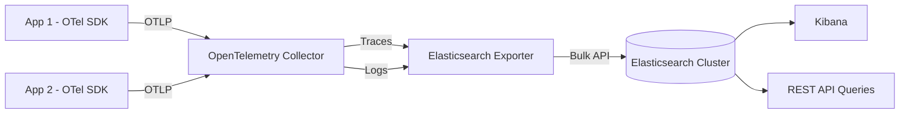

# How to Use Elasticsearch as an OpenTelemetry Log and Trace Backend

Author: [nawazdhandala](https://www.github.com/nawazdhandala)

Tags: OpenTelemetry, Elasticsearch, Logs, Traces, Observability, Backend, Search

Description: Step-by-step guide to configuring Elasticsearch as a backend for OpenTelemetry logs and traces with the Collector, index management, and querying tips.

---

Elasticsearch has been a go-to platform for log storage and search for over a decade, and it works well as a backend for OpenTelemetry data too. Its full-text search capabilities make it particularly strong for log analysis, and its support for structured queries makes trace exploration straightforward. If your organization already runs Elasticsearch for other purposes, using it as your OpenTelemetry backend means one less system to operate.

This guide covers setting up Elasticsearch to receive and store both logs and traces from the OpenTelemetry Collector. We will walk through deployment, Collector configuration, index lifecycle management, and practical query examples.

## Architecture

The setup follows the standard OpenTelemetry pattern. Applications send telemetry using OTLP to the Collector, which processes and batches the data before exporting it to Elasticsearch. You can then query the data through Elasticsearch's REST API or use Kibana for visual exploration.



The Elasticsearch exporter uses the Bulk API for writes, which is important for performance. Rather than making individual index requests for each span or log record, it batches them into bulk operations that Elasticsearch handles much more efficiently.

## Deploying Elasticsearch

For development and testing, a single-node Elasticsearch cluster is the easiest starting point. The following Docker command gets you up and running quickly.

```bash
# Start a single-node Elasticsearch instance for development
docker run -d \
  --name elasticsearch \
  -p 9200:9200 \
  -e discovery.type=single-node \
  -e xpack.security.enabled=true \
  -e ELASTIC_PASSWORD=changeme \
  -e "ES_JAVA_OPTS=-Xms1g -Xmx1g" \
  -v es-data:/usr/share/elasticsearch/data \
  docker.elastic.co/elasticsearch/elasticsearch:8.12.0
```

For production, you should run a multi-node cluster with dedicated master, data, and coordinating nodes. Here is a Docker Compose setup that provides a basic production-like topology.

```yaml
# docker-compose.yml - Elasticsearch cluster with Kibana
version: "3.8"
services:
  es-master:
    image: docker.elastic.co/elasticsearch/elasticsearch:8.12.0
    environment:
      - node.name=es-master
      - node.roles=master
      - cluster.name=otel-cluster
      - discovery.seed_hosts=es-data-1,es-data-2
      - cluster.initial_master_nodes=es-master
      - xpack.security.enabled=true
      - ELASTIC_PASSWORD=changeme
      - "ES_JAVA_OPTS=-Xms512m -Xmx512m"
    volumes:
      - es-master-data:/usr/share/elasticsearch/data

  es-data-1:
    image: docker.elastic.co/elasticsearch/elasticsearch:8.12.0
    environment:
      - node.name=es-data-1
      - node.roles=data,ingest
      - cluster.name=otel-cluster
      - discovery.seed_hosts=es-master,es-data-2
      - cluster.initial_master_nodes=es-master
      - xpack.security.enabled=true
      - ELASTIC_PASSWORD=changeme
      - "ES_JAVA_OPTS=-Xms2g -Xmx2g"
    volumes:
      - es-data-1-vol:/usr/share/elasticsearch/data

  es-data-2:
    image: docker.elastic.co/elasticsearch/elasticsearch:8.12.0
    environment:
      - node.name=es-data-2
      - node.roles=data,ingest
      - cluster.name=otel-cluster
      - discovery.seed_hosts=es-master,es-data-1
      - cluster.initial_master_nodes=es-master
      - xpack.security.enabled=true
      - ELASTIC_PASSWORD=changeme
      - "ES_JAVA_OPTS=-Xms2g -Xmx2g"
    volumes:
      - es-data-2-vol:/usr/share/elasticsearch/data

  kibana:
    image: docker.elastic.co/kibana/kibana:8.12.0
    ports:
      - "5601:5601"
    environment:
      - ELASTICSEARCH_HOSTS=http://es-master:9200
      - ELASTICSEARCH_USERNAME=elastic
      - ELASTICSEARCH_PASSWORD=changeme
    depends_on:
      - es-master

volumes:
  es-master-data:
  es-data-1-vol:
  es-data-2-vol:
```

## Configuring the OpenTelemetry Collector

The Collector's Elasticsearch exporter is available in the Contrib distribution. It supports both logs and traces pipelines and handles index creation, mapping, and bulk writes automatically.

Here is a Collector configuration that sends both logs and traces to Elasticsearch.

```yaml
# otel-collector-config.yaml
# Sends OpenTelemetry logs and traces to Elasticsearch

receivers:
  otlp:
    protocols:
      grpc:
        endpoint: 0.0.0.0:4317
      http:
        endpoint: 0.0.0.0:4318

processors:
  batch:
    # Larger batches work well with Elasticsearch's bulk API
    send_batch_size: 5000
    send_batch_max_size: 10000
    timeout: 5s

  memory_limiter:
    check_interval: 1s
    limit_mib: 1024
    spike_limit_mib: 256

exporters:
  elasticsearch/traces:
    # Elasticsearch endpoint URL
    endpoints: [https://localhost:9200]

    # Authentication credentials
    user: elastic
    password: changeme

    # Index configuration for traces
    traces_index: otel-traces

    # Mapping mode determines how OTel data maps to ES documents
    mapping:
      mode: ecs

    # TLS settings (disable verification for self-signed certs in dev)
    tls:
      insecure_skip_verify: true

    # Bulk indexing settings
    flush:
      bytes: 5242880   # 5MB flush threshold
      interval: 5s     # Flush at least every 5 seconds

    # Retry on transient failures
    retry:
      enabled: true
      max_requests: 3
      initial_interval: 1s

  elasticsearch/logs:
    endpoints: [https://localhost:9200]
    user: elastic
    password: changeme
    logs_index: otel-logs
    mapping:
      mode: ecs
    tls:
      insecure_skip_verify: true
    flush:
      bytes: 5242880
      interval: 5s
    retry:
      enabled: true
      max_requests: 3
      initial_interval: 1s

service:
  pipelines:
    traces:
      receivers: [otlp]
      processors: [memory_limiter, batch]
      exporters: [elasticsearch/traces]
    logs:
      receivers: [otlp]
      processors: [memory_limiter, batch]
      exporters: [elasticsearch/logs]
```

Notice that we define two separate Elasticsearch exporter instances, one for traces and one for logs. This lets you configure different indices and settings for each signal type, which is useful because traces and logs have different query patterns and retention requirements.

## Index Lifecycle Management

Observability data grows fast, and you need a strategy for managing it. Elasticsearch's Index Lifecycle Management (ILM) feature automates the process of rolling over indices, moving old data to cheaper storage tiers, and eventually deleting it.

Here is an ILM policy that keeps hot data for 3 days, moves it to warm storage for 14 days, then deletes it.

```json
// ILM policy for OpenTelemetry trace indices
// PUT _ilm/policy/otel-traces-policy
{
  "policy": {
    "phases": {
      "hot": {
        "min_age": "0ms",
        "actions": {
          "rollover": {
            "max_age": "1d",
            "max_primary_shard_size": "50gb"
          },
          "set_priority": {
            "priority": 100
          }
        }
      },
      "warm": {
        "min_age": "3d",
        "actions": {
          "shrink": {
            "number_of_shards": 1
          },
          "forcemerge": {
            "max_num_segments": 1
          },
          "set_priority": {
            "priority": 50
          }
        }
      },
      "delete": {
        "min_age": "14d",
        "actions": {
          "delete": {}
        }
      }
    }
  }
}
```

Apply this policy to your OpenTelemetry indices by creating an index template that references it.

```json
// Index template that applies the ILM policy to OTel trace indices
// PUT _index_template/otel-traces-template
{
  "index_patterns": ["otel-traces-*"],
  "template": {
    "settings": {
      "index.lifecycle.name": "otel-traces-policy",
      "index.lifecycle.rollover_alias": "otel-traces",
      "number_of_shards": 3,
      "number_of_replicas": 1
    }
  }
}
```

## Querying Traces and Logs

Elasticsearch's query DSL is powerful for searching through observability data. Here are some practical examples.

To find all error traces for a specific service in the last hour, use a bool query combining time range and status filters.

```json
// Find error traces for the checkout service in the last hour
// GET otel-traces/_search
{
  "query": {
    "bool": {
      "must": [
        { "match": { "resource.service.name": "checkout-service" } },
        { "match": { "status.code": "ERROR" } }
      ],
      "filter": [
        { "range": { "@timestamp": { "gte": "now-1h" } } }
      ]
    }
  },
  "sort": [{ "@timestamp": "desc" }],
  "size": 20
}
```

To search logs for a specific error message across all services, Elasticsearch's full-text search really shines.

```json
// Search for logs containing a specific error pattern
// GET otel-logs/_search
{
  "query": {
    "bool": {
      "must": [
        {
          "match_phrase": {
            "body": "connection refused"
          }
        }
      ],
      "filter": [
        { "range": { "@timestamp": { "gte": "now-6h" } } },
        { "term": { "severity_text": "ERROR" } }
      ]
    }
  },
  "sort": [{ "@timestamp": "desc" }],
  "size": 50
}
```

## Correlating Logs and Traces

One of the biggest advantages of sending both logs and traces to the same Elasticsearch cluster is correlation. Because OpenTelemetry injects trace context into log records, you can easily find all logs associated with a specific trace.

```json
// Find all logs associated with a specific trace
// GET otel-logs/_search
{
  "query": {
    "term": {
      "trace_id": "abc123def456789"
    }
  },
  "sort": [{ "@timestamp": "asc" }]
}
```

In Kibana, you can create saved searches and dashboards that link trace views with their corresponding log entries, giving your team a single pane of glass for debugging issues from the high-level trace view down to individual log lines.

## Performance Tips

Elasticsearch can handle high volumes of observability data, but there are a few things to get right. Size your JVM heap to no more than half of available memory, leaving the rest for the filesystem cache. Use SSDs for hot data nodes since observability workloads are I/O intensive. Set the Collector's batch size high enough to take advantage of Elasticsearch's bulk API (the 5000 setting in our config above is a good starting point). And monitor your cluster's indexing rate and search latency through Elasticsearch's own monitoring APIs or through Kibana's Stack Monitoring feature.

## Wrapping Up

Elasticsearch is a mature, well-understood platform for storing and searching OpenTelemetry data. Its full-text search makes it particularly strong for log analysis, and having both logs and traces in the same system enables powerful correlation workflows. Combined with Kibana for visualization and ILM for automated data management, it provides a complete observability backend that many teams are already familiar with.
