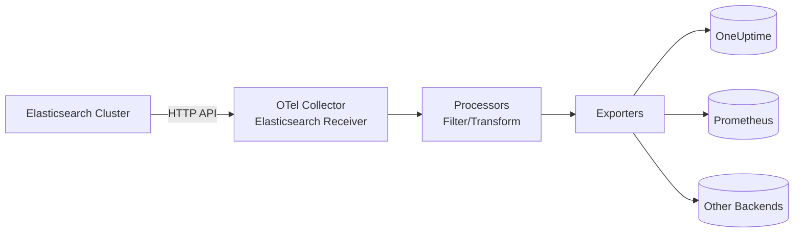

# How to Configure the Elasticsearch Receiver in the OpenTelemetry Collector

Author: [nawazdhandala](https://www.github.com/nawazdhandala)

Tags: OpenTelemetry, Collector, Elasticsearch, Observability, Metrics, Monitoring

Description: Learn how to configure the Elasticsearch receiver in OpenTelemetry Collector to monitor your Elasticsearch clusters with real YAML configuration examples and best practices.

---

Elasticsearch is a distributed search and analytics engine that powers many critical applications. Monitoring its health, performance, and resource usage is essential for maintaining reliable systems. The OpenTelemetry Collector's Elasticsearch receiver provides a standardized way to collect metrics from Elasticsearch clusters and ship them to your observability backend.

This guide walks through practical configuration of the Elasticsearch receiver, from basic setup to production-ready deployments with authentication, TLS, and advanced metric collection.

## What the Elasticsearch Receiver Does

The Elasticsearch receiver scrapes metrics from Elasticsearch nodes using the Elasticsearch REST API. It collects critical metrics including:

- Cluster health and status
- Node-level CPU, memory, and disk usage
- Index statistics and document counts
- Search and indexing performance metrics
- Thread pool statistics
- JVM heap and garbage collection metrics
- Cache hit rates and query performance

These metrics flow through the OpenTelemetry Collector's processing pipeline, where you can filter, transform, and route them to backends like OneUptime, Prometheus, or any OTLP-compatible system.

## Architecture Overview

The following diagram shows how the Elasticsearch receiver fits into your observability stack:



The receiver polls the Elasticsearch API at regular intervals, converts the raw JSON responses into OpenTelemetry metrics, and forwards them through your configured pipeline.

## Basic Configuration

Here's a minimal configuration to get started. This example connects to a local Elasticsearch instance without authentication:

```yaml
# receivers: Define how telemetry enters the Collector
receivers:
  # Elasticsearch receiver scrapes metrics from ES nodes
  elasticsearch:
    # Elasticsearch REST API endpoint
    endpoint: http://localhost:9200
    # Skip TLS verification (only for local development)
    skip_verify: false
    # How often to scrape metrics
    collection_interval: 60s
    # Collect node-level metrics
    nodes: ["_local"]
    # Username for basic authentication (if required)
    username: ""
    # Password for basic authentication (if required)
    password: ""

# exporters: Define where telemetry is sent
exporters:
  # Export to OneUptime using OTLP over HTTP
  otlphttp:
    endpoint: https://oneuptime.com/otlp
    headers:
      x-oneuptime-token: ${ONEUPTIME_TOKEN}

# service: Wire receivers and exporters into pipelines
service:
  pipelines:
    # Metrics pipeline for Elasticsearch data
    metrics:
      receivers: [elasticsearch]
      exporters: [otlphttp]
```

This basic configuration connects to Elasticsearch on localhost, scrapes metrics every 60 seconds from the local node, and exports them to OneUptime.

## Production Configuration with Authentication

Production Elasticsearch clusters typically require authentication and TLS. Here's a complete configuration with security enabled:

```yaml
receivers:
  elasticsearch:
    # Production Elasticsearch endpoint with HTTPS
    endpoint: https://elasticsearch.production.example.com:9200

    # Collection interval - balance freshness vs load
    # 30s for critical clusters, 60-120s for less critical
    collection_interval: 30s

    # Collect metrics from all cluster nodes
    # Use specific node names for targeted monitoring
    nodes: ["_all"]

    # Indices to monitor - supports wildcards
    # Empty list means all indices
    indices: ["application-*", "logs-*", "metrics-*"]

    # Basic authentication credentials
    # Store these in environment variables, not in config files
    username: ${ELASTICSEARCH_USERNAME}
    password: ${ELASTICSEARCH_PASSWORD}

    # TLS configuration for secure connections
    tls:
      # Verify server certificate (required in production)
      insecure_skip_verify: false
      # Path to CA certificate if using self-signed certs
      ca_file: /etc/ssl/certs/elasticsearch-ca.crt
      # Client certificate authentication (if required)
      cert_file: /etc/ssl/certs/collector-client.crt
      key_file: /etc/ssl/private/collector-client.key

    # Timeout for API requests
    timeout: 30s

# processors: Transform and enrich metrics
processors:
  # Batch metrics to reduce network overhead
  batch:
    timeout: 10s
    send_batch_size: 1024

  # Add resource attributes to identify the source
  resource:
    attributes:
      - key: service.name
        value: elasticsearch-production
        action: upsert
      - key: deployment.environment
        value: production
        action: upsert
      - key: elasticsearch.cluster.name
        value: production-cluster
        action: upsert

  # Memory limit to prevent collector OOM
  memory_limiter:
    check_interval: 5s
    limit_mib: 512

exporters:
  # Export to OneUptime
  otlphttp:
    endpoint: https://oneuptime.com/otlp
    headers:
      x-oneuptime-token: ${ONEUPTIME_TOKEN}
    timeout: 30s
    retry_on_failure:
      enabled: true
      initial_interval: 5s
      max_interval: 30s
      max_elapsed_time: 300s

service:
  pipelines:
    metrics:
      receivers: [elasticsearch]
      processors: [memory_limiter, batch, resource]
      exporters: [otlphttp]
```

This production configuration includes proper authentication, TLS verification, resource tagging, batching, and retry logic for reliable metric collection.

## Key Configuration Parameters Explained

### Collection Interval

The `collection_interval` determines how often the receiver polls Elasticsearch. Choose based on your needs:

- **30s**: High-frequency monitoring for critical clusters where you need near real-time alerts
- **60s**: Standard monitoring for most production workloads
- **120s or higher**: Low-priority clusters or cost-conscious environments

Shorter intervals increase load on Elasticsearch and your observability backend. Start conservative and adjust based on actual needs.

### Node Selection

The `nodes` parameter controls which Elasticsearch nodes to monitor:

- `["_all"]`: Monitor all nodes in the cluster (recommended for production)
- `["_local"]`: Only monitor the local node (useful when running collector on each ES node)
- `["node-1", "node-2"]`: Monitor specific named nodes
- `["_master"]`: Only monitor master-eligible nodes

For comprehensive cluster monitoring, use `["_all"]` with the collector running outside the cluster.

### Index Filtering

The `indices` parameter lets you filter which indices to collect metrics for:

```yaml
# Monitor all indices (can be expensive on large clusters)
indices: []

# Monitor specific index patterns
indices: ["application-*", "logs-2026-*"]

# Monitor only critical indices
indices: ["orders", "users", "products"]
```

Without filtering, the receiver collects metrics for every index, which can generate high cardinality metrics on clusters with many indices. Use patterns to focus on what matters.

## Multi-Cluster Monitoring

To monitor multiple Elasticsearch clusters from a single Collector instance, define multiple receiver instances:

```yaml
receivers:
  # Production cluster receiver
  elasticsearch/production:
    endpoint: https://es-prod.example.com:9200
    collection_interval: 30s
    nodes: ["_all"]
    username: ${ES_PROD_USERNAME}
    password: ${ES_PROD_PASSWORD}

  # Staging cluster receiver
  elasticsearch/staging:
    endpoint: https://es-staging.example.com:9200
    collection_interval: 60s
    nodes: ["_all"]
    username: ${ES_STAGING_USERNAME}
    password: ${ES_STAGING_PASSWORD}

  # Development cluster receiver
  elasticsearch/dev:
    endpoint: http://es-dev.example.com:9200
    collection_interval: 120s
    nodes: ["_all"]

processors:
  # Tag metrics with cluster name for filtering
  resource/production:
    attributes:
      - key: elasticsearch.cluster
        value: production
        action: upsert

  resource/staging:
    attributes:
      - key: elasticsearch.cluster
        value: staging
        action: upsert

  resource/dev:
    attributes:
      - key: elasticsearch.cluster
        value: development
        action: upsert

  batch:
    timeout: 10s

exporters:
  otlphttp:
    endpoint: https://oneuptime.com/otlp
    headers:
      x-oneuptime-token: ${ONEUPTIME_TOKEN}

service:
  pipelines:
    # Separate pipeline per cluster for granular control
    metrics/production:
      receivers: [elasticsearch/production]
      processors: [resource/production, batch]
      exporters: [otlphttp]

    metrics/staging:
      receivers: [elasticsearch/staging]
      processors: [resource/staging, batch]
      exporters: [otlphttp]

    metrics/dev:
      receivers: [elasticsearch/dev]
      processors: [resource/dev, batch]
      exporters: [otlphttp]
```

This approach gives you independent control over collection intervals, authentication, and processing for each cluster.

## Critical Metrics to Monitor

The Elasticsearch receiver exposes many metrics. Focus on these key indicators:

**Cluster Health**
- `elasticsearch.cluster.health`: Overall cluster status (green/yellow/red)
- `elasticsearch.cluster.nodes`: Number of nodes in the cluster
- `elasticsearch.cluster.shards`: Shard counts (active, relocating, unassigned)

**Node Performance**
- `elasticsearch.node.cpu.percent`: CPU utilization per node
- `elasticsearch.node.memory.heap.used`: JVM heap usage
- `elasticsearch.node.fs.available`: Available disk space

**Indexing and Search**
- `elasticsearch.node.indices.indexing.rate`: Documents indexed per second
- `elasticsearch.node.indices.search.rate`: Search queries per second
- `elasticsearch.node.indices.search.latency`: Query response time

**Resource Pressure**
- `elasticsearch.node.thread_pool.rejected`: Thread pool rejections (indicates overload)
- `elasticsearch.node.gc.time`: Garbage collection time
- `elasticsearch.node.breaker.tripped`: Circuit breaker trips

Set up alerts on these metrics to catch issues before they impact users.

## Deployment Patterns

### Pattern 1: Centralized Collector

Deploy one Collector instance outside the Elasticsearch cluster that scrapes all nodes:

```yaml
receivers:
  elasticsearch:
    endpoint: https://elasticsearch-lb.example.com:9200
    nodes: ["_all"]
    collection_interval: 60s
```

**Pros**: Simple deployment, single configuration point
**Cons**: Single point of failure, network latency to nodes

### Pattern 2: Agent per Node

Run a Collector instance on each Elasticsearch node using `_local`:

```yaml
receivers:
  elasticsearch:
    endpoint: http://localhost:9200
    nodes: ["_local"]
    collection_interval: 30s
```

**Pros**: No network overhead, survives individual node issues
**Cons**: More complex deployment, requires automation

### Pattern 3: Hybrid

Use a centralized collector for cluster-wide metrics and local agents for node-specific metrics:

```yaml
# Centralized collector - cluster metrics
receivers:
  elasticsearch/cluster:
    endpoint: https://elasticsearch-lb.example.com:9200
    nodes: ["_all"]
    indices: []  # Cluster-level only
    collection_interval: 60s

# Local agent - node metrics
receivers:
  elasticsearch/node:
    endpoint: http://localhost:9200
    nodes: ["_local"]
    collection_interval: 30s
```

This provides both broad visibility and detailed node insights.

## Troubleshooting Common Issues

**Authentication Failures**

If you see authentication errors, verify credentials and permissions:

```yaml
receivers:
  elasticsearch:
    username: ${ELASTICSEARCH_USERNAME}
    password: ${ELASTICSEARCH_PASSWORD}
```

Ensure the user has `monitor` or `cluster:monitor/*` privileges.

**TLS Certificate Errors**

For self-signed certificates, provide the CA certificate:

```yaml
receivers:
  elasticsearch:
    tls:
      ca_file: /path/to/ca.crt
      insecure_skip_verify: false  # Never use true in production
```

**High Cardinality Metrics**

If you have thousands of indices, filter to reduce cardinality:

```yaml
receivers:
  elasticsearch:
    indices: ["critical-*"]  # Only monitor critical indices
```

**Connection Timeouts**

Increase timeout for slow or overloaded clusters:

```yaml
receivers:
  elasticsearch:
    timeout: 60s
```

## Integration with OneUptime

Once metrics are flowing to OneUptime, you can:

1. Create dashboards visualizing Elasticsearch cluster health
2. Set up alerts for critical metrics like high heap usage or cluster status changes
3. Correlate Elasticsearch metrics with application traces and logs
4. Track performance trends over time

The OpenTelemetry standard ensures your metrics are portable. If you later switch to a different backend, your Collector configuration remains largely the same.

## Security Best Practices

**Never hardcode credentials**. Use environment variables:

```yaml
receivers:
  elasticsearch:
    username: ${ELASTICSEARCH_USERNAME}
    password: ${ELASTICSEARCH_PASSWORD}
```

**Always enable TLS** in production:

```yaml
receivers:
  elasticsearch:
    endpoint: https://elasticsearch.example.com:9200
    tls:
      insecure_skip_verify: false
```

**Use least privilege**. Create a dedicated monitoring user with only `monitor` permissions:

```bash
# Elasticsearch API call to create monitoring user
curl -X POST "https://elasticsearch:9200/_security/user/otel-monitor" -u elastic:password -H 'Content-Type: application/json' -d'
{
  "password" : "monitoring-password",
  "roles" : ["monitoring_user"],
  "full_name" : "OpenTelemetry Collector"
}
'
```

**Rotate credentials** regularly and store them securely in secrets management systems like HashiCorp Vault or Kubernetes Secrets.

## Related Resources

For more on OpenTelemetry Collector configuration:

- [OpenTelemetry Collector: What It Is, When You Need It, and When You Don't](https://oneuptime.com/blog/post/2025-09-18-what-is-opentelemetry-collector-and-why-use-one/view)
- [How to collect internal metrics from OpenTelemetry Collector](https://oneuptime.com/blog/post/2025-01-22-how-to-collect-opentelemetry-collector-internal-metrics/view)

For monitoring other infrastructure components:
- [How to Configure the Nginx Receiver in the OpenTelemetry Collector](https://oneuptime.com/blog/post/nginx-receiver-opentelemetry-collector/view)
- [How to Configure the Apache Receiver in the OpenTelemetry Collector](https://oneuptime.com/blog/post/apache-receiver-opentelemetry-collector/view)

## Final Thoughts

The Elasticsearch receiver gives you production-grade monitoring of your search infrastructure using open standards. Start with basic configuration, add authentication and TLS for security, and tune collection intervals based on your cluster size and monitoring needs.

The beauty of OpenTelemetry is portability. Configure once, export anywhere. Your Elasticsearch metrics integrate seamlessly with application traces and logs, giving you complete visibility into your systems.

Need a backend for your OpenTelemetry metrics? OneUptime natively supports OTLP and provides powerful dashboards, alerting, and correlation capabilities without vendor lock-in.
