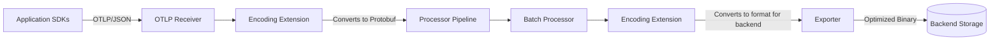

# How to Configure the Encoding Extension in the OpenTelemetry Collector

Author: [nawazdhandala](https://www.github.com/nawazdhandala)

Tags: OpenTelemetry, Collector, Extensions, Encoding, Data Transformation

Description: Learn how to configure the Encoding Extension in OpenTelemetry Collector to transform telemetry data between different encoding formats like JSON, Protobuf, and MessagePack for optimal performance and compatibility.

---

The Encoding Extension in the OpenTelemetry Collector provides critical capabilities for transforming telemetry data between different encoding formats. This extension becomes essential when you need to optimize data transmission, ensure compatibility with downstream systems, or reduce bandwidth consumption in distributed observability pipelines.

## What is the Encoding Extension?

The Encoding Extension is an OpenTelemetry Collector component that handles the serialization and deserialization of telemetry data. It enables you to convert telemetry signals (traces, metrics, logs) between different encoding formats such as JSON, Protocol Buffers (Protobuf), MessagePack, and other binary formats.

This extension operates at the pipeline level, allowing you to specify different encoding strategies for different receivers and exporters. The primary use cases include:

- Converting between human-readable formats (JSON) and efficient binary formats (Protobuf)
- Optimizing data transmission size for high-throughput environments
- Ensuring compatibility when integrating with legacy systems
- Reducing network bandwidth consumption in constrained environments
- Enabling debugging through readable format conversion

## Why Use the Encoding Extension?

Performance optimization is the primary driver for using the Encoding Extension. Binary formats like Protobuf can reduce payload sizes by 70-80% compared to JSON, significantly lowering network costs and improving throughput in high-volume telemetry pipelines.

Compatibility requirements often necessitate format conversion. When integrating the Collector with systems that only accept specific encoding formats, the Encoding Extension bridges this gap without requiring custom code changes in your applications.

Debugging becomes easier when you can convert binary telemetry to human-readable JSON for inspection, then switch back to optimized binary formats for production transmission.

## Architecture and Data Flow

The Encoding Extension sits between the receiver and processor stages in the Collector pipeline. Here's how data flows through the system:



The extension performs bidirectional conversion - it can decode incoming data from one format and encode outgoing data to another format. This flexibility allows you to optimize each leg of your telemetry pipeline independently.

## Basic Configuration

The Encoding Extension requires configuration in both the extensions section and the service section of your Collector configuration. Here's a basic setup that converts incoming JSON telemetry to Protobuf for internal processing:

```yaml
# extensions section defines the encoding strategies
extensions:
  # Define encoding extension for JSON to Protobuf conversion
  encoding:
    # Input encoding format from receivers
    decode:
      format: json              # Accept JSON-encoded telemetry
    # Output encoding format to processors/exporters
    encode:
      format: proto             # Convert to Protocol Buffers
      compression: gzip         # Apply gzip compression to reduce size

# receivers section remains standard
receivers:
  otlp:
    protocols:
      http:                     # HTTP receiver on port 4318
        endpoint: 0.0.0.0:4318

# processors for data transformation
processors:
  batch:
    timeout: 10s
    send_batch_size: 1024

# exporters send to backend
exporters:
  otlphttp:
    endpoint: https://oneuptime.com/otlp
    headers:
      x-oneuptime-token: ${ONEUPTIME_TOKEN}

# service section wires everything together
service:
  # Enable the encoding extension
  extensions: [encoding]

  pipelines:
    traces:
      receivers: [otlp]
      processors: [batch]
      exporters: [otlphttp]
    metrics:
      receivers: [otlp]
      processors: [batch]
      exporters: [otlphttp]
    logs:
      receivers: [otlp]
      processors: [batch]
      exporters: [otlphttp]
```

This configuration accepts JSON-encoded OTLP data from applications and converts it to compressed Protobuf for efficient internal processing and transmission to the backend.

## Advanced Configuration Patterns

### Multi-Format Support

In production environments, you often need to support multiple encoding formats simultaneously. Different services might emit telemetry in different formats, and your backend systems might require specific encodings.

Here's a configuration that handles multiple input formats and routes them appropriately:

```yaml
extensions:
  # Encoding extension for legacy JSON systems
  encoding/json:
    decode:
      format: json
    encode:
      format: json              # Keep as JSON for compatibility

  # Encoding extension for high-performance Protobuf
  encoding/proto:
    decode:
      format: proto
    encode:
      format: proto
      compression: snappy       # Snappy is faster than gzip for binary data

  # Encoding extension for MessagePack (compact binary)
  encoding/msgpack:
    decode:
      format: msgpack           # Accept MessagePack from efficient clients
    encode:
      format: proto             # Convert to Protobuf for backend
      compression: gzip

receivers:
  # Separate receivers for different encoding formats
  otlp/json:
    protocols:
      http:
        endpoint: 0.0.0.0:4318  # JSON endpoint

  otlp/proto:
    protocols:
      grpc:
        endpoint: 0.0.0.0:4317  # Protobuf endpoint

  otlp/msgpack:
    protocols:
      http:
        endpoint: 0.0.0.0:4319  # MessagePack endpoint

processors:
  # Batch processor optimized for each format
  batch/json:
    timeout: 5s                 # Shorter timeout for JSON (larger payloads)
    send_batch_size: 512

  batch/binary:
    timeout: 10s                # Longer timeout for binary (smaller payloads)
    send_batch_size: 2048

exporters:
  # Export to OneUptime with Protobuf
  otlphttp/oneuptime:
    endpoint: https://oneuptime.com/otlp
    encoding: proto             # Use Protobuf for optimal performance
    compression: gzip
    headers:
      x-oneuptime-token: ${ONEUPTIME_TOKEN}

service:
  # Enable all encoding extensions
  extensions: [encoding/json, encoding/proto, encoding/msgpack]

  pipelines:
    # Pipeline for JSON telemetry
    traces/json:
      receivers: [otlp/json]
      processors: [batch/json]
      exporters: [otlphttp/oneuptime]

    # Pipeline for Protobuf telemetry
    traces/proto:
      receivers: [otlp/proto]
      processors: [batch/binary]
      exporters: [otlphttp/oneuptime]

    # Pipeline for MessagePack telemetry
    traces/msgpack:
      receivers: [otlp/msgpack]
      processors: [batch/binary]
      exporters: [otlphttp/oneuptime]
```

This multi-pipeline approach allows different services to use their preferred encoding format while maintaining a unified backend export format.

### Compression Strategies

Compression significantly impacts both network bandwidth and CPU utilization. The Encoding Extension supports multiple compression algorithms, each with different trade-offs:

```yaml
extensions:
  # No compression - lowest CPU, highest bandwidth
  encoding/none:
    encode:
      format: proto
      compression: none         # No compression overhead

  # Gzip - best compression ratio, higher CPU usage
  encoding/gzip:
    encode:
      format: proto
      compression: gzip
      compression_level: 6      # Balance between speed and ratio (1-9)

  # Snappy - fast compression, moderate ratio
  encoding/snappy:
    encode:
      format: proto
      compression: snappy       # Optimized for speed

  # Zstd - modern algorithm, excellent ratio and speed
  encoding/zstd:
    encode:
      format: proto
      compression: zstd
      compression_level: 3      # Default level for balanced performance

receivers:
  otlp:
    protocols:
      grpc:
        endpoint: 0.0.0.0:4317

processors:
  batch:
    timeout: 10s
    send_batch_size: 1024

exporters:
  # Use Zstd for optimal balance in production
  otlphttp:
    endpoint: https://oneuptime.com/otlp
    encoding: proto
    compression: zstd
    headers:
      x-oneuptime-token: ${ONEUPTIME_TOKEN}

service:
  extensions: [encoding/zstd]
  pipelines:
    traces:
      receivers: [otlp]
      processors: [batch]
      exporters: [otlphttp]
```

Compression benchmarks for typical telemetry data:
- **None**: 100% size, 0% CPU overhead
- **Snappy**: 40-50% size reduction, 5-10% CPU overhead
- **Gzip (level 6)**: 70-80% size reduction, 15-25% CPU overhead
- **Zstd (level 3)**: 70-80% size reduction, 10-15% CPU overhead

For most production deployments, Zstd offers the best balance of compression ratio and CPU efficiency.

## Performance Considerations

### Memory Usage

The Encoding Extension performs in-memory serialization and deserialization. For high-throughput environments, configure the memory_limiter processor to prevent out-of-memory conditions:

```yaml
processors:
  # Protect Collector from memory exhaustion during encoding
  memory_limiter:
    check_interval: 1s
    limit_mib: 2048             # Hard limit
    spike_limit_mib: 512        # Allow temporary spikes

  batch:
    timeout: 10s
    send_batch_size: 1024

service:
  pipelines:
    traces:
      receivers: [otlp]
      # Memory limiter runs before encoding to prevent issues
      processors: [memory_limiter, batch]
      exporters: [otlphttp]
```

Place the memory_limiter processor before encoding-intensive operations to catch memory issues early.

### CPU Optimization

Encoding and compression are CPU-intensive operations. For multi-core systems, the Collector automatically parallelizes processing, but you can tune concurrency:

```yaml
extensions:
  encoding:
    encode:
      format: proto
      compression: zstd
      compression_level: 3
      # Number of concurrent encoding workers
      workers: 4                # Match to available CPU cores

receivers:
  otlp:
    protocols:
      grpc:
        endpoint: 0.0.0.0:4317
        # Limit concurrent streams to prevent CPU saturation
        max_concurrent_streams: 100

processors:
  batch:
    timeout: 10s
    send_batch_size: 1024

exporters:
  otlphttp:
    endpoint: https://oneuptime.com/otlp
    # Control export concurrency
    sending_queue:
      num_consumers: 4          # Parallel export workers
    headers:
      x-oneuptime-token: ${ONEUPTIME_TOKEN}

service:
  extensions: [encoding]
  pipelines:
    traces:
      receivers: [otlp]
      processors: [batch]
      exporters: [otlphttp]
```

Monitor CPU utilization and adjust worker counts based on your specific workload patterns.

## Debugging and Troubleshooting

### Enabling Debug Logging

When troubleshooting encoding issues, enable detailed logging to inspect format conversions:

```yaml
extensions:
  encoding:
    decode:
      format: json
    encode:
      format: proto
      compression: gzip
    # Enable debug logging for encoding operations
    debug:
      log_payloads: true        # Log payload samples (use carefully in production)
      log_errors: true          # Log all encoding errors
      sample_rate: 0.01         # Log 1% of successful conversions

receivers:
  otlp:
    protocols:
      http:
        endpoint: 0.0.0.0:4318

processors:
  batch:
    timeout: 10s

exporters:
  # Debug exporter logs telemetry to console
  logging:
    loglevel: debug
    sampling_initial: 5
    sampling_thereafter: 200

  otlphttp:
    endpoint: https://oneuptime.com/otlp
    headers:
      x-oneuptime-token: ${ONEUPTIME_TOKEN}

service:
  # Configure Collector's own telemetry
  telemetry:
    logs:
      level: debug              # Enable debug-level logs

  extensions: [encoding]
  pipelines:
    traces:
      receivers: [otlp]
      processors: [batch]
      # Include logging exporter for debugging
      exporters: [logging, otlphttp]
```

The debug configuration logs encoding operations, helping you identify format incompatibilities or conversion errors.

### Format Validation

Add validation to ensure incoming data matches expected encoding:

```yaml
extensions:
  encoding:
    decode:
      format: json
      # Strict validation catches malformed data early
      validation:
        strict: true            # Reject invalid payloads
        max_size_mb: 10         # Reject oversized payloads
    encode:
      format: proto

receivers:
  otlp:
    protocols:
      http:
        endpoint: 0.0.0.0:4318

processors:
  batch:
    timeout: 10s

exporters:
  otlphttp:
    endpoint: https://oneuptime.com/otlp
    headers:
      x-oneuptime-token: ${ONEUPTIME_TOKEN}

service:
  extensions: [encoding]
  pipelines:
    traces:
      receivers: [otlp]
      processors: [batch]
      exporters: [otlphttp]
```

Strict validation prevents corrupt or malformed telemetry from entering your pipeline, improving overall data quality.

## Production Best Practices

### High-Availability Configuration

For production deployments, implement redundancy and failover mechanisms:

```yaml
extensions:
  encoding/primary:
    decode:
      format: json
    encode:
      format: proto
      compression: zstd

  encoding/fallback:
    decode:
      format: json
    encode:
      format: json              # Fallback to JSON if Protobuf fails
      compression: gzip

receivers:
  otlp:
    protocols:
      grpc:
        endpoint: 0.0.0.0:4317
      http:
        endpoint: 0.0.0.0:4318

processors:
  batch:
    timeout: 10s
    send_batch_size: 1024

  # Retry on encoding failures
  retry_on_failure:
    enabled: true
    initial_interval: 1s
    max_interval: 30s
    max_elapsed_time: 5m

exporters:
  # Primary backend with Protobuf
  otlphttp/primary:
    endpoint: https://oneuptime.com/otlp
    encoding: proto
    compression: zstd
    headers:
      x-oneuptime-token: ${ONEUPTIME_TOKEN}
    retry_on_failure:
      enabled: true
      initial_interval: 5s
      max_interval: 30s

  # Fallback backend with JSON for maximum compatibility
  otlphttp/fallback:
    endpoint: https://backup.oneuptime.com/otlp
    encoding: json
    headers:
      x-oneuptime-token: ${ONEUPTIME_TOKEN_BACKUP}

service:
  extensions: [encoding/primary, encoding/fallback]
  pipelines:
    traces/primary:
      receivers: [otlp]
      processors: [batch, retry_on_failure]
      exporters: [otlphttp/primary]

    traces/fallback:
      receivers: [otlp]
      processors: [batch]
      exporters: [otlphttp/fallback]
```

This configuration provides automatic failover if the primary encoding or export path encounters issues.

## Monitoring the Encoding Extension

Track encoding performance with internal metrics:

```yaml
extensions:
  encoding:
    decode:
      format: json
    encode:
      format: proto
      compression: zstd

receivers:
  otlp:
    protocols:
      grpc:
        endpoint: 0.0.0.0:4317

processors:
  batch:
    timeout: 10s

exporters:
  otlphttp:
    endpoint: https://oneuptime.com/otlp
    headers:
      x-oneuptime-token: ${ONEUPTIME_TOKEN}

service:
  extensions: [encoding]

  # Configure Collector self-monitoring
  telemetry:
    metrics:
      level: detailed           # Capture detailed metrics
      readers:
        - periodic:
            exporter:
              otlp:
                protocol: http/protobuf
                endpoint: https://oneuptime.com/otlp
                headers:
                  x-oneuptime-token: ${ONEUPTIME_TOKEN}

  pipelines:
    traces:
      receivers: [otlp]
      processors: [batch]
      exporters: [otlphttp]
```

Key metrics to monitor:
- **otelcol_encoding_decode_duration**: Time spent decoding incoming telemetry
- **otelcol_encoding_encode_duration**: Time spent encoding outgoing telemetry
- **otelcol_encoding_compression_ratio**: Achieved compression ratios
- **otelcol_encoding_errors**: Encoding/decoding error counts

These metrics help you identify performance bottlenecks and optimize encoding configurations.

## Related Resources

For more information on optimizing your OpenTelemetry Collector deployment, check out these related posts:

- [OpenTelemetry Collector: What It Is, When You Need It, and When You Don't](https://oneuptime.com/blog/post/2025-09-18-what-is-opentelemetry-collector-and-why-use-one/view)
- [How to collect internal metrics from OpenTelemetry Collector](https://oneuptime.com/blog/post/2025-01-22-how-to-collect-opentelemetry-collector-internal-metrics/view)
- [How to reduce noise in OpenTelemetry](https://oneuptime.com/blog/post/2025-08-25-how-to-reduce-noise-in-opentelemetry/view)

## Summary

The Encoding Extension provides essential capabilities for optimizing telemetry data transmission in OpenTelemetry Collector pipelines. By configuring appropriate encoding formats and compression strategies, you can significantly reduce bandwidth consumption, improve throughput, and ensure compatibility across diverse observability infrastructure.

Start with simple configurations using Protobuf with Zstd compression for most production deployments. As your requirements grow, leverage multi-format support and advanced compression strategies to optimize specific pipeline segments.

Monitor encoding performance continuously through internal metrics, and adjust configurations based on actual workload patterns and resource utilization. The flexibility of the Encoding Extension allows you to balance CPU, memory, and network resources according to your specific operational constraints.

Need a production-grade backend for your OpenTelemetry Collector? OneUptime natively supports all OTLP encoding formats with automatic optimization and compression, providing a seamless observability experience without vendor lock-in.
