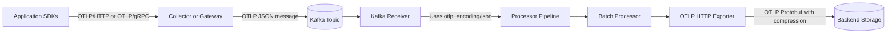

# How to Configure the Encoding Extension in the OpenTelemetry Collector

Author: [nawazdhandala](https://www.github.com/nawazdhandala)

Tags: OpenTelemetry, Collector, Extension, Encoding, Data Transformation

Description: Learn how to configure the Encoding Extension in OpenTelemetry Collector to transform telemetry data between different encoding formats like JSON, Protobuf.

---

The OTLP Encoding Extension in the OpenTelemetry Collector provides a reusable way for supported components to serialize and deserialize telemetry data in OTLP formats. This extension becomes useful when a receiver or exporter supports pluggable encodings, such as Kafka components that read from or write to topics containing OTLP JSON or OTLP Protobuf payloads.

## What is the Encoding Extension?

The OTLP Encoding Extension is an OpenTelemetry Collector contrib component that handles OTLP serialization and deserialization. It supports telemetry signals encoded with the OTLP Protobuf protocol or the OTLP JSON protocol.

This extension is not a processor and it does not run as a separate stage between receivers, processors, and exporters. Instead, components that support encoding extensions can reference it by component ID. The Collector receives data, converts it into its internal pdata representation, runs processors on that internal representation, and then exporters encode data for their destination.

The primary use cases include:

- Reading OTLP JSON or OTLP Protobuf telemetry from systems such as Kafka
- Writing OTLP JSON or OTLP Protobuf telemetry to systems such as Kafka
- Keeping encoding configuration reusable across components that support encoding extensions
- Ensuring compatibility when integrating with systems that already store OTLP payloads in a specific format
- Enabling readable OTLP JSON payloads in development or debugging workflows

## Why Use the Encoding Extension?

Compatibility is the primary driver for using the OTLP Encoding Extension. When telemetry is stored in Kafka or another supported transport as OTLP JSON or OTLP Protobuf, the extension gives the Collector an explicit encoder or decoder for that payload format.

Performance requirements often favor OTLP Protobuf because it is compact and efficient. OTLP JSON is easier to inspect manually, but it usually produces larger payloads and costs more CPU to parse and generate.

Debugging becomes easier when you use OTLP JSON for development topics or test pipelines, then switch to OTLP Protobuf for production topics where efficiency matters more.

## Architecture and Data Flow

The Encoding Extension is referenced by supported receivers or exporters. Here's how data flows through a Kafka-based pipeline:


```mermaid
graph LR
    A[Application SDKs] -->|OTLP/HTTP or OTLP/gRPC| B[Collector or Gateway]
    B -->|OTLP JSON message| C[(Kafka Topic)]
    C --> D[Kafka Receiver]
    D -->|Uses otlp_encoding/json| E[Processor Pipeline]
    E --> F[Batch Processor]
    F --> G[OTLP HTTP Exporter]
    G -->|OTLP Protobuf with compression| H[(Backend Storage)]
```

The receiver decodes incoming telemetry into the Collector's internal representation. Processors work on that internal representation, and exporters encode data for the destination protocol.

## Basic Configuration

The OTLP Encoding Extension is configured in the `extensions` section and enabled in the `service.extensions` list. Supported components then reference the extension by its component ID. Here's a basic setup that reads OTLP JSON telemetry from Kafka and exports it as compressed OTLP Protobuf over HTTP:

```yaml
# extensions section defines reusable OTLP encoders/decoders
extensions:
  otlp_encoding/json:
    protocol: otlp_json

# receivers decode incoming data
receivers:
  kafka:
    brokers:
      - localhost:9092
    traces:
      topics: [otlp_spans_json]
      encoding: otlp_encoding/json
    metrics:
      topics: [otlp_metrics_json]
      encoding: otlp_encoding/json
    logs:
      topics: [otlp_logs_json]
      encoding: otlp_encoding/json

# processors for data transformation
processors:
  batch:
    timeout: 10s
    send_batch_size: 1024

# exporters send to backend
exporters:
  otlp_http:
    endpoint: https://oneuptime.com/otlp
    encoding: proto
    compression: gzip
    headers:
      x-oneuptime-token: ${ONEUPTIME_TOKEN}

# service section wires everything together
service:
  # Enable the encoding extension
  extensions: [otlp_encoding/json]

  pipelines:
    traces:
      receivers: [kafka]
      processors: [batch]
      exporters: [otlp_http]
    metrics:
      receivers: [kafka]
      processors: [batch]
      exporters: [otlp_http]
    logs:
      receivers: [kafka]
      processors: [batch]
      exporters: [otlp_http]
```

This configuration consumes OTLP JSON data from Kafka topics, decodes it into the Collector's internal telemetry representation, batches it, and exports it to the backend using OTLP HTTP with Protobuf encoding and gzip compression.

## Advanced Configuration Patterns

### Multi-Format Support

In production environments, you often need to support multiple OTLP formats simultaneously. Different services might publish telemetry in different formats, and your backend systems might require a specific export encoding.

Here's a configuration that handles OTLP JSON and OTLP Protobuf Kafka topics and routes them to a unified OTLP HTTP backend:

```yaml
extensions:
  # Encoding extension for OTLP JSON payloads
  otlp_encoding/json:
    protocol: otlp_json

  # Encoding extension for OTLP Protobuf payloads
  otlp_encoding/proto:
    protocol: otlp_proto

receivers:
  # Kafka receiver for OTLP JSON telemetry
  kafka/json:
    brokers:
      - localhost:9092
    traces:
      topics: [otlp_spans_json]
      encoding: otlp_encoding/json

  # Kafka receiver for OTLP Protobuf telemetry
  kafka/proto:
    brokers:
      - localhost:9092
    traces:
      topics: [otlp_spans_proto]
      encoding: otlp_encoding/proto

processors:
  # Batch processor optimized for each format
  batch/json:
    timeout: 5s
    send_batch_size: 512

  batch/binary:
    timeout: 10s
    send_batch_size: 2048

exporters:
  # Export to OneUptime with Protobuf
  otlp_http/oneuptime:
    endpoint: https://oneuptime.com/otlp
    encoding: proto
    compression: gzip
    headers:
      x-oneuptime-token: ${ONEUPTIME_TOKEN}

service:
  # Enable all encoding extensions
  extensions: [otlp_encoding/json, otlp_encoding/proto]

  pipelines:
    # Pipeline for OTLP JSON telemetry
    traces/json:
      receivers: [kafka/json]
      processors: [batch/json]
      exporters: [otlp_http/oneuptime]

    # Pipeline for OTLP Protobuf telemetry
    traces/proto:
      receivers: [kafka/proto]
      processors: [batch/binary]
      exporters: [otlp_http/oneuptime]
```

This multi-pipeline approach allows different services to use their preferred OTLP payload format while maintaining a unified backend export format.

### Compression Strategies

Compression is configured on the transport component, such as the OTLP HTTP exporter, not on the OTLP Encoding Extension. Compression significantly impacts both network bandwidth and CPU utilization:

```yaml
receivers:
  otlp:
    protocols:
      grpc:
        endpoint: 0.0.0.0:4317

processors:
  batch:
    timeout: 10s
    send_batch_size: 1024

exporters:
  # No compression - lowest CPU, highest bandwidth
  otlp_http/none:
    endpoint: https://oneuptime.com/otlp
    encoding: proto
    compression: none
    headers:
      x-oneuptime-token: ${ONEUPTIME_TOKEN}

  # Gzip - widely supported and a good default for OTLP HTTP
  otlp_http/gzip:
    endpoint: https://oneuptime.com/otlp
    encoding: proto
    compression: gzip
    compression_params:
      level: 6
    headers:
      x-oneuptime-token: ${ONEUPTIME_TOKEN}

  # Snappy - faster compression when the backend supports it
  otlp_http/snappy:
    endpoint: https://oneuptime.com/otlp
    encoding: proto
    compression: snappy
    headers:
      x-oneuptime-token: ${ONEUPTIME_TOKEN}

  # Zstd - strong compression when the backend supports it
  otlp_http/zstd:
    endpoint: https://oneuptime.com/otlp
    encoding: proto
    compression: zstd
    compression_params:
      level: 3
    headers:
      x-oneuptime-token: ${ONEUPTIME_TOKEN}

service:
  pipelines:
    traces:
      receivers: [otlp]
      processors: [batch]
      exporters: [otlp_http/gzip]
```

Compression benchmarks vary heavily by payload size and data entropy. The Collector documentation includes benchmark data for gzip, snappy, and zstd and notes that gzip is the only required compression algorithm for OTLP servers. Use gzip as a compatibility-first default, and use snappy or zstd only when your destination supports them.

## Performance Considerations

### Memory Usage

Encoding and decoding require the Collector to hold request payloads and internal telemetry data in memory. For high-throughput environments, configure the memory_limiter processor to prevent out-of-memory conditions:

```yaml
processors:
  # Protect Collector from memory exhaustion
  memory_limiter:
    check_interval: 1s
    limit_mib: 2048
    spike_limit_mib: 512

  batch:
    timeout: 10s
    send_batch_size: 1024

service:
  pipelines:
    traces:
      receivers: [otlp]
      # Best practice is to place memory_limiter first in the pipeline
      processors: [memory_limiter, batch]
      exporters: [otlp_http]
```

Place the memory_limiter processor first in the pipeline so it can apply backpressure early when memory usage crosses its configured limits.

### CPU Optimization

Encoding and compression can be CPU-intensive operations. Tune the receiver and exporter settings that actually control concurrency and request behavior:

```yaml
receivers:
  otlp:
    protocols:
      grpc:
        endpoint: 0.0.0.0:4317
        # Limit concurrent streams to prevent CPU saturation
        max_concurrent_streams: 100

processors:
  batch:
    timeout: 10s
    send_batch_size: 1024

exporters:
  otlp_http:
    endpoint: https://oneuptime.com/otlp
    encoding: proto
    compression: gzip
    # Control export concurrency
    sending_queue:
      enabled: true
      num_consumers: 4
    headers:
      x-oneuptime-token: ${ONEUPTIME_TOKEN}

service:
  pipelines:
    traces:
      receivers: [otlp]
      processors: [batch]
      exporters: [otlp_http]
```

Monitor CPU utilization and adjust receiver limits, batch sizes, compression settings, and exporter queue consumers based on your specific workload patterns.

## Debugging and Troubleshooting

### Enabling Debug Logging

When troubleshooting encoding issues, enable Collector debug logs and add the debug exporter to inspect the telemetry that successfully entered the pipeline:

```yaml
extensions:
  otlp_encoding/json:
    protocol: otlp_json

receivers:
  kafka:
    brokers:
      - localhost:9092
    logs:
      topics: [otlp_logs_json]
      encoding: otlp_encoding/json

processors:
  batch:
    timeout: 10s

exporters:
  # Debug exporter logs telemetry to console
  debug:
    verbosity: detailed
    sampling_initial: 5
    sampling_thereafter: 200

  otlp_http:
    endpoint: https://oneuptime.com/otlp
    headers:
      x-oneuptime-token: ${ONEUPTIME_TOKEN}

service:
  # Configure Collector's own telemetry
  telemetry:
    logs:
      level: debug

  extensions: [otlp_encoding/json]
  pipelines:
    logs:
      receivers: [kafka]
      processors: [batch]
      # Include debug exporter for troubleshooting
      exporters: [debug, otlp_http]
```

Collector logs help identify configuration and decoding errors. The debug exporter helps you inspect telemetry after it has been decoded into the Collector pipeline.

### Format Validation

Use the documented protocol values on the OTLP Encoding Extension, and let the receiver reject payloads that do not match the configured encoding:

```yaml
extensions:
  otlp_encoding/json:
    protocol: otlp_json

receivers:
  kafka:
    brokers:
      - localhost:9092
    logs:
      topics: [otlp_logs_json]
      encoding: otlp_encoding/json

processors:
  batch:
    timeout: 10s

exporters:
  otlp_http:
    endpoint: https://oneuptime.com/otlp
    headers:
      x-oneuptime-token: ${ONEUPTIME_TOKEN}

service:
  extensions: [otlp_encoding/json]
  pipelines:
    logs:
      receivers: [kafka]
      processors: [batch]
      exporters: [otlp_http]
```

If a Kafka message is not valid OTLP JSON, the receiver reports a decode error instead of passing malformed telemetry into the pipeline.

## Production Best Practices

### High-Availability Configuration

For production deployments, combine explicit encoding, batching, sending queues, and retry configuration. The Collector's OTLP HTTP exporter supports retry and queue settings; failover to a second backend is not automatic just because multiple exporters are configured.

```yaml
extensions:
  otlp_encoding/proto:
    protocol: otlp_proto

receivers:
  kafka:
    brokers:
      - kafka-1:9092
      - kafka-2:9092
      - kafka-3:9092
    traces:
      topics: [otlp_spans]
      encoding: otlp_encoding/proto

processors:
  memory_limiter:
    check_interval: 1s
    limit_mib: 2048
    spike_limit_mib: 512

  batch:
    timeout: 10s
    send_batch_size: 1024

exporters:
  # Primary backend with Protobuf
  otlp_http/primary:
    endpoint: https://oneuptime.com/otlp
    encoding: proto
    compression: gzip
    headers:
      x-oneuptime-token: ${ONEUPTIME_TOKEN}
    sending_queue:
      enabled: true
      num_consumers: 4
      queue_size: 1000
    retry_on_failure:
      enabled: true
      initial_interval: 5s
      max_interval: 30s
      max_elapsed_time: 5m

  # Optional backup export path. This duplicates telemetry to the backup backend.
  otlp_http/backup:
    endpoint: https://backup.oneuptime.com/otlp
    encoding: proto
    compression: gzip
    headers:
      x-oneuptime-token: ${ONEUPTIME_TOKEN_BACKUP}
    retry_on_failure:
      enabled: true

service:
  extensions: [otlp_encoding/proto]
  pipelines:
    traces:
      receivers: [kafka]
      processors: [memory_limiter, batch]
      exporters: [otlp_http/primary, otlp_http/backup]
```

This configuration provides retry and queueing for the primary exporter and duplicates telemetry to a backup backend. If you need true failover semantics instead of duplicate export, validate the behavior with the specific exporter and routing components in your Collector distribution.

## Monitoring the Encoding Extension

Track Collector and component performance with internal telemetry:

```yaml
extensions:
  otlp_encoding/proto:
    protocol: otlp_proto

receivers:
  kafka:
    brokers:
      - localhost:9092
    traces:
      topics: [otlp_spans]
      encoding: otlp_encoding/proto

processors:
  batch:
    timeout: 10s

exporters:
  otlp_http:
    endpoint: https://oneuptime.com/otlp
    headers:
      x-oneuptime-token: ${ONEUPTIME_TOKEN}

service:
  extensions: [otlp_encoding/proto]

  # Configure Collector self-monitoring
  telemetry:
    metrics:
      level: detailed
      readers:
        - periodic:
            exporter:
              otlp:
                protocol: http/protobuf
                endpoint: https://oneuptime.com/otlp
                headers:
                  x-oneuptime-token: ${ONEUPTIME_TOKEN}

  pipelines:
    traces:
      receivers: [kafka]
      processors: [batch]
      exporters: [otlp_http]
```

Key metrics to monitor include receiver accepted/refused counts, exporter sent/failed counts, exporter queue metrics, process memory, and process CPU. These metrics help you identify decoding errors, queue pressure, and performance bottlenecks.

## Related Resources

For more information on optimizing your OpenTelemetry Collector deployment, check out these related posts:

- [OpenTelemetry Collector: What It Is, When You Need It, and When You Don't](https://oneuptime.com/blog/post/2025-09-18-what-is-opentelemetry-collector-and-why-use-one/view)
- [How to collect internal metrics from OpenTelemetry Collector](https://oneuptime.com/blog/post/2025-01-22-how-to-collect-opentelemetry-collector-internal-metrics/view)
- [How to reduce noise in OpenTelemetry](https://oneuptime.com/blog/post/2025-08-25-how-to-reduce-noise-in-opentelemetry/view)

## Summary

The OTLP Encoding Extension provides useful capabilities for Collector components that support pluggable encodings. By configuring OTLP JSON or OTLP Protobuf explicitly, you can integrate with Kafka topics and other supported transports that carry serialized OTLP payloads.

Start with OTLP Protobuf for most production deployments where payload size and throughput matter. Use OTLP JSON when human readability or integration compatibility is more important.

Monitor Collector performance continuously through internal metrics, and adjust receiver, batch, queue, retry, encoding, and compression settings based on actual workload patterns and resource utilization.

Need a production-grade backend for your OpenTelemetry Collector? OneUptime supports OTLP ingestion, providing a seamless observability experience without vendor lock-in.
