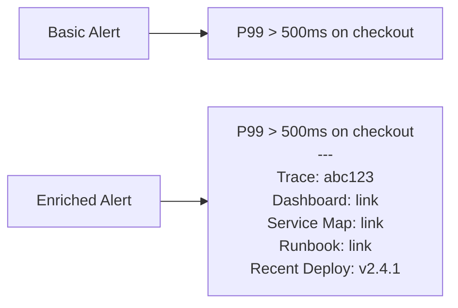

# How to Enrich Alert Payloads with OpenTelemetry Trace IDs, Service Maps, and Dashboard Links

Author: [nawazdhandala](https://www.github.com/nawazdhandala)

Tags: OpenTelemetry, Alert Enrichment, Trace Context, Service Maps, Observability

Description: Enrich your alert notifications with trace IDs, service dependency maps, and dashboard deep links from OpenTelemetry data.

An alert that says "P99 latency > 500ms on checkout-service" tells you something is wrong. An alert that includes a trace ID for the slowest request, a link to the service dependency map, and a direct link to the relevant Grafana dashboard gets you to the root cause in minutes instead of hours.

This post covers practical techniques for enriching alert payloads with contextual data from your OpenTelemetry pipeline.

## What Makes an Alert Payload Useful

The difference between a good alert and a great alert is the context it carries. When an on-call engineer gets paged at 3 AM, every second spent finding the right dashboard or trace is wasted time.



## Step 1: Include Exemplar Trace IDs in Alerts

OpenTelemetry supports exemplars - sample trace IDs attached to metric data points. When Prometheus stores these exemplars, you can reference them in alert annotations to link directly to the trace that triggered the alert.

First, enable exemplars in your OpenTelemetry SDK:

```python
# Python SDK with exemplar support
from opentelemetry import metrics, trace
from opentelemetry.sdk.metrics import MeterProvider
from opentelemetry.sdk.metrics.export import PeriodicExportingMetricReader
from opentelemetry.exporter.otlp.proto.grpc.metric_exporter import OTLPMetricExporter

# The SDK automatically attaches trace context as exemplars
# when both tracing and metrics are active in the same process
exporter = OTLPMetricExporter(endpoint="otel-collector:4317")
reader = PeriodicExportingMetricReader(exporter)
provider = MeterProvider(metric_readers=[reader])
metrics.set_meter_provider(provider)

meter = provider.get_meter("checkout-service")

# Histogram metrics automatically capture exemplars
# linking the metric data point to the active trace
request_duration = meter.create_histogram(
    name="http.server.request.duration",
    description="HTTP request duration",
    unit="s",
)
```

Enable exemplar storage in your OpenTelemetry Collector's Prometheus exporter:

```yaml
# otel-collector-config.yaml
exporters:
  prometheus:
    endpoint: "0.0.0.0:8889"
    resource_to_telemetry_conversion:
      enabled: true
    # Enable exemplar output
    enable_open_metrics: true
```

## Step 2: Build Alert Annotations with Deep Links

Prometheus alert annotations support Go templating. Use this to construct URLs that link directly to relevant dashboards, traces, and runbooks.

This alert rule includes annotations that build deep links dynamically:

```yaml
# prometheus-alert-rules.yaml
groups:
  - name: enriched_alerts
    rules:
      - alert: HighLatency
        expr: |
          histogram_quantile(0.99,
            sum by (service_name, le) (
              rate(otel_http_server_request_duration_seconds_bucket[5m])
            )
          ) > 0.5
        for: 3m
        labels:
          severity: critical
        annotations:
          summary: "P99 latency {{ $value | humanizeDuration }} on {{ $labels.service_name }}"

          # Direct link to the service's Grafana dashboard
          dashboard_url: >-
            https://grafana.example.com/d/otel-service-overview?var-service={{ $labels.service_name }}&from=now-1h&to=now

          # Link to trace search filtered by service and high latency
          trace_search_url: >-
            https://grafana.example.com/explore?orgId=1&left={"datasource":"Tempo","queries":[{"queryType":"traceqlSearch","serviceName":"{{ $labels.service_name }}","minDuration":"500ms"}]}

          # Link to the service map showing dependencies
          service_map_url: >-
            https://grafana.example.com/d/service-map?var-service={{ $labels.service_name }}

          # Runbook link based on alert name
          runbook_url: >-
            https://wiki.example.com/runbooks/{{ $labels.alertname | toLower }}

          # Recent deployments link
          deployments_url: >-
            https://argocd.example.com/applications/{{ $labels.service_name }}?view=timeline
```

## Step 3: Format Rich Notifications in Alertmanager

Alertmanager templates control how alert data appears in each notification channel. Create templates that surface the enriched annotations.

This Alertmanager template formats a rich Slack message:

```yaml
# alertmanager.yaml
templates:
  - "/etc/alertmanager/templates/*.tmpl"

receivers:
  - name: slack-enriched
    slack_configs:
      - channel: "#incidents"
        send_resolved: true
        title: "{{ .CommonLabels.severity | toUpper }}: {{ .CommonLabels.alertname }}"
        text: |
          {{ range .Alerts }}
          *{{ .Annotations.summary }}*

          *Quick Links:*
          - <{{ .Annotations.dashboard_url }}|Dashboard>
          - <{{ .Annotations.trace_search_url }}|Search Traces>
          - <{{ .Annotations.service_map_url }}|Service Map>
          - <{{ .Annotations.runbook_url }}|Runbook>
          - <{{ .Annotations.deployments_url }}|Recent Deploys>

          *Labels:*
          {{ range .Labels.SortedPairs }}- {{ .Name }}: `{{ .Value }}`
          {{ end }}
          {{ end }}
```

For PagerDuty, use custom details to include the same links:

```yaml
  - name: pagerduty-enriched
    pagerduty_configs:
      - routing_key: "YOUR_KEY"
        severity: "{{ .CommonLabels.severity }}"
        description: "{{ .CommonAnnotations.summary }}"
        details:
          dashboard: "{{ .CommonAnnotations.dashboard_url }}"
          traces: "{{ .CommonAnnotations.trace_search_url }}"
          service_map: "{{ .CommonAnnotations.service_map_url }}"
          runbook: "{{ .CommonAnnotations.runbook_url }}"
          deployments: "{{ .CommonAnnotations.deployments_url }}"
          firing_alerts: "{{ .Alerts.Firing | len }}"
          resolved_alerts: "{{ .Alerts.Resolved | len }}"
```

## Step 4: Attach Recent Deployment Info via External Labels

If your deployment pipeline writes metadata to Prometheus (via a pushgateway or a custom exporter), you can include the last deployment version in alert context.

This recording rule captures the most recent deployment version:

```yaml
# prometheus-recording-rules.yaml
groups:
  - name: deployment_info
    rules:
      - record: service:last_deploy_version:info
        expr: |
          max by (service_name) (
            deploy_info{status="success"}
          )
```

Reference it in alert annotations:

```yaml
annotations:
  last_deploy: >-
    Last deploy: {{ with printf "service:last_deploy_version:info{service_name='%s'}" .Labels.service_name | query }}
      {{ . | first | label "version" }}
    {{ end }}
```

## Practical Tips

Keep annotation URLs short by using Grafana's short link API or a URL shortener. Long URLs in PagerDuty custom details get truncated. Test your template rendering by using `amtool template render` before deploying changes. Include a maximum of 5-6 links per alert - more than that creates decision fatigue at 3 AM. Prioritize the dashboard link and runbook link as the two most important pieces of context for any alert.
