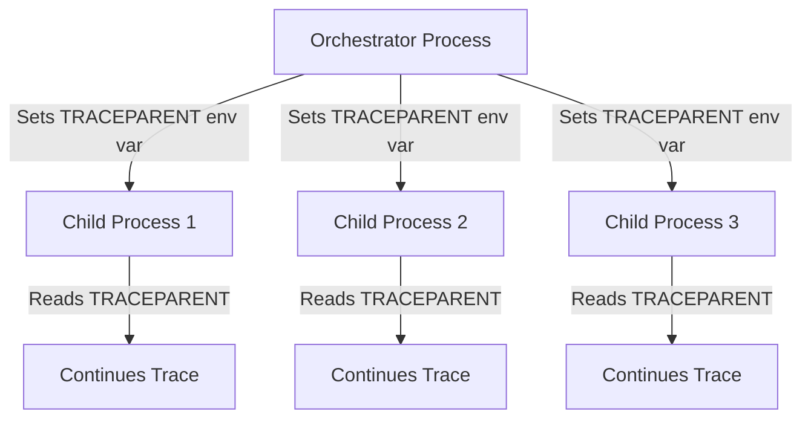

# How to Use Environment Variables as Context Propagation Carriers

Author: [nawazdhandala](https://www.github.com/nawazdhandala)

Tags: OpenTelemetry, Context Propagation, Environment Variables, Distributed Tracing, CI/CD, Batch Jobs, Subprocess

Description: Learn how to use environment variables to propagate OpenTelemetry trace context to subprocesses, scripts, batch jobs, and CI/CD pipelines.

---

Most OpenTelemetry tutorials focus on context propagation through HTTP headers or message queue metadata. That covers the typical microservices use case, but there is a whole class of systems where neither HTTP nor messaging is involved. Think about a CI/CD pipeline that spawns build steps as separate processes. Or a data pipeline that launches worker scripts via subprocess calls. Or a cron job that kicks off a shell script that calls a Python script that calls a Go binary.

In these scenarios, environment variables are often the only shared channel between parent and child processes. Using them as context propagation carriers lets you maintain trace continuity through process boundaries that would otherwise be invisible to your tracing system.

## When Environment Variables Make Sense

Environment variables are inherited by child processes automatically. This makes them a natural fit for propagating trace context when:

- A parent process spawns child processes using `fork/exec`, `subprocess.run`, or similar
- CI/CD pipelines pass data between pipeline stages
- Shell scripts orchestrate multiple commands
- Batch schedulers launch jobs (Airflow operators, cron, systemd timers)
- Container entrypoints need to receive trace context from orchestrators



The W3C Trace Context specification does not define environment variable propagation, but the pattern is straightforward. You serialize the `traceparent` and `tracestate` values into environment variables, and the child process reads them on startup.

## The TRACEPARENT and TRACESTATE Variables

The convention (used by several OpenTelemetry ecosystem tools) is to use `TRACEPARENT` and `TRACESTATE` as the environment variable names. These map directly to the W3C Trace Context header names.

A `TRACEPARENT` value looks like this:

```
00-4bf92f3577b34da6a3ce929d0e0e4736-00f067aa0ba902b7-01
```

It is a dash-separated string with four fields: version, trace ID, parent span ID, and trace flags. The `TRACESTATE` variable carries vendor-specific data and is optional.

## Injecting Context Into Subprocesses (Python)

Here is how you set up a parent process to inject trace context into the environment of a subprocess:

```python
# parent_process.py
import os
import subprocess
from opentelemetry import trace, context
from opentelemetry.propagate import inject

tracer = trace.get_tracer(__name__)

class EnvVarCarrier:
    """Carrier that writes trace context to a dictionary for env vars."""

    def __init__(self, env=None):
        # Start with the current environment or a provided dict
        self.env = env if env is not None else {}

    def get(self, key):
        # Map header-style keys to env var names (uppercase, hyphens to underscores)
        env_key = key.upper().replace("-", "_")
        return self.env.get(env_key)

    def set(self, key, value):
        # Convert traceparent -> TRACEPARENT, tracestate -> TRACESTATE
        env_key = key.upper().replace("-", "_")
        self.env[env_key] = value

    def keys(self):
        return list(self.env.keys())

def run_child_process(command: list[str]):
    with tracer.start_as_current_span(
        "run-child-process",
        kind=trace.SpanKind.INTERNAL
    ) as span:
        # Build environment with trace context injected
        child_env = os.environ.copy()
        carrier = EnvVarCarrier(child_env)
        inject(carrier=carrier)

        span.set_attribute("subprocess.command", " ".join(command))
        span.set_attribute("trace.propagation.method", "environment_variable")

        # The child process inherits TRACEPARENT and TRACESTATE in its env
        result = subprocess.run(
            command,
            env=child_env,
            capture_output=True,
            text=True
        )

        span.set_attribute("subprocess.exit_code", result.returncode)
        if result.returncode != 0:
            span.set_attribute("error", True)
            span.set_attribute("subprocess.stderr", result.stderr[:500])

        return result
```

The `EnvVarCarrier` does the translation between the W3C header names (`traceparent`, `tracestate`) and the environment variable convention (`TRACEPARENT`, `TRACESTATE`). The `inject()` call writes the current span's context into the carrier, which flows into the child's environment.

## Extracting Context in the Child Process

The child process reads the environment variables at startup and uses them to establish the parent context:

```python
# child_process.py
import os
from opentelemetry import trace, context
from opentelemetry.propagate import extract

tracer = trace.get_tracer(__name__)

class EnvVarCarrier:
    """Carrier that reads trace context from environment variables."""

    def __init__(self):
        self.env = os.environ

    def get(self, key):
        env_key = key.upper().replace("-", "_")
        return self.env.get(env_key)

    def set(self, key, value):
        env_key = key.upper().replace("-", "_")
        os.environ[env_key] = value

    def keys(self):
        # Return the keys the propagator cares about
        return ["TRACEPARENT", "TRACESTATE"]

def main():
    # Extract trace context from environment variables
    carrier = EnvVarCarrier()
    ctx = extract(carrier=carrier)

    # Start the main span of this process linked to the parent trace
    with tracer.start_as_current_span(
        "child-process-main",
        context=ctx,
        kind=trace.SpanKind.INTERNAL
    ) as span:
        span.set_attribute("process.pid", os.getpid())

        # All work in this process is now part of the parent trace
        do_work()

if __name__ == "__main__":
    main()
```

When this script starts, it reads `TRACEPARENT` from the environment, extracts the trace context, and creates its main span as a child of the parent process's span. The entire trace now flows from the parent through the subprocess boundary.

## Shell Script Integration

One of the most practical uses of this pattern is in shell scripts that orchestrate multiple tools. You can propagate trace context through bash without any OpenTelemetry SDK at all:

```bash
#!/bin/bash
# orchestrator.sh - Propagate trace context through shell scripts

# If TRACEPARENT is already set (from a parent process), use it
# Otherwise, this script is the trace root and we skip propagation

if [ -n "$TRACEPARENT" ]; then
    echo "Continuing trace: $TRACEPARENT"
fi

# Export so child processes inherit the context
export TRACEPARENT
export TRACESTATE

# Each of these commands will inherit TRACEPARENT from the environment
echo "Running data extraction..."
python3 /opt/pipeline/extract.py

echo "Running data transformation..."
python3 /opt/pipeline/transform.py

echo "Running data load..."
python3 /opt/pipeline/load.py
```

Each Python script in this pipeline can read `TRACEPARENT` from the environment and join the same trace. The shell script itself does not need an OpenTelemetry SDK. It just needs to make sure the environment variable is exported.

## CI/CD Pipeline Integration

CI/CD systems are a particularly good fit for this pattern. Here is an example with GitHub Actions:

```yaml
# .github/workflows/build.yml
name: Build and Deploy

on: [push]

jobs:
  build:
    runs-on: ubuntu-latest
    steps:
      # Generate a trace context for this pipeline run
      - name: Initialize Trace Context
        id: trace
        run: |
          # Generate trace and span IDs
          TRACE_ID=$(openssl rand -hex 16)
          SPAN_ID=$(openssl rand -hex 8)
          # Format as W3C traceparent
          echo "TRACEPARENT=00-${TRACE_ID}-${SPAN_ID}-01" >> $GITHUB_ENV

      - name: Checkout
        uses: actions/checkout@v4

      - name: Run Tests
        # TRACEPARENT is automatically available as an env var
        run: |
          echo "Trace context: $TRACEPARENT"
          python -m pytest tests/ --tb=short

      - name: Build
        run: |
          # The build process and any subprocesses inherit TRACEPARENT
          docker build -t myapp:latest \
            --build-arg TRACEPARENT="$TRACEPARENT" .

      - name: Deploy
        run: |
          # Pass trace context to deployment script
          ./scripts/deploy.sh
```

Each step in the pipeline runs with `TRACEPARENT` in its environment. If your test runner, build tool, or deployment script is instrumented with OpenTelemetry, it will pick up the context and contribute spans to a single trace that covers the entire pipeline execution.

## Docker and Container Propagation

When launching containers, you can pass trace context through the `-e` flag or through Docker Compose environment configuration:

```yaml
# docker-compose.yml - Pass trace context to containers
version: "3.8"
services:
  worker:
    image: myapp-worker:latest
    environment:
      # These can be set dynamically by the orchestrator
      - TRACEPARENT=${TRACEPARENT}
      - TRACESTATE=${TRACESTATE}
      - OTEL_SERVICE_NAME=worker
      - OTEL_EXPORTER_OTLP_ENDPOINT=http://collector:4317
```

And programmatically when using the Docker SDK:

```python
# docker_launcher.py
import docker
from opentelemetry import trace
from opentelemetry.propagate import inject

tracer = trace.get_tracer(__name__)

def launch_container(image: str, command: str):
    with tracer.start_as_current_span("launch-container") as span:
        # Inject context into environment variables
        carrier = EnvVarCarrier({})
        inject(carrier=carrier)

        # Build the environment for the container
        env_vars = {
            "TRACEPARENT": carrier.env.get("TRACEPARENT", ""),
            "TRACESTATE": carrier.env.get("TRACESTATE", ""),
            "OTEL_SERVICE_NAME": "worker",
        }

        client = docker.from_env()
        container = client.containers.run(
            image,
            command=command,
            environment=env_vars,
            detach=True
        )

        span.set_attribute("container.id", container.id[:12])
        return container
```

## Handling the Carrier Key Mapping

One subtle issue with environment variable carriers is the key mapping. The W3C propagator uses lowercase header names (`traceparent`, `tracestate`), but environment variables conventionally use uppercase (`TRACEPARENT`, `TRACESTATE`). Your carrier needs to handle this translation.

Some OpenTelemetry propagators might also use keys with hyphens, like `baggage` or custom vendor headers. Since environment variable names cannot contain hyphens on all platforms, you should replace them with underscores in your carrier implementation.

```python
# Robust key mapping for environment variable carriers
def _header_to_env(self, key: str) -> str:
    """Convert an HTTP header name to an environment variable name."""
    # traceparent -> TRACEPARENT
    # x-custom-header -> X_CUSTOM_HEADER
    return key.upper().replace("-", "_")

def _env_to_header(self, env_key: str) -> str:
    """Convert an environment variable name back to an HTTP header name."""
    # TRACEPARENT -> traceparent
    return env_key.lower().replace("_", "-")
```

## Limitations and Considerations

Environment variables work well for propagating context to child processes, but they have some constraints you should know about.

They are set at process creation time. You cannot update them from the parent after the child has started. This means each subprocess gets a snapshot of the context at the moment it was launched.

They are visible to all code in the process. If you are running untrusted code, be aware that `TRACEPARENT` values contain the trace ID and span ID, which could be used to inject fake spans into your trace.

They are also limited in size on some platforms (the total environment size has OS-dependent limits), but trace context values are small enough that this is never a practical issue.

## Wrapping Up

Environment variables provide a simple, universal mechanism for propagating trace context across process boundaries. They work with any language, any runtime, and any process spawning mechanism. The pattern is always the same: the parent injects `TRACEPARENT` (and optionally `TRACESTATE`) into the child's environment, and the child extracts it on startup. This is especially valuable for CI/CD pipelines, data processing workflows, and any system where orchestration happens through subprocess execution rather than network calls.
