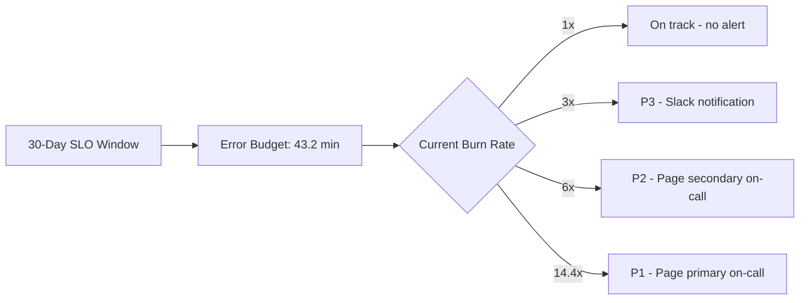

# How to Set Up Error Budget Burn Rate Alerts That Page On-Call Engineers via OpenTelemetry

Author: [nawazdhandala](https://www.github.com/nawazdhandala)

Tags: OpenTelemetry, Error Budget, Burn Rate, SLO

Description: Implement multi-window error budget burn rate alerting using OpenTelemetry metrics to page engineers before SLO breaches occur.

Traditional threshold-based alerts tell you something is broken right now. Error budget burn rate alerts tell you something is on track to breach your SLO. This distinction matters because many incidents are slow-burning - the error rate is elevated but not spiking, and by the time a static threshold fires, you have already consumed most of your error budget. Burn rate alerts catch these slow degradations early. OpenTelemetry provides the metrics foundation for implementing them properly.

## Error Budget Fundamentals

An error budget is the inverse of your SLO. If your SLO is 99.9% availability over 30 days, your error budget is 0.1% of total requests - roughly 43 minutes of total downtime. The burn rate measures how fast you are consuming that budget.

- **Burn rate 1x**: You are consuming your error budget at exactly the expected rate. You will exhaust it at the end of the SLO window.
- **Burn rate 2x**: You are consuming twice as fast. Your budget will run out in 15 days instead of 30.
- **Burn rate 10x**: You will exhaust your budget in 3 days.

## Recording SLI Metrics with OpenTelemetry

The foundation is recording Service Level Indicator (SLI) metrics. For an availability SLO, this means tracking total requests and successful requests.

```python
# Record SLI metrics using OpenTelemetry
from opentelemetry import metrics

meter = metrics.get_meter("sli.metrics")

# Total requests counter
total_requests = meter.create_counter(
    "sli.requests.total",
    description="Total number of requests",
    unit="1"
)

# Successful requests counter (non-5xx responses)
successful_requests = meter.create_counter(
    "sli.requests.successful",
    description="Requests that met the SLI criteria",
    unit="1"
)

# Latency histogram for latency-based SLOs
request_latency = meter.create_histogram(
    "sli.request.duration",
    description="Request duration for SLI measurement",
    unit="ms"
)

def record_request(service, endpoint, status_code, duration_ms):
    attrs = {
        "service.name": service,
        "http.route": endpoint,
    }

    total_requests.add(1, attributes=attrs)

    # For availability SLO: anything that is not a server error counts as good
    if status_code < 500:
        successful_requests.add(1, attributes=attrs)

    # For latency SLO: record duration
    request_latency.record(duration_ms, attributes=attrs)
```

## Computing Burn Rate

The burn rate formula is: `burn_rate = (1 - current_good_rate) / (1 - SLO_target)`. If your SLO target is 99.9% and your current success rate is 99.5%, the burn rate is `(1 - 0.995) / (1 - 0.999) = 0.005 / 0.001 = 5x`.

Here is this expressed as PromQL:

```promql
# Current burn rate for a 99.9% availability SLO
(
  1 - (
    sum(rate(sli_requests_successful_total{service_name="api-gateway"}[1h]))
    /
    sum(rate(sli_requests_total{service_name="api-gateway"}[1h]))
  )
)
/
(1 - 0.999)
```

## Multi-Window Burn Rate Alerts

Google's SRE book recommends multi-window burn rate alerts. The idea is to check both a short window (for recent behavior) and a long window (for sustained impact). An alert only fires when both windows indicate elevated burn rate. This prevents alerting on brief spikes that self-resolve.

```yaml
# Alerting rules for multi-window burn rate
# These rules use the OpenTelemetry-generated SLI metrics
groups:
  - name: error_budget_burn_rate
    rules:
      # P1 alert: 14.4x burn rate over 1h, confirmed by 5m window
      # At this rate, budget exhausts in ~2 days
      - alert: ErrorBudgetBurnRateCritical
        expr: |
          (
            (1 - (sum(rate(sli_requests_successful_total{service_name="api-gateway"}[1h]))
                  / sum(rate(sli_requests_total{service_name="api-gateway"}[1h]))))
            / (1 - 0.999)
          ) > 14.4
          and
          (
            (1 - (sum(rate(sli_requests_successful_total{service_name="api-gateway"}[5m]))
                  / sum(rate(sli_requests_total{service_name="api-gateway"}[5m]))))
            / (1 - 0.999)
          ) > 14.4
        for: 2m
        labels:
          severity: critical
          slo: availability-99.9
        annotations:
          summary: "Error budget burning at 14.4x rate - budget exhausts in ~2 days"
          runbook: "https://wiki.internal/runbooks/error-budget-critical"

      # P2 alert: 6x burn rate over 6h, confirmed by 30m window
      # At this rate, budget exhausts in ~5 days
      - alert: ErrorBudgetBurnRateHigh
        expr: |
          (
            (1 - (sum(rate(sli_requests_successful_total{service_name="api-gateway"}[6h]))
                  / sum(rate(sli_requests_total{service_name="api-gateway"}[6h]))))
            / (1 - 0.999)
          ) > 6
          and
          (
            (1 - (sum(rate(sli_requests_successful_total{service_name="api-gateway"}[30m]))
                  / sum(rate(sli_requests_total{service_name="api-gateway"}[30m]))))
            / (1 - 0.999)
          ) > 6
        for: 5m
        labels:
          severity: warning
          slo: availability-99.9

      # P3 alert: 3x burn rate over 1d, confirmed by 2h window
      # At this rate, budget exhausts in ~10 days
      - alert: ErrorBudgetBurnRateElevated
        expr: |
          (
            (1 - (sum(rate(sli_requests_successful_total{service_name="api-gateway"}[1d]))
                  / sum(rate(sli_requests_total{service_name="api-gateway"}[1d]))))
            / (1 - 0.999)
          ) > 3
          and
          (
            (1 - (sum(rate(sli_requests_successful_total{service_name="api-gateway"}[2h]))
                  / sum(rate(sli_requests_total{service_name="api-gateway"}[2h]))))
            / (1 - 0.999)
          ) > 3
        for: 10m
        labels:
          severity: info
          slo: availability-99.9
```

## Visualizing Error Budget Consumption



## Collector Pipeline for SLI Metrics

Ensure your OpenTelemetry Collector routes SLI metrics to a backend that supports the required query window lengths (up to 30 days).

```yaml
# otel-collector-sli.yaml
receivers:
  otlp:
    protocols:
      grpc:
        endpoint: 0.0.0.0:4317

processors:
  # Ensure SLI metrics have consistent labels
  metricstransform:
    transforms:
      - include: sli.requests.total
        action: update
        new_name: sli_requests_total
      - include: sli.requests.successful
        action: update
        new_name: sli_requests_successful

  batch:
    send_batch_size: 1024
    timeout: 5s

exporters:
  prometheusremotewrite:
    endpoint: "http://prometheus:9090/api/v1/write"
    # Use long retention for SLO calculations
    resource_to_telemetry_conversion:
      enabled: true

service:
  pipelines:
    metrics:
      receivers: [otlp]
      processors: [metricstransform, batch]
      exporters: [prometheusremotewrite]
```

## Remaining Budget Dashboard Query

Show engineers how much error budget remains in the current window so they can make informed decisions about risky deployments.

```promql
# Remaining error budget as a percentage
1 - (
  (
    1 - (
      sum(increase(sli_requests_successful_total{service_name="api-gateway"}[30d]))
      /
      sum(increase(sli_requests_total{service_name="api-gateway"}[30d]))
    )
  )
  /
  (1 - 0.999)
)
```

A value of 0.75 means 75% of your error budget remains. When this drops below 0, you have breached your SLO for the current window.

## Why Burn Rate Beats Static Thresholds

Static threshold alerts (e.g., "page if error rate > 1%") have two problems. They fire too late for slow-burning issues and too early for brief spikes. A 0.5% error rate might seem fine, but sustained over a week it could consume your entire monthly error budget. Conversely, a 5% error rate for 30 seconds might trigger a page even though the actual budget impact is negligible.

Burn rate alerts solve both problems by measuring the rate of budget consumption rather than the absolute error level. This aligns alerting directly with business impact - you get paged when your SLO is genuinely at risk, not when an arbitrary threshold is crossed.
