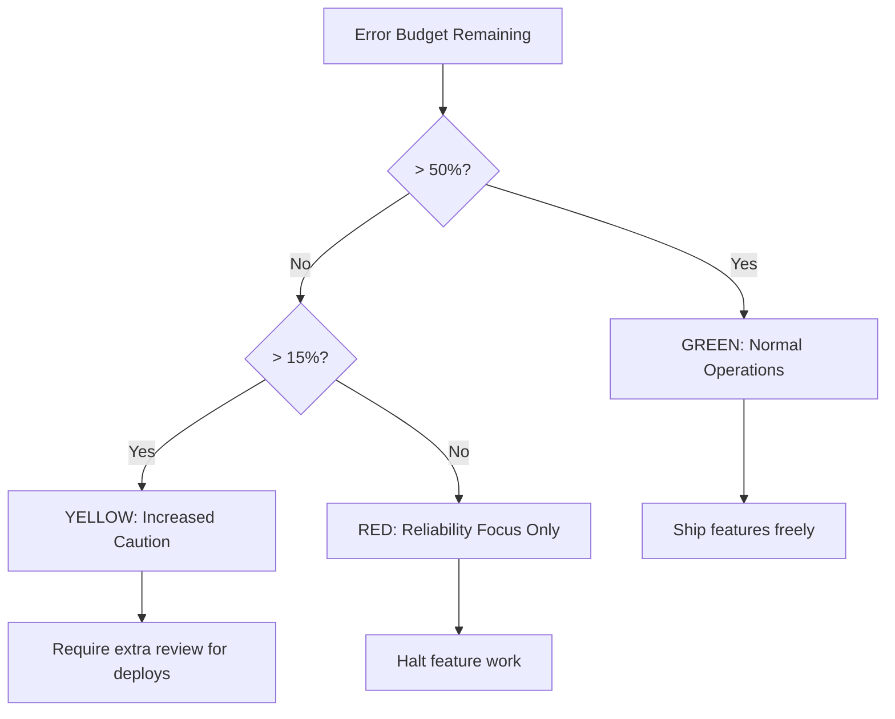

# How to Implement Error Budget Policies (Green/Yellow/Red) with OpenTelemetry Data

Author: [nawazdhandala](https://www.github.com/nawazdhandala)

Tags: OpenTelemetry, Error Budget, SRE, Policy

Description: Implement a three-tier error budget policy system using OpenTelemetry data to drive engineering decisions automatically.

Error budget policies turn raw reliability data into engineering decisions. When your error budget is healthy, teams ship features freely. When the budget is under pressure, the focus shifts toward stability. When the budget is exhausted, feature work stops and all effort goes to reliability improvements. This Green/Yellow/Red framework gives teams clear, objective rules for balancing velocity with reliability, and OpenTelemetry provides the data foundation to drive it.

## The Three Tiers

The policy maps error budget consumption to operational modes:

| Zone   | Budget Remaining | Engineering Response                          |
|--------|-----------------|-----------------------------------------------|
| Green  | > 50%           | Normal velocity. Ship features, experiment.   |
| Yellow | 15% - 50%       | Caution. Reduce risky deploys, add safeguards.|
| Red    | < 15%           | Freeze. Focus entirely on reliability work.   |

These thresholds are starting points. Adjust them based on your team's risk tolerance and release cadence.



## Computing Budget Status from OpenTelemetry Metrics

The error budget remaining metric, derived from your OpenTelemetry counters, feeds directly into the policy engine. Here are the Prometheus recording rules that produce the budget status label.

```yaml
# prometheus-rules/error-budget-policy.yaml
groups:
  - name: error_budget_policy
    interval: 1m
    rules:
      # Calculate error budget remaining (0.0 to 1.0 scale)
      - record: slo:error_budget:remaining_ratio
        expr: |
          1 - (
            (
              sum(increase(http_server_request_errors_total{service="payment-service"}[30d]))
              /
              sum(increase(http_server_request_total{service="payment-service"}[30d]))
            )
            /
            (1 - 0.999)
          )

      # Green zone indicator (1 if green, 0 otherwise)
      - record: slo:error_budget:zone_green
        expr: slo:error_budget:remaining_ratio > 0.50

      # Yellow zone indicator
      - record: slo:error_budget:zone_yellow
        expr: |
          slo:error_budget:remaining_ratio <= 0.50
          and
          slo:error_budget:remaining_ratio > 0.15

      # Red zone indicator
      - record: slo:error_budget:zone_red
        expr: slo:error_budget:remaining_ratio <= 0.15
```

## Automating Policy Enforcement

Manual policy enforcement does not scale. When a team has to check a dashboard before every deploy, they will eventually skip it. Automation closes that gap. Here is a Python service that queries the error budget state and enforces the policy by gating CI/CD pipelines.

```python
import requests
from enum import Enum
from dataclasses import dataclass

class BudgetZone(Enum):
    GREEN = "green"
    YELLOW = "yellow"
    RED = "red"

@dataclass
class PolicyDecision:
    zone: BudgetZone
    budget_remaining: float
    deploy_allowed: bool
    message: str

def get_budget_remaining(prometheus_url: str, service: str) -> float:
    """Query Prometheus for the current error budget remaining."""
    query = f'slo:error_budget:remaining_ratio{{service="{service}"}}'
    response = requests.get(
        f"{prometheus_url}/api/v1/query",
        params={"query": query},
    )
    result = response.json()["data"]["result"]

    if not result:
        # No data means no errors recorded - budget is full
        return 1.0

    return float(result[0]["value"][1])

def evaluate_policy(budget_remaining: float, is_rollback: bool = False) -> PolicyDecision:
    """
    Evaluate the error budget policy and return a deployment decision.
    Rollbacks are always allowed regardless of budget zone.
    """
    if is_rollback:
        return PolicyDecision(
            zone=BudgetZone.RED,
            budget_remaining=budget_remaining,
            deploy_allowed=True,
            message="Rollback permitted in all zones.",
        )

    if budget_remaining > 0.50:
        return PolicyDecision(
            zone=BudgetZone.GREEN,
            budget_remaining=budget_remaining,
            deploy_allowed=True,
            message=f"Budget healthy at {budget_remaining:.1%}. Deploy freely.",
        )
    elif budget_remaining > 0.15:
        return PolicyDecision(
            zone=BudgetZone.YELLOW,
            budget_remaining=budget_remaining,
            deploy_allowed=True,  # Allowed but with extra review
            message=f"Budget at {budget_remaining:.1%}. Deploy with caution and extra review.",
        )
    else:
        return PolicyDecision(
            zone=BudgetZone.RED,
            budget_remaining=budget_remaining,
            deploy_allowed=False,
            message=f"Budget critically low at {budget_remaining:.1%}. Feature deploys blocked.",
        )
```

## CI/CD Integration

Integrate the policy check into your deployment pipeline. This example shows a step that gates deploys based on the current error budget zone.

```yaml
# .github/workflows/deploy.yaml (relevant step)
jobs:
  deploy:
    runs-on: ubuntu-latest
    steps:
      - name: Check Error Budget Policy
        id: budget-check
        run: |
          # Query the error budget policy endpoint
          RESULT=$(curl -s "${{ secrets.POLICY_API_URL }}/check?service=payment-service")
          ZONE=$(echo "$RESULT" | jq -r '.zone')
          ALLOWED=$(echo "$RESULT" | jq -r '.deploy_allowed')

          echo "zone=$ZONE" >> "$GITHUB_OUTPUT"
          echo "allowed=$ALLOWED" >> "$GITHUB_OUTPUT"

          if [ "$ALLOWED" = "false" ]; then
            echo "Deployment blocked: error budget in RED zone"
            echo "Remaining budget: $(echo "$RESULT" | jq -r '.budget_remaining')"
            exit 1
          fi

      - name: Deploy with extra review gate
        if: steps.budget-check.outputs.zone == 'yellow'
        run: |
          echo "Yellow zone: requiring manual approval before deploy"
          # Trigger approval workflow or add extra canary time
```

## Alert Rules for Zone Transitions

Notify teams when the error budget crosses a zone boundary. These transitions are significant events that should trigger communication.

```yaml
# prometheus-rules/budget-zone-alerts.yaml
groups:
  - name: error_budget_zone_transitions
    rules:
      - alert: ErrorBudgetEnteredYellow
        expr: |
          slo:error_budget:remaining_ratio <= 0.50
          and
          slo:error_budget:remaining_ratio > 0.15
        for: 5m
        labels:
          severity: warning
        annotations:
          summary: "Error budget has entered YELLOW zone"
          description: >
            {{ $value | humanizePercentage }} of error budget remains.
            Reduce risky deployments and increase monitoring.

      - alert: ErrorBudgetEnteredRed
        expr: slo:error_budget:remaining_ratio <= 0.15
        for: 5m
        labels:
          severity: critical
        annotations:
          summary: "Error budget has entered RED zone"
          description: >
            Only {{ $value | humanizePercentage }} of error budget remains.
            Feature deployments should be halted until reliability improves.
```

## Making Policies Stick

The hardest part of error budget policies is not the technical implementation - it is organizational adoption. A few things help: make the current zone visible on a shared dashboard that leadership sees, include the zone status in standup reports, and ensure exceptions to the policy require explicit VP-level approval. When teams see that budget zones are taken seriously, they naturally build more reliable software to stay in the green zone.

For details on setting up the multi-burn-rate alerts that feed into these policies, see the companion post at https://oneuptime.com/blog/post/2026-02-06-multi-burn-rate-slo-alerts/view.
