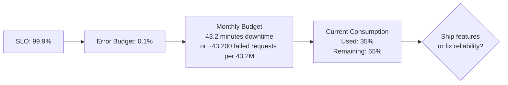
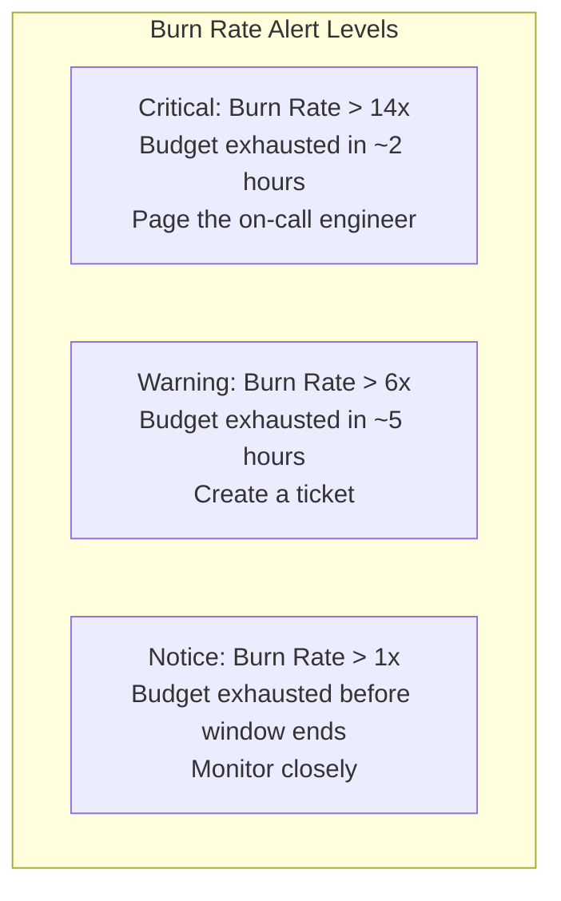

# How to Implement Error Budget Tracking with OpenTelemetry

Author: [nawazdhandala](https://www.github.com/nawazdhandala)

Tags: OpenTelemetry, Error Budget, SRE, SLO, Reliability, Metrics, Observability, Site Reliability Engineering

Description: Learn how to implement error budget tracking with OpenTelemetry metrics, enabling your team to balance reliability investments against feature velocity using real production data.

---

Error budgets are one of the most practical concepts from site reliability engineering. The idea is simple: if your SLO says 99.9% of requests should succeed, that means you have a budget of 0.1% for errors. As long as you are within budget, you ship features fast. When the budget runs low, you slow down and focus on reliability.

The challenge is actually tracking this in real time. You need to know your current error budget consumption at any moment, not just at the end of the month when you review SLA reports. OpenTelemetry gives you the building blocks to instrument your services for continuous error budget tracking, so your team always knows where they stand.

---

## Error Budget Fundamentals



An error budget is the inverse of your SLO. If your SLO is 99.9% availability, your error budget is 0.1%. Over a 30-day window, that translates to approximately 43.2 minutes of allowed downtime, or equivalently, 0.1% of your total requests can fail without breaching your SLO.

---

## Instrumenting for Error Budget Calculation

The first step is collecting the raw metrics you need to calculate error budget consumption.

```python
# error_budget_metrics.py
from opentelemetry import metrics
from opentelemetry.sdk.metrics import MeterProvider
from opentelemetry.sdk.metrics.export import PeriodicExportingMetricReader
from opentelemetry.exporter.otlp.proto.http.metric_exporter import OTLPMetricExporter
from opentelemetry.sdk.resources import Resource, SERVICE_NAME

resource = Resource.create({SERVICE_NAME: "api-service"})
reader = PeriodicExportingMetricReader(
    OTLPMetricExporter(endpoint="https://otel.oneuptime.com/v1/metrics"),
    export_interval_millis=10000,
)
provider = MeterProvider(resource=resource, metric_readers=[reader])
metrics.set_meter_provider(provider)
meter = metrics.get_meter("error.budget")

# Total requests counter, the denominator for error rate
total_requests = meter.create_counter(
    name="slo.requests.total",
    description="Total requests for SLO calculation",
    unit="requests",
)

# Good requests counter (requests that meet the SLO criteria)
good_requests = meter.create_counter(
    name="slo.requests.good",
    description="Requests that met SLO criteria",
    unit="requests",
)

# Bad requests counter (requests that violated the SLO)
bad_requests = meter.create_counter(
    name="slo.requests.bad",
    description="Requests that violated SLO criteria",
    unit="requests",
)

def classify_request(status_code: int, duration_ms: float, slo_name: str):
    """
    Classify a request as good or bad based on SLO criteria.
    A request is 'good' if it succeeds AND meets the latency target.
    """
    attributes = {"slo.name": slo_name}

    total_requests.add(1, attributes)

    # Define what 'good' means for this SLO
    is_successful = status_code < 500
    is_fast_enough = duration_ms < 300  # P99 latency target

    if is_successful and is_fast_enough:
        good_requests.add(1, attributes)
    else:
        bad_requests.add(1, {
            **attributes,
            "slo.violation_reason": (
                "server_error" if not is_successful else "latency_exceeded"
            ),
        })
```

The classification function is important. A request counts as "good" only if it both succeeds (no 5xx error) AND meets the latency target. This means a request that returns 200 OK but takes 5 seconds still consumes error budget if your latency SLO is 300ms.

---

## The Error Budget Calculator

This class calculates the current error budget status from the raw metrics.

```python
# error_budget_calculator.py
from dataclasses import dataclass
from datetime import datetime, timedelta

@dataclass
class SLODefinition:
    """Defines an SLO and its error budget parameters."""
    name: str
    target: float            # e.g., 0.999 for 99.9%
    window_days: int         # Rolling window, typically 30
    description: str = ""

    @property
    def error_budget_fraction(self) -> float:
        """The fraction of requests allowed to be bad."""
        return 1.0 - self.target

@dataclass
class ErrorBudgetStatus:
    """Current status of an error budget."""
    slo: SLODefinition
    window_start: datetime
    window_end: datetime

    total_requests: int
    good_requests: int
    bad_requests: int

    @property
    def current_reliability(self) -> float:
        """Actual reliability during the window."""
        if self.total_requests == 0:
            return 1.0
        return self.good_requests / self.total_requests

    @property
    def budget_total(self) -> int:
        """Total number of bad requests allowed in the window."""
        return int(self.total_requests * self.slo.error_budget_fraction)

    @property
    def budget_remaining(self) -> int:
        """Number of bad requests still allowed."""
        return max(0, self.budget_total - self.bad_requests)

    @property
    def budget_consumed_percent(self) -> float:
        """Percentage of error budget consumed."""
        if self.budget_total == 0:
            return 0.0
        return (self.bad_requests / self.budget_total) * 100

    @property
    def burn_rate(self) -> float:
        """
        How fast the budget is being consumed relative to the allowed rate.
        A burn rate of 1.0 means consuming exactly at the allowed rate.
        A burn rate of 2.0 means consuming twice as fast as allowed.
        """
        elapsed_fraction = self._elapsed_window_fraction
        if elapsed_fraction == 0:
            return 0.0
        consumed_fraction = self.budget_consumed_percent / 100
        return consumed_fraction / elapsed_fraction

    @property
    def _elapsed_window_fraction(self) -> float:
        """Fraction of the SLO window that has elapsed."""
        total_window = (self.window_end - self.window_start).total_seconds()
        elapsed = (datetime.utcnow() - self.window_start).total_seconds()
        return min(1.0, elapsed / total_window)

    @property
    def projected_exhaustion_days(self) -> float:
        """Days until budget is fully consumed at the current burn rate."""
        if self.burn_rate <= 0:
            return float('inf')
        remaining_fraction = 1.0 - (self.budget_consumed_percent / 100)
        daily_burn = self.burn_rate / self.slo.window_days
        if daily_burn <= 0:
            return float('inf')
        return remaining_fraction / daily_burn


def calculate_error_budget(
    metrics_client,
    slo: SLODefinition,
) -> ErrorBudgetStatus:
    """Calculate the current error budget status for an SLO."""
    window_end = datetime.utcnow()
    window_start = window_end - timedelta(days=slo.window_days)

    total = metrics_client.query_sum(
        metric="slo.requests.total",
        labels={"slo.name": slo.name},
        start=window_start,
        end=window_end,
    )

    good = metrics_client.query_sum(
        metric="slo.requests.good",
        labels={"slo.name": slo.name},
        start=window_start,
        end=window_end,
    )

    bad = metrics_client.query_sum(
        metric="slo.requests.bad",
        labels={"slo.name": slo.name},
        start=window_start,
        end=window_end,
    )

    return ErrorBudgetStatus(
        slo=slo,
        window_start=window_start,
        window_end=window_end,
        total_requests=total,
        good_requests=good,
        bad_requests=bad,
    )
```

The `burn_rate` property is the most actionable number here. A burn rate of 1.0 means you are consuming your budget at exactly the expected rate and will run out at the end of the window. A burn rate of 10.0 means you are consuming budget 10 times faster than sustainable and will run out in 3 days instead of 30.

---

## Publishing Error Budget as OpenTelemetry Metrics

Make the calculated budget status available as OpenTelemetry metrics so it shows up in your dashboards alongside everything else.

```python
# budget_publisher.py
from opentelemetry import metrics

meter = metrics.get_meter("error.budget.status")

budget_consumed = meter.create_gauge(
    name="error_budget.consumed_percent",
    description="Percentage of error budget consumed",
    unit="percent",
)

budget_remaining_gauge = meter.create_gauge(
    name="error_budget.remaining_requests",
    description="Number of bad requests still allowed",
    unit="requests",
)

burn_rate_gauge = meter.create_gauge(
    name="error_budget.burn_rate",
    description="Current error budget burn rate (1.0 = sustainable)",
    unit="rate",
)

def publish_budget_status(status: ErrorBudgetStatus):
    """Publish error budget status as OpenTelemetry metrics."""
    attributes = {"slo.name": status.slo.name}

    budget_consumed.set(status.budget_consumed_percent, attributes)
    budget_remaining_gauge.set(status.budget_remaining, attributes)
    burn_rate_gauge.set(status.burn_rate, attributes)
```

---

## Burn Rate Alerting

The Google SRE book recommends multi-window, multi-burn-rate alerting. The idea is to alert on fast burns (something is broken now) and slow burns (something is gradually degrading).



A burn rate of 14x means your 30-day error budget will be consumed in roughly 2 hours. That is almost certainly an active incident. A burn rate of 6x gives you about 5 hours, which is urgent but gives you time to investigate. A burn rate just above 1x means you will run out before the end of the window if nothing changes, which is worth monitoring but not an emergency.

---

## Summary

Error budget tracking turns reliability from a vague aspiration into a measurable, manageable resource. By building it on top of OpenTelemetry metrics, you get real-time visibility into how your reliability investments are paying off and when you need to shift focus from features to stability. The burn rate metric is your single most important number. Keep it visible, set up multi-level alerts around it, and use it to drive the conversation between development speed and reliability investment.
