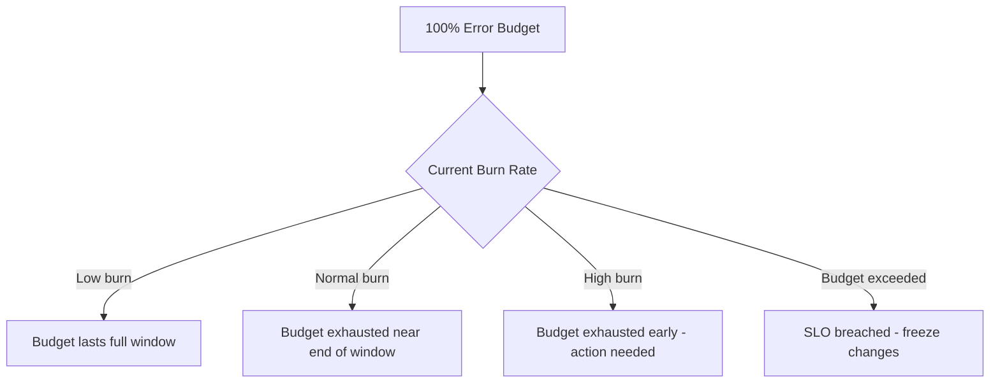

# How to Calculate Error Budgets from OpenTelemetry Trace and Metric Data

Author: [nawazdhandala](https://www.github.com/nawazdhandala)

Tags: OpenTelemetry, Error Budgets, SRE, Metrics

Description: Step-by-step instructions for calculating error budgets using OpenTelemetry traces and metrics as your data source.

An error budget is the maximum amount of unreliability your service is allowed before you breach your SLO. If your SLO targets 99.9% availability over 30 days, your error budget is 0.1% of total requests - or roughly 43 minutes of downtime. Error budgets turn abstract reliability targets into concrete, actionable numbers that engineering teams can spend like currency. This post covers how to compute error budgets from OpenTelemetry trace and metric data.

## The Error Budget Formula

The math behind error budgets is straightforward.

```
Error Budget = 1 - SLO Target
Error Budget Consumed = (1 - Current SLI) / (1 - SLO Target)
Error Budget Remaining = 1 - Error Budget Consumed
```

For a 99.9% availability SLO where your current availability is 99.95%:

```
Error Budget = 1 - 0.999 = 0.001 (0.1%)
Error Budget Consumed = (1 - 0.9995) / (1 - 0.999) = 0.0005 / 0.001 = 0.5 (50%)
Error Budget Remaining = 1 - 0.5 = 0.5 (50%)
```

You have used half your error budget and have half remaining.

## Calculating Error Budgets from OpenTelemetry Metrics

If you followed the approach in the SLI definition post at https://oneuptime.com/blog/post/2026-02-06-sli-opentelemetry-metrics/view, you already have counters for total and failed requests. Here is how to calculate the error budget in Prometheus.

```promql
# Step 1: Calculate the current error rate over the SLO window (30 days)
# This gives you the fraction of requests that failed
sum(increase(http_server_request_errors_total{service="payment-service"}[30d]))
/
sum(increase(http_server_request_total{service="payment-service"}[30d]))

# Step 2: Calculate error budget remaining as a fraction
# 0.999 is the SLO target - adjust for your specific SLO
1 - (
  (
    sum(increase(http_server_request_errors_total{service="payment-service"}[30d]))
    /
    sum(increase(http_server_request_total{service="payment-service"}[30d]))
  )
  /
  (1 - 0.999)
)
```

## Deriving Error Budgets from OpenTelemetry Traces

Traces provide a different - and sometimes more accurate - view of errors. A trace captures the full lifecycle of a request, including whether it ultimately succeeded or failed even across multiple service hops. This is valuable when a request retries internally and eventually succeeds, which counter-based metrics might double-count.

To extract error budget data from traces, you need to convert span data into metrics using the OpenTelemetry Collector's span metrics connector.

```yaml
# otel-collector-config.yaml
receivers:
  otlp:
    protocols:
      grpc:
        endpoint: "0.0.0.0:4317"

connectors:
  # The spanmetrics connector derives metrics from trace spans
  spanmetrics:
    histogram:
      explicit:
        buckets: [5ms, 10ms, 25ms, 50ms, 100ms, 200ms, 500ms, 1s, 2.5s, 5s]
    dimensions:
      - name: service.name
      - name: http.method
      - name: http.status_code
      - name: http.route
    # Include call counts and error counts
    metrics_flush_interval: 15s

exporters:
  prometheus:
    endpoint: "0.0.0.0:8889"

service:
  pipelines:
    traces:
      receivers: [otlp]
      exporters: [spanmetrics]
    metrics:
      receivers: [spanmetrics]
      exporters: [prometheus]
```

The spanmetrics connector produces `calls_total` and `duration_milliseconds` metrics derived from spans. You can then query the error budget from trace-derived data.

```promql
# Error rate from trace-derived span metrics
# Spans with status_code="ERROR" are counted as failures
sum(increase(calls_total{service_name="payment-service", status_code="STATUS_CODE_ERROR"}[30d]))
/
sum(increase(calls_total{service_name="payment-service"}[30d]))
```

## Implementing Error Budget Tracking in Code

Sometimes you want to compute error budgets programmatically - for example, to expose them as a metric themselves or to feed them into a decision engine. Here is a Python implementation.

```python
from dataclasses import dataclass
from opentelemetry import metrics

meter = metrics.get_meter("slo-calculator", version="1.0.0")

# Expose error budget remaining as its own gauge metric
error_budget_gauge = meter.create_observable_gauge(
    name="slo.error_budget.remaining",
    description="Fraction of error budget remaining (1.0 = full, 0.0 = exhausted)",
    unit="1",
)

@dataclass
class SLOConfig:
    name: str
    target: float       # e.g., 0.999
    window_seconds: int  # e.g., 30 * 24 * 3600

    @property
    def error_budget(self) -> float:
        """Maximum allowed error rate."""
        return 1.0 - self.target


def calculate_error_budget_remaining(
    total_requests: int,
    failed_requests: int,
    slo: SLOConfig,
) -> float:
    """
    Returns a value between -inf and 1.0.
    1.0 means the full budget is intact.
    0.0 means the budget is exactly exhausted.
    Negative values mean the budget is overspent.
    """
    if total_requests == 0:
        return 1.0  # No traffic means no errors

    observed_error_rate = failed_requests / total_requests
    budget_consumed = observed_error_rate / slo.error_budget

    return 1.0 - budget_consumed


# Example usage
slo = SLOConfig(name="payment-availability", target=0.999, window_seconds=2592000)
remaining = calculate_error_budget_remaining(
    total_requests=1_000_000,
    failed_requests=350,
    slo=slo,
)
# remaining = 1 - (0.00035 / 0.001) = 1 - 0.35 = 0.65 (65% remaining)
```

## Visualizing Error Budget Burn

A useful visualization shows how the error budget changes over time. This helps teams see if reliability is trending in the right direction.



## Combining Trace and Metric Error Budgets

In practice, metric-based and trace-based error budgets may produce slightly different numbers. Metrics are sampled at the counter level and are very efficient. Traces provide richer context but may be subject to sampling. A good strategy is to use metric-based error budgets for real-time alerting (they are cheaper to compute) and trace-based analysis for post-incident investigation (they provide more detail about what went wrong).

## Practical Considerations

When setting up error budget tracking, account for a few edge cases. Zero-traffic periods should not count against your budget. Planned maintenance windows may need to be excluded from the calculation. And if your service has wildly different traffic patterns on weekdays versus weekends, consider whether a simple 30-day rolling window captures user experience accurately or whether you need weighted calculations.

Error budgets are most powerful when they drive concrete decisions - when to deploy, when to freeze changes, and when to invest in reliability work. The next post in this series covers building multi-burn-rate alerts that notify you at different urgency levels based on how fast you are consuming your budget.
