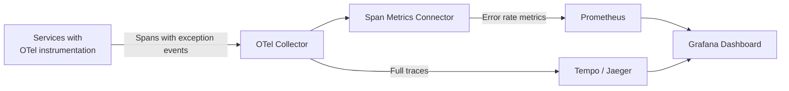

# How to Build an Error Tracking Dashboard That Correlates OpenTelemetry Traces with Exceptions

Author: [nawazdhandala](https://www.github.com/nawazdhandala)

Tags: OpenTelemetry, Error Tracking, Traces, Exceptions

Description: Build an error tracking dashboard that links OpenTelemetry trace data with exception details for faster debugging.

Error tracking tools are useful, but they often exist in isolation. You see that a NullPointerException happened 500 times in the last hour, but you do not know which request flow triggered it, what upstream service called it, or what the request parameters were. By correlating OpenTelemetry traces with exception events, you can build a dashboard that connects the dots between error rates, affected endpoints, and the exact trace that captured the failure.

## How OpenTelemetry Records Exceptions

When an exception occurs in instrumented code, the OpenTelemetry SDK records it as a span event with specific semantic conventions:

- The span's `status` is set to `ERROR`
- An event named `exception` is added to the span
- The event carries attributes: `exception.type`, `exception.message`, and `exception.stacktrace`

Here is how this looks when recording an exception manually in Python:

```python
# Recording an exception on the current span
from opentelemetry import trace

tracer = trace.get_tracer("order-service")

def process_order(order_id):
    with tracer.start_as_current_span("process_order") as span:
        try:
            result = database.execute_order(order_id)
            return result
        except Exception as exc:
            # Record the exception as a span event
            span.record_exception(exc)
            # Set the span status to ERROR
            span.set_status(
                trace.StatusCode.ERROR,
                description=str(exc)
            )
            raise
```

## Deriving Error Metrics with Span Metrics Connector

To power dashboard panels, you need metrics derived from these error spans. The Span Metrics Connector in the collector generates counters and histograms from spans, including error status.

```yaml
# otel-collector-config.yaml
connectors:
  spanmetrics:
    histogram:
      explicit:
        buckets: [5ms, 10ms, 25ms, 50ms, 100ms, 250ms, 500ms, 1s, 5s]
    dimensions:
      # Include exception type as a metric dimension
      - name: exception.type
      - name: http.route
      - name: http.request.method
    # The connector automatically includes status_code as a dimension

receivers:
  otlp:
    protocols:
      grpc:
        endpoint: "0.0.0.0:4317"

exporters:
  prometheusremotewrite:
    endpoint: "http://prometheus:9090/api/v1/write"
  otlp/traces:
    endpoint: "tempo:4317"
    tls:
      insecure: true

service:
  pipelines:
    traces:
      receivers: [otlp]
      exporters: [spanmetrics, otlp/traces]
    metrics:
      receivers: [spanmetrics]
      exporters: [prometheusremotewrite]
```

## Architecture



The key insight is that Grafana can link metrics panels to trace views. When you see a spike in errors on the dashboard, you can click through to the actual traces that recorded those errors.

## Dashboard Queries

**Overall Error Rate** - Percentage of requests resulting in an error:

```promql
# Error rate as a percentage across all services
sum(rate(duration_milliseconds_count{status_code="STATUS_CODE_ERROR"}[5m]))
/
sum(rate(duration_milliseconds_count[5m]))
* 100
```

**Error Rate by Service** - Identify which service has the most errors:

```promql
# Per-service error rate
sum by (service_name) (
  rate(duration_milliseconds_count{status_code="STATUS_CODE_ERROR"}[5m])
)
```

**Top Exception Types** - A table showing the most common exception types:

```promql
# Count of errors grouped by exception type
sum by (exception_type) (
  rate(duration_milliseconds_count{status_code="STATUS_CODE_ERROR", exception_type!=""}[5m])
)
```

**Error Rate by HTTP Route** - Pinpoint which endpoints are failing:

```promql
# Error rate per endpoint
sum by (http_route) (
  rate(duration_milliseconds_count{status_code="STATUS_CODE_ERROR"}[5m])
)
```

**Error Latency vs Normal Latency** - Compare how long errored requests take versus successful ones:

```promql
# P95 latency for error requests
histogram_quantile(0.95,
  sum by (le) (
    rate(duration_milliseconds_bucket{status_code="STATUS_CODE_ERROR"}[5m])
  )
)
```

## Linking to Traces in Grafana

Grafana supports data links that let you jump from a metrics panel to the trace backend. Configure a data link on your error rate panel.

In the panel settings, add a data link with this URL template:

```
/explore?orgId=1&left={"datasource":"Tempo","queries":[{"queryType":"traceqlSearch","filters":[{"id":"status","tag":"status","operator":"=","value":["error"],"type":"static","scope":"intrinsic"},{"id":"service","tag":"service.name","operator":"=","value":["${__field.labels.service_name}"],"type":"static","scope":"resource"}]}]}
```

This opens Grafana Explore with a TraceQL query pre-filtered to error traces for the selected service. From there, you can inspect the full trace waterfall, see the exception event with its stack trace, and understand the complete request context.

## Dashboard Layout

1. **Error Summary** - Total error count, error rate gauge, top exception types table
2. **Service Breakdown** - Error rate per service time series, error rate by HTTP route
3. **Latency Impact** - Error vs success latency comparison, error duration heatmap
4. **Trace Links** - Recent error spans table with clickable trace IDs

This setup eliminates the gap between "something is failing" and "here is the exact trace showing why." The correlation between metrics and traces is what makes OpenTelemetry-based error tracking more powerful than standalone error tracking tools.
