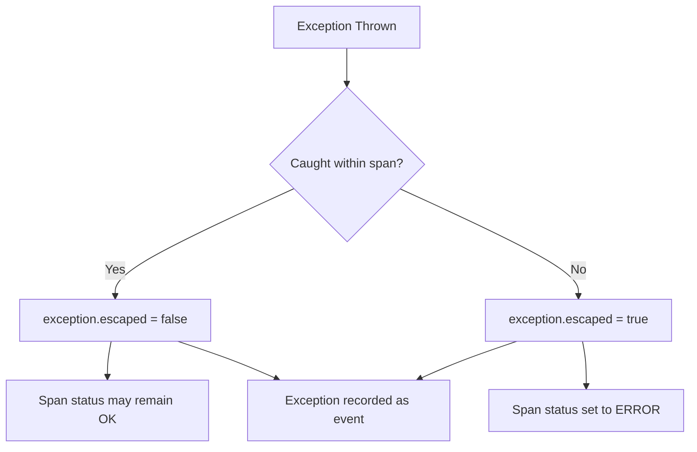
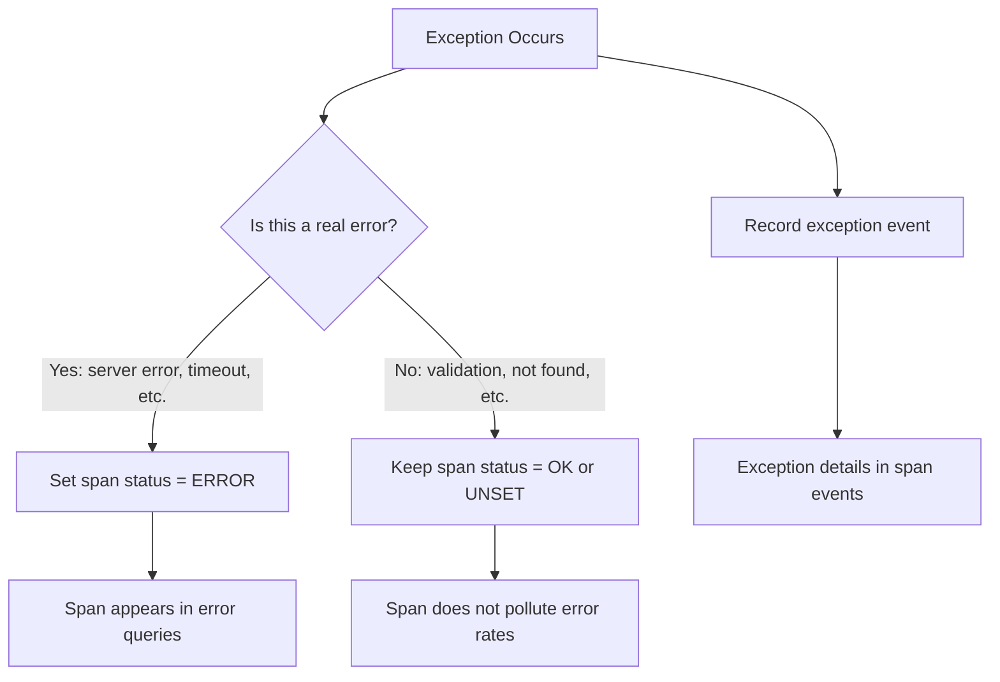

# How to Apply Exception Semantic Conventions for Error Recording

Author: [nawazdhandala](https://www.github.com/nawazdhandala)

Tags: OpenTelemetry, Exceptions, Error Handling, Semantic Conventions, Observability, Tracing, Debugging

Description: Learn how to apply OpenTelemetry exception semantic conventions to record errors consistently across services for faster debugging and root cause analysis.

---

## Introduction

Every production system encounters errors. The question is not whether exceptions will happen, but how quickly you can understand them when they do. OpenTelemetry's exception semantic conventions define a standard way to record exceptions as span events, ensuring that error information is captured consistently across all your services regardless of language or framework.

This guide walks through the exception semantic conventions in detail. You will learn the attribute schema, see how to record exceptions properly in application code, understand how exception events relate to span status, and set up pipelines that make exception data actionable.

## Exception Event Attributes

In OpenTelemetry, exceptions are recorded as span events with a specific set of attributes. The event name is always `exception`, and the attributes describe what went wrong.

| Attribute | Type | Required | Description |
|-----------|------|----------|-------------|
| `exception.type` | string | Conditionally | The type or class name of the exception |
| `exception.message` | string | Conditionally | The exception message |
| `exception.stacktrace` | string | No | The full stack trace as a string |
| `exception.escaped` | boolean | No | Whether the exception escaped the scope of the span |

At least one of `exception.type` or `exception.message` must be present. In practice, you should always include both when they are available.

The `exception.escaped` attribute deserves special attention. It indicates whether the exception propagated beyond the boundary of the span. If a span catches and handles an exception, `exception.escaped` should be `false`. If the exception propagates to the caller, it should be `true`.



## Recording Exceptions in Python

The OpenTelemetry SDK provides a `record_exception` method on spans that handles the attribute mapping for you. However, understanding what it does under the hood helps you customize the behavior when needed.

This Python example shows both the convenient method and the manual approach. The `record_exception` method extracts the type, message, and stack trace automatically from the Python exception object:

```python
# Two approaches to recording exceptions on spans.
# The record_exception method is convenient and handles
# stack trace extraction automatically. The manual approach
# gives you full control over the event attributes.
from opentelemetry import trace
import traceback

tracer = trace.get_tracer("payment-service")

def process_payment(payment_id, amount):
    with tracer.start_as_current_span("process_payment") as span:
        span.set_attribute("app.payment.id", payment_id)
        span.set_attribute("app.payment.amount", amount)

        try:
            result = charge_card(payment_id, amount)
            return result

        except InsufficientFundsError as e:
            # Approach 1: Use the built-in record_exception method.
            # This extracts exception.type, exception.message, and
            # exception.stacktrace from the exception object.
            span.record_exception(e)
            span.set_status(
                trace.StatusCode.ERROR,
                f"Payment failed: insufficient funds"
            )
            raise

        except GatewayTimeoutError as e:
            # Approach 2: Record the exception event manually.
            # This gives full control over all attributes.
            span.add_event("exception", attributes={
                "exception.type": type(e).__name__,
                "exception.message": str(e),
                "exception.stacktrace": traceback.format_exc(),
                "exception.escaped": True,
            })
            span.set_status(
                trace.StatusCode.ERROR,
                f"Payment gateway timed out"
            )
            raise
```

Both approaches produce the same span event. The `record_exception` method is preferred for most cases because it handles edge cases like nested exceptions and missing stack frames.

## Exception Recording in Java

Java applications often deal with checked exceptions, which adds nuance to how you record them. The following example shows exception recording in a Java Spring service with proper handling of both checked and unchecked exceptions:

```java
// Java exception recording with OpenTelemetry.
// The Span.recordException method works similarly to Python's
// record_exception, extracting type, message, and stack trace
// from the Java Throwable object.
import io.opentelemetry.api.trace.Span;
import io.opentelemetry.api.trace.StatusCode;
import io.opentelemetry.api.trace.Tracer;
import io.opentelemetry.api.common.Attributes;

public class OrderService {
    private final Tracer tracer;

    public OrderService(Tracer tracer) {
        this.tracer = tracer;
    }

    public Order createOrder(OrderRequest request) {
        Span span = tracer.spanBuilder("createOrder")
            .setAttribute("app.order.customer_id", request.getCustomerId())
            .startSpan();

        try {
            // Validate the order
            validateOrder(request);

            // Process payment
            PaymentResult payment = processPayment(request);

            // Create the order record
            Order order = saveOrder(request, payment);
            span.setAttribute("app.order.id", order.getId());

            return order;

        } catch (ValidationException e) {
            // Client error: record but mark as handled
            span.recordException(e, Attributes.of(
                AttributeKey.booleanKey("exception.escaped"), false
            ));
            // Not setting ERROR status because this is expected behavior
            throw new BadRequestException(e.getMessage());

        } catch (PaymentDeclinedException e) {
            // Business logic error: record with escaped = true
            span.recordException(e);
            span.setStatus(StatusCode.ERROR, "Payment declined");
            throw e;

        } catch (Exception e) {
            // Unexpected error: always record and mark as error
            span.recordException(e);
            span.setStatus(StatusCode.ERROR, "Unexpected error in order creation");
            throw new InternalServerException("Order creation failed", e);

        } finally {
            span.end();
        }
    }
}
```

Notice how different exception types get different treatment. Validation errors are recorded but do not set the span status to ERROR because they represent expected client mistakes. Payment failures set ERROR status because they indicate a problem that needs investigation. Unexpected exceptions always get full error treatment.

## The Relationship Between Exceptions and Span Status

A common point of confusion is the relationship between recording an exception event and setting the span status to ERROR. These are independent actions, and getting this right is important for useful error dashboards.



You should record the exception event whenever an exception is thrown, because it provides valuable debugging context. But you should only set the span status to ERROR when the exception represents a genuine failure. A 404 Not Found is not an error in most APIs. A timeout connecting to a database is.

This distinction keeps your error rates meaningful. If every caught exception sets ERROR status, your dashboards will show inflated error rates that mask real problems.

## Recording Multiple Exceptions

A single span can have multiple exception events. This is useful when a function catches one exception, attempts a retry, and encounters another. The following example shows how to record a retry sequence with multiple exceptions:

```python
# Recording multiple exceptions on a single span during retries.
# Each exception is recorded as a separate event with a timestamp,
# so you can see the full retry history in the trace.
import time

def fetch_with_retry(url, max_retries=3):
    with tracer.start_as_current_span("fetch_with_retry") as span:
        span.set_attribute("http.request.method", "GET")
        span.set_attribute("url.full", url)
        span.set_attribute("app.max_retries", max_retries)

        last_exception = None

        for attempt in range(max_retries):
            span.set_attribute("app.retry.attempt", attempt)
            try:
                response = http_client.get(url, timeout=5)
                span.set_attribute("http.response.status_code",
                                  response.status_code)
                return response

            except ConnectionError as e:
                # Record each failed attempt as an exception event
                span.record_exception(e, attributes={
                    "app.retry.attempt": attempt,
                    "exception.escaped": False,
                })
                last_exception = e
                # Wait before retrying
                time.sleep(2 ** attempt)

            except TimeoutError as e:
                span.record_exception(e, attributes={
                    "app.retry.attempt": attempt,
                    "exception.escaped": False,
                })
                last_exception = e
                time.sleep(2 ** attempt)

        # All retries exhausted
        span.record_exception(last_exception, attributes={
            "exception.escaped": True,
        })
        span.set_status(
            trace.StatusCode.ERROR,
            f"All {max_retries} retries failed"
        )
        raise last_exception
```

When you view this span in your observability tool, you will see a timeline of exception events showing exactly what went wrong at each retry attempt.

## Adding Custom Context to Exceptions

The semantic conventions define the minimum attributes for exception events, but you can add custom attributes that make debugging faster. Including business context alongside the exception details saves time during incident response.

```python
# Adding business context to exception events.
# Custom attributes on the exception event provide the
# information that engineers need to reproduce the issue.
def process_order(order):
    with tracer.start_as_current_span("process_order") as span:
        try:
            validate_inventory(order)
        except OutOfStockError as e:
            span.add_event("exception", attributes={
                "exception.type": "OutOfStockError",
                "exception.message": str(e),
                "exception.stacktrace": traceback.format_exc(),
                "exception.escaped": True,
                # Custom context that helps debugging
                "app.order.id": order.id,
                "app.product.sku": e.sku,
                "app.product.requested_qty": e.requested,
                "app.product.available_qty": e.available,
                "app.warehouse.id": e.warehouse_id,
            })
            span.set_status(trace.StatusCode.ERROR, "Product out of stock")
            raise
```

When an engineer investigates this error, they immediately see which product was out of stock, how many were requested versus available, and which warehouse was involved. This is far more useful than a generic "out of stock" message.

## Best Practices

Always use `record_exception` when the SDK provides it. It handles edge cases like missing stack frames and exception chaining better than manual event creation.

Be deliberate about when you set span status to ERROR. Record the exception event always, but reserve ERROR status for failures that genuinely need attention. This keeps your error rate metrics useful.

Set `exception.escaped` accurately. It tells you whether the error was handled locally or propagated upward, which changes how you triage the issue.

Include the full stack trace in `exception.stacktrace`. It costs some bytes in storage, but the debugging time it saves is worth it. If storage is a concern, use sampling rather than stripping stack traces.

Add business context as custom attributes on exception events. The combination of technical details (type, message, stack trace) and business context (order ID, customer ID, product SKU) makes exceptions self-contained debugging artifacts.

## Conclusion

Exception semantic conventions turn your error handling into structured, queryable data. By consistently recording exceptions with their type, message, stack trace, and escape status, you create a foundation for error dashboards, alerting, and root cause analysis that works across all services in your system. The small investment in proper exception recording pays for itself every time you need to diagnose a production incident.
