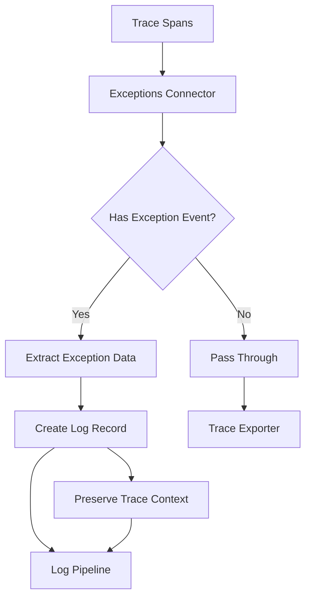

# How to Configure the Exceptions Connector in the OpenTelemetry Collector

Author: [nawazdhandala](https://www.github.com/nawazdhandala)

Tags: OpenTelemetry, Collector, Connectors, Exceptions, Error Tracking, Observability

Description: Master the Exceptions Connector in OpenTelemetry Collector to extract exception events from spans and transform them into structured logs for better error tracking and analysis.

The Exceptions Connector in the OpenTelemetry Collector extracts exception events from trace spans and converts them into log records. This transformation enables centralized error tracking, better correlation between traces and logs, and more efficient exception analysis across your distributed systems.

## Why Use the Exceptions Connector

Applications instrumented with OpenTelemetry often record exceptions as span events within traces. While this approach maintains context about where exceptions occurred, it can make exception aggregation and analysis challenging. The Exceptions Connector solves this by:

- Extracting exception events from spans into dedicated log records
- Preserving trace context for correlation between exceptions and traces
- Enabling centralized exception monitoring and alerting
- Supporting specialized error tracking backends
- Reducing storage costs by separating high-volume exceptions from traces

## How the Exceptions Connector Works

The connector operates as a bridge between trace and log pipelines. It receives spans, identifies those containing exception events, extracts the exception data, and emits structured log records:



Each extracted exception log contains the exception type, message, stack trace, and the original trace context, enabling full correlation.

## Basic Configuration

Here's a minimal configuration to get started with the Exceptions Connector:

```yaml
# Define the exceptions connector
connectors:
  exceptions:
    # No additional configuration required for basic usage

receivers:
  otlp:
    protocols:
      grpc:
        endpoint: 0.0.0.0:4317

processors:
  batch:
    timeout: 10s

exporters:
  otlp/traces:
    endpoint: traces-backend:4317
  otlp/logs:
    endpoint: logs-backend:4317

service:
  pipelines:
    # Traces pipeline that feeds the exceptions connector
    traces:
      receivers: [otlp]
      processors: [batch]
      # Export to both exceptions connector and trace backend
      exporters: [exceptions, otlp/traces]

    # Logs pipeline receives exception logs from the connector
    logs:
      receivers: [exceptions]
      processors: [batch]
      exporters: [otlp/logs]
```

This configuration routes all traces through the Exceptions Connector, which extracts exception events and sends them to the logs pipeline.

## Understanding Exception Events in Spans

OpenTelemetry records exceptions as span events with specific attributes. The Exceptions Connector looks for events with these characteristics:

```yaml
# Example of how exceptions appear in spans (conceptual)
# Your application code records exceptions like this:
# span.recordException(exception)

# The connector extracts these event attributes:
# - exception.type: The exception class name
# - exception.message: The exception message
# - exception.stacktrace: The full stack trace
# - exception.escaped: Whether the exception left the span scope

# These become structured fields in the generated logs
```

## Configuring Exception Extraction Rules

You can control which exceptions get extracted based on severity, type, or other span attributes:

```yaml
connectors:
  exceptions:
    # Currently, the exceptions connector extracts all exception events
    # Use processors to filter the resulting logs

processors:
  # Filter exception logs by severity or attributes
  filter/exceptions:
    logs:
      # Only keep errors and above
      exclude:
        match_type: strict
        record_attributes:
          - key: severity_text
            value: DEBUG
          - key: severity_text
            value: INFO

  # Add additional context to exception logs
  resource/exceptions:
    attributes:
      - key: exception.source
        value: otel-collector
        action: upsert

  # Transform exception data
  transform/exceptions:
    log_statements:
      - context: log
        statements:
          # Extract exception class from fully qualified name
          - set(attributes["exception.class"], Split(attributes["exception.type"], ".")[-1])
          # Truncate long stack traces
          - set(body, Substring(body, 0, 10000)) where len(body) > 10000

exporters:
  otlp/traces:
    endpoint: traces-backend:4317
  otlp/logs:
    endpoint: logs-backend:4317

service:
  pipelines:
    traces:
      receivers: [otlp]
      processors: [batch]
      exporters: [exceptions, otlp/traces]

    logs:
      receivers: [exceptions]
      # Apply filters and transformations to exception logs
      processors: [filter/exceptions, transform/exceptions, resource/exceptions, batch]
      exporters: [otlp/logs]
```

## Preserving Trace Context

The Exceptions Connector automatically preserves trace context in the generated log records. This enables correlation between exceptions and their originating traces:

```yaml
connectors:
  exceptions:
    # Trace context is preserved automatically

processors:
  # Ensure trace context propagates through the logs pipeline
  batch:
    timeout: 10s

exporters:
  # Your log backend should support trace context
  otlp/logs:
    endpoint: logs-backend:4317

  # Send to multiple destinations for different use cases
  loki:
    endpoint: http://loki:3100/loki/api/v1/push
    # Trace context enables jumping from logs to traces

service:
  pipelines:
    traces:
      receivers: [otlp]
      processors: [batch]
      exporters: [exceptions, otlp/traces]

    logs:
      receivers: [exceptions]
      processors: [batch]
      # Export to multiple backends
      exporters: [otlp/logs, loki]
```

When viewing exception logs, you can use the trace ID to retrieve the full distributed trace that contains the exception.

## Exception Enrichment

Enhance exception logs with additional metadata for better context and analysis:

```yaml
connectors:
  exceptions:
    # Base exception extraction

processors:
  # Add deployment information
  resource/deployment:
    attributes:
      - key: deployment.environment
        value: ${ENVIRONMENT}
        action: upsert
      - key: service.version
        value: ${VERSION}
        action: upsert
      - key: deployment.region
        value: ${REGION}
        action: upsert

  # Add fingerprinting for grouping similar exceptions
  transform/fingerprint:
    log_statements:
      - context: log
        statements:
          # Create a fingerprint from exception type and first line of message
          - set(attributes["exception.fingerprint"], MD5(Concat([attributes["exception.type"], Split(attributes["exception.message"], "\n")[0]])))

  # Classify exceptions by severity
  transform/classify:
    log_statements:
      - context: log
        statements:
          # Mark critical exceptions
          - set(attributes["exception.critical"], true) where attributes["exception.type"] == "OutOfMemoryError"
          - set(attributes["exception.critical"], true) where attributes["exception.type"] == "StackOverflowError"
          # Mark transient errors
          - set(attributes["exception.transient"], true) where IsMatch(attributes["exception.type"], ".*Timeout.*")
          - set(attributes["exception.transient"], true) where IsMatch(attributes["exception.type"], ".*Connection.*")

exporters:
  otlp/logs:
    endpoint: logs-backend:4317

service:
  pipelines:
    traces:
      receivers: [otlp]
      processors: [batch]
      exporters: [exceptions, otlp/traces]

    logs:
      receivers: [exceptions]
      processors:
        - resource/deployment
        - transform/fingerprint
        - transform/classify
        - batch
      exporters: [otlp/logs]
```

## Routing Exceptions to Specialized Backends

Different exception types may benefit from different storage or analysis tools:

```yaml
connectors:
  exceptions:
    # Extract all exceptions

processors:
  # Use routing processor to send exceptions to different destinations
  routing:
    from_attribute: exception.destination
    default_exporters: [otlp/logs]
    table:
      - value: security
        exporters: [otlp/security]
      - value: performance
        exporters: [otlp/performance]

  # Classify exceptions to determine routing
  transform/classify:
    log_statements:
      - context: log
        statements:
          # Route security exceptions
          - set(attributes["exception.destination"], "security") where IsMatch(attributes["exception.type"], ".*(Authentication|Authorization|Security).*")
          # Route performance exceptions
          - set(attributes["exception.destination"], "performance") where IsMatch(attributes["exception.type"], ".*(Timeout|OutOfMemory|Performance).*")

exporters:
  otlp/traces:
    endpoint: traces-backend:4317
  otlp/logs:
    endpoint: logs-backend:4317
  otlp/security:
    endpoint: security-backend:4317
  otlp/performance:
    endpoint: performance-backend:4317

service:
  pipelines:
    traces:
      receivers: [otlp]
      processors: [batch]
      exporters: [exceptions, otlp/traces]

    logs:
      receivers: [exceptions]
      processors: [transform/classify, routing, batch]
      exporters: [otlp/logs, otlp/security, otlp/performance]
```

## Sampling High-Volume Exceptions

Some applications generate large volumes of exceptions. Apply sampling to reduce storage costs while maintaining visibility:

```yaml
connectors:
  exceptions:
    # Extract all exceptions first

processors:
  # Sample based on exception type
  probabilistic_sampler/exceptions:
    # Attribute-based sampling coming in future versions
    # For now, apply global sampling rate
    sampling_percentage: 10.0

  # Tail sampling: keep all critical exceptions
  tail_sampling:
    policies:
      # Always keep critical exceptions
      - name: critical-exceptions
        type: string_attribute
        string_attribute:
          key: exception.critical
          values: ["true"]

      # Sample common exceptions at 5%
      - name: common-exceptions
        type: probabilistic
        probabilistic:
          sampling_percentage: 5.0

  # Count exceptions before sampling
  transform/count:
    log_statements:
      - context: log
        statements:
          # Add metadata indicating this was sampled
          - set(attributes["exception.sampled"], true)
          - set(attributes["exception.sample_rate"], 10.0)

exporters:
  otlp/traces:
    endpoint: traces-backend:4317
  otlp/logs:
    endpoint: logs-backend:4317
  # Send counts to metrics backend
  otlp/metrics:
    endpoint: metrics-backend:4317

service:
  pipelines:
    traces:
      receivers: [otlp]
      processors: [batch]
      exporters: [exceptions, otlp/traces]

    logs:
      receivers: [exceptions]
      processors: [probabilistic_sampler/exceptions, transform/count, batch]
      exporters: [otlp/logs]
```

## Monitoring Exception Patterns

Combine the Exceptions Connector with the Count Connector to track exception patterns over time:

```yaml
connectors:
  exceptions:
    # Extract exceptions to logs

  count:
    logs:
      # Count exceptions by type
      exception.count:
        description: "Count of exceptions by type"
        attributes:
          - key: exception.type
          - key: service.name
          - key: deployment.environment

      # Count critical exceptions
      exception.critical.count:
        description: "Count of critical exceptions"
        conditions:
          - 'attributes["exception.critical"] == "true"'
        attributes:
          - key: exception.type
          - key: service.name

receivers:
  otlp:
    protocols:
      grpc:
        endpoint: 0.0.0.0:4317

processors:
  batch:
    timeout: 10s

  # Classify exceptions as critical
  transform/classify:
    log_statements:
      - context: log
        statements:
          - set(attributes["exception.critical"], "true") where attributes["exception.type"] == "OutOfMemoryError"

exporters:
  otlp/traces:
    endpoint: traces-backend:4317
  otlp/logs:
    endpoint: logs-backend:4317
  otlp/metrics:
    endpoint: metrics-backend:4317

service:
  pipelines:
    traces:
      receivers: [otlp]
      processors: [batch]
      exporters: [exceptions, otlp/traces]

    logs/exceptions:
      receivers: [exceptions]
      processors: [transform/classify, batch]
      exporters: [count, otlp/logs]

    metrics:
      receivers: [count]
      processors: [batch]
      exporters: [otlp/metrics]
```

For more information about the Count Connector, see https://oneuptime.com/blog/post/2026-02-06-count-connector-opentelemetry-collector/view.

## Production Configuration Example

Here's a comprehensive production-ready configuration:

```yaml
connectors:
  exceptions:
    # Extract all exception events from spans

  count:
    logs:
      exception.count:
        description: "Exception count by type and service"
        attributes:
          - key: exception.type
          - key: service.name
          - key: deployment.environment
          - key: exception.critical

receivers:
  otlp:
    protocols:
      grpc:
        endpoint: 0.0.0.0:4317
      http:
        endpoint: 0.0.0.0:4318

processors:
  batch:
    timeout: 10s
    send_batch_size: 1024

  resource/enrich:
    attributes:
      - key: deployment.environment
        value: ${ENVIRONMENT}
        action: upsert
      - key: collector.version
        value: ${COLLECTOR_VERSION}
        action: upsert

  transform/exceptions:
    log_statements:
      - context: log
        statements:
          # Create exception fingerprint for deduplication
          - set(attributes["exception.fingerprint"], MD5(Concat([attributes["exception.type"], attributes["service.name"], Split(attributes["exception.message"], "\n")[0]])))
          # Mark critical exceptions
          - set(attributes["exception.critical"], "true") where IsMatch(attributes["exception.type"], ".*(OutOfMemory|StackOverflow|Fatal).*")
          - set(attributes["exception.critical"], "false") where attributes["exception.critical"] == nil
          # Extract exception class name
          - set(attributes["exception.class"], Split(attributes["exception.type"], ".")[-1]) where attributes["exception.type"] != nil
          # Limit stack trace length
          - set(body, Substring(body, 0, 8000)) where len(body) > 8000

  filter/noise:
    logs:
      exclude:
        match_type: regexp
        record_attributes:
          # Filter known non-critical exceptions
          - key: exception.type
            value: ".*NotFoundException"

  memory_limiter:
    check_interval: 1s
    limit_mib: 512

exporters:
  otlp/traces:
    endpoint: ${TRACES_BACKEND}
    retry_on_failure:
      enabled: true
      initial_interval: 1s
      max_interval: 30s

  otlp/logs:
    endpoint: ${LOGS_BACKEND}
    retry_on_failure:
      enabled: true
      initial_interval: 1s
      max_interval: 30s

  otlp/metrics:
    endpoint: ${METRICS_BACKEND}
    retry_on_failure:
      enabled: true
      initial_interval: 1s
      max_interval: 30s

service:
  telemetry:
    metrics:
      level: detailed
      address: 0.0.0.0:8888

  pipelines:
    traces:
      receivers: [otlp]
      processors: [memory_limiter, resource/enrich, batch]
      exporters: [exceptions, otlp/traces]

    logs/exceptions:
      receivers: [exceptions]
      processors:
        - memory_limiter
        - transform/exceptions
        - filter/noise
        - batch
      exporters: [count, otlp/logs]

    metrics:
      receivers: [count]
      processors: [batch]
      exporters: [otlp/metrics]
```

## Integration with Error Tracking Platforms

The Exceptions Connector enables integration with specialized error tracking platforms:

```yaml
# Send exception logs to Sentry, Rollbar, or similar platforms
exporters:
  # OpenTelemetry-compatible error tracking
  otlp/errors:
    endpoint: error-tracking-platform:4317
    headers:
      x-api-key: ${ERROR_TRACKING_API_KEY}

  # Traditional log aggregation
  loki:
    endpoint: http://loki:3100/loki/api/v1/push
    labels:
      resource:
        service.name: "service_name"
      attributes:
        exception.type: "exception_type"

service:
  pipelines:
    traces:
      receivers: [otlp]
      processors: [batch]
      exporters: [exceptions, otlp/traces]

    logs/exceptions:
      receivers: [exceptions]
      processors: [transform/exceptions, batch]
      # Multiple destinations for different use cases
      exporters: [otlp/logs, otlp/errors, loki]
```

## Correlation with Service Performance

Combine the Exceptions Connector with other connectors for comprehensive observability. Link exceptions to service performance metrics using the Span Metrics Connector at https://oneuptime.com/blog/post/2026-02-06-span-metrics-connector-red-metrics/view and visualize service dependencies with the Service Graph Connector at https://oneuptime.com/blog/post/2026-02-06-service-graph-connector-opentelemetry-collector/view.

## Best Practices

1. **Always Preserve Trace Context**: Ensure your log backend supports trace context for correlation.

2. **Apply Fingerprinting**: Create exception fingerprints to group similar errors for analysis.

3. **Classify by Severity**: Differentiate critical exceptions from routine errors for appropriate alerting.

4. **Sample Wisely**: Use sampling for high-volume exceptions while keeping all critical errors.

5. **Monitor Connector Health**: Track connector metrics to ensure exception extraction is working correctly.

6. **Enrich Early**: Add deployment and environmental context as early as possible in the pipeline.

## Conclusion

The Exceptions Connector transforms exception handling in distributed systems by extracting exception events from traces into structured logs. This separation enables specialized error tracking, better exception analysis, and more efficient storage while maintaining full trace correlation.

Start with basic exception extraction and progressively add classification, enrichment, and routing as your error tracking needs grow. The flexibility of the OpenTelemetry Collector's pipeline architecture allows you to build sophisticated exception handling workflows tailored to your organization's requirements.
