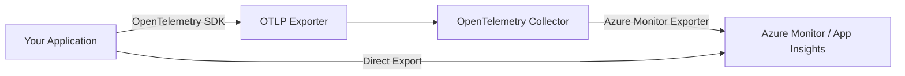

# How to Export OpenTelemetry Data to Azure Monitor and Application Insights

Author: [nawazdhandala](https://www.github.com/nawazdhandala)

Tags: OpenTelemetry, Azure Monitor, Application Insights, Observability, Azure, Tracing, Metrics, Logging

Description: A practical guide to exporting OpenTelemetry traces, metrics, and logs to Azure Monitor and Application Insights using the Azure Monitor OpenTelemetry Exporter.

---

> Azure Monitor and Application Insights are the primary observability tools in the Microsoft Azure ecosystem. With OpenTelemetry becoming the standard for telemetry instrumentation, connecting the two is a natural step for teams running workloads on Azure.

This guide walks you through exporting OpenTelemetry data to Azure Monitor and Application Insights. We will cover the Azure Monitor OpenTelemetry Exporter, the OpenTelemetry Collector with the Azure Monitor exporter, and the Azure Monitor OpenTelemetry Distro. By the end, you will have a working pipeline that sends traces, metrics, and logs from your applications into Application Insights.

---

## Architecture Overview

Before diving into code, it helps to understand how data flows from your application to Azure Monitor.



There are two main paths. You can export directly from your application using the Azure Monitor exporter SDK, or you can route data through the OpenTelemetry Collector. The Collector approach is more flexible and is recommended for production deployments because it decouples your application from the backend.

---

## Prerequisites

Before getting started, make sure you have:

- An Azure subscription with an Application Insights resource
- Your Application Insights connection string (found in the Azure Portal under your App Insights resource)
- Python 3.8+ or Node.js 18+ (depending on your stack)
- Basic familiarity with OpenTelemetry concepts like traces, spans, and metrics

---

## Option 1: Direct Export with the Azure Monitor Distro (Python)

The Azure Monitor OpenTelemetry Distro is the simplest way to get started. It bundles the exporter, auto-instrumentation libraries, and sensible defaults into a single package.

### Installation

Install the distro package along with the core OpenTelemetry dependencies.

```bash
# Install the Azure Monitor OpenTelemetry Distro
# This includes the exporter and common auto-instrumentation libraries
pip install azure-monitor-opentelemetry
```

### Configuration

The distro can be configured with just the connection string. It automatically sets up tracing, metrics, and logging pipelines.

```python
# configure_telemetry.py
# Set up the Azure Monitor OpenTelemetry Distro with your connection string

from azure.monitor.opentelemetry import configure_azure_monitor

# Replace with your actual Application Insights connection string
# Found in Azure Portal > Application Insights > Overview > Connection String
configure_azure_monitor(
    connection_string="InstrumentationKey=your-key-here;IngestionEndpoint=https://eastus-8.in.applicationinsights.azure.com/;LiveEndpoint=https://eastus.livediagnostics.monitor.azure.com/"
)
```

### Adding Traces to Your Application

Once the distro is configured, the OpenTelemetry API works as expected. You can create custom spans alongside the auto-instrumented ones.

```python
# app.py
# A simple Flask app with Azure Monitor telemetry

from flask import Flask
from opentelemetry import trace

app = Flask(__name__)

# Get a tracer for creating custom spans
tracer = trace.get_tracer(__name__)

@app.route("/")
def index():
    # Create a custom span for business logic tracking
    with tracer.start_as_current_span("process-homepage-request") as span:
        span.set_attribute("user.type", "visitor")
        span.set_attribute("page.name", "homepage")
        return "Hello from OpenTelemetry + Azure Monitor!"

if __name__ == "__main__":
    app.run(port=5000)
```

The Flask auto-instrumentation (included in the distro) will automatically create spans for incoming HTTP requests. The custom span we created nests inside those auto-generated spans, giving you both framework-level and business-level visibility.

---

## Option 2: Direct Export with the Azure Monitor Exporter (Node.js)

For Node.js applications, the `@azure/monitor-opentelemetry-exporter` package provides direct export to Application Insights.

### Installation

```bash
# Install OpenTelemetry SDK and the Azure Monitor exporter
npm install @opentelemetry/sdk-node \
            @opentelemetry/sdk-trace-node \
            @opentelemetry/sdk-metrics \
            @azure/monitor-opentelemetry-exporter
```

### Setting Up the Exporter

Configure the OpenTelemetry SDK with the Azure Monitor exporter for both traces and metrics.

```javascript
// tracing.js
// Configure OpenTelemetry with Azure Monitor export for Node.js

const { NodeSDK } = require("@opentelemetry/sdk-node");
const { AzureMonitorTraceExporter } = require("@azure/monitor-opentelemetry-exporter");
const { AzureMonitorMetricExporter } = require("@azure/monitor-opentelemetry-exporter");
const { PeriodicExportingMetricReader } = require("@opentelemetry/sdk-metrics");

// Create the trace exporter pointing to Application Insights
const traceExporter = new AzureMonitorTraceExporter({
    connectionString: process.env.APPLICATIONINSIGHTS_CONNECTION_STRING,
});

// Create the metric exporter with a 60-second export interval
const metricExporter = new AzureMonitorMetricExporter({
    connectionString: process.env.APPLICATIONINSIGHTS_CONNECTION_STRING,
});

const metricReader = new PeriodicExportingMetricReader({
    exporter: metricExporter,
    exportIntervalMillis: 60000, // Export metrics every 60 seconds
});

// Initialize the SDK with both exporters
const sdk = new NodeSDK({
    traceExporter: traceExporter,
    metricReader: metricReader,
    serviceName: "my-node-service",
});

// Start the SDK before your application code runs
sdk.start();

// Gracefully shut down on process exit to flush pending telemetry
process.on("SIGTERM", () => {
    sdk.shutdown().then(() => {
        console.log("Telemetry SDK shut down successfully");
        process.exit(0);
    });
});
```

Run your application with the connection string set as an environment variable.

```bash
# Set the connection string and start the application
# The tracing.js file should be required before your app code
export APPLICATIONINSIGHTS_CONNECTION_STRING="InstrumentationKey=your-key-here;IngestionEndpoint=https://eastus-8.in.applicationinsights.azure.com/"
node -r ./tracing.js app.js
```

---

## Option 3: Using the OpenTelemetry Collector

For production setups, the OpenTelemetry Collector gives you a centralized pipeline. Your applications export to the Collector via OTLP, and the Collector forwards data to Azure Monitor. This approach lets you add processing, filtering, and routing without changing application code.

### Collector Configuration

The Collector configuration defines receivers, exporters, and pipelines. Here is a configuration that accepts OTLP data and exports to Azure Monitor.

```yaml
# otel-collector-config.yaml
# OpenTelemetry Collector configuration for Azure Monitor export

receivers:
  otlp:
    protocols:
      grpc:
        endpoint: 0.0.0.0:4317  # Accept OTLP gRPC from applications
      http:
        endpoint: 0.0.0.0:4318  # Accept OTLP HTTP from applications

processors:
  batch:
    timeout: 10s          # Batch telemetry for 10 seconds before sending
    send_batch_size: 1024 # Or send when batch reaches 1024 items

  resource:
    attributes:
      - key: environment
        value: production
        action: upsert     # Add environment tag to all telemetry

exporters:
  azuremonitor:
    # Connection string from your Application Insights resource
    connection_string: "InstrumentationKey=your-key;IngestionEndpoint=https://eastus-8.in.applicationinsights.azure.com/"
    # Maximum number of concurrent connections to Azure Monitor
    maxbatchsize: 100
    maxbatchinterval: 10s

service:
  pipelines:
    traces:
      receivers: [otlp]
      processors: [batch, resource]
      exporters: [azuremonitor]
    metrics:
      receivers: [otlp]
      processors: [batch, resource]
      exporters: [azuremonitor]
    logs:
      receivers: [otlp]
      processors: [batch, resource]
      exporters: [azuremonitor]
```

### Running the Collector

You can run the Collector using Docker. Make sure to use the `contrib` distribution, which includes the Azure Monitor exporter.

```bash
# Run the OpenTelemetry Collector with the Azure Monitor exporter
# The contrib image includes the azuremonitor exporter
docker run -d \
  --name otel-collector \
  -p 4317:4317 \
  -p 4318:4318 \
  -v $(pwd)/otel-collector-config.yaml:/etc/otelcol-contrib/config.yaml \
  otel/opentelemetry-collector-contrib:latest
```

Then point your applications to the Collector endpoint instead of Azure Monitor directly.

```bash
# Configure your application to send telemetry to the Collector
export OTEL_EXPORTER_OTLP_ENDPOINT="http://localhost:4317"
export OTEL_SERVICE_NAME="my-service"
```

---

## Verifying Data in Application Insights

After your application starts sending telemetry, you can verify it in the Azure Portal.

1. Navigate to your Application Insights resource
2. Open the **Transaction search** blade to see individual traces
3. Check the **Performance** blade for request timing and dependencies
4. Use **Metrics** to see custom and auto-collected metrics
5. Open **Logs** and run a KQL query to explore your data

Here is a quick KQL query to verify traces are arriving:

```
// Query recent traces in Application Insights
// This shows the last 10 requests received
requests
| order by timestamp desc
| take 10
| project timestamp, name, duration, resultCode, cloud_RoleName
```

---

## Common Pitfalls

A few things to watch out for when setting up this integration:

- **Connection string vs. instrumentation key**: The connection string is the modern approach and includes the ingestion endpoint. Do not use the instrumentation key alone, as it does not support newer features like regional endpoints.
- **Sampling**: Azure Monitor applies adaptive sampling by default. If you are missing traces, check the sampling settings in both the OpenTelemetry SDK and Application Insights.
- **Collector version**: The Azure Monitor exporter is only available in the `contrib` distribution of the OpenTelemetry Collector. The core distribution does not include it.
- **Flush on shutdown**: Always call `sdk.shutdown()` or `flush()` before your process exits. Without this, the last batch of telemetry may be lost.

---

## Summary

Exporting OpenTelemetry data to Azure Monitor is straightforward with the right tools. For quick setups, the Azure Monitor Distro or direct exporter gets you running in minutes. For production environments, the OpenTelemetry Collector gives you flexibility to process and route telemetry before it reaches Application Insights. Whichever path you choose, the result is the same: full visibility into your application with traces, metrics, and logs flowing into Azure Monitor.
