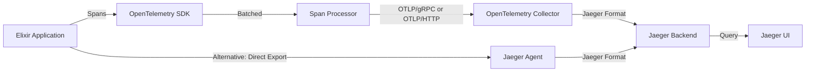

# How to Export OpenTelemetry Data from Elixir Applications to Jaeger

Author: [nawazdhandala](https://www.github.com/nawazdhandala)

Tags: OpenTelemetry, Elixir, Jaeger, Exporter, Tracing, Backend

Description: Configure OpenTelemetry in your Elixir applications to export trace data to Jaeger for powerful distributed tracing visualization.

Jaeger has become one of the most popular distributed tracing backends, providing powerful visualization, analysis, and debugging capabilities for microservices. While Jaeger originally used its own instrumentation format, it now fully supports OpenTelemetry, making it an excellent choice for Elixir applications. Getting trace data from your Elixir services into Jaeger requires proper configuration of exporters and understanding the export pipeline.

## Why Export to Jaeger

Jaeger offers several compelling features for analyzing traces from Elixir applications. Its UI provides intuitive trace visualization that shows the complete request flow through your system, including timing breakdowns and service dependencies. The architecture search feature helps identify performance bottlenecks by analyzing trace patterns across your infrastructure.

Unlike simple logging, Jaeger's trace view connects related operations across service boundaries. You can drill down from a high-level request to see every GenServer call, database query, and external API request involved. This level of detail is essential for debugging distributed Elixir systems where failures might cascade through multiple services.

Jaeger also supports sampling strategies that reduce storage costs while maintaining observability. For high-throughput Elixir applications processing millions of requests daily, intelligent sampling ensures you capture interesting traces without overwhelming your infrastructure.

## Understanding the Export Pipeline

OpenTelemetry data flows from your Elixir application through several components before reaching Jaeger:



The recommended approach uses the OpenTelemetry Protocol (OTLP) to send spans to an OpenTelemetry Collector, which then forwards them to Jaeger. This architecture provides flexibility for changing backends, adding sampling rules, and processing spans before storage. Alternatively, you can export directly to Jaeger, though this couples your application more tightly to Jaeger's specific format.

## Setting Up Jaeger

Before configuring your Elixir application, you need a running Jaeger instance. For development, use Docker:

```bash
# Run Jaeger all-in-one with OTLP support
docker run -d --name jaeger \
  -e COLLECTOR_OTLP_ENABLED=true \
  -p 16686:16686 \
  -p 4317:4317 \
  -p 4318:4318 \
  jaegertracing/all-in-one:latest
```

This command starts Jaeger with multiple ports:
- 16686: Jaeger UI for viewing traces
- 4317: OTLP gRPC endpoint for receiving traces
- 4318: OTLP HTTP endpoint for receiving traces

For production, deploy Jaeger with separate components for better scalability:

```bash
# Production deployment with separate collector and query service
# Collector receives traces
docker run -d --name jaeger-collector \
  -e SPAN_STORAGE_TYPE=elasticsearch \
  -e ES_SERVER_URLS=http://elasticsearch:9200 \
  -p 4317:4317 \
  -p 4318:4318 \
  jaegertracing/jaeger-collector:latest

# Query service for the UI
docker run -d --name jaeger-query \
  -e SPAN_STORAGE_TYPE=elasticsearch \
  -e ES_SERVER_URLS=http://elasticsearch:9200 \
  -p 16686:16686 \
  jaegertracing/jaeger-query:latest
```

## Configuring OpenTelemetry Exporter in Elixir

Add the necessary dependencies to your `mix.exs`:

```elixir
defp deps do
  [
    {:opentelemetry, "~> 1.3"},
    {:opentelemetry_api, "~> 1.2"},
    {:opentelemetry_exporter, "~> 1.6"},
    {:opentelemetry_telemetry, "~> 1.0"}
  ]
end
```

Configure the OTLP exporter in your application configuration:

```elixir
# config/config.exs
import Config

# Configure OpenTelemetry resource attributes
config :opentelemetry, :resource,
  service: [
    name: "my-elixir-service",
    version: "1.0.0"
  ]

# Configure the batch span processor
config :opentelemetry,
  span_processor: :batch,
  traces_exporter: :otlp

# Configure OTLP exporter settings
config :opentelemetry_exporter,
  otlp_protocol: :http_protobuf,
  otlp_endpoint: "http://localhost:4318",
  otlp_headers: []
```

The configuration uses HTTP/Protobuf by default, which works well for most deployments. For higher throughput scenarios, consider using gRPC:

```elixir
# Alternative: Use gRPC for better performance
config :opentelemetry_exporter,
  otlp_protocol: :grpc,
  otlp_endpoint: "http://localhost:4317",
  otlp_headers: []
```

## Environment-Specific Configuration

Different environments require different exporter settings. Handle this with runtime configuration:

```elixir
# config/runtime.exs
import Config

if config_env() == :prod do
  # Production configuration with authentication
  config :opentelemetry_exporter,
    otlp_protocol: :http_protobuf,
    otlp_endpoint: System.get_env("OTEL_EXPORTER_OTLP_ENDPOINT"),
    otlp_headers: [
      {"x-api-key", System.get_env("OTEL_API_KEY")}
    ]

  # More aggressive batching for high throughput
  config :opentelemetry,
    traces_exporter: {:otlp, %{
      scheduled_delay_ms: 5000,
      max_queue_size: 2048
    }}
else
  # Development configuration
  config :opentelemetry_exporter,
    otlp_protocol: :http_protobuf,
    otlp_endpoint: "http://localhost:4318",
    otlp_headers: []
end
```

## Initializing the Exporter

Initialize OpenTelemetry in your application's start function:

```elixir
defmodule MyApp.Application do
  use Application
  require Logger

  def start(_type, _args) do
    # Configure OpenTelemetry before starting supervision tree
    setup_opentelemetry()

    children = [
      MyApp.Repo,
      {Phoenix.PubSub, name: MyApp.PubSub},
      MyAppWeb.Endpoint
    ]

    opts = [strategy: :one_for_one, name: MyApp.Supervisor]
    Supervisor.start_link(children, opts)
  end

  defp setup_opentelemetry do
    # Register the application tracer
    OpentelemetryTelemetry.register_application_tracer(:my_app)

    # Verify exporter configuration
    case verify_exporter_config() do
      :ok ->
        Logger.info("OpenTelemetry exporter configured successfully")

      {:error, reason} ->
        Logger.warning("OpenTelemetry exporter configuration issue: #{reason}")
    end
  end

  defp verify_exporter_config do
    endpoint = Application.get_env(:opentelemetry_exporter, :otlp_endpoint)

    cond do
      is_nil(endpoint) ->
        {:error, "OTLP endpoint not configured"}

      not is_binary(endpoint) ->
        {:error, "OTLP endpoint must be a string"}

      true ->
        :ok
    end
  end
end
```

## Creating and Exporting Spans

With the exporter configured, create spans that will automatically export to Jaeger:

```elixir
defmodule MyApp.Users do
  require OpenTelemetry.Tracer, as: Tracer
  alias MyApp.Repo
  alias MyApp.Users.User

  def get_user(user_id) do
    Tracer.with_span "users.get_user" do
      Tracer.set_attributes([
        {"user_id", user_id},
        {"operation", "read"}
      ])

      case Repo.get(User, user_id) do
        nil ->
          Tracer.set_status(:error, "User not found")
          {:error, :not_found}

        user ->
          Tracer.set_status(:ok)
          {:ok, user}
      end
    end
  end

  def create_user(attrs) do
    Tracer.with_span "users.create_user" do
      Tracer.set_attributes([
        {"operation", "create"}
      ])

      changeset = User.changeset(%User{}, attrs)

      case Repo.insert(changeset) do
        {:ok, user} ->
          Tracer.set_attributes([
            {"user_id", user.id},
            {"success", true}
          ])
          Tracer.add_event("user_created", %{user_id: user.id})
          {:ok, user}

        {:error, changeset} ->
          errors = format_changeset_errors(changeset)
          Tracer.set_status(:error, "Validation failed")
          Tracer.add_event("validation_failed", %{errors: errors})
          {:error, changeset}
      end
    end
  end

  defp format_changeset_errors(changeset) do
    Ecto.Changeset.traverse_errors(changeset, fn {msg, _opts} -> msg end)
    |> Enum.map(fn {field, errors} -> "#{field}: #{Enum.join(errors, ", ")}" end)
    |> Enum.join("; ")
  end
end
```

These spans are automatically batched and exported to Jaeger based on your configuration. The batch processor accumulates spans and sends them periodically, reducing the overhead of individual exports.

## Customizing Export Behavior

Fine-tune the export behavior for your application's needs:

```elixir
defmodule MyApp.Telemetry do
  @moduledoc """
  Custom OpenTelemetry configuration and handlers.
  """

  def setup do
    # Configure custom span processor with specific batching behavior
    configure_span_processor()

    # Add custom resource attributes
    configure_resource_attributes()

    # Set up span filters to exclude noisy operations
    configure_span_filters()
  end

  defp configure_span_processor do
    # Create a batch processor with custom settings
    processor_config = %{
      # Maximum time between exports (milliseconds)
      scheduled_delay_ms: 5000,
      # Maximum number of spans in a batch
      max_queue_size: 2048,
      # Maximum number of spans to export at once
      max_export_batch_size: 512,
      # Timeout for export operations
      exporter_timeout_ms: 30_000
    }

    # The batch processor is configured via application env
    Application.put_env(:opentelemetry, :processors, [
      {:otel_batch_processor, processor_config}
    ])
  end

  defp configure_resource_attributes do
    # Add custom attributes to all spans
    additional_attributes = [
      deployment: [
        environment: System.get_env("DEPLOYMENT_ENV", "development"),
        region: System.get_env("REGION", "us-east-1")
      ],
      host: [
        name: System.get_env("HOSTNAME", "localhost"),
        type: System.get_env("INSTANCE_TYPE", "local")
      ]
    ]

    current_resource = Application.get_env(:opentelemetry, :resource, [])
    merged_resource = Keyword.merge(current_resource, additional_attributes)

    Application.put_env(:opentelemetry, :resource, merged_resource)
  end

  defp configure_span_filters do
    # Filter out health check spans to reduce noise
    :otel_batch_processor.set_exporter(fn spans ->
      filtered_spans = Enum.reject(spans, &health_check_span?/1)
      :opentelemetry_exporter.export(filtered_spans)
    end)
  end

  defp health_check_span?(span) do
    # Check if this is a health check request
    attributes = :otel_span.attributes(span)

    case Enum.find(attributes, fn {key, _value} -> key == "http.target" end) do
      {_key, "/health"} -> true
      {_key, "/healthz"} -> true
      _ -> false
    end
  end
end
```

## Handling Export Failures

Export failures can occur due to network issues, backend unavailability, or configuration problems. Implement proper error handling:

```elixir
defmodule MyApp.ExporterHealthCheck do
  use GenServer
  require Logger

  @check_interval :timer.minutes(5)

  def start_link(opts) do
    GenServer.start_link(__MODULE__, opts, name: __MODULE__)
  end

  @impl true
  def init(_opts) do
    schedule_health_check()
    {:ok, %{last_success: nil, consecutive_failures: 0}}
  end

  @impl true
  def handle_info(:health_check, state) do
    case check_exporter_health() do
      :ok ->
        new_state = %{
          last_success: DateTime.utc_now(),
          consecutive_failures: 0
        }

        if state.consecutive_failures > 0 do
          Logger.info("OpenTelemetry exporter recovered")
        end

        schedule_health_check()
        {:noreply, new_state}

      {:error, reason} ->
        new_failures = state.consecutive_failures + 1

        Logger.warning(
          "OpenTelemetry exporter health check failed: #{inspect(reason)} " <>
          "(#{new_failures} consecutive failures)"
        )

        if new_failures >= 3 do
          Logger.error("OpenTelemetry exporter has failed #{new_failures} times. Check configuration.")
        end

        schedule_health_check()
        {:noreply, %{state | consecutive_failures: new_failures}}
    end
  end

  defp check_exporter_health do
    # Test the connection to the OTLP endpoint
    endpoint = Application.get_env(:opentelemetry_exporter, :otlp_endpoint)

    case HTTPoison.get("#{endpoint}/health") do
      {:ok, %{status_code: 200}} -> :ok
      {:ok, %{status_code: code}} -> {:error, "HTTP #{code}"}
      {:error, error} -> {:error, error}
    end
  rescue
    error -> {:error, error}
  end

  defp schedule_health_check do
    Process.send_after(self(), :health_check, @check_interval)
  end
end
```

## Verifying Data in Jaeger

After configuration, verify that spans are reaching Jaeger:

```elixir
defmodule MyApp.TracingTest do
  use ExUnit.Case
  require OpenTelemetry.Tracer, as: Tracer

  @moduletag :integration

  test "exports spans to Jaeger" do
    # Create a test span with unique attributes
    test_id = UUID.uuid4()

    Tracer.with_span "test.verification" do
      Tracer.set_attributes([
        {"test_id", test_id},
        {"test_run", true}
      ])

      # Do some work
      Process.sleep(100)
    end

    # Force flush to ensure span is exported
    :otel_batch_processor.force_flush()

    # Wait for export and indexing
    Process.sleep(2000)

    # Query Jaeger API to verify span was received
    assert span_exists_in_jaeger?(test_id)
  end

  defp span_exists_in_jaeger?(test_id) do
    # Query Jaeger's HTTP API
    jaeger_url = "http://localhost:16686"
    service = "my-elixir-service"

    query_url =
      "#{jaeger_url}/api/traces?service=#{service}&tags=%7B%22test_id%22%3A%22#{test_id}%22%7D"

    case HTTPoison.get(query_url) do
      {:ok, %{status_code: 200, body: body}} ->
        response = Jason.decode!(body)
        length(response["data"]) > 0

      _ ->
        false
    end
  end
end
```

## Performance Optimization

For high-throughput Elixir applications, optimize the export pipeline:

```elixir
defmodule MyApp.Config.Tracing do
  def production_config do
    %{
      # Use gRPC for better performance
      protocol: :grpc,
      endpoint: System.fetch_env!("OTEL_EXPORTER_OTLP_ENDPOINT"),

      # Aggressive batching reduces overhead
      scheduled_delay_ms: 10_000,
      max_queue_size: 4096,
      max_export_batch_size: 1024,

      # Longer timeout for large batches
      exporter_timeout_ms: 60_000,

      # Sampling reduces volume
      sampler: {:parent_based, %{
        root: {:trace_id_ratio_based, 0.1},  # Sample 10% of traces
        remote_parent_sampled: :always_on,
        remote_parent_not_sampled: :always_off
      }}
    }
  end

  def apply_config(config) do
    Application.put_env(:opentelemetry_exporter, :otlp_protocol, config.protocol)
    Application.put_env(:opentelemetry_exporter, :otlp_endpoint, config.endpoint)

    Application.put_env(:opentelemetry, :processors, [
      {:otel_batch_processor, %{
        scheduled_delay_ms: config.scheduled_delay_ms,
        max_queue_size: config.max_queue_size,
        max_export_batch_size: config.max_export_batch_size,
        exporter_timeout_ms: config.exporter_timeout_ms
      }}
    ])

    Application.put_env(:opentelemetry, :sampler, config.sampler)
  end
end
```

## Monitoring Export Metrics

Track exporter performance with telemetry events:

```elixir
defmodule MyApp.ExporterMetrics do
  require Logger

  def attach_handlers do
    events = [
      [:otel, :batch_processor, :export, :start],
      [:otel, :batch_processor, :export, :stop],
      [:otel, :batch_processor, :export, :exception]
    ]

    :telemetry.attach_many(
      "otel-exporter-metrics",
      events,
      &handle_event/4,
      nil
    )
  end

  def handle_event(
        [:otel, :batch_processor, :export, :start],
        _measurements,
        %{span_count: count},
        _config
      ) do
    Logger.debug("Exporting #{count} spans to Jaeger")
  end

  def handle_event(
        [:otel, :batch_processor, :export, :stop],
        %{duration: duration},
        %{span_count: count},
        _config
      ) do
    duration_ms = System.convert_time_unit(duration, :native, :millisecond)
    Logger.debug("Exported #{count} spans in #{duration_ms}ms")

    # Record metrics for monitoring
    :telemetry.execute(
      [:my_app, :otel_export],
      %{duration: duration_ms, span_count: count},
      %{}
    )
  end

  def handle_event(
        [:otel, :batch_processor, :export, :exception],
        _measurements,
        %{kind: kind, reason: reason},
        _config
      ) do
    Logger.error("Span export failed: #{kind} - #{inspect(reason)}")

    # Record error metric
    :telemetry.execute(
      [:my_app, :otel_export, :error],
      %{count: 1},
      %{kind: kind}
    )
  end
end
```

## Using the OpenTelemetry Collector

For production deployments, run an OpenTelemetry Collector between your application and Jaeger:

```yaml
# otel-collector-config.yaml
receivers:
  otlp:
    protocols:
      grpc:
        endpoint: 0.0.0.0:4317
      http:
        endpoint: 0.0.0.0:4318

processors:
  batch:
    timeout: 10s
    send_batch_size: 1024

  # Add resource attributes
  resource:
    attributes:
      - key: environment
        value: production
        action: upsert

  # Sample traces to reduce volume
  probabilistic_sampler:
    sampling_percentage: 10

exporters:
  jaeger:
    endpoint: jaeger-collector:14250
    tls:
      insecure: true

service:
  pipelines:
    traces:
      receivers: [otlp]
      processors: [resource, probabilistic_sampler, batch]
      exporters: [jaeger]
```

Deploy the collector alongside your services:

```bash
docker run -d --name otel-collector \
  -v $(pwd)/otel-collector-config.yaml:/etc/otel-collector-config.yaml \
  -p 4317:4317 \
  -p 4318:4318 \
  otel/opentelemetry-collector:latest \
  --config=/etc/otel-collector-config.yaml
```

Exporting OpenTelemetry data from Elixir to Jaeger provides powerful distributed tracing capabilities. With proper configuration of exporters, batching, and sampling, you can maintain observability without impacting application performance. Jaeger's visualization tools then transform that trace data into actionable insights about your Elixir system's behavior and performance.
