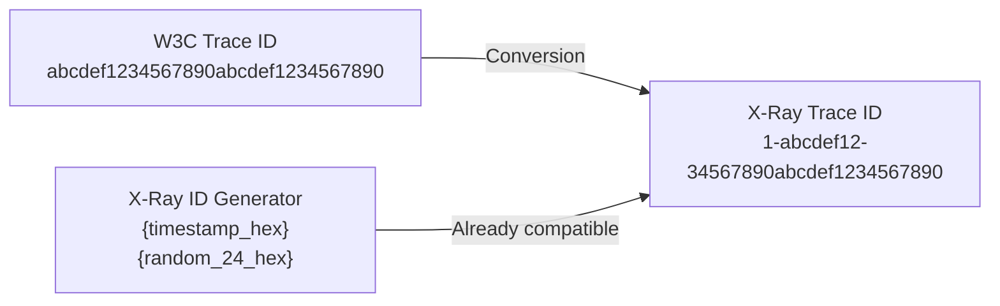

# How to Export OpenTelemetry Traces to AWS X-Ray

Author: [nawazdhandala](https://www.github.com/nawazdhandala)

Tags: OpenTelemetry, AWS X-Ray, Distributed Tracing, Observability, AWS

Description: Step-by-step instructions for exporting OpenTelemetry traces to AWS X-Ray using the collector and SDK exporters, with trace ID format conversion details.

---

AWS X-Ray is Amazon's distributed tracing service. It is deeply integrated with other AWS services like Lambda, API Gateway, and ECS, which makes it a natural choice if you are running workloads on AWS. But you do not have to use the X-Ray SDK to send it data. OpenTelemetry can export traces directly to X-Ray, letting you use a vendor-neutral instrumentation layer while still taking advantage of X-Ray's service map and trace analysis features.

There is a catch, though. X-Ray uses a different trace ID format than OpenTelemetry. This guide covers how to handle that and set up the export pipeline properly.

## X-Ray Trace ID Format

Before diving into configuration, it helps to understand what makes X-Ray's trace IDs different. OpenTelemetry uses a standard W3C trace ID, which is a 32-character hex string. X-Ray trace IDs look like this:

```
1-5f4b3c2a-1234567890abcdef12345678
```

That format is `1-{unix_timestamp_hex}-{96_bits_of_randomness}`. The timestamp component lets X-Ray efficiently index and query traces by time range.

When you use the OpenTelemetry X-Ray exporter, it handles the conversion automatically. But if you are generating trace IDs yourself, you need to embed the timestamp in the first 8 characters of your 32-character W3C trace ID. OpenTelemetry provides an ID generator for this purpose.



## Option 1: Using the OpenTelemetry Collector (Recommended)

The cleanest approach is to run the OpenTelemetry Collector with the AWS X-Ray exporter. This decouples your application from the export destination and lets you change backends without redeploying your services.

### Install the Collector

If you are running on EKS, you can use the ADOT Collector image which includes the X-Ray exporter. For other environments, use the `otelcol-contrib` distribution.

```bash
# Pull the contrib collector image which includes the awsxray exporter
docker pull otel/opentelemetry-collector-contrib:0.98.0
```

### Collector Configuration

Here is a collector config that receives OTLP traces and exports them to X-Ray:

```yaml
# otel-collector-config.yaml
# Receives traces via OTLP and exports them to AWS X-Ray
receivers:
  otlp:
    protocols:
      grpc:
        endpoint: 0.0.0.0:4317
      http:
        endpoint: 0.0.0.0:4318

processors:
  # Batch traces to reduce the number of API calls to X-Ray
  batch:
    timeout: 10s
    send_batch_size: 256

  # Memory limiter prevents the collector from running out of memory
  memory_limiter:
    check_interval: 5s
    limit_mib: 256

exporters:
  awsxray:
    # The region where your X-Ray data will be stored
    region: us-east-1
    # Optional: index log groups for correlation with CloudWatch Logs
    indexed_attributes:
      - aws.log.group.names

  # Keep a debug exporter during development to see what is being exported
  debug:
    verbosity: basic

service:
  pipelines:
    traces:
      receivers: [otlp]
      processors: [memory_limiter, batch]
      exporters: [awsxray, debug]
```

### Run the Collector with AWS Credentials

The collector needs AWS credentials to call the X-Ray API. You can provide them through environment variables, an IAM instance profile, or IRSA on EKS.

```bash
# Run the collector with AWS credentials passed as environment variables
# In production, prefer IAM roles (instance profile or IRSA) over access keys
docker run -d \
  --name otel-collector \
  -p 4317:4317 \
  -p 4318:4318 \
  -e AWS_ACCESS_KEY_ID=your-access-key \
  -e AWS_SECRET_ACCESS_KEY=your-secret-key \
  -e AWS_REGION=us-east-1 \
  -v $(pwd)/otel-collector-config.yaml:/etc/otelcol/config.yaml \
  otel/opentelemetry-collector-contrib:0.98.0 \
  --config /etc/otelcol/config.yaml
```

The IAM role or user needs these permissions:

```json
{
  "Version": "2012-10-17",
  "Statement": [
    {
      "Effect": "Allow",
      "Action": [
        "xray:PutTraceSegments",
        "xray:PutTelemetryRecords",
        "xray:GetSamplingRules",
        "xray:GetSamplingTargets",
        "xray:GetSamplingStatisticSummaries"
      ],
      "Resource": "*"
    }
  ]
}
```

## Option 2: Direct SDK Export

If you do not want to run a collector, you can export directly from your application to X-Ray. This is simpler for small setups but gives you less flexibility.

### Python Example

Install the required packages:

```bash
# Install the OpenTelemetry SDK and the AWS X-Ray propagator and exporter
pip install opentelemetry-sdk \
  opentelemetry-exporter-otlp \
  opentelemetry-sdk-extension-aws \
  opentelemetry-propagator-aws-xray
```

Configure the tracer with the X-Ray ID generator and propagator:

```python
# tracing_setup.py
# Configures OpenTelemetry to generate X-Ray compatible trace IDs and propagate context
from opentelemetry import trace
from opentelemetry.sdk.trace import TracerProvider
from opentelemetry.sdk.trace.export import BatchSpanProcessor
from opentelemetry.exporter.otlp.proto.grpc.trace_exporter import OTLPSpanExporter
from opentelemetry.sdk.extension.aws.trace import AwsXRayIdGenerator
from opentelemetry.propagators.aws import AwsXRayPropagator
from opentelemetry import propagate

# Use the X-Ray ID generator so trace IDs embed the timestamp
# This is required for proper trace ID correlation in X-Ray
provider = TracerProvider(id_generator=AwsXRayIdGenerator())

# Export spans via OTLP to a collector (which then forwards to X-Ray)
# Or you could use the direct X-Ray exporter if no collector is running
exporter = OTLPSpanExporter(endpoint="http://localhost:4317", insecure=True)
provider.add_span_processor(BatchSpanProcessor(exporter))

trace.set_tracer_provider(provider)

# Set the X-Ray propagator so trace context is passed correctly
# between services using the X-Ray trace header format
propagate.set_global_textmap(AwsXRayPropagator())
```

### Node.js Example

```bash
# Install OpenTelemetry packages for Node.js with X-Ray support
npm install @opentelemetry/sdk-trace-node \
  @opentelemetry/exporter-trace-otlp-grpc \
  @opentelemetry/id-generator-aws-xray \
  @opentelemetry/propagator-aws-xray
```

```javascript
// tracing.js
// Sets up OpenTelemetry with X-Ray compatible trace IDs for a Node.js application
const { NodeTracerProvider } = require('@opentelemetry/sdk-trace-node');
const { BatchSpanProcessor } = require('@opentelemetry/sdk-trace-base');
const { OTLPTraceExporter } = require('@opentelemetry/exporter-trace-otlp-grpc');
const { AWSXRayIdGenerator } = require('@opentelemetry/id-generator-aws-xray');
const { AWSXRayPropagator } = require('@opentelemetry/propagator-aws-xray');
const { propagation } = require('@opentelemetry/api');

// Create a provider that generates X-Ray compatible trace IDs
const provider = new NodeTracerProvider({
  idGenerator: new AWSXRayIdGenerator(),
});

// Export to OTLP collector running locally
const exporter = new OTLPTraceExporter({
  url: 'http://localhost:4317',
});

provider.addSpanProcessor(new BatchSpanProcessor(exporter));
provider.register();

// Use X-Ray propagator for cross-service trace context
propagation.setGlobalTextMap(new AWSXRayPropagator());

console.log('OpenTelemetry tracing initialized with X-Ray ID generator');
```

## Mapping OpenTelemetry Concepts to X-Ray

X-Ray has its own terminology. Understanding the mapping helps when you look at traces in the X-Ray console.

| OpenTelemetry | X-Ray | Notes |
|--------------|-------|-------|
| Trace | Trace | Same concept, different ID format |
| Span (root, server kind) | Segment | Top-level operation in a service |
| Span (child) | Subsegment | Nested operation within a segment |
| Span attributes | Annotations/Metadata | Annotations are indexed and searchable |
| Span events | Subsegment with metadata | Events map to subsegments |
| Span status ERROR | Fault/Error | HTTP 5xx = Fault, 4xx = Error |

The X-Ray exporter in the collector handles all these conversions. Your application code uses standard OpenTelemetry APIs, and the export layer translates everything.

## Setting Span Attributes That X-Ray Understands

X-Ray can extract certain span attributes and display them in the console. Setting these attributes improves the experience.

```python
# Add attributes that X-Ray uses for its service map and filtering
from opentelemetry import trace

tracer = trace.get_tracer("order-service")

with tracer.start_as_current_span("process-order") as span:
    # These semantic convention attributes map to X-Ray annotations
    span.set_attribute("http.method", "POST")
    span.set_attribute("http.url", "https://api.example.com/orders")
    span.set_attribute("http.status_code", 200)

    # Custom attributes become X-Ray metadata by default
    span.set_attribute("order.id", "ORD-12345")
    span.set_attribute("order.total", 99.99)

    # To make a custom attribute searchable as an X-Ray annotation,
    # prefix it with "aws.xray.annotations." or configure the exporter
    span.set_attribute("customer.tier", "premium")
```

## Verifying Traces in the X-Ray Console

After setting everything up, generate some traffic and check the X-Ray console.

```bash
# Send a test trace to the collector using grpcurl
# This creates a simple span that should appear in X-Ray within a minute
grpcurl -plaintext -d '{
  "resourceSpans": [{
    "resource": {
      "attributes": [{
        "key": "service.name",
        "value": {"stringValue": "test-service"}
      }]
    },
    "scopeSpans": [{
      "spans": [{
        "traceId": "'"$(python3 -c "import time,os;t=hex(int(time.time()))[2:];r=os.urandom(12).hex();print(t+r)")"'",
        "spanId": "'"$(python3 -c "import os;print(os.urandom(8).hex())")"'",
        "name": "test-span",
        "kind": 2,
        "startTimeUnixNano": "'"$(date +%s)000000000"'",
        "endTimeUnixNano": "'"$(date +%s)500000000"'"
      }]
    }]
  }]
}' localhost:4317 opentelemetry.proto.collector.trace.v1.TraceService/Export
```

In the X-Ray console, you should see your trace within a couple of minutes. The service map will show your service as a node, and clicking on it reveals the individual traces.

## Sampling Configuration

X-Ray has its own sampling rules, and the OpenTelemetry exporter can respect them. This is useful because you can change sampling rates in the X-Ray console without redeploying your application.

```yaml
# Collector config with X-Ray remote sampling enabled
# The collector fetches sampling rules from X-Ray and applies them locally
receivers:
  otlp:
    protocols:
      grpc:
        endpoint: 0.0.0.0:4317

processors:
  batch:
    timeout: 10s

exporters:
  awsxray:
    region: us-east-1

extensions:
  # This extension fetches sampling rules from X-Ray
  awsproxy:
    endpoint: 0.0.0.0:2000

service:
  extensions: [awsproxy]
  pipelines:
    traces:
      receivers: [otlp]
      processors: [batch]
      exporters: [awsxray]
```

## Wrapping Up

Exporting OpenTelemetry traces to X-Ray is mostly a matter of configuration. The X-Ray exporter in the collector handles the trace ID format conversion and maps OpenTelemetry concepts to X-Ray segments and subsegments. The one thing you should not skip is the X-Ray ID generator in your SDK setup. Without it, your trace IDs will lack the timestamp component that X-Ray expects, and while traces will still work, some time-based features in the console may not behave correctly.

Start with the collector-based approach if possible. It gives you the flexibility to add additional exporters later (maybe you want traces in both X-Ray and another backend), and it keeps export logic out of your application code.
