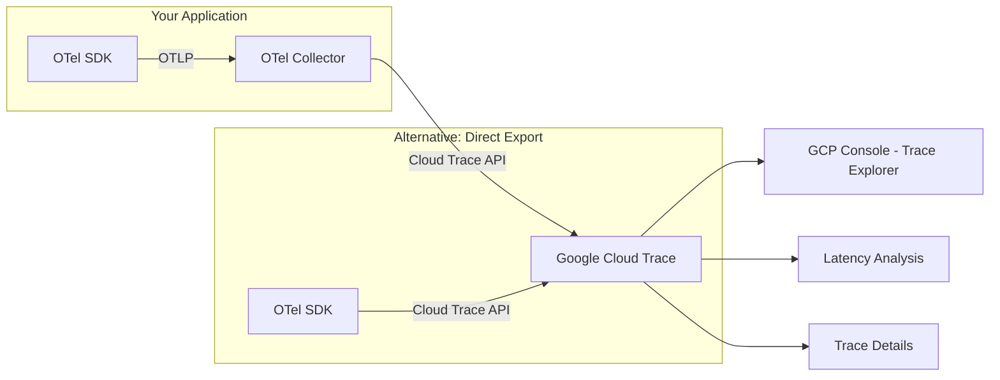

# How to Export OpenTelemetry Traces to Google Cloud Trace

Author: [nawazdhandala](https://www.github.com/nawazdhandala)

Tags: OpenTelemetry, Google Cloud, Cloud Trace, Tracing, GCP, Exporter, Observability

Description: Learn how to export OpenTelemetry traces to Google Cloud Trace using the collector exporter and direct SDK exporters in Python, Node.js, and Go.

---

Google Cloud Trace (formerly Stackdriver Trace) is Google's managed distributed tracing service. It integrates tightly with other GCP services and provides trace analysis, latency reporting, and automatic bottleneck detection. If you are running workloads on Google Cloud, exporting OpenTelemetry traces to Cloud Trace gives you native integration with the GCP console while still keeping your instrumentation vendor-neutral.

There are two ways to get OpenTelemetry traces into Cloud Trace: through the OpenTelemetry Collector with the Google Cloud exporter, or directly from your application using language-specific exporters. This guide covers both approaches with working examples.

## How the Integration Works

Cloud Trace speaks its own protocol, but the OpenTelemetry ecosystem provides exporters that translate OTLP trace data into the Cloud Trace format. The translation handles span attributes, resource attributes, status codes, and span links.



The collector approach is recommended for production because it decouples your application from the export destination. You can switch backends without redeploying your apps. The direct export approach is simpler for development and small deployments.

## Prerequisites

Before starting, ensure you have:

- A Google Cloud project with the Cloud Trace API enabled
- `gcloud` CLI installed and authenticated
- Appropriate IAM permissions (the `roles/cloudtrace.agent` role)

Enable the Cloud Trace API if it is not already enabled.

```bash
# Enable the Cloud Trace API on your project
gcloud services enable cloudtrace.googleapis.com
```

## Method 1: Export via the OpenTelemetry Collector

The collector approach uses the `googlecloud` exporter from the OpenTelemetry Collector Contrib distribution. This exporter converts OTLP spans to the Cloud Trace format and sends them using the Cloud Trace API.

### Collector Configuration

Here is a complete collector configuration that receives OTLP traces from your applications and exports them to Cloud Trace.

```yaml
# otel-collector-config.yaml - Export traces to Google Cloud Trace
receivers:
  otlp:
    protocols:
      grpc:
        endpoint: 0.0.0.0:4317
      http:
        endpoint: 0.0.0.0:4318

processors:
  batch:
    timeout: 5s
    send_batch_size: 200

  # Detect GCP environment metadata and add as resource attributes
  # This adds cloud.provider, cloud.platform, cloud.region, etc.
  resourcedetection:
    detectors: [gcp]
    timeout: 5s

  memory_limiter:
    check_interval: 1s
    limit_mib: 512
    spike_limit_mib: 128

exporters:
  # Google Cloud Trace exporter
  googlecloud:
    project: my-gcp-project    # Your GCP project ID
    trace:
      # Use batch write for better performance
      # The exporter buffers spans and writes them in batches
      attribute_mappings:
        # Map OpenTelemetry attributes to Cloud Trace labels
        - key: http.method
          replacement: /http/method
        - key: http.status_code
          replacement: /http/status_code
        - key: http.url
          replacement: /http/url

  # Optional: also export to OneUptime for a vendor-neutral view
  otlphttp:
    endpoint: "https://oneuptime.com/otlp"

service:
  pipelines:
    traces:
      receivers: [otlp]
      processors: [memory_limiter, resourcedetection, batch]
      exporters: [googlecloud, otlphttp]
```

### Running the Collector on GCE or GKE

When running on Google Compute Engine or GKE, the collector can use the default service account credentials. No additional authentication setup is needed if the instance or pod has the `cloudtrace.agent` role.

```bash
# Run the collector using the contrib distribution (includes the googlecloud exporter)
docker run --rm \
  -p 4317:4317 \
  -p 4318:4318 \
  -v $(pwd)/otel-collector-config.yaml:/etc/otelcol-contrib/config.yaml \
  otel/opentelemetry-collector-contrib:latest
```

On GCE, the collector automatically picks up credentials from the instance metadata service. On GKE, use Workload Identity (covered in detail below).

### Running the Collector Outside GCP

If your collector runs outside of Google Cloud (for example, on-premises or in another cloud), you need to provide a service account key.

```bash
# Create a service account and download the key file
gcloud iam service-accounts create otel-trace-exporter \
  --display-name="OTel Trace Exporter"

gcloud projects add-iam-policy-binding my-gcp-project \
  --member="serviceAccount:otel-trace-exporter@my-gcp-project.iam.gserviceaccount.com" \
  --role="roles/cloudtrace.agent"

gcloud iam service-accounts keys create otel-sa-key.json \
  --iam-account=otel-trace-exporter@my-gcp-project.iam.gserviceaccount.com
```

Point the collector at the key file using the `GOOGLE_APPLICATION_CREDENTIALS` environment variable.

```bash
# Run the collector with explicit GCP credentials
docker run --rm \
  -p 4317:4317 \
  -p 4318:4318 \
  -v $(pwd)/otel-collector-config.yaml:/etc/otelcol-contrib/config.yaml \
  -v $(pwd)/otel-sa-key.json:/etc/gcp/sa-key.json \
  -e GOOGLE_APPLICATION_CREDENTIALS=/etc/gcp/sa-key.json \
  otel/opentelemetry-collector-contrib:latest
```

## Method 2: Direct Export from Application Code

For simpler setups or development environments, you can export traces directly from your application to Cloud Trace without a collector.

### Python

Google provides an OpenTelemetry exporter package for Python that sends traces directly to Cloud Trace.

```bash
# Install the Google Cloud Trace exporter for OpenTelemetry
pip install opentelemetry-exporter-gcp-trace opentelemetry-api opentelemetry-sdk
```

Configure the exporter in your application startup code.

```python
# tracing.py - Direct export to Google Cloud Trace from Python
from opentelemetry import trace
from opentelemetry.sdk.trace import TracerProvider
from opentelemetry.sdk.trace.export import BatchSpanProcessor
from opentelemetry.sdk.resources import Resource
from opentelemetry.exporter.cloud_trace import CloudTraceSpanExporter

# Create a resource identifying your service
resource = Resource.create({
    "service.name": "my-python-service",
    "service.version": "1.0.0",
})

# Initialize the tracer provider with the Cloud Trace exporter
provider = TracerProvider(resource=resource)

# The exporter auto-detects credentials from the environment
# On GCE/GKE: uses the default service account
# Locally: uses GOOGLE_APPLICATION_CREDENTIALS or gcloud auth
cloud_trace_exporter = CloudTraceSpanExporter(
    project_id="my-gcp-project"
)

# Use BatchSpanProcessor for efficient batching of exports
provider.add_span_processor(
    BatchSpanProcessor(cloud_trace_exporter)
)

trace.set_tracer_provider(provider)

# Now create spans in your application code
tracer = trace.get_tracer("my-service")

def handle_request():
    with tracer.start_as_current_span("handle-request") as span:
        span.set_attribute("http.method", "GET")
        span.set_attribute("http.url", "/api/users")
        # Your business logic here
        result = fetch_users()
        return result
```

### Node.js

The Node.js exporter works similarly. Install the Google Cloud exporter package and configure it during SDK initialization.

```bash
# Install the Google Cloud Trace exporter for Node.js
npm install @google-cloud/opentelemetry-cloud-trace-exporter \
            @opentelemetry/api \
            @opentelemetry/sdk-node
```

```javascript
// tracing.js - Direct export to Google Cloud Trace from Node.js
const { NodeSDK } = require("@opentelemetry/sdk-node");
const { TraceExporter } = require("@google-cloud/opentelemetry-cloud-trace-exporter");

// The exporter handles authentication automatically
// using Application Default Credentials
const traceExporter = new TraceExporter({
  projectId: "my-gcp-project",
});

const sdk = new NodeSDK({
  traceExporter: traceExporter,
  serviceName: "my-node-service",
});

sdk.start();
console.log("OpenTelemetry initialized, exporting to Cloud Trace");

// Graceful shutdown
process.on("SIGTERM", () => {
  sdk.shutdown()
    .then(() => console.log("Tracing shut down"))
    .catch((err) => console.error("Error shutting down tracing", err))
    .finally(() => process.exit(0));
});
```

### Go

Go applications can use the Google Cloud exporter package.

```bash
# Install the Go exporter module
go get github.com/GoogleCloudPlatform/opentelemetry-operations-go/exporter/trace
```

```go
// main.go - Direct export to Google Cloud Trace from Go
package main

import (
    "context"
    "log"

    texporter "github.com/GoogleCloudPlatform/opentelemetry-operations-go/exporter/trace"
    "go.opentelemetry.io/otel"
    "go.opentelemetry.io/otel/sdk/resource"
    sdktrace "go.opentelemetry.io/otel/sdk/trace"
    semconv "go.opentelemetry.io/otel/semconv/v1.21.0"
)

func initTracing() (*sdktrace.TracerProvider, error) {
    ctx := context.Background()

    // Create the Cloud Trace exporter
    // It uses Application Default Credentials automatically
    exporter, err := texporter.New(texporter.WithProjectID("my-gcp-project"))
    if err != nil {
        return nil, err
    }

    // Define the service resource
    res, err := resource.New(ctx,
        resource.WithAttributes(
            semconv.ServiceName("my-go-service"),
            semconv.ServiceVersion("1.0.0"),
        ),
    )
    if err != nil {
        return nil, err
    }

    // Create the tracer provider with batch export
    tp := sdktrace.NewTracerProvider(
        sdktrace.WithBatcher(exporter),
        sdktrace.WithResource(res),
    )

    // Set as the global tracer provider
    otel.SetTracerProvider(tp)

    return tp, nil
}

func main() {
    tp, err := initTracing()
    if err != nil {
        log.Fatalf("Failed to initialize tracing: %v", err)
    }
    defer tp.Shutdown(context.Background())

    // Create spans using the global tracer
    tracer := otel.Tracer("my-go-service")
    ctx, span := tracer.Start(context.Background(), "main-operation")
    defer span.End()

    // Your application logic here
    processRequest(ctx)
}
```

## GKE Workload Identity Setup

On GKE, the recommended authentication method is Workload Identity. This binds a Kubernetes service account to a Google Cloud service account, allowing pods to authenticate without managing key files.

```bash
# Create the GCP service account
gcloud iam service-accounts create otel-trace-writer \
  --display-name="OTel Trace Writer"

# Grant Cloud Trace permissions
gcloud projects add-iam-policy-binding my-gcp-project \
  --member="serviceAccount:otel-trace-writer@my-gcp-project.iam.gserviceaccount.com" \
  --role="roles/cloudtrace.agent"

# Allow the Kubernetes service account to impersonate the GCP service account
gcloud iam service-accounts add-iam-policy-binding \
  otel-trace-writer@my-gcp-project.iam.gserviceaccount.com \
  --role="roles/iam.workloadIdentityUser" \
  --member="serviceAccount:my-gcp-project.svc.id.goog[observability/otel-collector]"

# Annotate the Kubernetes service account
kubectl annotate serviceaccount otel-collector \
  --namespace observability \
  iam.gke.io/gcp-service-account=otel-trace-writer@my-gcp-project.iam.gserviceaccount.com
```

## Cloud Trace Attribute Mapping

Cloud Trace has its own label format. The OpenTelemetry exporter maps standard attributes, but you should know how the mapping works so your labels appear correctly in the GCP console.

```mermaid
graph LR
    subgraph OpenTelemetry Attributes
        A1[http.method]
        A2[http.status_code]
        A3[db.system]
        A4[service.name]
    end

    subgraph Cloud Trace Labels
        B1[/http/method]
        B2[/http/status_code]
        B3[g.co/agent]
        B4[service.name - auto mapped]
    end

    A1 --> B1
    A2 --> B2
    A3 --> B3
    A4 --> B4
```

The exporter automatically converts common OpenTelemetry semantic convention attributes to their Cloud Trace equivalents. Custom attributes are passed through as-is.

## Sampling Configuration

For high-throughput services, you will want to configure sampling to control costs and avoid hitting Cloud Trace quotas. The free tier allows 2.5 million spans per month.

```yaml
# Collector config with tail-based sampling
processors:
  # Sample all error traces and 10% of successful ones
  tail_sampling:
    decision_wait: 10s
    policies:
      - name: errors-always
        type: status_code
        status_code:
          status_codes: [ERROR]
      - name: sample-success
        type: probabilistic
        probabilistic:
          sampling_percentage: 10

service:
  pipelines:
    traces:
      receivers: [otlp]
      processors: [memory_limiter, tail_sampling, batch]
      exporters: [googlecloud]
```

For SDK-side sampling (head-based), configure it in your application. This reduces the amount of data sent to the collector.

```python
# Head-based sampling in Python - sample 25% of traces
from opentelemetry.sdk.trace.sampling import TraceIdRatioBased

provider = TracerProvider(
    resource=resource,
    sampler=TraceIdRatioBased(0.25),  # Sample 25% of traces
)
```

## Viewing Traces in the GCP Console

Once traces are flowing into Cloud Trace, you can view them in the GCP console under Trace Explorer (Navigation Menu > Trace > Trace Explorer). The explorer lets you:

- Search traces by service name, span name, or latency
- View the waterfall diagram of a full distributed trace
- Analyze latency distributions across services
- Set up automated latency alerts

Cloud Trace also provides an Analysis Reports feature that automatically identifies latency bottlenecks and performance regressions across your services.

## Troubleshooting

**No traces appearing**: Check that the Cloud Trace API is enabled and your service account has the `roles/cloudtrace.agent` role. Look at the collector logs for authentication errors.

**Missing attributes**: Cloud Trace has a limit of 32 attributes per span. If you have more than 32 OpenTelemetry attributes, some will be dropped. Prioritize the most important ones using the attributes processor in the collector.

**High latency in export**: The Cloud Trace API has rate limits. If you see export errors or high latency, increase the batch processor timeout and reduce the send frequency. The persistent queue can buffer data during quota throttling.

## Summary

Exporting OpenTelemetry traces to Google Cloud Trace gives you native GCP integration while keeping your instrumentation portable. Use the collector approach for production deployments where you want flexibility to switch or add backends. Use the direct SDK exporter for development and simpler setups. Either way, make sure to configure sampling for high-throughput services, and use Workload Identity on GKE to handle authentication cleanly without managing service account keys.
