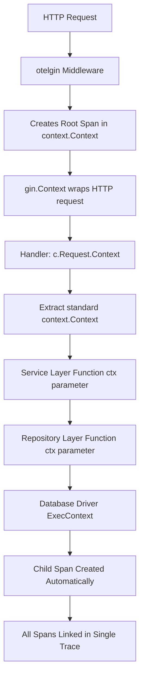

# How to Extract Go Context from gin.Context for OpenTelemetry Span Propagation

Author: [nawazdhandala](https://www.github.com/nawazdhandala)

Tags: OpenTelemetry, Go, Gin, Context, Span Propagation

Description: Master the technique of extracting Go's standard context from Gin's context to properly propagate OpenTelemetry spans across service boundaries and function calls.

When working with OpenTelemetry in Go Gin applications, understanding how to properly extract and use the standard Go context is fundamental to building effective distributed tracing. The Gin framework uses its own `gin.Context` type, which wraps the standard `context.Context` but adds HTTP-specific functionality. Getting this wrong can break span propagation, leading to disconnected traces that make debugging distributed systems nearly impossible.

## Why Context Extraction Matters

OpenTelemetry stores span information in Go's standard `context.Context`. When you make database calls, HTTP requests to other services, or any other instrumented operation, these functions expect a standard `context.Context` that contains the active span. If you pass the wrong context or create a new one, the trace chain breaks.

The Gin framework's `gin.Context` serves a different purpose than the standard library's context. It provides request and response handling methods, parameter extraction, and middleware chaining. However, it also embeds a standard `context.Context` that gets populated by OpenTelemetry middleware like otelgin.

## The Core Problem

Here's what goes wrong when developers don't extract context properly:

```go
// WRONG - Creates a new context, breaking the trace chain
func badHandler(c *gin.Context) {
    ctx := context.Background() // This loses all span information!
    result := database.Query(ctx, "SELECT * FROM users")
    c.JSON(200, result)
}

// WRONG - Uses gin.Context where standard context is needed
func alsoWrong(c *gin.Context) {
    // Most libraries expect context.Context, not gin.Context
    result := database.Query(c, "SELECT * FROM users") // Compilation error
}

// CORRECT - Extract the standard context from gin.Context
func correctHandler(c *gin.Context) {
    ctx := c.Request.Context() // Contains the active span
    result := database.Query(ctx, "SELECT * FROM users")
    c.JSON(200, result)
}
```

## Extracting Context the Right Way

The proper method to extract the standard context from a Gin context is through the `Request.Context()` method.

```go
import (
    "context"
    "net/http"

    "github.com/gin-gonic/gin"
)

// handleUserRequest demonstrates proper context extraction
// The extracted context contains the span created by otelgin middleware
func handleUserRequest(c *gin.Context) {
    // Extract standard context from the HTTP request
    // This context contains OpenTelemetry span information
    ctx := c.Request.Context()

    // Get user ID from route parameter
    userID := c.Param("id")

    // Pass the extracted context to business logic
    user, err := getUserFromDatabase(ctx, userID)
    if err != nil {
        c.JSON(http.StatusInternalServerError, gin.H{
            "error": "Failed to fetch user",
        })
        return
    }

    c.JSON(http.StatusOK, user)
}
```

## Propagating Context Through Multiple Layers

In real applications, requests often flow through multiple layers: handlers, services, repositories, and external clients. Each layer must receive and pass along the context.

```go
// Handler layer - extracts context from gin.Context
func createOrderHandler(c *gin.Context) {
    ctx := c.Request.Context()

    var order Order
    if err := c.ShouldBindJSON(&order); err != nil {
        c.JSON(http.StatusBadRequest, gin.H{"error": err.Error()})
        return
    }

    // Pass context to service layer
    result, err := orderService.CreateOrder(ctx, &order)
    if err != nil {
        c.JSON(http.StatusInternalServerError, gin.H{"error": err.Error()})
        return
    }

    c.JSON(http.StatusCreated, result)
}

// Service layer - receives context and passes it to repository
type OrderService struct {
    repo      OrderRepository
    inventory InventoryClient
}

func (s *OrderService) CreateOrder(ctx context.Context, order *Order) (*Order, error) {
    // Check inventory with context propagation
    available, err := s.inventory.CheckAvailability(ctx, order.ProductID)
    if err != nil {
        return nil, err
    }

    if !available {
        return nil, errors.New("product not available")
    }

    // Save to database with context propagation
    return s.repo.Save(ctx, order)
}

// Repository layer - uses context for database operations
type OrderRepository struct {
    db *sql.DB
}

func (r *OrderRepository) Save(ctx context.Context, order *Order) (*Order, error) {
    // The context propagates span information to the database driver
    query := "INSERT INTO orders (product_id, quantity) VALUES (?, ?)"
    result, err := r.db.ExecContext(ctx, query, order.ProductID, order.Quantity)
    if err != nil {
        return nil, err
    }

    // Additional database operations use the same context
    id, _ := result.LastInsertId()
    order.ID = id
    return order, nil
}
```

## Understanding the Context Flow

The following diagram illustrates how context flows through the application stack:



## Adding Custom Spans to Propagated Context

Sometimes you need to create additional spans within your business logic to track specific operations. You can do this by extracting the tracer and creating child spans.

```go
import (
    "go.opentelemetry.io/otel"
    "go.opentelemetry.io/otel/attribute"
    "go.opentelemetry.io/otel/codes"
    "go.opentelemetry.io/otel/trace"
)

// processPayment creates a custom child span for payment processing
func processPayment(ctx context.Context, orderID string, amount float64) error {
    // Get the global tracer
    tracer := otel.Tracer("order-service")

    // Create a child span using the context from the parent
    // The parent span information is extracted from ctx automatically
    ctx, span := tracer.Start(ctx, "processPayment",
        trace.WithAttributes(
            attribute.String("order.id", orderID),
            attribute.Float64("payment.amount", amount),
        ),
    )
    defer span.End()

    // Simulate payment processing
    err := chargePaymentGateway(ctx, amount)
    if err != nil {
        // Record error in span
        span.RecordError(err)
        span.SetStatus(codes.Error, "Payment failed")
        return err
    }

    span.SetStatus(codes.Ok, "Payment successful")
    return nil
}

// chargePaymentGateway makes an HTTP call to payment provider
func chargePaymentGateway(ctx context.Context, amount float64) error {
    // Create HTTP client with OpenTelemetry instrumentation
    client := &http.Client{
        Transport: otelhttp.NewTransport(http.DefaultTransport),
    }

    // Create request
    req, err := http.NewRequestWithContext(
        ctx, // Context contains span info that will be propagated via HTTP headers
        "POST",
        "https://payment-gateway.example.com/charge",
        nil,
    )
    if err != nil {
        return err
    }

    // Execute request - trace context automatically propagates
    resp, err := client.Do(req)
    if err != nil {
        return err
    }
    defer resp.Body.Close()

    if resp.StatusCode != http.StatusOK {
        return fmt.Errorf("payment failed with status: %d", resp.StatusCode)
    }

    return nil
}
```

## Context Extraction for Concurrent Operations

When you need to perform concurrent operations (like calling multiple microservices in parallel), proper context handling becomes even more important.

```go
import (
    "golang.org/x/sync/errgroup"
)

// fetchUserProfile makes parallel calls to multiple services
func fetchUserProfile(c *gin.Context) {
    ctx := c.Request.Context()
    userID := c.Param("id")

    // Create error group for concurrent operations
    g, ctx := errgroup.WithContext(ctx)

    var user *User
    var orders []*Order
    var recommendations []*Product

    // Each goroutine receives the context with span information
    g.Go(func() error {
        var err error
        user, err = userService.GetUser(ctx, userID)
        return err
    })

    g.Go(func() error {
        var err error
        orders, err = orderService.GetUserOrders(ctx, userID)
        return err
    })

    g.Go(func() error {
        var err error
        recommendations, err = recommendationService.GetRecommendations(ctx, userID)
        return err
    })

    // Wait for all goroutines to complete
    if err := g.Wait(); err != nil {
        c.JSON(http.StatusInternalServerError, gin.H{"error": err.Error()})
        return
    }

    // Combine results
    profile := UserProfile{
        User:            user,
        Orders:          orders,
        Recommendations: recommendations,
    }

    c.JSON(http.StatusOK, profile)
}
```

## Common Context Extraction Mistakes

Several patterns can break span propagation. Understanding these helps avoid subtle bugs.

```go
// MISTAKE 1: Creating a background context
func mistake1(c *gin.Context) {
    // This creates a new, empty context with no span information
    ctx := context.Background()
    database.Query(ctx, "SELECT * FROM users") // Orphaned span!
}

// MISTAKE 2: Using TODO context
func mistake2(c *gin.Context) {
    // TODO is meant for temporary code, not production use
    ctx := context.TODO()
    database.Query(ctx, "SELECT * FROM users") // Orphaned span!
}

// MISTAKE 3: Not passing context at all
func mistake3(c *gin.Context) {
    // Functions that need context should always receive it
    database.Query("SELECT * FROM users") // No tracing possible
}

// MISTAKE 4: Extracting context inside nested function
func mistake4(c *gin.Context) {
    // Correct: Extract once in handler
    ctx := c.Request.Context()

    // Don't do this in nested functions
    func() {
        // Wrong: Re-extracting context inside closure
        ctx := c.Request.Context()
        database.Query(ctx, "SELECT * FROM users")
    }()

    // Correct: Use the already-extracted context
    func() {
        database.Query(ctx, "SELECT * FROM users")
    }()
}
```

## Context Extraction with Middleware Chain

When you have multiple middleware functions, each one can extract and enhance the context.

```go
// authMiddleware extracts context and adds user info
func authMiddleware() gin.HandlerFunc {
    return func(c *gin.Context) {
        // Extract the current context
        ctx := c.Request.Context()

        // Get authorization token
        token := c.GetHeader("Authorization")
        if token == "" {
            c.AbortWithStatusJSON(http.StatusUnauthorized, gin.H{
                "error": "Missing authorization",
            })
            return
        }

        // Validate token and extract user ID
        userID, err := validateToken(ctx, token)
        if err != nil {
            c.AbortWithStatusJSON(http.StatusUnauthorized, gin.H{
                "error": "Invalid token",
            })
            return
        }

        // Add user ID to context for downstream handlers
        ctx = context.WithValue(ctx, "userID", userID)

        // Update the request with the enriched context
        c.Request = c.Request.WithContext(ctx)

        c.Next()
    }
}

// Handler can now extract context with user info
func protectedHandler(c *gin.Context) {
    ctx := c.Request.Context()

    // Extract user ID that was added by middleware
    userID, ok := ctx.Value("userID").(string)
    if !ok {
        c.JSON(http.StatusInternalServerError, gin.H{
            "error": "User ID not found in context",
        })
        return
    }

    // Use the context for further operations
    data, err := fetchUserData(ctx, userID)
    if err != nil {
        c.JSON(http.StatusInternalServerError, gin.H{
            "error": err.Error(),
        })
        return
    }

    c.JSON(http.StatusOK, data)
}
```

## Testing Context Propagation

When writing tests for your handlers, you need to ensure context propagation works correctly.

```go
import (
    "net/http/httptest"
    "testing"

    "github.com/gin-gonic/gin"
    "github.com/stretchr/testify/assert"
    "go.opentelemetry.io/otel"
    sdktrace "go.opentelemetry.io/otel/sdk/trace"
)

func TestContextPropagation(t *testing.T) {
    // Set up in-memory span exporter for testing
    exporter := &inMemoryExporter{}
    tp := sdktrace.NewTracerProvider(
        sdktrace.WithSyncer(exporter),
    )
    otel.SetTracerProvider(tp)

    // Create Gin router with otelgin middleware
    router := gin.New()
    router.Use(otelgin.Middleware("test-service"))

    router.GET("/users/:id", func(c *gin.Context) {
        ctx := c.Request.Context()

        // This should create a child span
        tracer := otel.Tracer("test")
        _, span := tracer.Start(ctx, "database-query")
        defer span.End()

        c.JSON(200, gin.H{"id": c.Param("id")})
    })

    // Make test request
    w := httptest.NewRecorder()
    req := httptest.NewRequest("GET", "/users/123", nil)
    router.ServeHTTP(w, req)

    assert.Equal(t, 200, w.Code)

    // Verify spans were created and linked
    spans := exporter.GetSpans()
    assert.Equal(t, 2, len(spans)) // HTTP span + database span

    // Verify parent-child relationship
    httpSpan := spans[0]
    dbSpan := spans[1]
    assert.Equal(t, httpSpan.SpanContext().TraceID(), dbSpan.SpanContext().TraceID())
}
```

## Best Practices for Context Extraction

Following these guidelines ensures reliable span propagation throughout your application:

**Extract Once**: Extract the context once at the beginning of your handler and pass it down through all layers.

**Never Create New Contexts**: Avoid `context.Background()` or `context.TODO()` in request handlers. Always use the extracted context.

**Pass Context First**: By Go convention, context should be the first parameter of any function that needs it.

**Don't Store Context**: Never store context in structs. Always pass it explicitly through function parameters.

**Check Context Cancellation**: Long-running operations should check `ctx.Done()` to respect cancellation.

## Complete Working Example

Here's a comprehensive example showing proper context extraction across all layers:

```go
package main

import (
    "context"
    "database/sql"
    "net/http"

    "github.com/gin-gonic/gin"
    "go.opentelemetry.io/contrib/instrumentation/github.com/gin-gonic/gin/otelgin"
    "go.opentelemetry.io/otel"
)

type Product struct {
    ID    int64   `json:"id"`
    Name  string  `json:"name"`
    Price float64 `json:"price"`
}

type ProductService struct {
    repo *ProductRepository
}

func (s *ProductService) GetProduct(ctx context.Context, id string) (*Product, error) {
    // Service layer receives context and passes to repository
    return s.repo.FindByID(ctx, id)
}

type ProductRepository struct {
    db *sql.DB
}

func (r *ProductRepository) FindByID(ctx context.Context, id string) (*Product, error) {
    // Repository uses context for database operations
    query := "SELECT id, name, price FROM products WHERE id = ?"

    var product Product
    err := r.db.QueryRowContext(ctx, query, id).Scan(
        &product.ID,
        &product.Name,
        &product.Price,
    )
    if err != nil {
        return nil, err
    }

    return &product, nil
}

func main() {
    router := gin.Default()
    router.Use(otelgin.Middleware("product-service"))

    productService := &ProductService{
        repo: &ProductRepository{db: initDB()},
    }

    // Handler extracts context and passes to service
    router.GET("/products/:id", func(c *gin.Context) {
        // Extract context from gin.Context
        ctx := c.Request.Context()
        id := c.Param("id")

        // Pass extracted context to service layer
        product, err := productService.GetProduct(ctx, id)
        if err != nil {
            c.JSON(http.StatusNotFound, gin.H{
                "error": "Product not found",
            })
            return
        }

        c.JSON(http.StatusOK, product)
    })

    router.Run(":8080")
}

func initDB() *sql.DB {
    // Initialize database connection
    // In production, use an instrumented driver
    return nil
}
```

Proper context extraction is the foundation of distributed tracing in Go applications. By consistently extracting context from `gin.Context` and passing it through all layers of your application, you ensure that spans remain connected, providing complete visibility into request flow across your entire system.
