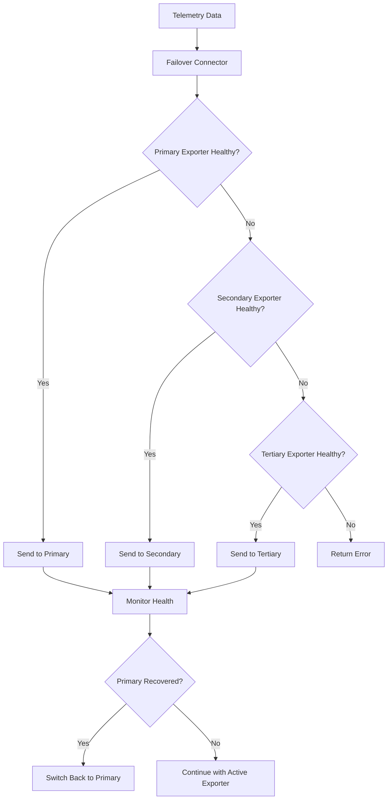

# How to Configure the Failover Connector in the OpenTelemetry Collector

Author: [nawazdhandala](https://www.github.com/nawazdhandala)

Tags: OpenTelemetry, Collector, Connectors, Failover, High Availability, Reliability

Description: Implement robust failover strategies in OpenTelemetry Collector using the Failover Connector to ensure continuous telemetry collection even when primary backends become unavailable.

The Failover Connector in the OpenTelemetry Collector provides automatic failover capabilities for your observability pipeline. When a primary exporter fails, the Failover Connector automatically routes telemetry data to backup exporters, ensuring continuous data collection even during outages or maintenance windows.

## Understanding the Failover Connector

Modern observability systems must handle backend failures gracefully. Network issues, backend maintenance, or overload conditions can cause exporters to fail. Without proper failover mechanisms, these failures result in data loss and observability gaps.

The Failover Connector addresses this by implementing a priority-based failover system. It maintains a list of exporters ordered by preference, continuously monitors their health, and automatically switches to backup exporters when the primary fails.

## How Failover Works

The Failover Connector operates using a priority queue of exporters:



The connector continuously monitors exporter health and automatically recovers to higher-priority exporters when they become available again.

## Basic Configuration

Here's a simple failover configuration with primary and backup exporters:

```yaml
# Define exporters with different priorities
exporters:
  # Primary exporter - preferred destination
  otlp/primary:
    endpoint: primary-backend:4317
    timeout: 10s

  # Secondary exporter - first backup
  otlp/secondary:
    endpoint: secondary-backend:4317
    timeout: 10s

  # Tertiary exporter - second backup (local storage)
  file:
    path: /var/log/otel/failover-data.json

connectors:
  failover:
    # List of exporters in priority order
    # The connector tries each in sequence until one succeeds
    pipelines:
      traces:
        - [otlp/primary]
        - [otlp/secondary]
        - [file]

      metrics:
        - [otlp/primary]
        - [otlp/secondary]
        - [file]

      logs:
        - [otlp/primary]
        - [otlp/secondary]
        - [file]

receivers:
  otlp:
    protocols:
      grpc:
        endpoint: 0.0.0.0:4317

processors:
  batch:
    timeout: 10s

service:
  pipelines:
    traces:
      receivers: [otlp]
      processors: [batch]
      # Use failover connector instead of direct exporters
      exporters: [failover]

    metrics:
      receivers: [otlp]
      processors: [batch]
      exporters: [failover]

    logs:
      receivers: [otlp]
      processors: [batch]
      exporters: [failover]
```

This configuration attempts to send data to the primary backend first. If that fails, it tries the secondary backend, and finally falls back to local file storage.

## Advanced Failover Strategies

Configure different failover strategies for different telemetry types based on their criticality and volume:

```yaml
exporters:
  # Production backends
  otlp/prod-primary:
    endpoint: prod-primary.example.com:4317
    timeout: 5s
    retry_on_failure:
      enabled: false  # Failover handles retries

  otlp/prod-secondary:
    endpoint: prod-secondary.example.com:4317
    timeout: 5s
    retry_on_failure:
      enabled: false

  # Staging backend as tertiary failover
  otlp/staging:
    endpoint: staging.example.com:4317
    timeout: 10s

  # Local file storage as last resort
  file/traces:
    path: /var/log/otel/traces-failover.json
    rotation:
      max_megabytes: 100
      max_backups: 10

  file/metrics:
    path: /var/log/otel/metrics-failover.json
    rotation:
      max_megabytes: 50
      max_backups: 5

  file/logs:
    path: /var/log/otel/logs-failover.json
    rotation:
      max_megabytes: 100
      max_backups: 10

connectors:
  failover:
    pipelines:
      # Traces: Prioritize reliability
      traces:
        - [otlp/prod-primary]
        - [otlp/prod-secondary]
        - [otlp/staging]
        - [file/traces]

      # Metrics: Similar strategy but different file
      metrics:
        - [otlp/prod-primary]
        - [otlp/prod-secondary]
        - [file/metrics]

      # Logs: May tolerate more data loss
      logs:
        - [otlp/prod-primary]
        - [otlp/prod-secondary]
        - [file/logs]

    # Retry interval before switching back to higher priority exporter
    retry_interval: 60s

    # Gap between retry attempts
    retry_gap: 10s

    # Maximum number of retries before failover
    max_retries: 3

receivers:
  otlp:
    protocols:
      grpc:
        endpoint: 0.0.0.0:4317
      http:
        endpoint: 0.0.0.0:4318

processors:
  batch:
    timeout: 10s
    send_batch_size: 1024

  memory_limiter:
    check_interval: 1s
    limit_mib: 512

service:
  pipelines:
    traces:
      receivers: [otlp]
      processors: [memory_limiter, batch]
      exporters: [failover]

    metrics:
      receivers: [otlp]
      processors: [memory_limiter, batch]
      exporters: [failover]

    logs:
      receivers: [otlp]
      processors: [memory_limiter, batch]
      exporters: [failover]
```

## Multi-Region Failover

Implement geographic redundancy by failing over between regional backends:

```yaml
exporters:
  # Primary region (us-east-1)
  otlp/us-east:
    endpoint: otel.us-east-1.example.com:4317
    timeout: 5s

  # Secondary region (us-west-2)
  otlp/us-west:
    endpoint: otel.us-west-2.example.com:4317
    timeout: 5s

  # Tertiary region (eu-west-1)
  otlp/eu-west:
    endpoint: otel.eu-west-1.example.com:4317
    timeout: 10s  # Higher latency expected

  # Local buffer for complete regional outages
  file/local:
    path: /var/log/otel/regional-failover.json
    rotation:
      max_megabytes: 500
      max_backups: 20

connectors:
  failover:
    pipelines:
      traces:
        # Try local region first, then nearest regions, finally local storage
        - [otlp/us-east]
        - [otlp/us-west]
        - [otlp/eu-west]
        - [file/local]

      metrics:
        - [otlp/us-east]
        - [otlp/us-west]
        - [otlp/eu-west]
        - [file/local]

      logs:
        - [otlp/us-east]
        - [otlp/us-west]
        - [file/local]

    # Check primary region availability every minute
    retry_interval: 60s
    retry_gap: 10s
    max_retries: 2

processors:
  # Add region metadata
  resource/region:
    attributes:
      - key: collector.region
        value: us-east-1
        action: upsert
      - key: failover.enabled
        value: "true"
        action: upsert

receivers:
  otlp:
    protocols:
      grpc:
        endpoint: 0.0.0.0:4317

service:
  pipelines:
    traces:
      receivers: [otlp]
      processors: [resource/region, batch]
      exporters: [failover]

    metrics:
      receivers: [otlp]
      processors: [resource/region, batch]
      exporters: [failover]

    logs:
      receivers: [otlp]
      processors: [resource/region, batch]
      exporters: [failover]
```

## Combining Failover with Load Balancing

For high-throughput environments, combine failover with load balancing at each tier:

```yaml
exporters:
  # Primary tier - load balanced across multiple endpoints
  loadbalancing/primary:
    protocol:
      otlp:
        timeout: 5s
    resolver:
      static:
        hostnames:
          - primary-backend-1.example.com:4317
          - primary-backend-2.example.com:4317
          - primary-backend-3.example.com:4317

  # Secondary tier - load balanced backups
  loadbalancing/secondary:
    protocol:
      otlp:
        timeout: 5s
    resolver:
      static:
        hostnames:
          - secondary-backend-1.example.com:4317
          - secondary-backend-2.example.com:4317

  # Tertiary - single backup endpoint
  otlp/backup:
    endpoint: backup.example.com:4317
    timeout: 10s

  # Final fallback - local storage
  file:
    path: /var/log/otel/ultimate-failover.json

connectors:
  failover:
    pipelines:
      traces:
        # Each tier can be load balanced internally
        - [loadbalancing/primary]
        - [loadbalancing/secondary]
        - [otlp/backup]
        - [file]

      metrics:
        - [loadbalancing/primary]
        - [loadbalancing/secondary]
        - [otlp/backup]
        - [file]

    retry_interval: 30s
    retry_gap: 5s
    max_retries: 3

receivers:
  otlp:
    protocols:
      grpc:
        endpoint: 0.0.0.0:4317

processors:
  batch:
    timeout: 10s
    send_batch_size: 2048
    send_batch_max_size: 4096

service:
  pipelines:
    traces:
      receivers: [otlp]
      processors: [batch]
      exporters: [failover]

    metrics:
      receivers: [otlp]
      processors: [batch]
      exporters: [failover]
```

## Handling Partial Failures

Configure the Failover Connector to handle scenarios where some telemetry types fail while others succeed:

```yaml
exporters:
  # Backend that accepts traces and logs
  otlp/traces-logs:
    endpoint: traces-logs-backend.example.com:4317

  # Backend that accepts metrics
  otlp/metrics:
    endpoint: metrics-backend.example.com:4317

  # Backup for traces and logs
  otlp/traces-logs-backup:
    endpoint: backup.example.com:4317

  # Backup for metrics
  otlp/metrics-backup:
    endpoint: metrics-backup.example.com:4317

  # Local storage fallbacks
  file/traces:
    path: /var/log/otel/traces.json
  file/metrics:
    path: /var/log/otel/metrics.json
  file/logs:
    path: /var/log/otel/logs.json

connectors:
  # Separate failover connectors for different telemetry types
  failover/traces:
    pipelines:
      traces:
        - [otlp/traces-logs]
        - [otlp/traces-logs-backup]
        - [file/traces]
    retry_interval: 30s

  failover/metrics:
    pipelines:
      metrics:
        - [otlp/metrics]
        - [otlp/metrics-backup]
        - [file/metrics]
    retry_interval: 30s

  failover/logs:
    pipelines:
      logs:
        - [otlp/traces-logs]
        - [otlp/traces-logs-backup]
        - [file/logs]
    retry_interval: 30s

receivers:
  otlp:
    protocols:
      grpc:
        endpoint: 0.0.0.0:4317

processors:
  batch:
    timeout: 10s

service:
  pipelines:
    traces:
      receivers: [otlp]
      processors: [batch]
      exporters: [failover/traces]

    metrics:
      receivers: [otlp]
      processors: [batch]
      exporters: [failover/metrics]

    logs:
      receivers: [otlp]
      processors: [batch]
      exporters: [failover/logs]
```

## Monitoring Failover Health

Track failover events and exporter health to understand system reliability:

```yaml
service:
  # Enable telemetry to monitor the collector itself
  telemetry:
    logs:
      level: info
      # Log failover events
      initial_fields:
        service: otel-collector

    metrics:
      level: detailed
      address: 0.0.0.0:8888
      # Expose metrics about failover behavior

exporters:
  # Send collector's own telemetry to monitoring
  prometheus:
    endpoint: 0.0.0.0:8889

  # Log failover events
  logging:
    verbosity: detailed
    sampling_initial: 5
    sampling_thereafter: 200

connectors:
  failover:
    pipelines:
      traces:
        - [otlp/primary]
        - [otlp/secondary]
        - [file]
      metrics:
        - [otlp/primary]
        - [otlp/secondary]
        - [file]
      logs:
        - [otlp/primary]
        - [otlp/secondary]
        - [file]

    retry_interval: 60s
    retry_gap: 10s
    max_retries: 3

receivers:
  otlp:
    protocols:
      grpc:
        endpoint: 0.0.0.0:4317

  # Receive internal metrics for self-monitoring
  prometheus:
    config:
      scrape_configs:
        - job_name: 'otel-collector'
          scrape_interval: 10s
          static_configs:
            - targets: ['localhost:8888']

processors:
  batch:
    timeout: 10s

service:
  pipelines:
    traces:
      receivers: [otlp]
      processors: [batch]
      exporters: [failover]

    # Pipeline for collector's own metrics
    metrics/internal:
      receivers: [prometheus]
      processors: [batch]
      exporters: [prometheus]
```

Key metrics to monitor:
- `otelcol_exporter_send_failed_spans`: Failed span exports per exporter
- `otelcol_exporter_send_failed_metric_points`: Failed metric exports
- `otelcol_exporter_send_failed_log_records`: Failed log exports
- `otelcol_connector_refused_spans`: Data refused by connector

## Production-Ready Configuration

Here's a comprehensive production configuration with multiple failover tiers:

```yaml
receivers:
  otlp:
    protocols:
      grpc:
        endpoint: 0.0.0.0:4317
        max_recv_msg_size_mib: 16
      http:
        endpoint: 0.0.0.0:4318

processors:
  memory_limiter:
    check_interval: 1s
    limit_mib: 1024
    spike_limit_mib: 256

  batch:
    timeout: 10s
    send_batch_size: 1024
    send_batch_max_size: 2048

  resource/failover:
    attributes:
      - key: collector.failover.enabled
        value: "true"
        action: upsert
      - key: collector.instance.id
        value: ${COLLECTOR_INSTANCE_ID}
        action: upsert

exporters:
  # Tier 1: Primary production backends
  otlp/prod-primary-1:
    endpoint: ${PRIMARY_BACKEND_1}
    timeout: 5s
    compression: gzip
    retry_on_failure:
      enabled: false  # Failover handles retries

  otlp/prod-primary-2:
    endpoint: ${PRIMARY_BACKEND_2}
    timeout: 5s
    compression: gzip
    retry_on_failure:
      enabled: false

  # Tier 2: Secondary production backends
  otlp/prod-secondary-1:
    endpoint: ${SECONDARY_BACKEND_1}
    timeout: 5s
    compression: gzip
    retry_on_failure:
      enabled: false

  otlp/prod-secondary-2:
    endpoint: ${SECONDARY_BACKEND_2}
    timeout: 5s
    compression: gzip
    retry_on_failure:
      enabled: false

  # Tier 3: Staging environment (emergency fallback)
  otlp/staging:
    endpoint: ${STAGING_BACKEND}
    timeout: 10s
    compression: gzip

  # Tier 4: Local persistent storage
  file/traces:
    path: /var/log/otel/failover/traces.json
    rotation:
      max_megabytes: 200
      max_backups: 30

  file/metrics:
    path: /var/log/otel/failover/metrics.json
    rotation:
      max_megabytes: 100
      max_backups: 20

  file/logs:
    path: /var/log/otel/failover/logs.json
    rotation:
      max_megabytes: 200
      max_backups: 30

  # Monitoring
  prometheus:
    endpoint: 0.0.0.0:8889

connectors:
  failover:
    pipelines:
      traces:
        # Try primary backends in parallel (load balanced)
        - [otlp/prod-primary-1, otlp/prod-primary-2]
        # Then try secondary backends
        - [otlp/prod-secondary-1, otlp/prod-secondary-2]
        # Emergency fallback to staging
        - [otlp/staging]
        # Final fallback to local storage
        - [file/traces]

      metrics:
        - [otlp/prod-primary-1, otlp/prod-primary-2]
        - [otlp/prod-secondary-1, otlp/prod-secondary-2]
        - [file/metrics]

      logs:
        - [otlp/prod-primary-1, otlp/prod-primary-2]
        - [otlp/prod-secondary-1, otlp/prod-secondary-2]
        - [otlp/staging]
        - [file/logs]

    # Recovery settings
    retry_interval: 60s  # Check primary every 60 seconds
    retry_gap: 10s       # Wait 10 seconds between retries
    max_retries: 3       # Try 3 times before failover

service:
  telemetry:
    logs:
      level: ${LOG_LEVEL:-info}
      encoding: json

    metrics:
      level: detailed
      address: 0.0.0.0:8888

  pipelines:
    traces:
      receivers: [otlp]
      processors: [memory_limiter, resource/failover, batch]
      exporters: [failover]

    metrics:
      receivers: [otlp]
      processors: [memory_limiter, resource/failover, batch]
      exporters: [failover]

    logs:
      receivers: [otlp]
      processors: [memory_limiter, resource/failover, batch]
      exporters: [failover]

  extensions: []
```

## Integration with Other Connectors

The Failover Connector works seamlessly with other OpenTelemetry connectors. Combine it with the Routing Connector at https://oneuptime.com/blog/post/2026-02-06-routing-connector-opentelemetry-collector/view for advanced traffic management, or use it alongside the Service Graph Connector at https://oneuptime.com/blog/post/2026-02-06-service-graph-connector-opentelemetry-collector/view to ensure service topology data remains available during outages.

## Best Practices

1. **Order Exporters by Preference**: Place your most preferred exporters first in the failover list.

2. **Use Local Storage as Final Fallback**: Always include a file exporter as the last resort to prevent data loss.

3. **Configure Appropriate Timeouts**: Set shorter timeouts on primary exporters to fail over quickly.

4. **Monitor Failover Events**: Track which exporters are being used to identify reliability issues.

5. **Test Failover Scenarios**: Regularly test failover behavior by simulating backend failures.

6. **Balance Retry Intervals**: Set retry intervals long enough to avoid overwhelming recovering backends, but short enough to restore normal operation quickly.

7. **Consider Data Volume**: Ensure local storage has sufficient capacity for your telemetry volume during extended outages.

8. **Disable Exporter Retries**: Let the Failover Connector handle retries rather than individual exporters to avoid double retry logic.

## Conclusion

The Failover Connector is essential for building resilient observability pipelines. By automatically routing telemetry data to healthy backends, it ensures continuous data collection even during infrastructure failures or maintenance windows.

Start with a simple primary-backup configuration and progressively add more sophisticated failover tiers as your reliability requirements grow. The combination of automatic health monitoring, priority-based routing, and seamless recovery makes the Failover Connector a critical component in production OpenTelemetry deployments.
