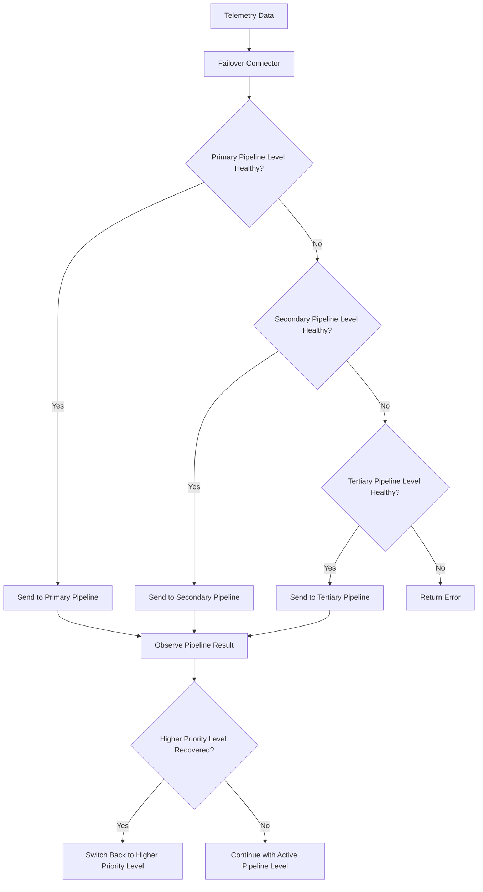

# How to Configure the Failover Connector in the OpenTelemetry Collector

Author: [nawazdhandala](https://www.github.com/nawazdhandala)

Tags: OpenTelemetry, Collector, Connector, Failover, High Availability, Reliability

Description: Implement robust failover strategies in OpenTelemetry Collector using the Failover Connector to ensure continuous telemetry collection even when primary backends become unavailable.

The Failover Connector in the OpenTelemetry Collector provides health-based routing capabilities for your observability pipeline. When a downstream pipeline returns an error, the Failover Connector routes telemetry data to a lower-priority pipeline, helping reduce data loss during backend outages or maintenance windows.

## Understanding the Failover Connector

Modern observability systems must handle backend failures gracefully. Network issues, backend maintenance, or overload conditions can cause exporters to fail. Without proper failover mechanisms, these failures result in data loss and observability gaps.

The Failover Connector addresses this by implementing a priority-based failover system. It maintains a list of downstream pipelines ordered by preference and switches to lower-priority pipelines when the current priority level fails. The connector supports traces-to-traces, metrics-to-metrics, and logs-to-logs pipelines and is currently an alpha component in the contrib and k8s Collector distributions.

## How Failover Works

The Failover Connector operates using priority levels of downstream pipelines:


```mermaid
graph TB
    A[Telemetry Data] --> B[Failover Connector]
    B --> C{Primary Pipeline Level Healthy?}
    C -->|Yes| D[Send to Primary Pipeline]
    C -->|No| E{Secondary Pipeline Level Healthy?}
    E -->|Yes| F[Send to Secondary Pipeline]
    E -->|No| G{Tertiary Pipeline Level Healthy?}
    G -->|Yes| H[Send to Tertiary Pipeline]
    G -->|No| I[Return Error]
    D --> J[Observe Pipeline Result]
    F --> J
    H --> J
    J --> K{Higher Priority Level Recovered?}
    K -->|Yes| L[Switch Back to Higher Priority Level]
    K -->|No| M[Continue with Active Pipeline Level]
```

If any pipeline at the active priority level fails, that level is considered unhealthy and the connector moves to the next priority level. The connector periodically tries to reestablish a stable connection with higher-priority levels based on `retry_interval`.

## Basic Configuration

Here's a simple failover configuration with primary and backup exporters:

```yaml
exporters:
  # Primary exporter - preferred destination
  otlp/primary:
    endpoint: primary-backend:4317
    timeout: 10s

  # Secondary exporter - first backup
  otlp/secondary:
    endpoint: secondary-backend:4317
    timeout: 10s

  # Tertiary exporter - second backup (local storage)
  file:
    path: /var/log/otel/failover-data.json

connectors:
  failover/traces:
    priority_levels:
      - [traces/primary]
      - [traces/secondary]
      - [traces/file]
    retry_interval: 60s

  failover/metrics:
    priority_levels:
      - [metrics/primary]
      - [metrics/secondary]
      - [metrics/file]
    retry_interval: 60s

  failover/logs:
    priority_levels:
      - [logs/primary]
      - [logs/secondary]
      - [logs/file]
    retry_interval: 60s

receivers:
  otlp:
    protocols:
      grpc:
        endpoint: 0.0.0.0:4317

processors:
  batch:
    timeout: 10s

service:
  pipelines:
    traces:
      receivers: [otlp]
      processors: [batch]
      exporters: [failover/traces]
    traces/primary:
      receivers: [failover/traces]
      exporters: [otlp/primary]
    traces/secondary:
      receivers: [failover/traces]
      exporters: [otlp/secondary]
    traces/file:
      receivers: [failover/traces]
      exporters: [file]

    metrics:
      receivers: [otlp]
      processors: [batch]
      exporters: [failover/metrics]
    metrics/primary:
      receivers: [failover/metrics]
      exporters: [otlp/primary]
    metrics/secondary:
      receivers: [failover/metrics]
      exporters: [otlp/secondary]
    metrics/file:
      receivers: [failover/metrics]
      exporters: [file]

    logs:
      receivers: [otlp]
      processors: [batch]
      exporters: [failover/logs]
    logs/primary:
      receivers: [failover/logs]
      exporters: [otlp/primary]
    logs/secondary:
      receivers: [failover/logs]
      exporters: [otlp/secondary]
    logs/file:
      receivers: [failover/logs]
      exporters: [file]
```

This configuration attempts to send data to the primary backend first. If the primary pipeline fails, it tries the secondary pipeline, and finally falls back to local file storage.

## Advanced Failover Strategies

Configure different failover strategies for different telemetry types based on their criticality and volume:

```yaml
exporters:
  otlp/prod-primary:
    endpoint: prod-primary.example.com:4317
    timeout: 5s
    retry_on_failure:
      enabled: false

  otlp/prod-secondary:
    endpoint: prod-secondary.example.com:4317
    timeout: 5s
    retry_on_failure:
      enabled: false

  otlp/staging:
    endpoint: staging.example.com:4317
    timeout: 10s

  file/traces:
    path: /var/log/otel/traces-failover.json
    rotation:
      max_megabytes: 100
      max_backups: 10

  file/metrics:
    path: /var/log/otel/metrics-failover.json
    rotation:
      max_megabytes: 50
      max_backups: 5

  file/logs:
    path: /var/log/otel/logs-failover.json
    rotation:
      max_megabytes: 100
      max_backups: 10

connectors:
  failover/traces:
    priority_levels:
      - [traces/prod-primary]
      - [traces/prod-secondary]
      - [traces/staging]
      - [traces/file]
    retry_interval: 60s

  failover/metrics:
    priority_levels:
      - [metrics/prod-primary]
      - [metrics/prod-secondary]
      - [metrics/file]
    retry_interval: 60s

  failover/logs:
    priority_levels:
      - [logs/prod-primary]
      - [logs/prod-secondary]
      - [logs/file]
    retry_interval: 60s

receivers:
  otlp:
    protocols:
      grpc:
        endpoint: 0.0.0.0:4317
      http:
        endpoint: 0.0.0.0:4318

processors:
  batch:
    timeout: 10s
    send_batch_size: 1024

  memory_limiter:
    check_interval: 1s
    limit_mib: 512

service:
  pipelines:
    traces:
      receivers: [otlp]
      processors: [memory_limiter, batch]
      exporters: [failover/traces]
    traces/prod-primary:
      receivers: [failover/traces]
      exporters: [otlp/prod-primary]
    traces/prod-secondary:
      receivers: [failover/traces]
      exporters: [otlp/prod-secondary]
    traces/staging:
      receivers: [failover/traces]
      exporters: [otlp/staging]
    traces/file:
      receivers: [failover/traces]
      exporters: [file/traces]

    metrics:
      receivers: [otlp]
      processors: [memory_limiter, batch]
      exporters: [failover/metrics]
    metrics/prod-primary:
      receivers: [failover/metrics]
      exporters: [otlp/prod-primary]
    metrics/prod-secondary:
      receivers: [failover/metrics]
      exporters: [otlp/prod-secondary]
    metrics/file:
      receivers: [failover/metrics]
      exporters: [file/metrics]

    logs:
      receivers: [otlp]
      processors: [memory_limiter, batch]
      exporters: [failover/logs]
    logs/prod-primary:
      receivers: [failover/logs]
      exporters: [otlp/prod-primary]
    logs/prod-secondary:
      receivers: [failover/logs]
      exporters: [otlp/prod-secondary]
    logs/file:
      receivers: [failover/logs]
      exporters: [file/logs]
```

## Multi-Region Failover

Implement geographic redundancy by failing over between regional backends:

```yaml
exporters:
  otlp/us-east:
    endpoint: otel.us-east-1.example.com:4317
    timeout: 5s

  otlp/us-west:
    endpoint: otel.us-west-2.example.com:4317
    timeout: 5s

  otlp/eu-west:
    endpoint: otel.eu-west-1.example.com:4317
    timeout: 10s

  file/local:
    path: /var/log/otel/regional-failover.json
    rotation:
      max_megabytes: 500
      max_backups: 20

connectors:
  failover/traces:
    priority_levels:
      - [traces/us-east]
      - [traces/us-west]
      - [traces/eu-west]
      - [traces/file]
    retry_interval: 60s

  failover/metrics:
    priority_levels:
      - [metrics/us-east]
      - [metrics/us-west]
      - [metrics/eu-west]
      - [metrics/file]
    retry_interval: 60s

  failover/logs:
    priority_levels:
      - [logs/us-east]
      - [logs/us-west]
      - [logs/file]
    retry_interval: 60s

processors:
  resource/region:
    attributes:
      - key: collector.region
        value: us-east-1
        action: upsert
      - key: failover.enabled
        value: "true"
        action: upsert

  batch:

receivers:
  otlp:
    protocols:
      grpc:
        endpoint: 0.0.0.0:4317

service:
  pipelines:
    traces:
      receivers: [otlp]
      processors: [resource/region, batch]
      exporters: [failover/traces]
    traces/us-east:
      receivers: [failover/traces]
      exporters: [otlp/us-east]
    traces/us-west:
      receivers: [failover/traces]
      exporters: [otlp/us-west]
    traces/eu-west:
      receivers: [failover/traces]
      exporters: [otlp/eu-west]
    traces/file:
      receivers: [failover/traces]
      exporters: [file/local]

    metrics:
      receivers: [otlp]
      processors: [resource/region, batch]
      exporters: [failover/metrics]
    metrics/us-east:
      receivers: [failover/metrics]
      exporters: [otlp/us-east]
    metrics/us-west:
      receivers: [failover/metrics]
      exporters: [otlp/us-west]
    metrics/eu-west:
      receivers: [failover/metrics]
      exporters: [otlp/eu-west]
    metrics/file:
      receivers: [failover/metrics]
      exporters: [file/local]

    logs:
      receivers: [otlp]
      processors: [resource/region, batch]
      exporters: [failover/logs]
    logs/us-east:
      receivers: [failover/logs]
      exporters: [otlp/us-east]
    logs/us-west:
      receivers: [failover/logs]
      exporters: [otlp/us-west]
    logs/file:
      receivers: [failover/logs]
      exporters: [file/local]
```

## Combining Failover with Load Balancing

For high-throughput environments, combine failover with load balancing at each tier:

```yaml
exporters:
  load_balancing/primary:
    protocol:
      otlp:
        timeout: 5s
    resolver:
      static:
        hostnames:
          - primary-backend-1.example.com:4317
          - primary-backend-2.example.com:4317
          - primary-backend-3.example.com:4317

  load_balancing/secondary:
    protocol:
      otlp:
        timeout: 5s
    resolver:
      static:
        hostnames:
          - secondary-backend-1.example.com:4317
          - secondary-backend-2.example.com:4317

  otlp/backup:
    endpoint: backup.example.com:4317
    timeout: 10s

  file:
    path: /var/log/otel/ultimate-failover.json

connectors:
  failover/traces:
    priority_levels:
      - [traces/primary]
      - [traces/secondary]
      - [traces/backup]
      - [traces/file]
    retry_interval: 30s

  failover/metrics:
    priority_levels:
      - [metrics/primary]
      - [metrics/secondary]
      - [metrics/backup]
      - [metrics/file]
    retry_interval: 30s

receivers:
  otlp:
    protocols:
      grpc:
        endpoint: 0.0.0.0:4317

processors:
  batch:
    timeout: 10s
    send_batch_size: 2048
    send_batch_max_size: 4096

service:
  pipelines:
    traces:
      receivers: [otlp]
      processors: [batch]
      exporters: [failover/traces]
    traces/primary:
      receivers: [failover/traces]
      exporters: [load_balancing/primary]
    traces/secondary:
      receivers: [failover/traces]
      exporters: [load_balancing/secondary]
    traces/backup:
      receivers: [failover/traces]
      exporters: [otlp/backup]
    traces/file:
      receivers: [failover/traces]
      exporters: [file]

    metrics:
      receivers: [otlp]
      processors: [batch]
      exporters: [failover/metrics]
    metrics/primary:
      receivers: [failover/metrics]
      exporters: [load_balancing/primary]
    metrics/secondary:
      receivers: [failover/metrics]
      exporters: [load_balancing/secondary]
    metrics/backup:
      receivers: [failover/metrics]
      exporters: [otlp/backup]
    metrics/file:
      receivers: [failover/metrics]
      exporters: [file]
```

## Handling Partial Failures

Configure the Failover Connector to handle scenarios where some telemetry types fail while others succeed:

```yaml
exporters:
  otlp/traces-logs:
    endpoint: traces-logs-backend.example.com:4317

  otlp/metrics:
    endpoint: metrics-backend.example.com:4317

  otlp/traces-logs-backup:
    endpoint: backup.example.com:4317

  otlp/metrics-backup:
    endpoint: metrics-backup.example.com:4317

  file/traces:
    path: /var/log/otel/traces.json
  file/metrics:
    path: /var/log/otel/metrics.json
  file/logs:
    path: /var/log/otel/logs.json

connectors:
  failover/traces:
    priority_levels:
      - [traces/traces-logs]
      - [traces/backup]
      - [traces/file]
    retry_interval: 30s

  failover/metrics:
    priority_levels:
      - [metrics/primary]
      - [metrics/backup]
      - [metrics/file]
    retry_interval: 30s

  failover/logs:
    priority_levels:
      - [logs/traces-logs]
      - [logs/backup]
      - [logs/file]
    retry_interval: 30s

receivers:
  otlp:
    protocols:
      grpc:
        endpoint: 0.0.0.0:4317

processors:
  batch:
    timeout: 10s

service:
  pipelines:
    traces:
      receivers: [otlp]
      processors: [batch]
      exporters: [failover/traces]
    traces/traces-logs:
      receivers: [failover/traces]
      exporters: [otlp/traces-logs]
    traces/backup:
      receivers: [failover/traces]
      exporters: [otlp/traces-logs-backup]
    traces/file:
      receivers: [failover/traces]
      exporters: [file/traces]

    metrics:
      receivers: [otlp]
      processors: [batch]
      exporters: [failover/metrics]
    metrics/primary:
      receivers: [failover/metrics]
      exporters: [otlp/metrics]
    metrics/backup:
      receivers: [failover/metrics]
      exporters: [otlp/metrics-backup]
    metrics/file:
      receivers: [failover/metrics]
      exporters: [file/metrics]

    logs:
      receivers: [otlp]
      processors: [batch]
      exporters: [failover/logs]
    logs/traces-logs:
      receivers: [failover/logs]
      exporters: [otlp/traces-logs]
    logs/backup:
      receivers: [failover/logs]
      exporters: [otlp/traces-logs-backup]
    logs/file:
      receivers: [failover/logs]
      exporters: [file/logs]
```

## Monitoring Failover Health

Track failover events and exporter health to understand system reliability:

```yaml
exporters:
  otlp/primary:
    endpoint: primary-backend:4317

  otlp/secondary:
    endpoint: secondary-backend:4317

  file:
    path: /var/log/otel/failover-data.json

  prometheus:
    endpoint: 0.0.0.0:8889

connectors:
  failover/traces:
    priority_levels:
      - [traces/primary]
      - [traces/secondary]
      - [traces/file]
    retry_interval: 60s

receivers:
  otlp:
    protocols:
      grpc:
        endpoint: 0.0.0.0:4317

  prometheus:
    config:
      scrape_configs:
        - job_name: otel-collector
          scrape_interval: 10s
          static_configs:
            - targets: [localhost:8888]

processors:
  batch:
    timeout: 10s

service:
  telemetry:
    logs:
      level: info
      initial_fields:
        service: otel-collector
    metrics:
      level: detailed
      readers:
        - pull:
            exporter:
              prometheus:
                host: 0.0.0.0
                port: 8888

  pipelines:
    traces:
      receivers: [otlp]
      processors: [batch]
      exporters: [failover/traces]
    traces/primary:
      receivers: [failover/traces]
      exporters: [otlp/primary]
    traces/secondary:
      receivers: [failover/traces]
      exporters: [otlp/secondary]
    traces/file:
      receivers: [failover/traces]
      exporters: [file]

    metrics/internal:
      receivers: [prometheus]
      processors: [batch]
      exporters: [prometheus]
```

Key metrics to monitor:
- `otelcol_exporter_send_failed_spans`: Failed span exports per exporter
- `otelcol_exporter_send_failed_metric_points`: Failed metric exports
- `otelcol_exporter_send_failed_log_records`: Failed log exports
- `otelcol_exporter_enqueue_failed_spans`: Spans that failed to enter an exporter's sending queue
- `otelcol_exporter_queue_size`: Current exporter queue size

When these metrics are scraped by Prometheus, names can include Prometheus-specific suffixes such as `_total` unless you configure the Collector's internal telemetry Prometheus exporter to omit type and unit suffixes.

## Production-Ready Configuration

Here's a comprehensive production configuration with multiple failover tiers:

```yaml
receivers:
  otlp:
    protocols:
      grpc:
        endpoint: 0.0.0.0:4317
        max_recv_msg_size_mib: 16
      http:
        endpoint: 0.0.0.0:4318

processors:
  memory_limiter:
    check_interval: 1s
    limit_mib: 1024
    spike_limit_mib: 256

  batch:
    timeout: 10s
    send_batch_size: 1024
    send_batch_max_size: 2048

  resource/failover:
    attributes:
      - key: collector.failover.enabled
        value: "true"
        action: upsert
      - key: collector.instance.id
        value: ${env:COLLECTOR_INSTANCE_ID}
        action: upsert

exporters:
  otlp/prod-primary-1:
    endpoint: ${env:PRIMARY_BACKEND_1}
    timeout: 5s
    compression: gzip
    retry_on_failure:
      enabled: false

  otlp/prod-primary-2:
    endpoint: ${env:PRIMARY_BACKEND_2}
    timeout: 5s
    compression: gzip
    retry_on_failure:
      enabled: false

  otlp/prod-secondary-1:
    endpoint: ${env:SECONDARY_BACKEND_1}
    timeout: 5s
    compression: gzip
    retry_on_failure:
      enabled: false

  otlp/prod-secondary-2:
    endpoint: ${env:SECONDARY_BACKEND_2}
    timeout: 5s
    compression: gzip
    retry_on_failure:
      enabled: false

  otlp/staging:
    endpoint: ${env:STAGING_BACKEND}
    timeout: 10s
    compression: gzip

  file/traces:
    path: /var/log/otel/failover/traces.json
    rotation:
      max_megabytes: 200
      max_backups: 30

  file/metrics:
    path: /var/log/otel/failover/metrics.json
    rotation:
      max_megabytes: 100
      max_backups: 20

  file/logs:
    path: /var/log/otel/failover/logs.json
    rotation:
      max_megabytes: 200
      max_backups: 30

connectors:
  failover/traces:
    priority_levels:
      - [traces/prod-primary-1, traces/prod-primary-2]
      - [traces/prod-secondary-1, traces/prod-secondary-2]
      - [traces/staging]
      - [traces/file]
    retry_interval: 60s

  failover/metrics:
    priority_levels:
      - [metrics/prod-primary-1, metrics/prod-primary-2]
      - [metrics/prod-secondary-1, metrics/prod-secondary-2]
      - [metrics/file]
    retry_interval: 60s

  failover/logs:
    priority_levels:
      - [logs/prod-primary-1, logs/prod-primary-2]
      - [logs/prod-secondary-1, logs/prod-secondary-2]
      - [logs/staging]
      - [logs/file]
    retry_interval: 60s

service:
  telemetry:
    logs:
      level: ${env:LOG_LEVEL:-info}
      encoding: json
    metrics:
      level: detailed
      readers:
        - pull:
            exporter:
              prometheus:
                host: 0.0.0.0
                port: 8888

  pipelines:
    traces:
      receivers: [otlp]
      processors: [memory_limiter, resource/failover, batch]
      exporters: [failover/traces]
    traces/prod-primary-1:
      receivers: [failover/traces]
      exporters: [otlp/prod-primary-1]
    traces/prod-primary-2:
      receivers: [failover/traces]
      exporters: [otlp/prod-primary-2]
    traces/prod-secondary-1:
      receivers: [failover/traces]
      exporters: [otlp/prod-secondary-1]
    traces/prod-secondary-2:
      receivers: [failover/traces]
      exporters: [otlp/prod-secondary-2]
    traces/staging:
      receivers: [failover/traces]
      exporters: [otlp/staging]
    traces/file:
      receivers: [failover/traces]
      exporters: [file/traces]

    metrics:
      receivers: [otlp]
      processors: [memory_limiter, resource/failover, batch]
      exporters: [failover/metrics]
    metrics/prod-primary-1:
      receivers: [failover/metrics]
      exporters: [otlp/prod-primary-1]
    metrics/prod-primary-2:
      receivers: [failover/metrics]
      exporters: [otlp/prod-primary-2]
    metrics/prod-secondary-1:
      receivers: [failover/metrics]
      exporters: [otlp/prod-secondary-1]
    metrics/prod-secondary-2:
      receivers: [failover/metrics]
      exporters: [otlp/prod-secondary-2]
    metrics/file:
      receivers: [failover/metrics]
      exporters: [file/metrics]

    logs:
      receivers: [otlp]
      processors: [memory_limiter, resource/failover, batch]
      exporters: [failover/logs]
    logs/prod-primary-1:
      receivers: [failover/logs]
      exporters: [otlp/prod-primary-1]
    logs/prod-primary-2:
      receivers: [failover/logs]
      exporters: [otlp/prod-primary-2]
    logs/prod-secondary-1:
      receivers: [failover/logs]
      exporters: [otlp/prod-secondary-1]
    logs/prod-secondary-2:
      receivers: [failover/logs]
      exporters: [otlp/prod-secondary-2]
    logs/staging:
      receivers: [failover/logs]
      exporters: [otlp/staging]
    logs/file:
      receivers: [failover/logs]
      exporters: [file/logs]
```

## Integration with Other Connectors

The Failover Connector works with other OpenTelemetry connectors when they are connected through normal Collector pipelines. Combine it with the Routing Connector at https://oneuptime.com/blog/post/2026-02-06-routing-connector-opentelemetry-collector/view for advanced traffic management, or use it alongside the Service Graph Connector at https://oneuptime.com/blog/post/2026-02-06-service-graph-connector-opentelemetry-collector/view to ensure service topology data remains available during outages.

## Best Practices

1. **Order Pipelines by Preference**: Place your most preferred downstream pipelines first in the `priority_levels` list.

2. **Use Local Storage as Final Fallback**: Include a file exporter pipeline as the last resort when writing data locally is appropriate for your deployment.

3. **Configure Appropriate Timeouts**: Set shorter timeouts on primary exporters to fail over quickly.

4. **Monitor Failover Events**: Track which exporters and downstream pipelines are being used to identify reliability issues.

5. **Test Failover Scenarios**: Regularly test failover behavior by simulating backend failures.

6. **Balance Retry Intervals**: Set retry intervals long enough to avoid overwhelming recovering backends, but short enough to restore normal operation quickly.

7. **Consider Data Volume**: Ensure local storage has sufficient capacity for your telemetry volume during extended outages.

8. **Coordinate Exporter Retries**: Tune exporter retry settings intentionally. Disabling exporter retries can make failover happen faster, while enabling bounded retries can absorb short transient failures before the connector moves to the next priority level.

## Conclusion

The Failover Connector is useful for building resilient observability pipelines. By routing telemetry data to healthy downstream pipelines, it helps maintain telemetry delivery during infrastructure failures or maintenance windows.

Start with a simple primary-backup configuration and progressively add more sophisticated failover tiers as your reliability requirements grow. The combination of priority-based routing and periodic recovery attempts makes the Failover Connector a useful component in production OpenTelemetry deployments, while its alpha stability level means teams should test it carefully before relying on it for critical paths.
