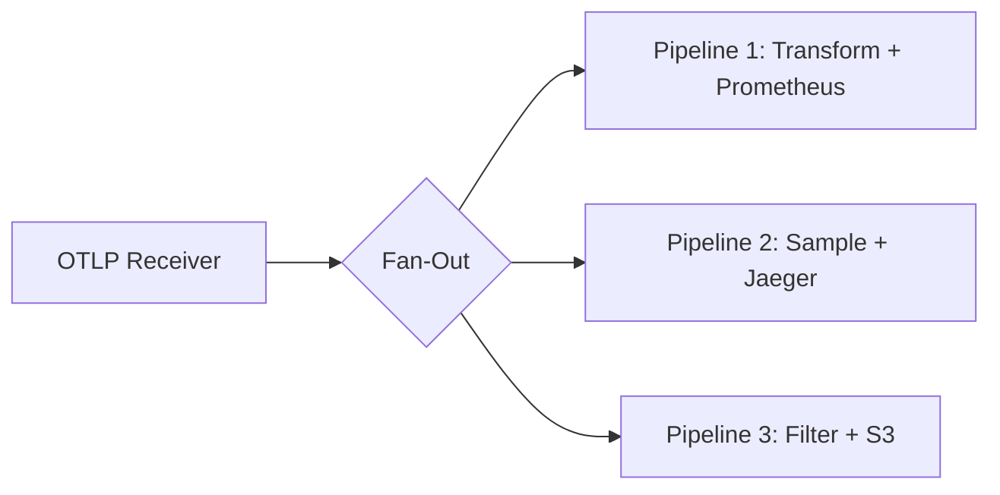

# How to Build Fan-Out Pipelines in the OpenTelemetry Collector

Author: [nawazdhandala](https://www.github.com/nawazdhandala)

Tags: OpenTelemetry, Collector, Pipelines, Fan-Out, Observability

Description: Learn how to configure fan-out pipelines in the OpenTelemetry Collector to duplicate and send telemetry data to multiple destinations simultaneously.

Fan-out pipelines are a powerful pattern in the OpenTelemetry Collector that allow you to duplicate telemetry data and send it to multiple destinations or processing paths simultaneously. This capability is essential for organizations that need to route their observability data to different backends, apply different transformations, or maintain redundancy in their telemetry infrastructure.

## Understanding Fan-Out Architecture

A fan-out pipeline takes a single stream of telemetry data from receivers and splits it into multiple processing paths. Each path can have its own processors and exporters, allowing you to handle the same telemetry data differently based on your requirements.



The diagram above shows how a single receiver can feed multiple pipelines, each with different processing logic and destinations.

## Basic Fan-Out Configuration

The simplest fan-out pattern involves defining multiple pipelines that use the same receiver. Here's a basic configuration that sends traces to both Jaeger and Zipkin:

```yaml
# Basic fan-out configuration for traces
receivers:
  otlp:
    protocols:
      grpc:
        endpoint: 0.0.0.0:4317
      http:
        endpoint: 0.0.0.0:4318

processors:
  batch:
    timeout: 10s
    send_batch_size: 1024

exporters:
  # Export to Jaeger
  jaeger:
    endpoint: jaeger:14250
    tls:
      insecure: true

  # Export to Zipkin
  zipkin:
    endpoint: http://zipkin:9411/api/v2/spans

service:
  pipelines:
    # First pipeline: OTLP -> Batch -> Jaeger
    traces/jaeger:
      receivers: [otlp]
      processors: [batch]
      exporters: [jaeger]

    # Second pipeline: OTLP -> Batch -> Zipkin
    traces/zipkin:
      receivers: [otlp]
      processors: [batch]
      exporters: [zipkin]
```

In this configuration, both pipelines share the same OTLP receiver. When traces arrive, they are duplicated and sent through both pipelines independently.

## Multi-Backend Fan-Out with Different Processing

A more advanced use case involves applying different processing logic to each pipeline. For example, you might want to send all traces to one backend for long-term storage, while sending only sampled traces to an expensive analytics platform:

```yaml
receivers:
  otlp:
    protocols:
      grpc:
        endpoint: 0.0.0.0:4317

processors:
  # Batch processor for efficient export
  batch:
    timeout: 10s
    send_batch_size: 1024

  # Probabilistic sampler - keeps 10% of traces
  probabilistic_sampler:
    sampling_percentage: 10.0

  # Resource attributes processor
  resource:
    attributes:
      - key: deployment.environment
        value: production
        action: upsert

exporters:
  # Cost-effective storage for all traces
  otlp/storage:
    endpoint: storage-backend:4317
    tls:
      insecure: false
      cert_file: /etc/certs/storage-cert.pem

  # Expensive analytics platform (sampled data only)
  otlp/analytics:
    endpoint: analytics-backend:4317
    tls:
      insecure: false
      cert_file: /etc/certs/analytics-cert.pem

service:
  pipelines:
    # Pipeline 1: All traces with resource enrichment
    traces/full:
      receivers: [otlp]
      processors: [resource, batch]
      exporters: [otlp/storage]

    # Pipeline 2: Sampled traces for analytics
    traces/sampled:
      receivers: [otlp]
      processors: [probabilistic_sampler, resource, batch]
      exporters: [otlp/analytics]
```

This configuration demonstrates how the same telemetry data can follow different paths with different transformations. The full pipeline enriches and sends all traces, while the sampled pipeline applies aggressive sampling before exporting.

## Fan-Out for Metrics with Aggregation

When working with metrics, you might want to send raw metrics to one backend while sending aggregated or filtered metrics to another. Here's an example:

```yaml
receivers:
  prometheus:
    config:
      scrape_configs:
        - job_name: 'app-metrics'
          scrape_interval: 30s
          static_configs:
            - targets: ['localhost:8080']

processors:
  batch:
    timeout: 30s

  # Filter metrics - only keep HTTP-related metrics
  filter/http:
    metrics:
      include:
        match_type: regexp
        metric_names:
          - http_.*
          - requests_.*

  # Cumulative to delta conversion
  cumulativetodelta:
    include:
      match_type: regexp
      metrics:
        - http_requests_total

exporters:
  # Send all metrics to Prometheus
  prometheusremotewrite:
    endpoint: http://prometheus:9090/api/v1/write
    tls:
      insecure: true

  # Send filtered metrics to specialized backend
  otlphttp/metrics:
    endpoint: http://metrics-backend:4318
    compression: gzip

service:
  pipelines:
    # Pipeline 1: All metrics to Prometheus
    metrics/all:
      receivers: [prometheus]
      processors: [batch]
      exporters: [prometheusremotewrite]

    # Pipeline 2: Filtered HTTP metrics with delta conversion
    metrics/http:
      receivers: [prometheus]
      processors: [filter/http, cumulativetodelta, batch]
      exporters: [otlphttp/metrics]
```

## Cross-Signal Fan-Out Pattern

Some scenarios require fan-out across different telemetry signals. You can configure multiple signal types to use the same receivers and apply signal-specific processing:

```yaml
receivers:
  otlp:
    protocols:
      grpc:
        endpoint: 0.0.0.0:4317

processors:
  batch/traces:
    timeout: 10s

  batch/metrics:
    timeout: 30s

  batch/logs:
    timeout: 5s

  # Add span metrics from traces
  spanmetrics:
    metrics_exporter: prometheus

exporters:
  # Multi-signal backend
  otlp/primary:
    endpoint: primary-backend:4317

  # Specialized exporters
  jaeger:
    endpoint: jaeger:14250
    tls:
      insecure: true

  prometheus:
    endpoint: prometheus:9090

service:
  pipelines:
    # Trace pipelines
    traces/primary:
      receivers: [otlp]
      processors: [batch/traces]
      exporters: [otlp/primary]

    traces/jaeger:
      receivers: [otlp]
      processors: [spanmetrics, batch/traces]
      exporters: [jaeger]

    # Metric pipelines (including derived span metrics)
    metrics/primary:
      receivers: [otlp]
      processors: [batch/metrics]
      exporters: [otlp/primary]

    metrics/prometheus:
      receivers: [otlp, spanmetrics]
      processors: [batch/metrics]
      exporters: [prometheus]
```

Notice how the `traces/jaeger` pipeline includes the `spanmetrics` processor, which generates metrics from trace spans. These derived metrics are then consumed by the `metrics/prometheus` pipeline through the `spanmetrics` receiver connection.

## Fan-Out with Error Handling

When implementing fan-out pipelines, consider what happens when one destination fails. The OpenTelemetry Collector handles each pipeline independently, so a failure in one pipeline does not affect others:

```yaml
receivers:
  otlp:
    protocols:
      grpc:
        endpoint: 0.0.0.0:4317

processors:
  batch:
    timeout: 10s
    send_batch_size: 1024

  # Retry processor for unreliable backends
  retry:
    enabled: true
    initial_interval: 5s
    max_interval: 30s
    max_elapsed_time: 300s

exporters:
  # Primary backend (reliable)
  otlp/primary:
    endpoint: primary-backend:4317
    retry_on_failure:
      enabled: true
      initial_interval: 5s
      max_interval: 30s
      max_elapsed_time: 300s

  # Secondary backend (may be unstable)
  otlp/secondary:
    endpoint: secondary-backend:4317
    sending_queue:
      enabled: true
      num_consumers: 10
      queue_size: 5000
    retry_on_failure:
      enabled: true
      initial_interval: 1s
      max_interval: 60s
      max_elapsed_time: 600s

  # Logging exporter for debugging
  logging:
    verbosity: detailed
    sampling_initial: 5
    sampling_thereafter: 200

service:
  pipelines:
    traces/primary:
      receivers: [otlp]
      processors: [batch]
      exporters: [otlp/primary]

    traces/secondary:
      receivers: [otlp]
      processors: [retry, batch]
      exporters: [otlp/secondary]

    traces/debug:
      receivers: [otlp]
      processors: [batch]
      exporters: [logging]
```

This configuration shows how each exporter can have different retry and queuing strategies. The secondary backend has a larger queue and more aggressive retry settings to handle instability.

## Performance Considerations

Fan-out pipelines duplicate data, which increases memory usage and processing overhead. Here are some best practices:

1. **Use batching**: Always include batch processors to reduce the number of export operations.

2. **Configure queues appropriately**: Set `sending_queue` sizes based on your expected throughput and available memory.

3. **Monitor collector performance**: Track metrics like `otelcol_processor_refused_spans` and `otelcol_exporter_queue_size` to identify bottlenecks.

4. **Consider async processing**: The collector processes pipelines asynchronously, but CPU-intensive processors can slow down all pipelines sharing the same receiver.

## Related Resources

For more information on OpenTelemetry Collector patterns, check out these related articles:

- [How to Route Telemetry to Multiple Backends with the Routing Connector](https://oneuptime.com/blog/post/2026-02-06-route-telemetry-multiple-backends-routing-connector/view)
- [How to Deploy the OpenTelemetry Collector as a Gateway](https://oneuptime.com/blog/post/2026-02-06-deploy-opentelemetry-collector-gateway/view)

Fan-out pipelines provide a flexible way to duplicate and process telemetry data for multiple destinations. By understanding the configuration patterns and performance implications, you can build robust observability pipelines that meet your organization's diverse requirements.
