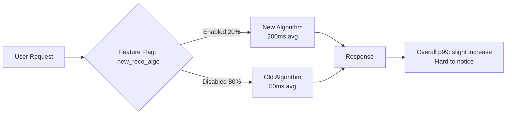

# How to Track Feature Flag Impact on Performance with OpenTelemetry

Author: [nawazdhandala](https://www.github.com/nawazdhandala)

Tags: OpenTelemetry, Feature Flags, Performance, A/B Testing, Monitoring, Observability, LaunchDarkly

Description: Learn how to correlate feature flag states with OpenTelemetry telemetry to measure the performance impact of feature toggles and catch regressions early.

---

> Feature flags let you decouple deployment from release, but they also introduce a new category of production risk. A flag that enables a new code path can silently degrade performance for a subset of users. OpenTelemetry gives you the instrumentation to detect these regressions before they become incidents.

Every feature flag creates a fork in your application's behavior. Users with the flag enabled take one code path, and users without it take another. If the new code path has a performance regression, traditional monitoring might show a small overall degradation, but you will not know which flag caused it unless you correlate flag states with your telemetry.

This guide shows you how to tag OpenTelemetry traces and metrics with feature flag information, build dashboards that compare performance across flag variants, and set up alerts that catch flag-induced regressions.

---

## The Problem: Invisible Performance Forks

Consider a scenario where you roll out a new recommendation algorithm behind a feature flag. The flag is enabled for 20% of users. Your p99 latency dashboard shows a slight uptick, but nothing alarming.



The overall metrics blend the two populations together, masking the fact that the 20% of users with the flag enabled are experiencing 4x worse latency. Without flag-aware telemetry, you might not discover this until the flag is rolled out to 100% and your latency spikes dramatically.

---

## Adding Feature Flag Context to Spans

The first step is recording which flags are active for each request. Add flag evaluations as span attributes so they appear in your traces:

```python
# feature_flags.py
# Integrate feature flag evaluations with OpenTelemetry spans

from opentelemetry import trace
import ldclient  # LaunchDarkly client, but this pattern works with any provider

tracer = trace.get_tracer("feature-flags")

class TracedFeatureFlags:
    """
    Wrapper around a feature flag client that records evaluations
    as OpenTelemetry span attributes and events.
    """

    def __init__(self, flag_client):
        self.client = flag_client

    def evaluate(self, flag_key, user_context, default_value):
        """
        Evaluate a feature flag and record the result on the current span.
        This lets you filter traces and metrics by flag state.
        """
        # Get the current span (created by your framework instrumentation)
        span = trace.get_current_span()

        # Evaluate the flag
        result = self.client.variation(flag_key, user_context, default_value)

        # Record the flag evaluation as a span attribute
        # Prefix with "feature_flag." to follow OpenTelemetry conventions
        span.set_attribute(f"feature_flag.{flag_key}", str(result))

        # Also record it as an event with additional detail
        # Events provide a timeline of flag evaluations within the span
        span.add_event(
            "feature_flag.evaluation",
            attributes={
                "feature_flag.key": flag_key,
                "feature_flag.value": str(result),
                "feature_flag.provider": "launchdarkly",
            },
        )

        return result


# Usage in your request handler
flags = TracedFeatureFlags(ldclient.get())

def handle_recommendation_request(request):
    with tracer.start_as_current_span("get_recommendations") as span:
        user = get_user_context(request)

        # This records the flag state on the span automatically
        use_new_algo = flags.evaluate("new_reco_algo", user, False)

        if use_new_algo:
            # New code path
            with tracer.start_as_current_span("recommendations.new_algorithm"):
                results = new_recommendation_engine(user)
        else:
            # Old code path
            with tracer.start_as_current_span("recommendations.old_algorithm"):
                results = old_recommendation_engine(user)

        return results
```

Now every trace includes the flag state as an attribute, and you can see which code path each request took.

---

## Recording Flag-Aware Metrics

Span attributes are great for individual trace investigation, but you also need aggregate metrics to compare performance across flag variants. Add the flag state as a metric attribute:

```python
# flag_metrics.py
# Record performance metrics segmented by feature flag state

from opentelemetry import metrics, trace
import time
from functools import wraps

meter = metrics.get_meter("feature-flag-metrics")

# Histogram for request duration, segmented by flag variant
flag_duration = meter.create_histogram(
    name="http.server.request.duration.by_flag",
    description="Request duration segmented by feature flag variant",
    unit="ms",
)

# Counter for errors, segmented by flag variant
flag_errors = meter.create_counter(
    name="http.server.request.errors.by_flag",
    description="Request errors segmented by feature flag variant",
    unit="1",
)

# Counter for flag evaluations to track rollout percentage
flag_evaluations = meter.create_counter(
    name="feature_flag.evaluations",
    description="Number of feature flag evaluations",
    unit="1",
)


def track_flag_performance(flag_key):
    """
    Decorator that measures function performance segmented by feature flag value.
    Apply this to any function whose performance depends on a feature flag.
    """
    def decorator(func):
        @wraps(func)
        def wrapper(*args, **kwargs):
            # Read the flag value from the current span's attributes
            span = trace.get_current_span()
            flag_value = span.attributes.get(f"feature_flag.{flag_key}", "unknown")

            start_time = time.time()
            try:
                result = func(*args, **kwargs)
                return result
            except Exception as e:
                # Record the error with flag context
                flag_errors.add(1, {
                    "feature_flag.key": flag_key,
                    "feature_flag.value": str(flag_value),
                    "error.type": type(e).__name__,
                })
                raise
            finally:
                duration_ms = (time.time() - start_time) * 1000
                # Record duration with flag context
                flag_duration.record(duration_ms, {
                    "feature_flag.key": flag_key,
                    "feature_flag.value": str(flag_value),
                })

        return wrapper
    return decorator


# Apply the decorator to functions that run behind feature flags
@track_flag_performance("new_reco_algo")
def get_recommendations(user):
    # This function's performance is now tracked per flag variant
    pass
```

---

## Building a Feature Flag Performance Dashboard

With flag-segmented metrics, you can build a dashboard that compares performance between flag variants:

```yaml
# flag-performance-dashboard.yaml
# Dashboard that compares performance across feature flag variants

panels:
  - title: "Latency by Flag Variant: new_reco_algo"
    type: timeseries
    queries:
      - label: "Flag ON (new algorithm)"
        query: |
          histogram_quantile(0.95,
            sum(rate(http_server_request_duration_by_flag_bucket{
              feature_flag_key="new_reco_algo",
              feature_flag_value="true"
            }[5m])) by (le)
          )
      - label: "Flag OFF (old algorithm)"
        query: |
          histogram_quantile(0.95,
            sum(rate(http_server_request_duration_by_flag_bucket{
              feature_flag_key="new_reco_algo",
              feature_flag_value="false"
            }[5m])) by (le)
          )

  - title: "Error Rate by Flag Variant"
    type: timeseries
    queries:
      - label: "Flag ON"
        query: |
          sum(rate(http_server_request_errors_by_flag{
            feature_flag_key="new_reco_algo",
            feature_flag_value="true"
          }[5m]))
      - label: "Flag OFF"
        query: |
          sum(rate(http_server_request_errors_by_flag{
            feature_flag_key="new_reco_algo",
            feature_flag_value="false"
          }[5m]))

  - title: "Rollout Percentage"
    type: gauge
    query: |
      sum(rate(feature_flag_evaluations{
        feature_flag_key="new_reco_algo",
        feature_flag_value="true"
      }[5m]))
      /
      sum(rate(feature_flag_evaluations{
        feature_flag_key="new_reco_algo"
      }[5m]))
      * 100
```

This dashboard immediately reveals performance differences between the two code paths. If the "Flag ON" line is significantly higher than the "Flag OFF" line, you have a regression.

---

## Automated Flag Regression Detection

Rather than watching dashboards, you can automate the detection of flag-induced performance regressions:

```python
# flag_regression_detector.py
# Automatically detect when a feature flag variant causes performance degradation

from opentelemetry import trace, metrics

tracer = trace.get_tracer("flag-regression-detector")
meter = metrics.get_meter("flag-regression-detector")

regression_alerts = meter.create_counter(
    name="feature_flag.regression.detected",
    description="Number of flag-induced regressions detected",
    unit="1",
)

class FlagRegressionDetector:
    def __init__(self, metrics_client, config):
        self.metrics_client = metrics_client
        self.config = config

    def check_flag(self, flag_key, variant_on="true", variant_off="false"):
        """
        Compare performance metrics between flag-on and flag-off populations.
        Alert if the flag-on population is significantly worse.
        """
        with tracer.start_as_current_span("flag.regression_check") as span:
            span.set_attribute("feature_flag.key", flag_key)
            window = self.config.get("analysis_window", "15m")

            # Query p95 latency for both variants
            on_latency = self._query_latency(flag_key, variant_on, window)
            off_latency = self._query_latency(flag_key, variant_off, window)

            span.set_attribute("flag.on_p95_ms", on_latency)
            span.set_attribute("flag.off_p95_ms", off_latency)

            # Query error rate for both variants
            on_errors = self._query_error_rate(flag_key, variant_on, window)
            off_errors = self._query_error_rate(flag_key, variant_off, window)

            span.set_attribute("flag.on_error_rate", on_errors)
            span.set_attribute("flag.off_error_rate", off_errors)

            # Check for latency regression
            # A 50% increase in p95 latency is considered a regression
            latency_threshold = self.config.get("latency_regression_pct", 0.50)
            if off_latency > 0:
                latency_increase = (on_latency - off_latency) / off_latency
            else:
                latency_increase = 0

            latency_regression = latency_increase > latency_threshold

            # Check for error rate regression
            # Any increase above 1% absolute is considered a regression
            error_threshold = self.config.get("error_regression_abs", 0.01)
            error_increase = on_errors - off_errors
            error_regression = error_increase > error_threshold

            is_regression = latency_regression or error_regression
            span.set_attribute("flag.is_regression", is_regression)

            if is_regression:
                regression_alerts.add(1, {
                    "feature_flag.key": flag_key,
                    "regression.type": "latency" if latency_regression else "errors",
                })

                return {
                    "regression_detected": True,
                    "flag_key": flag_key,
                    "latency": {
                        "on_ms": on_latency,
                        "off_ms": off_latency,
                        "increase_pct": latency_increase,
                    },
                    "error_rate": {
                        "on": on_errors,
                        "off": off_errors,
                        "increase_abs": error_increase,
                    },
                    "recommendation": f"Consider disabling flag '{flag_key}' until the regression is fixed",
                }

            return {"regression_detected": False, "flag_key": flag_key}

    def _query_latency(self, flag_key, variant, window):
        return self.metrics_client.query(
            f'histogram_quantile(0.95, sum(rate('
            f'http_server_request_duration_by_flag_bucket{{'
            f'feature_flag_key="{flag_key}", '
            f'feature_flag_value="{variant}"'
            f'}}[{window}])) by (le))'
        )

    def _query_error_rate(self, flag_key, variant, window):
        return self.metrics_client.query(
            f'sum(rate(http_server_request_errors_by_flag{{'
            f'feature_flag_key="{flag_key}", '
            f'feature_flag_value="{variant}"'
            f'}}[{window}]))'
            f' / sum(rate(feature_flag_evaluations{{'
            f'feature_flag_key="{flag_key}", '
            f'feature_flag_value="{variant}"'
            f'}}[{window}]))'
        )
```

---

## Collector Processing for Flag Telemetry

Configure the OpenTelemetry Collector to extract flag attributes and ensure they propagate correctly:

```yaml
# otel-collector-config.yaml
receivers:
  otlp:
    protocols:
      grpc:
        endpoint: 0.0.0.0:4317

processors:
  batch:
    timeout: 10s

  # Use the attributes processor to normalize feature flag attributes
  # This ensures consistent naming across services
  attributes:
    actions:
      # Normalize flag attribute names across services
      # Some services might use "ff." prefix, others "feature_flag."
      - key: feature_flag.key
        from_attribute: ff.key
        action: upsert
      - key: feature_flag.value
        from_attribute: ff.value
        action: upsert

exporters:
  otlp:
    endpoint: https://oneuptime.com/otlp

service:
  pipelines:
    traces:
      receivers: [otlp]
      processors: [attributes, batch]
      exporters: [otlp]
    metrics:
      receivers: [otlp]
      processors: [attributes, batch]
      exporters: [otlp]
```

---

## Best Practices for Flag Observability

1. **Log flag evaluations at the request level, not the flag level**: Recording one attribute per flag per request scales well. Recording every flag evaluation as a separate event creates too much noise.

2. **Watch cardinality**: If you have 50 active flags, adding all of them as metric dimensions creates a cardinality explosion. Only add the flags you are actively monitoring to your metrics.

3. **Set up alerts before rolling out**: Create the regression detection rules before you start increasing the flag percentage. By the time you notice a problem manually, it may have already affected many users.

4. **Include flag state in error reports**: When a user reports a bug, knowing their flag states helps reproduce the issue. Include flag evaluations in your trace context.

5. **Clean up stale flags**: Old feature flags that are permanently enabled or disabled still add attributes to every span. Remove the instrumentation when you remove the flag from your code.

Feature flags are a powerful deployment tool, but they are also a source of hidden performance risk. By integrating flag evaluations into your OpenTelemetry telemetry, you make that risk visible and measurable, turning each flag rollout from a leap of faith into a data-driven decision.
