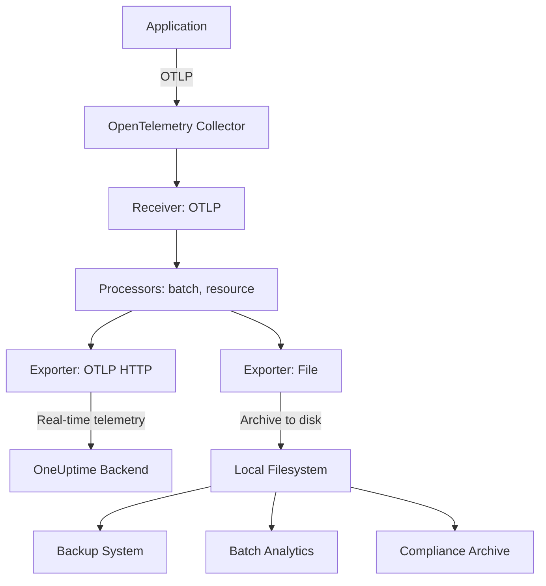

# How to Configure the File Exporter in the OpenTelemetry Collector

Author: [nawazdhandala](https://www.github.com/nawazdhandala)

Tags: OpenTelemetry, Collector, Exporters, File, Storage, Archival, Debugging

Description: A comprehensive guide to configuring the File exporter in OpenTelemetry Collector for writing telemetry to disk, including rotation strategies, compression options, format control, and production patterns for archival and debugging scenarios.

---

The File exporter writes telemetry data (traces, metrics, and logs) directly to files on disk. Unlike network-based exporters that send data to remote backends, the File exporter stores telemetry locally, making it valuable for archival, compliance, debugging, and backup scenarios.

The File exporter is particularly useful when you need durable local storage of telemetry data, want to process telemetry with custom tools, need to meet data retention requirements, or want to debug issues without impacting production backends.

This guide covers everything from basic file writing to advanced rotation strategies, compression, format options, and production deployment patterns.

---

## Why Use the File Exporter?

The File exporter serves several important use cases:

**Archival and compliance**: Store telemetry data on disk to meet regulatory requirements for data retention and auditing.

**Backup and disaster recovery**: Keep local copies of critical telemetry in case the primary backend becomes unavailable.

**Offline processing**: Export telemetry to files for batch processing with custom analytics tools, ETL pipelines, or machine learning systems.

**Cost optimization**: Store raw telemetry locally and send only aggregated or sampled data to expensive cloud backends.

**Debugging and forensics**: Capture complete telemetry during incidents for detailed post-mortem analysis without overwhelming production backends.

**Air-gapped environments**: Export telemetry in environments without internet connectivity, then transfer files manually to analysis systems.

---

## Basic Configuration

Here is a minimal File exporter configuration:

```yaml
# receivers configuration (how telemetry enters the Collector)
receivers:
  otlp:
    protocols:
      grpc:        # Accept OTLP over gRPC from instrumented apps
      http:        # Accept OTLP over HTTP from instrumented apps

# exporters configuration (write telemetry to disk)
exporters:
  file:
    path: /var/log/otel/telemetry.json  # Output file path

# service pipelines (wire receivers to exporters)
service:
  pipelines:
    traces:
      receivers: [otlp]
      exporters: [file]

    metrics:
      receivers: [otlp]
      exporters: [file]

    logs:
      receivers: [otlp]
      exporters: [file]
```

This writes all telemetry to `/var/log/otel/telemetry.json` in JSON format. The file grows indefinitely until you implement rotation (covered below).

---

## File Path Configuration

The `path` parameter specifies where telemetry is written. It supports several patterns:

### Static Path

Write to a fixed file:

```yaml
exporters:
  file:
    path: /var/log/otel/telemetry.json
```

### Environment Variable Substitution

Use environment variables for flexible configuration:

```yaml
exporters:
  file:
    path: ${OTEL_LOG_DIR}/telemetry-${HOSTNAME}.json
```

Set variables before starting the Collector:

```bash
export OTEL_LOG_DIR=/var/log/otel
export HOSTNAME=$(hostname)
./otelcol-contrib --config=config.yaml
```

### Separate Files per Signal

Write traces, metrics, and logs to separate files:

```yaml
exporters:
  file/traces:
    path: /var/log/otel/traces.json

  file/metrics:
    path: /var/log/otel/metrics.json

  file/logs:
    path: /var/log/otel/logs.json

service:
  pipelines:
    traces:
      receivers: [otlp]
      exporters: [file/traces]

    metrics:
      receivers: [otlp]
      exporters: [file/metrics]

    logs:
      receivers: [otlp]
      exporters: [file/logs]
```

This separation makes it easier to process different signal types with specialized tools.

---

## File Formats

The File exporter supports multiple output formats:

### JSON Format (Default)

Human-readable JSON with one telemetry item per line (JSON Lines format):

```yaml
exporters:
  file:
    path: /var/log/otel/telemetry.json
    format: json  # Default format
```

Example output:

```json
{"resourceSpans":[{"resource":{"attributes":[{"key":"service.name","value":{"stringValue":"payment-api"}}]},"scopeSpans":[{"scope":{"name":"opentelemetry.instrumentation.fastapi"},"spans":[{"traceId":"a1b2c3d4e5f6g7h8i9j0k1l2m3n4o5p6","spanId":"y5z6a7b8c9d0e1f2","name":"POST /api/payment","kind":"SPAN_KIND_SERVER","startTimeUnixNano":"1675689330123456000","endTimeUnixNano":"1675689330234567000","attributes":[{"key":"http.method","value":{"stringValue":"POST"}},{"key":"http.status_code","value":{"intValue":"200"}}],"status":{"code":"STATUS_CODE_OK"}}]}]}]}
```

JSON format is best for:
- Human inspection with tools like `jq`
- Integration with log aggregation systems
- Custom processing scripts

### Protocol Buffers Format

Binary protobuf format for efficient storage:

```yaml
exporters:
  file:
    path: /var/log/otel/telemetry.pb
    format: proto  # Binary protobuf format
```

Protobuf format is best for:
- Minimal disk space usage (50-70% smaller than JSON)
- High-throughput scenarios
- Processing with protobuf-aware tools
- Preserving exact wire format for replay

To read protobuf files, use the OpenTelemetry protobuf definitions or tools like `protoc`.

---

## File Rotation

Without rotation, telemetry files grow indefinitely and can fill disk space. Configure rotation to manage file size:

### Size-Based Rotation

Rotate when the file reaches a specific size:

```yaml
exporters:
  file:
    path: /var/log/otel/telemetry.json

    # Rotate when file reaches 100 MB
    rotation:
      max_megabytes: 100

      # Keep up to 10 rotated files (oldest deleted automatically)
      max_backups: 10

      # Delete rotated files after 30 days
      max_days: 30
```

With this configuration:
1. Telemetry writes to `telemetry.json`
2. When it reaches 100 MB, it is renamed to `telemetry-2026-02-06T10-15-30.json`
3. A new `telemetry.json` starts
4. After 10 rotations, the oldest file is deleted
5. Files older than 30 days are deleted regardless of count

### Time-Based Rotation

Rotate at regular intervals (daily, hourly, etc.):

```yaml
exporters:
  file:
    path: /var/log/otel/telemetry.json

    # Rotate daily at midnight
    rotation:
      max_days: 1  # Rotate every day
      max_backups: 30  # Keep 30 days of history
```

### Compression

Compress rotated files to save disk space:

```yaml
exporters:
  file:
    path: /var/log/otel/telemetry.json

    rotation:
      max_megabytes: 100
      max_backups: 10

      # Compress rotated files with gzip
      compress: true
```

Rotated files will be named like `telemetry-2026-02-06T10-15-30.json.gz`. Compression typically reduces file size by 80-90% for text formats.

---

## Buffering and Flushing

Control write buffering for performance vs durability trade-offs:

```yaml
exporters:
  file:
    path: /var/log/otel/telemetry.json

    # Flush behavior
    flush_interval: 5s  # Flush buffer every 5 seconds
```

The `flush_interval` determines how often buffered data is written to disk:

- **Short interval (1s)**: More durable (less data loss on crash), slightly lower throughput
- **Long interval (30s)**: Higher throughput, more data at risk if Collector crashes
- **No interval (0s)**: Flush after every write (lowest throughput, maximum durability)

For most use cases, 5-10 seconds provides a good balance.

---

## Production-Ready Configuration

Here is a comprehensive production configuration:

```yaml
receivers:
  # Accept telemetry from instrumented applications
  otlp:
    protocols:
      grpc:
        endpoint: 0.0.0.0:4317
      http:
        endpoint: 0.0.0.0:4318

processors:
  # Protect Collector from memory exhaustion
  memory_limiter:
    check_interval: 1s
    limit_mib: 512
    spike_limit_mib: 128

  # Add resource attributes for identification
  resource:
    attributes:
      - key: collector.hostname
        value: ${HOSTNAME}
        action: upsert
      - key: collector.environment
        value: production
        action: upsert

  # Batch telemetry to reduce write overhead
  batch:
    timeout: 10s
    send_batch_size: 1000

exporters:
  # Primary backend (OneUptime)
  otlphttp:
    endpoint: https://oneuptime.com/otlp
    headers:
      x-oneuptime-token: "${ONEUPTIME_TOKEN}"

  # File archival exporter (separate files per signal)
  file/traces:
    path: /var/log/otel/traces.json
    format: json
    rotation:
      max_megabytes: 500     # 500 MB per file
      max_backups: 20        # Keep 20 rotated files
      max_days: 7            # Delete after 7 days
      compress: true         # Compress rotated files

  file/metrics:
    path: /var/log/otel/metrics.json
    format: json
    rotation:
      max_megabytes: 100
      max_backups: 30
      max_days: 30
      compress: true

  file/logs:
    path: /var/log/otel/logs.json
    format: json
    rotation:
      max_megabytes: 200
      max_backups: 15
      max_days: 14
      compress: true

# Service configuration
service:
  pipelines:
    # Traces: send to both backend and file
    traces:
      receivers: [otlp]
      processors: [memory_limiter, resource, batch]
      exporters: [otlphttp, file/traces]

    # Metrics: send to both backend and file
    metrics:
      receivers: [otlp]
      processors: [memory_limiter, resource, batch]
      exporters: [otlphttp, file/metrics]

    # Logs: send to both backend and file
    logs:
      receivers: [otlp]
      processors: [memory_limiter, resource, batch]
      exporters: [otlphttp, file/logs]
```

This configuration:

- Sends telemetry to OneUptime for real-time monitoring
- Archives all telemetry to local files for compliance/backup
- Uses separate files per signal type
- Rotates files based on size to prevent disk fill
- Compresses rotated files to save space
- Limits retention (7-30 days depending on signal type)
- Adds resource attributes for traceability

---

## Dual Export Pattern

The File exporter works well in dual-export scenarios:



This pattern provides:

- Real-time monitoring via the primary backend
- Durable local backup in case backend is unavailable
- Historical data for compliance and auditing
- Source data for offline batch processing

---

## Sampling for Cost Optimization

Combine File exporter with sampling to reduce storage costs:

```yaml
processors:
  # Keep all errors, sample success at 10%
  tail_sampling:
    decision_wait: 10s
    policies:
      - name: errors
        type: status_code
        status_code:
          status_codes: [ERROR]
      - name: sample_success
        type: probabilistic
        probabilistic:
          sampling_percentage: 10

exporters:
  # Send everything to backend
  otlphttp:
    endpoint: https://oneuptime.com/otlp

  # Archive only sampled data to save disk space
  file/sampled:
    path: /var/log/otel/sampled.json
    rotation:
      max_megabytes: 100
      max_backups: 10
      compress: true

service:
  pipelines:
    traces:
      receivers: [otlp]
      processors: [tail_sampling]
      exporters: [otlphttp, file/sampled]
```

This reduces file storage by 90% while preserving all errors and a representative sample of success traces.

---

## Kubernetes Volume Configuration

When running in Kubernetes, mount a persistent volume for file storage:

```yaml
# kubernetes deployment
apiVersion: apps/v1
kind: Deployment
metadata:
  name: otel-collector
spec:
  template:
    spec:
      containers:
        - name: otel-collector
          image: otel/opentelemetry-collector-contrib:latest
          volumeMounts:
            - name: otel-logs
              mountPath: /var/log/otel

      volumes:
        - name: otel-logs
          persistentVolumeClaim:
            claimName: otel-logs-pvc
---
apiVersion: v1
kind: PersistentVolumeClaim
metadata:
  name: otel-logs-pvc
spec:
  accessModes:
    - ReadWriteOnce
  resources:
    requests:
      storage: 100Gi  # Size based on expected volume
```

Use a DaemonSet if you want per-node file storage:

```yaml
apiVersion: apps/v1
kind: DaemonSet
metadata:
  name: otel-collector
spec:
  template:
    spec:
      containers:
        - name: otel-collector
          volumeMounts:
            - name: otel-logs
              mountPath: /var/log/otel

      volumes:
        - name: otel-logs
          hostPath:
            path: /var/log/otel  # Store on node filesystem
            type: DirectoryOrCreate
```

---

## File Processing Patterns

Once telemetry is written to files, you can process it with standard Unix tools or custom scripts:

### Extract Specific Fields with jq

```bash
# Extract all span names from traces file
cat traces.json | jq -r '.resourceSpans[].scopeSpans[].spans[].name'

# Find slow traces (>1 second)
cat traces.json | jq 'select(.resourceSpans[].scopeSpans[].spans[].endTimeUnixNano - .resourceSpans[].scopeSpans[].spans[].startTimeUnixNano > 1000000000)'

# Count spans by service
cat traces.json | jq -r '.resourceSpans[].resource.attributes[] | select(.key=="service.name") | .value.stringValue' | sort | uniq -c
```

### Monitor File Growth

```bash
# Watch file size in real-time
watch -n 5 'ls -lh /var/log/otel/*.json'

# Alert if file exceeds threshold
SIZE=$(stat -f%z /var/log/otel/traces.json)
if [ $SIZE -gt 1000000000 ]; then
  echo "Traces file exceeds 1GB, rotation may not be working"
fi
```

### Upload to S3 for Long-Term Storage

```bash
# Upload rotated files to S3 and delete local copies
find /var/log/otel -name "*.json.gz" -mtime +1 -exec sh -c '
  aws s3 cp "$1" s3://my-bucket/otel-archive/ && rm "$1"
' sh {} \;
```

### Import into Clickhouse for Analysis

```bash
# Bulk import JSON telemetry into Clickhouse
cat traces.json | clickhouse-client --query="INSERT INTO traces FORMAT JSONEachRow"
```

---

## Debugging with File Exporter

The File exporter is excellent for debugging production issues:

### Capture Incident Window

Enable File exporter during an incident to capture full telemetry:

```yaml
exporters:
  # Normal production exporter
  otlphttp:
    endpoint: https://oneuptime.com/otlp

  # Incident capture (enable manually during issues)
  file/incident:
    path: /var/log/otel/incident-${INCIDENT_ID}.json
    format: json
    flush_interval: 1s  # Flush frequently for quick access

service:
  pipelines:
    traces:
      receivers: [otlp]
      exporters:
        - otlphttp
        # Uncomment during incidents:
        # - file/incident
```

After resolving the incident, analyze the captured file offline without impacting production.

### Compare Before/After Processor Changes

Capture telemetry before and after processor changes to verify correctness:

```yaml
exporters:
  file/before:
    path: /tmp/before-processing.json

  file/after:
    path: /tmp/after-processing.json

service:
  pipelines:
    # Capture raw telemetry
    traces/before:
      receivers: [otlp]
      exporters: [file/before]

    # Capture processed telemetry
    traces/after:
      receivers: [otlp]
      processors: [attributes, filter, tail_sampling]
      exporters: [file/after]
```

Compare the files to verify processors work as expected:

```bash
diff <(jq -S . /tmp/before-processing.json) <(jq -S . /tmp/after-processing.json)
```

---

## Troubleshooting Common Issues

### Permission Denied Errors

**Problem**: Collector cannot write to the specified path.

**Solution**:
- Ensure the directory exists and Collector has write permissions
- Create directory with appropriate ownership:

```bash
sudo mkdir -p /var/log/otel
sudo chown otel-user:otel-group /var/log/otel
sudo chmod 755 /var/log/otel
```

- In Kubernetes, ensure the volume mount allows writes:

```yaml
securityContext:
  fsGroup: 1000  # Match Collector's user ID
```

### Disk Space Exhaustion

**Problem**: Telemetry files fill available disk space.

**Solution**:
- Configure rotation with reasonable limits:

```yaml
rotation:
  max_megabytes: 100
  max_backups: 10
  max_days: 7
  compress: true
```

- Monitor disk usage with alerts
- Use sampling to reduce volume
- Set up automated cleanup or upload to object storage

### File Descriptor Exhaustion

**Problem**: Collector runs out of file descriptors with many exporters.

**Solution**:
- Increase OS file descriptor limits:

```bash
# Temporary increase
ulimit -n 65536

# Permanent increase (add to /etc/security/limits.conf)
otel-user soft nofile 65536
otel-user hard nofile 65536
```

- Reduce number of file exporters (combine signals into one file if needed)

### Corrupted Files After Crash

**Problem**: Files contain partial telemetry after Collector crash.

**Solution**:
- Use shorter `flush_interval` (1-5s) for more frequent writes
- Enable compression (compressed files are less likely to be corrupted)
- Implement external monitoring to detect crashes and mark files as suspect
- Consider using the File exporter with a persistent queue for better durability

---

## Performance Considerations

File I/O can impact Collector performance. Follow these guidelines:

**Use batching**: Always enable the batch processor before the File exporter to reduce write operations.

**Choose appropriate rotation size**: Smaller files rotate more frequently (more I/O overhead). Larger files may cause longer pauses during rotation. 100-500 MB is a good balance.

**Enable compression**: Compression happens asynchronously during rotation, not during active writes, so it has minimal impact on throughput.

**Use SSDs**: File exporter benefits significantly from SSD storage. Avoid slow network-attached storage.

**Monitor I/O wait**: High I/O wait times indicate the disk cannot keep up. Consider sampling or using a faster disk.

**Benchmark your setup**: Test with expected load to ensure disk can handle write volume:

```bash
# Generate test telemetry and measure throughput
otel-telemetry-generator --rate 10000 --duration 60s
```

---

## Related Resources

- [What is the OpenTelemetry Collector and Why Use One?](https://oneuptime.com/blog/post/2025-09-18-what-is-opentelemetry-collector-and-why-use-one/view)
- [How to Configure the Debug Exporter in the OpenTelemetry Collector](https://oneuptime.com/blog/post/2026-02-06-debug-exporter-opentelemetry-collector/view)
- [How to Configure the Kafka Exporter in the OpenTelemetry Collector](https://oneuptime.com/blog/post/2026-02-06-kafka-exporter-opentelemetry-collector/view)

---

## Summary

The File exporter provides durable local storage for OpenTelemetry telemetry data. Key takeaways:

- Use it for archival, compliance, backup, and debugging
- Configure rotation to manage disk space (size, count, age limits)
- Enable compression to reduce storage by 80-90%
- Separate files per signal type for easier processing
- Combine with primary exporters for dual shipping
- Use persistent volumes in Kubernetes deployments
- Monitor disk space and file descriptor usage
- Process files with standard tools (jq, grep, awk) or custom scripts

The File exporter is production-ready and reliable. It provides peace of mind knowing you have durable local copies of critical telemetry data, even if network backends are unavailable.

For a fully managed observability solution that eliminates the need for local archival and provides built-in retention policies, check out [OneUptime](https://oneuptime.com).
