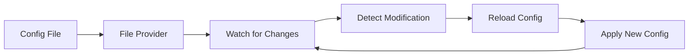

# How to Use the File Provider for Dynamic Collector Configuration

Author: [nawazdhandala](https://www.github.com/nawazdhandala)

Tags: OpenTelemetry, Collector, Configuration, File Provider, Dynamic Configuration

Description: Implement dynamic configuration reloading for the OpenTelemetry Collector using file providers to update collector behavior without restarts or downtime.

The OpenTelemetry Collector's file provider enables dynamic configuration updates by monitoring configuration files for changes and automatically reloading them. This capability is essential for production environments where collector downtime is unacceptable and configuration changes need to be applied seamlessly.

## Understanding Configuration Providers

Configuration providers are components that supply configuration data to the collector. While the standard collector reads configuration from a static file at startup, providers enable dynamic configuration management.

The file provider watches specified files or directories for changes and triggers configuration reloads when modifications are detected:



## Enabling the File Provider

The collector requires the `configprovider` feature to use file providers. When using the OpenTelemetry Collector Contrib distribution, this feature is typically enabled by default.

Basic file provider configuration structure:

```yaml
# collector-config.yaml
receivers:
  otlp:
    protocols:
      grpc:
        endpoint: 0.0.0.0:4317

# Define configuration providers
providers:
  file:
    # Enable file watching
    enabled: true

    # Poll interval for checking file changes (default: 5s)
    poll_interval: 5s

    # Paths to watch for configuration changes
    paths:
      - /etc/otel/config.d/*.yaml
      - /etc/otel/pipelines.yaml

exporters:
  debug:
    verbosity: detailed

service:
  pipelines:
    traces:
      receivers: [otlp]
      exporters: [debug]
```

Start the collector with the configuration provider enabled:

```bash
./otelcol --config collector-config.yaml --feature-gates=configprovider.Enable
```

## Dynamic Pipeline Configuration

The file provider excels at enabling dynamic pipeline updates. Create separate configuration files for different pipeline components that can be modified independently.

Main collector configuration:

```yaml
# collector-config.yaml
receivers:
  otlp:
    protocols:
      grpc:
        endpoint: 0.0.0.0:4317
      http:
        endpoint: 0.0.0.0:4318

# Reference external configuration files
providers:
  file:
    enabled: true
    poll_interval: 10s
    paths:
      # Watch the entire configuration directory
      - /etc/otel/config.d/

exporters:
  # Exporters will be loaded from external files
  debug:
    verbosity: basic

processors:
  # Processors will be loaded from external files
  batch:
    timeout: 10s

service:
  # Pipeline configuration from external files
  pipelines:
    traces:
      receivers: [otlp]
      processors: [batch]
      exporters: [debug]
```

Create modular configuration files:

```yaml
# /etc/otel/config.d/exporters.yaml
exporters:
  # Prometheus exporter for metrics
  prometheus:
    endpoint: 0.0.0.0:8889

  # OTLP exporter for traces
  otlp/traces:
    endpoint: tempo.observability.svc:4317
    compression: gzip
    tls:
      insecure: false
      cert_file: /etc/certs/client.crt
      key_file: /etc/certs/client.key

  # OTLP exporter for metrics
  otlp/metrics:
    endpoint: mimir.observability.svc:4317
    compression: gzip

  # Jaeger exporter for traces
  jaeger:
    endpoint: jaeger-collector:14250
    tls:
      insecure: true
```

```yaml
# /etc/otel/config.d/processors.yaml
processors:
  # Batch processor for all signals
  batch:
    timeout: 10s
    send_batch_size: 1000
    send_batch_max_size: 1500

  # Attributes processor for adding labels
  attributes:
    actions:
      - key: environment
        value: production
        action: upsert
      - key: cluster
        value: us-east-1
        action: upsert

  # Resource detection processor
  resourcedetection:
    detectors: [env, system, docker]
    timeout: 5s

  # Memory limiter to prevent OOM
  memory_limiter:
    check_interval: 1s
    limit_mib: 512
    spike_limit_mib: 128
```

```yaml
# /etc/otel/config.d/pipelines.yaml
service:
  pipelines:
    # Traces pipeline
    traces:
      receivers: [otlp]
      processors: [memory_limiter, resourcedetection, attributes, batch]
      exporters: [otlp/traces, jaeger]

    # Metrics pipeline
    metrics:
      receivers: [otlp]
      processors: [memory_limiter, resourcedetection, attributes, batch]
      exporters: [otlp/metrics, prometheus]
```

When you modify any file in `/etc/otel/config.d/`, the file provider detects the change and reloads the configuration automatically.

## Hot-Swapping Exporters

The file provider enables adding, removing, or modifying exporters without collector downtime. This is valuable for testing new backends or migrating between observability platforms.

Example of dynamically switching exporters:

```yaml
# /etc/otel/config.d/exporters-active.yaml
# Initially configured with debug exporter
exporters:
  debug:
    verbosity: detailed

service:
  pipelines:
    traces:
      receivers: [otlp]
      processors: [batch]
      exporters: [debug]
```

Update the file to add a production exporter:

```yaml
# /etc/otel/config.d/exporters-active.yaml
# Add production OTLP exporter alongside debug
exporters:
  debug:
    verbosity: detailed

  otlp/production:
    endpoint: prod-backend.example.com:4317
    compression: gzip
    retry_on_failure:
      enabled: true
      initial_interval: 5s
      max_interval: 30s
      max_elapsed_time: 300s

service:
  pipelines:
    traces:
      receivers: [otlp]
      processors: [batch]
      # Send to both exporters for validation
      exporters: [debug, otlp/production]
```

After validating the production exporter works correctly, remove the debug exporter:

```yaml
# /etc/otel/config.d/exporters-active.yaml
# Final configuration with only production exporter
exporters:
  otlp/production:
    endpoint: prod-backend.example.com:4317
    compression: gzip
    retry_on_failure:
      enabled: true
      initial_interval: 5s
      max_interval: 30s
      max_elapsed_time: 300s

service:
  pipelines:
    traces:
      receivers: [otlp]
      processors: [batch]
      exporters: [otlp/production]
```

The collector applies each change without restart, ensuring continuous data collection.

## Dynamic Sampling Configuration

Adjust sampling rates dynamically based on traffic patterns or debugging needs:

```yaml
# /etc/otel/config.d/sampling.yaml
processors:
  # Tail sampling processor with dynamic rules
  tail_sampling:
    # Decision wait time before sampling
    decision_wait: 10s

    # Number of traces to keep in memory
    num_traces: 100000

    # Sampling policies (can be modified dynamically)
    policies:
      # Always sample errors
      - name: error-policy
        type: status_code
        status_code:
          status_codes: [ERROR]

      # Sample 100% of slow requests
      - name: slow-requests
        type: latency
        latency:
          threshold_ms: 1000

      # Probabilistic sampling for normal traffic
      - name: probabilistic-policy
        type: probabilistic
        probabilistic:
          sampling_percentage: 10

service:
  pipelines:
    traces:
      receivers: [otlp]
      processors: [tail_sampling, batch]
      exporters: [otlp/traces]
```

During a production incident, increase sampling for debugging:

```yaml
# /etc/otel/config.d/sampling.yaml
processors:
  tail_sampling:
    decision_wait: 10s
    num_traces: 100000
    policies:
      # Keep error sampling
      - name: error-policy
        type: status_code
        status_code:
          status_codes: [ERROR]

      # Lower latency threshold to catch more issues
      - name: slow-requests
        type: latency
        latency:
          threshold_ms: 500  # Changed from 1000ms

      # Increase sampling to 50% during incident
      - name: probabilistic-policy
        type: probabilistic
        probabilistic:
          sampling_percentage: 50  # Changed from 10%

service:
  pipelines:
    traces:
      receivers: [otlp]
      processors: [tail_sampling, batch]
      exporters: [otlp/traces]
```

## Configuration with GitOps

The file provider integrates well with GitOps workflows. Use Git repositories to version control collector configurations and automatically deploy changes.

Directory structure for GitOps:

```
otel-config/
├── base/
│   ├── collector-config.yaml
│   └── receivers.yaml
├── overlays/
│   ├── development/
│   │   ├── exporters.yaml
│   │   └── pipelines.yaml
│   ├── staging/
│   │   ├── exporters.yaml
│   │   └── pipelines.yaml
│   └── production/
│       ├── exporters.yaml
│       ├── pipelines.yaml
│       └── sampling.yaml
└── deploy.sh
```

Base configuration (shared across environments):

```yaml
# base/collector-config.yaml
receivers:
  otlp:
    protocols:
      grpc:
        endpoint: 0.0.0.0:4317
      http:
        endpoint: 0.0.0.0:4318

  # Host metrics receiver
  hostmetrics:
    collection_interval: 30s
    scrapers:
      cpu: {}
      memory: {}
      disk: {}
      network: {}

providers:
  file:
    enabled: true
    poll_interval: 15s
    paths:
      - /etc/otel/config.d/*.yaml

processors:
  batch:
    timeout: 10s
    send_batch_size: 1000

  memory_limiter:
    check_interval: 1s
    limit_mib: 512
```

Environment-specific configurations:

```yaml
# overlays/production/exporters.yaml
exporters:
  otlp/tempo:
    endpoint: tempo-prod.monitoring.svc:4317
    compression: gzip
    tls:
      insecure: false
      cert_file: /etc/certs/client.crt
      key_file: /etc/certs/client.key

  prometheusremotewrite:
    endpoint: https://prometheus-prod.monitoring.svc/api/v1/write
    tls:
      insecure: false
    headers:
      X-Scope-OrgID: production
```

```yaml
# overlays/production/pipelines.yaml
service:
  telemetry:
    logs:
      level: warn
    metrics:
      level: detailed

  pipelines:
    traces:
      receivers: [otlp]
      processors: [memory_limiter, batch]
      exporters: [otlp/tempo]

    metrics:
      receivers: [otlp, hostmetrics]
      processors: [memory_limiter, batch]
      exporters: [prometheusremotewrite]
```

Deployment script:

```bash
#!/bin/bash
# deploy.sh

ENVIRONMENT=$1
CONFIG_DIR="/etc/otel/config.d"

if [ -z "$ENVIRONMENT" ]; then
  echo "Usage: $0 <environment>"
  exit 1
fi

# Validate environment exists
if [ ! -d "overlays/$ENVIRONMENT" ]; then
  echo "Error: Environment '$ENVIRONMENT' not found"
  exit 1
fi

# Copy base configuration
cp base/*.yaml "$CONFIG_DIR/"

# Copy environment-specific configuration
cp overlays/$ENVIRONMENT/*.yaml "$CONFIG_DIR/"

echo "Configuration deployed for $ENVIRONMENT"
echo "File provider will detect changes and reload automatically"
```

Deploy configuration:

```bash
# Deploy to production
./deploy.sh production

# The file provider detects changes and reloads
# No collector restart needed
```

## Monitoring Configuration Changes

Implement monitoring to track configuration reloads and detect issues:

```yaml
# collector-config.yaml
service:
  telemetry:
    logs:
      # Enable detailed logging for config changes
      level: info

    metrics:
      # Expose collector internal metrics
      level: detailed
      address: 0.0.0.0:8888

  # Enable zpages for debugging
  extensions: [zpages]

extensions:
  zpages:
    endpoint: 0.0.0.0:55679

# Monitor configuration reload events
processors:
  attributes:
    actions:
      - key: config.version
        value: ${CONFIG_VERSION:-unknown}
        action: upsert
```

Query collector internal metrics to monitor reloads:

```promql
# Number of configuration reloads
otelcol_process_uptime{job="otel-collector"}

# Configuration reload errors
rate(otelcol_exporter_send_failed_metric_points[5m])

# Memory usage after reload
otelcol_process_memory_rss
```

## Error Handling and Rollback

When the file provider detects an invalid configuration, the collector continues running with the previous valid configuration and logs errors.

Create a validation script to test configurations before deployment:

```bash
#!/bin/bash
# validate-config.sh

CONFIG_FILE=$1

if [ -z "$CONFIG_FILE" ]; then
  echo "Usage: $0 <config-file>"
  exit 1
fi

# Validate YAML syntax
if ! yq eval '.' "$CONFIG_FILE" > /dev/null 2>&1; then
  echo "Error: Invalid YAML syntax in $CONFIG_FILE"
  exit 1
fi

# Use collector's validate command
if ! ./otelcol validate --config="$CONFIG_FILE"; then
  echo "Error: Configuration validation failed"
  exit 1
fi

echo "Configuration is valid"
```

Integrate validation into deployment:

```bash
#!/bin/bash
# safe-deploy.sh

ENVIRONMENT=$1
CONFIG_DIR="/etc/otel/config.d"
BACKUP_DIR="/etc/otel/backups/$(date +%Y%m%d-%H%M%S)"

# Create backup
mkdir -p "$BACKUP_DIR"
cp "$CONFIG_DIR"/*.yaml "$BACKUP_DIR/"

# Validate new configuration
for file in overlays/$ENVIRONMENT/*.yaml; do
  if ! ./validate-config.sh "$file"; then
    echo "Validation failed, aborting deployment"
    exit 1
  fi
done

# Deploy configuration
cp overlays/$ENVIRONMENT/*.yaml "$CONFIG_DIR/"

# Monitor for errors (wait 30 seconds)
sleep 30

# Check collector logs for errors
if grep -q "ERROR" /var/log/otel-collector.log; then
  echo "Errors detected, rolling back"
  cp "$BACKUP_DIR"/*.yaml "$CONFIG_DIR/"
  exit 1
fi

echo "Deployment successful"
```

## Best Practices

**Test Configurations**: Always validate configuration files before deploying to production using the collector's validate command.

**Version Control**: Store all configurations in Git to track changes and enable easy rollbacks.

**Monitoring**: Monitor collector metrics and logs to detect configuration reload issues.

**Gradual Rollouts**: When making significant changes, deploy to development and staging environments first.

**Backup Configurations**: Maintain backups of working configurations for quick rollback if needed.

**Documentation**: Document the purpose of each configuration file and when to modify it.

For more advanced configuration management, explore [HTTP provider for remote configuration](https://oneuptime.com/blog/post/2026-02-06-http-provider-remote-collector-configuration/view) or [OpAMP for centralized management](https://oneuptime.com/blog/post/2026-02-06-manage-collector-configuration-opamp/view). You can also use [environment variables](https://oneuptime.com/blog/post/2026-02-06-environment-variables-opentelemetry-collector-configuration/view) alongside file providers for maximum flexibility.

## Conclusion

The file provider transforms the OpenTelemetry Collector from a static data pipeline into a dynamic, adaptable system. By enabling configuration changes without restarts, teams can respond quickly to production issues, test new exporters safely, and implement GitOps workflows. Combined with proper validation and monitoring, the file provider provides a robust foundation for managing collector configurations at scale.
