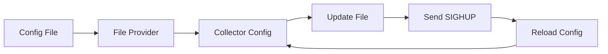

# How to Use the File Provider for Dynamic Collector Configuration

Author: [nawazdhandala](https://www.github.com/nawazdhandala)

Tags: OpenTelemetry, Collector, Configuration, File Provider, Dynamic Configuration

Description: Implement dynamic configuration reloading for the OpenTelemetry Collector using file providers to update collector behavior without restarts or downtime.

The OpenTelemetry Collector's file provider enables configuration to be loaded from files and file-backed configuration fragments. Combined with the Collector's configuration reload support, this lets you update collector behavior without a full process restart.

## Understanding Configuration Providers

Configuration providers are components that supply configuration data to the collector. While the standard collector can read a static file at startup, providers enable configuration to come from different URI schemes such as `file:`, `env:`, `yaml:`, `http:`, and `https:`.

The file provider reads configuration from a file URI. The Collector can also reload its configuration when you send it a SIGHUP signal:


```mermaid
graph LR
    A[Config File] --> B[File Provider]
    B --> C[Collector Config]
    C --> D[Update File]
    D --> E[Send SIGHUP]
    E --> F[Reload Config]
    F --> C
```

## Enabling the File Provider

The standard OpenTelemetry Collector and Collector Contrib distributions include the file provider. Use the `file:` scheme with `--config` to load configuration from a file.

Basic file provider configuration structure:

```yaml
# collector-config.yaml

receivers:
  otlp:
    protocols:
      grpc:
        endpoint: 0.0.0.0:4317

exporters:
  debug:
    verbosity: detailed

service:
  pipelines:
    traces:
      receivers: [otlp]
      exporters: [debug]
```

Start the collector with the file provider:

```bash
./otelcol-contrib --config=file:collector-config.yaml
```

After updating the file, validate the configuration and send SIGHUP to reload it:

```bash
./otelcol-contrib validate --config=file:collector-config.yaml
kill -HUP $(pgrep -f otelcol-contrib)
```

## Dynamic Pipeline Configuration

The file provider is useful for composing pipeline configuration from separate files. Create separate configuration files for different pipeline components that can be modified independently.

Main collector configuration:

```yaml
# collector-config.yaml
receivers:
  otlp:
    protocols:
      grpc:
        endpoint: 0.0.0.0:4317
      http:
        endpoint: 0.0.0.0:4318

# Reference external configuration fragments
exporters: ${file:/etc/otel/config.d/exporters.yaml}

processors: ${file:/etc/otel/config.d/processors.yaml}

service:
  pipelines: ${file:/etc/otel/config.d/pipelines.yaml}
```

Create modular configuration files:

```yaml
# /etc/otel/config.d/exporters.yaml
# Prometheus exporter for metrics
prometheus:
  endpoint: 0.0.0.0:8889

# OTLP exporter for traces
otlp/traces:
  endpoint: tempo.observability.svc:4317
  compression: gzip
  tls:
    insecure: false
    cert_file: /etc/certs/client.crt
    key_file: /etc/certs/client.key

# OTLP exporter for metrics
otlp/metrics:
  endpoint: mimir.observability.svc:4317
  compression: gzip

# OTLP exporter for Jaeger traces
otlp/jaeger:
  endpoint: jaeger-collector:4317
  tls:
    insecure: true
```

```yaml
# /etc/otel/config.d/processors.yaml
# Batch processor for all signals
batch:
  timeout: 10s
  send_batch_size: 1000
  send_batch_max_size: 1500

# Attributes processor for adding labels
attributes:
  actions:
    - key: environment
      value: production
      action: upsert
    - key: cluster
      value: us-east-1
      action: upsert

# Resource detection processor
resourcedetection:
  detectors: [env, system, docker]
  timeout: 5s

# Memory limiter to prevent OOM
memory_limiter:
  check_interval: 1s
  limit_mib: 512
  spike_limit_mib: 128
```

```yaml
# /etc/otel/config.d/pipelines.yaml
# Traces pipeline
traces:
  receivers: [otlp]
  processors: [memory_limiter, resourcedetection, attributes, batch]
  exporters: [otlp/traces, otlp/jaeger]

# Metrics pipeline
metrics:
  receivers: [otlp]
  processors: [memory_limiter, resourcedetection, attributes, batch]
  exporters: [otlp/metrics, prometheus]
```

When you modify any referenced file in `/etc/otel/config.d/`, validate the merged configuration and send SIGHUP to the collector to apply the change.

## Hot-Swapping Exporters

The file provider enables adding, removing, or modifying exporters without a full collector process restart. This is valuable for testing new backends or migrating between observability platforms.

Example of dynamically switching exporters:

```yaml
# collector-config.yaml
receivers:
  otlp:
    protocols:
      grpc:

processors:
  batch:

exporters: ${file:/etc/otel/config.d/exporters-active.yaml}

service:
  pipelines:
    traces:
      receivers: [otlp]
      processors: [batch]
      exporters: ${file:/etc/otel/config.d/trace-exporters.yaml}
```

```yaml
# /etc/otel/config.d/exporters-active.yaml
# Initially configured with debug exporter
debug:
  verbosity: detailed
```

```yaml
# /etc/otel/config.d/trace-exporters.yaml
- debug
```

Update the files to add a production exporter:

```yaml
# /etc/otel/config.d/exporters-active.yaml
# Add production OTLP exporter alongside debug
debug:
  verbosity: detailed

otlp/production:
  endpoint: prod-backend.example.com:4317
  compression: gzip
  retry_on_failure:
    enabled: true
    initial_interval: 5s
    max_interval: 30s
    max_elapsed_time: 300s
```

```yaml
# /etc/otel/config.d/trace-exporters.yaml
# Send to both exporters for validation
- debug
- otlp/production
```

After validating the production exporter works correctly, remove the debug exporter:

```yaml
# /etc/otel/config.d/exporters-active.yaml
# Final configuration with only production exporter
otlp/production:
  endpoint: prod-backend.example.com:4317
  compression: gzip
  retry_on_failure:
    enabled: true
    initial_interval: 5s
    max_interval: 30s
    max_elapsed_time: 300s
```

```yaml
# /etc/otel/config.d/trace-exporters.yaml
- otlp/production
```

The collector applies each valid reload without a full process restart, ensuring continuous data collection.

## Dynamic Sampling Configuration

Adjust sampling rates dynamically based on traffic patterns or debugging needs:

```yaml
# collector-config.yaml
receivers:
  otlp:
    protocols:
      grpc:

processors: ${file:/etc/otel/config.d/sampling.yaml}

exporters:
  otlp/traces:
    endpoint: tempo.observability.svc:4317

service:
  pipelines:
    traces:
      receivers: [otlp]
      processors: [tail_sampling, batch]
      exporters: [otlp/traces]
```

```yaml
# /etc/otel/config.d/sampling.yaml
# Tail sampling processor with dynamic rules
tail_sampling:
  # Decision wait time before sampling
  decision_wait: 10s

  # Number of traces to keep in memory
  num_traces: 100000

  # Sampling policies (can be modified dynamically)
  policies:
    # Always sample errors
    - name: error-policy
      type: status_code
      status_code:
        status_codes: [ERROR]

    # Sample 100% of slow requests
    - name: slow-requests
      type: latency
      latency:
        threshold_ms: 1000

    # Probabilistic sampling for normal traffic
    - name: probabilistic-policy
      type: probabilistic
      probabilistic:
        sampling_percentage: 10

batch:
  timeout: 10s
```

During a production incident, increase sampling for debugging:

```yaml
# /etc/otel/config.d/sampling.yaml
tail_sampling:
  decision_wait: 10s
  num_traces: 100000
  policies:
    # Keep error sampling
    - name: error-policy
      type: status_code
      status_code:
        status_codes: [ERROR]

    # Lower latency threshold to catch more issues
    - name: slow-requests
      type: latency
      latency:
        threshold_ms: 500  # Changed from 1000ms

    # Increase sampling to 50% during incident
    - name: probabilistic-policy
      type: probabilistic
      probabilistic:
        sampling_percentage: 50  # Changed from 10%

batch:
  timeout: 10s
```

## Configuration with GitOps

The file provider integrates well with GitOps workflows. Use Git repositories to version control collector configurations and deploy changes, then trigger a SIGHUP reload after validation.

Directory structure for GitOps:

```text
otel-config/
├── base/
│   ├── collector-config.yaml
│   └── receivers.yaml
├── overlays/
│   ├── development/
│   │   ├── exporters.yaml
│   │   └── pipelines.yaml
│   ├── staging/
│   │   ├── exporters.yaml
│   │   └── pipelines.yaml
│   └── production/
│       ├── exporters.yaml
│       ├── pipelines.yaml
│       └── sampling.yaml
└── deploy.sh
```

Base configuration (shared across environments):

```yaml
# base/collector-config.yaml
receivers:
  otlp:
    protocols:
      grpc:
        endpoint: 0.0.0.0:4317
      http:
        endpoint: 0.0.0.0:4318

  # Host metrics receiver
  hostmetrics:
    collection_interval: 30s
    scrapers:
      cpu: {}
      memory: {}
      disk: {}
      network: {}

exporters: ${file:/etc/otel/config.d/exporters.yaml}

processors:
  batch:
    timeout: 10s
    send_batch_size: 1000

  memory_limiter:
    check_interval: 1s
    limit_mib: 512

service:
  pipelines: ${file:/etc/otel/config.d/pipelines.yaml}
```

Environment-specific configurations:

```yaml
# overlays/production/exporters.yaml
otlp/tempo:
  endpoint: tempo-prod.monitoring.svc:4317
  compression: gzip
  tls:
    insecure: false
    cert_file: /etc/certs/client.crt
    key_file: /etc/certs/client.key

prometheus_remote_write:
  endpoint: https://prometheus-prod.monitoring.svc/api/v1/write
  tls:
    insecure: false
  headers:
    X-Scope-OrgID: production
```

```yaml
# overlays/production/pipelines.yaml
traces:
  receivers: [otlp]
  processors: [memory_limiter, batch]
  exporters: [otlp/tempo]

metrics:
  receivers: [otlp, hostmetrics]
  processors: [memory_limiter, batch]
  exporters: [prometheus_remote_write]
```

Deployment script:

```bash
#!/bin/bash
# deploy.sh

ENVIRONMENT=$1
CONFIG_DIR="/etc/otel/config.d"
MAIN_CONFIG="/etc/otel/collector-config.yaml"

if [ -z "$ENVIRONMENT" ]; then
  echo "Usage: $0 <environment>"
  exit 1
fi

# Validate environment exists
if [ ! -d "overlays/$ENVIRONMENT" ]; then
  echo "Error: Environment '$ENVIRONMENT' not found"
  exit 1
fi

# Copy base configuration
cp base/collector-config.yaml "$MAIN_CONFIG"

# Copy environment-specific configuration
cp overlays/$ENVIRONMENT/*.yaml "$CONFIG_DIR/"

# Validate the merged configuration
./otelcol-contrib validate --config="file:$MAIN_CONFIG"

# Reload the collector
kill -HUP $(pgrep -f otelcol-contrib)

echo "Configuration deployed for $ENVIRONMENT"
echo "Collector reload signal sent"
```

Deploy configuration:

```bash
# Deploy to production
./deploy.sh production

# The collector reloads after validation and SIGHUP
# No full collector process restart needed
```

## Monitoring Configuration Changes

Implement monitoring to track collector health and detect issues after configuration reloads:

```yaml
# collector-config.yaml
extensions:
  zpages:
    endpoint: 0.0.0.0:55679

service:
  telemetry:
    logs:
      # Enable detailed logging for config changes
      level: info

    metrics:
      # Expose detailed collector internal metrics
      level: detailed
      readers:
        - pull:
            exporter:
              prometheus:
                host: 0.0.0.0
                port: 8888

  # Enable zpages for debugging
  extensions: [zpages]

# Monitor configuration version on telemetry flowing through the pipeline
processors:
  attributes:
    actions:
      - key: config.version
        value: ${env:CONFIG_VERSION:-unknown}
        action: upsert
```

Query collector internal metrics to monitor reloads:

```promql
# Collector process uptime
otelcol_process_uptime

# Exporter metric point send failures
rate(otelcol_exporter_send_failed_metric_points[5m])

# Memory usage after reload
otelcol_process_memory_rss
```

## Error Handling and Rollback

When a reload fails because the new configuration is invalid, the collector logs the error. Validate configurations before deployment so invalid updates are not signaled to a running collector.

Create a validation script to test configurations before deployment:

```bash
#!/bin/bash
# validate-config.sh

CONFIG_FILE=$1

if [ -z "$CONFIG_FILE" ]; then
  echo "Usage: $0 <config-file>"
  exit 1
fi

# Validate YAML syntax
if ! yq eval '.' "$CONFIG_FILE" > /dev/null 2>&1; then
  echo "Error: Invalid YAML syntax in $CONFIG_FILE"
  exit 1
fi

# Use collector's validate command
if ! ./otelcol-contrib validate --config="file:$CONFIG_FILE"; then
  echo "Error: Configuration validation failed"
  exit 1
fi

echo "Configuration is valid"
```

Integrate validation into deployment:

```bash
#!/bin/bash
# safe-deploy.sh

ENVIRONMENT=$1
CONFIG_DIR="/etc/otel/config.d"
MAIN_CONFIG="/etc/otel/collector-config.yaml"
BACKUP_DIR="/etc/otel/backups/$(date +%Y%m%d-%H%M%S)"

# Create backup
mkdir -p "$BACKUP_DIR"
cp "$MAIN_CONFIG" "$BACKUP_DIR/"
cp "$CONFIG_DIR"/*.yaml "$BACKUP_DIR/"

# Validate new configuration
cp base/collector-config.yaml "$MAIN_CONFIG"
cp overlays/$ENVIRONMENT/*.yaml "$CONFIG_DIR/"

if ! ./otelcol-contrib validate --config="file:$MAIN_CONFIG"; then
  echo "Validation failed, rolling back"
  cp "$BACKUP_DIR"/collector-config.yaml "$MAIN_CONFIG"
  cp "$BACKUP_DIR"/*.yaml "$CONFIG_DIR/"
  exit 1
fi

# Reload configuration
kill -HUP $(pgrep -f otelcol-contrib)

# Monitor for errors (wait 30 seconds)
sleep 30

# Check collector logs for errors
if grep -q "ERROR" /var/log/otel-collector.log; then
  echo "Errors detected, rolling back"
  cp "$BACKUP_DIR"/collector-config.yaml "$MAIN_CONFIG"
  cp "$BACKUP_DIR"/*.yaml "$CONFIG_DIR/"
  kill -HUP $(pgrep -f otelcol-contrib)
  exit 1
fi

echo "Deployment successful"
```

## Best Practices

**Test Configurations**: Always validate configuration files before deploying to production using the collector's validate command.

**Version Control**: Store all configurations in Git to track changes and enable easy rollbacks.

**Monitoring**: Monitor collector metrics and logs to detect configuration reload issues.

**Gradual Rollouts**: When making significant changes, deploy to development and staging environments first.

**Backup Configurations**: Maintain backups of working configurations for quick rollback if needed.

**Documentation**: Document the purpose of each configuration file and when to modify it.

For more advanced configuration management, explore [HTTP provider for remote configuration](https://oneuptime.com/blog/post/2026-02-06-http-provider-remote-collector-configuration/view) or [OpAMP for centralized management](https://oneuptime.com/blog/post/2026-02-06-manage-collector-configuration-opamp/view). You can also use [environment variables](https://oneuptime.com/blog/post/2026-02-06-environment-variables-opentelemetry-collector-configuration/view) alongside file providers for maximum flexibility.

## Conclusion

The file provider helps transform the OpenTelemetry Collector from a single static configuration file into a composable, adaptable system. By validating file-backed changes and reloading configuration without a full process restart, teams can respond quickly to production issues, test new exporters safely, and implement GitOps workflows. Combined with proper validation and monitoring, the file provider provides a robust foundation for managing collector configurations at scale.
