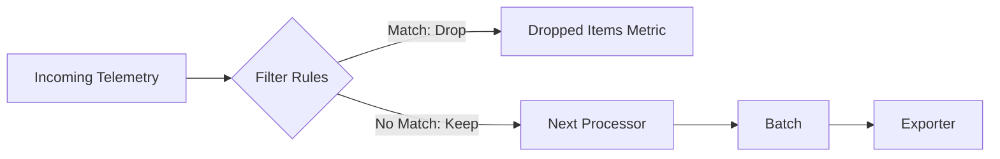

# How to Configure the Filter Processor in the OpenTelemetry Collector

Author: [nawazdhandala](https://www.github.com/nawazdhandala)

Tags: OpenTelemetry, Collector, Processor, Filter Processor, Data Filtering, Cost Optimization, Sampling

Description: Master the filter processor in OpenTelemetry Collector to drop unwanted telemetry, reduce costs, eliminate noise, and control data volume with precision filtering rules.

The filter processor enables selective dropping of telemetry data in the OpenTelemetry Collector based on configurable criteria. It acts as a gatekeeper in your pipeline, allowing only valuable telemetry to flow to downstream processors and exporters while discarding noise, health checks, debugging spans, and other unwanted data.

Proper filtering is essential for production observability pipelines. It reduces storage costs, improves query performance, decreases network bandwidth consumption, and eliminates alert fatigue by removing telemetry that provides no actionable insights.

## Why Filtering Matters

Unfiltered telemetry pipelines suffer from several problems:

- **Excessive costs**: Storage and ingestion charges for millions of health check spans and debug logs
- **Noise pollution**: Important signals buried in verbose debug output
- **Performance degradation**: Backends slowed by processing irrelevant data
- **Alert fatigue**: Dashboards and alerts triggered by noise rather than real issues
- **Compliance risk**: Sensitive data accidentally exported before sanitization

The filter processor solves these problems by dropping unwanted telemetry early in the pipeline, before it consumes resources or reaches backends.

## How Filter Processor Works

The filter processor evaluates telemetry items against configured rules and either passes them through or drops them:


```mermaid
graph LR
    A[Incoming Telemetry] --> B{Filter Rules}
    B -->|Match: Drop| C[Dropped Items Metric]
    B -->|No Match: Keep| D[Next Processor]
    D --> E[Batch]
    E --> F[Exporter]
```

Filtering happens early in the processor chain, preventing dropped items from consuming memory or CPU in downstream processors.

## Basic Configuration

Here's a minimal filter processor configuration:

```yaml
receivers:
  otlp:
    protocols:
      grpc:
        endpoint: 0.0.0.0:4317

processors:
  filter:
    trace_conditions:
      # Drop health check spans
      - 'span.attributes["http.target"] == "/healthz"'
      - 'span.attributes["http.target"] == "/readyz"'

  batch:
    timeout: 5s
    send_batch_size: 1024

exporters:
  otlphttp:
    endpoint: https://oneuptime.com/otlp
    encoding: json
    headers:
      x-oneuptime-token: "YOUR_TOKEN"

service:
  pipelines:
    traces:
      receivers: [otlp]
      processors: [filter, batch]
      exporters: [otlphttp]
```

This configuration drops spans for health check endpoints before they reach the batch processor and exporter.

## Core Configuration Structure

The filter processor uses OTTL (OpenTelemetry Transformation Language) for filtering rules:

```yaml
processors:
  filter:
    # Error mode: "ignore" (log and continue) or "propagate" (fail pipeline)
    error_mode: ignore

    trace_conditions:
      - 'span.condition1'
      - 'spanevent.condition2'

    metric_conditions:
      - 'metric.condition3'
      - 'datapoint.condition4'

    log_conditions:
      - 'log.condition5'
```

Each condition is an OTTL expression that returns true (drop) or false (keep).

## Filtering Traces

### Dropping Spans by Attribute

Filter out health checks and internal endpoints:

```yaml
processors:
  filter:
    trace_conditions:
      # Drop health check endpoints
      - 'span.attributes["http.target"] == "/healthz"'
      - 'span.attributes["http.target"] == "/readyz"'
      - 'span.attributes["http.target"] == "/livez"'

      # Drop metrics scrape endpoints
      - 'span.attributes["http.target"] == "/metrics"'

      # Drop Kubernetes probes
      - 'IsMatch(span.attributes["user_agent"], ".*kube-probe.*")'
```

### Dropping Spans by Name

Filter based on span operation names:

```yaml
processors:
  filter:
    trace_conditions:
      # Drop debugging spans
      - 'span.name == "debug.trace"'

      # Drop internal monitoring spans
      - 'IsMatch(span.name, "^internal\\..*")'

      # Drop low-value spans
      - 'span.name == "noop"'
```

### Dropping Spans by Status

Remove successful spans to focus on errors:

```yaml
processors:
  filter:
    trace_conditions:
      # Only keep error spans (drop OK spans)
      - 'span.status.code == STATUS_CODE_OK'

      # Alternative: keep errors and warnings only
      # This drops STATUS_CODE_OK, keeping ERROR and UNSET
```

**Note**: Be cautious with this approach. Dropping all successful spans eliminates baseline behavior needed for anomaly detection and performance analysis. Consider sampling instead of filtering for success cases.

### Dropping Spans by Duration

Filter out very short spans that provide little value:

```yaml
processors:
  filter:
    trace_conditions:
      # Drop spans shorter than 1ms
      - '(span.end_time - span.start_time) < Duration("1ms")'

      # Drop very long timeout spans (> 30 seconds)
      - '(span.end_time - span.start_time) > Duration("30s")'
```

### Dropping Spans by Service

Exclude telemetry from specific services:

```yaml
processors:
  filter:
    trace_conditions:
      # Drop spans from test services
      - 'resource.attributes["service.name"] == "test-service"'

      # Drop spans from staging environment
      - 'resource.attributes["deployment.environment"] == "staging"'
```

### Combining Multiple Conditions

Use logical operators for complex filtering:

```yaml
processors:
  filter:
    trace_conditions:
      # Drop successful health checks
      - 'span.attributes["http.target"] == "/healthz" and span.status.code == STATUS_CODE_OK'

      # Drop fast successful requests to static content
      - 'IsMatch(span.attributes["http.target"], ".*/static/.*") and span.status.code == STATUS_CODE_OK and (span.end_time - span.start_time) < Duration("10ms")'

      # Drop internal service-to-service health checks
      - 'resource.attributes["service.name"] == "health-checker" and span.attributes["http.method"] == "GET"'
```

## Filtering Metrics

### Dropping Metrics by Name

Remove unwanted metric families:

```yaml
processors:
  filter:
    metric_conditions:
      # Drop Go runtime metrics
      - 'IsMatch(metric.name, "^go_.*")'

      # Drop process metrics
      - 'IsMatch(metric.name, "^process_.*")'

      # Drop specific noisy metrics
      - 'metric.name == "http.server.request.body.size"'
```

### Dropping Metric Data Points

Filter specific data points within a metric:

```yaml
processors:
  filter:
    metric_conditions:
      # Drop data points with specific attribute values
      - 'datapoint.attributes["http.status_code"] == "200"'

      # Drop data points below threshold
      - 'datapoint.value_int < 10'

      # Drop data points from test environments
      - 'resource.attributes["environment"] == "test"'
```

### Dropping High-Cardinality Metrics

Control cardinality explosion:

```yaml
processors:
  filter:
    metric_conditions:
      # Drop data points with user-specific labels
      - 'datapoint.attributes["user.id"] != ""'

      # Drop data points with session IDs
      - 'datapoint.attributes["session.id"] != ""'

      # Drop data points with UUIDs in paths
      - 'IsMatch(datapoint.attributes["http.route"], ".*[a-f0-9]{8}-[a-f0-9]{4}-.*")'
```

## Filtering Logs

### Dropping Logs by Level

Remove verbose log levels in production:

```yaml
processors:
  filter:
    log_conditions:
      # Drop debug logs
      - 'log.severity_text == "DEBUG"'

      # Drop trace logs
      - 'log.severity_text == "TRACE"'

      # Alternative: keep only warnings and errors
      - 'log.severity_number < SEVERITY_NUMBER_WARN'
```

### Dropping Logs by Body Content

Filter based on log message content:

```yaml
processors:
  filter:
    log_conditions:
      # Drop health check logs
      - 'IsMatch(log.body, ".*health check.*")'

      # Drop verbose library logs
      - 'IsMatch(log.body, ".*DEBUG: .*")'

      # Drop specific noisy patterns
      - 'IsMatch(log.body, ".*Connection pool.*")'
```

### Dropping Logs by Attribute

Remove logs with specific attributes:

```yaml
processors:
  filter:
    log_conditions:
      # Drop logs from test users
      - 'log.attributes["user.id"] == "test-user"'

      # Drop internal monitoring logs
      - 'log.attributes["log.source"] == "internal-monitor"'

      # Drop logs from specific services
      - 'resource.attributes["service.name"] == "chatty-service"'
```

## Advanced Filtering Patterns

### Inverse Filtering (Keep Only)

The filter processor drops matching items. To keep only specific items, invert your logic:

```yaml
processors:
  filter:
    trace_conditions:
      # Keep ONLY errors: drop everything that's NOT an error
      - 'span.status.code != STATUS_CODE_ERROR'

      # Keep ONLY slow spans: drop fast spans
      - '(span.end_time - span.start_time) < Duration("500ms")'  # Drop spans < 500ms

      # Keep ONLY specific services: drop others
      - 'resource.attributes["service.name"] != "critical-service"'
```

### Environment-Specific Filtering

Different filtering rules for different environments:

```yaml
processors:
  # Production: aggressive filtering
  filter/prod:
    trace_conditions:
      - 'span.attributes["http.target"] == "/healthz"'
      - 'span.status.code == STATUS_CODE_OK and (span.end_time - span.start_time) < Duration("100ms")'

  # Staging: keep more data
  filter/staging:
    trace_conditions:
      - 'span.attributes["http.target"] == "/healthz"'

  # Development: minimal filtering
  filter/dev:
    trace_conditions:
      - 'span.attributes["http.target"] == "/internal/debug"'

service:
  pipelines:
    traces/prod:
      receivers: [otlp]
      processors: [filter/prod, batch]
      exporters: [otlphttp]

    traces/staging:
      receivers: [otlp]
      processors: [filter/staging, batch]
      exporters: [otlphttp]
```

Select the appropriate pipeline at deployment time based on environment.

### Sampling vs. Filtering

Sometimes you want to reduce volume without complete elimination. Combine filtering with probabilistic sampling:

```yaml
processors:
  # First, drop definite noise
  filter:
    trace_conditions:
      - 'span.attributes["http.target"] == "/healthz"'

  # Then, sample remaining traces
  probabilistic_sampler:
    sampling_percentage: 10  # Keep 10% of remaining traces

  batch:
    timeout: 5s

service:
  pipelines:
    traces:
      processors: [filter, probabilistic_sampler, batch]
```

This approach drops noise completely while sampling useful telemetry to manage volume.

### Multi-Stage Filtering

Complex filtering scenarios often need multiple stages:

```yaml
processors:
  # Stage 1: Drop absolute noise
  filter/noise:
    trace_conditions:
      - 'span.attributes["http.target"] == "/healthz"'
      - 'span.attributes["http.target"] == "/metrics"'

  # Stage 2: Drop fast successful requests
  filter/successful:
    trace_conditions:
      - 'span.status.code == STATUS_CODE_OK and (span.end_time - span.start_time) < Duration("50ms")'

  # Stage 3: Drop internal testing traffic
  filter/testing:
    trace_conditions:
      - 'IsMatch(span.attributes["user_agent"], ".*test.*")'

  batch:
    timeout: 5s

service:
  pipelines:
    traces:
      processors: [filter/noise, filter/successful, filter/testing, batch]
```

This staged approach makes the pipeline easier to understand and modify.

## Common Filtering Scenarios

### Scenario 1: SaaS Cost Reduction

Drop high-volume, low-value telemetry to reduce SaaS observability costs:

```yaml
processors:
  filter/cost_reduction:
    trace_conditions:
      # Drop health checks (often 30-50% of volume)
      - 'IsMatch(span.attributes["http.target"], ".*health.*")'

      # Drop successful sub-10ms spans (fast, unlikely to be issues)
      - 'span.status.code == STATUS_CODE_OK and (span.end_time - span.start_time) < Duration("10ms")'

      # Drop internal monitoring spans
      - 'IsMatch(resource.attributes["service.name"], ".*monitor.*")'

      # Drop static asset requests
      - 'IsMatch(span.attributes["http.target"], ".*/static/.*")'

    metric_conditions:
      # Drop runtime metrics (often not actionable)
      - 'IsMatch(metric.name, "^(go_|process_).*")'

    log_conditions:
      # Drop debug logs
      - 'log.severity_number < SEVERITY_NUMBER_INFO'
```

This configuration can reduce telemetry volume by 50-70% while retaining actionable signals.

### Scenario 2: PII Compliance

Ensure no PII-containing telemetry reaches backends:

```yaml
processors:
  # Drop telemetry containing PII
  filter/pii:
    trace_conditions:
      # Drop spans with email attributes
      - 'span.attributes["user.email"] != ""'

      # Drop spans with phone numbers
      - 'span.attributes["user.phone"] != ""'

      # Drop spans with credit card patterns
      - 'IsMatch(span.attributes["payment.card"], ".*[0-9]{4}-[0-9]{4}-[0-9]{4}-[0-9]{4}.*")'

    log_conditions:
      # Drop logs containing email patterns
      - 'IsMatch(log.body, ".*@.*\\.com.*")'

      # Drop logs with social security numbers
      - 'IsMatch(log.body, ".*[0-9]{3}-[0-9]{2}-[0-9]{4}.*")'
```

**Important**: Filtering for PII compliance should be combined with the attributes processor to mask PII in remaining telemetry. Filtering alone isn't sufficient.

### Scenario 3: High-Cardinality Control

Prevent cardinality explosion in backends:

```yaml
processors:
  filter/cardinality:
    trace_conditions:
      # Drop spans with user IDs (unbounded cardinality)
      - 'span.attributes["user.id"] != ""'

      # Drop spans with session IDs
      - 'span.attributes["session.id"] != ""'

      # Drop spans with request IDs
      - 'span.attributes["request.id"] != ""'

    metric_conditions:
      # Drop metric data points with unbounded labels
      - 'datapoint.attributes["user.id"] != ""'
      - 'datapoint.attributes["trace.id"] != ""'
```

This prevents high-cardinality attributes from exploding metric dimensions, which can crash backends or drive up costs dramatically.

### Scenario 4: Multi-Tenant Filtering

Different filtering rules per tenant:

```yaml
processors:
  # Free tier: aggressive filtering
  filter/free_tier:
    trace_conditions:
      - 'resource.attributes["tenant.tier"] == "free" and span.status.code == STATUS_CODE_OK'
      - 'resource.attributes["tenant.tier"] == "free" and (span.end_time - span.start_time) < Duration("100ms")'

  # Paid tier: moderate filtering
  filter/paid_tier:
    trace_conditions:
      - 'resource.attributes["tenant.tier"] == "paid" and span.attributes["http.target"] == "/healthz"'

  # Enterprise tier: minimal filtering
  filter/enterprise_tier:
    trace_conditions:
      - 'resource.attributes["tenant.tier"] == "enterprise" and span.attributes["http.target"] == "/healthz"'
```

Note: This requires routing to different pipelines based on tenant tier, which is complex. Often better handled at the receiver or routing level.

## Performance Considerations

Filtering improves overall pipeline performance by reducing downstream processing, but the filter processor itself has costs:

### Efficient Filtering

```yaml
processors:
  filter:
    trace_conditions:
      # Simple equality checks are fast
      - 'span.attributes["http.target"] == "/healthz"'

      # Direct attribute access is fast
      - 'span.status.code == STATUS_CODE_OK'
```

### Less Efficient Filtering

```yaml
processors:
  filter:
    trace_conditions:
      # Complex regex patterns are slower
      - 'IsMatch(span.attributes["http.target"], ".*very(complex|regex|with|many|alternatives).*")'

      # Multiple nested conditions can be slow
      - 'span.attributes["a"] == "1" and (span.attributes["b"] == "2" or (span.attributes["c"] == "3" and span.attributes["d"] == "4"))'
```

**Best practices**:
1. Place filter processor early in pipeline (before expensive processors)
2. Use simple conditions when possible (equality over regex)
3. Combine related conditions into a single filter processor
4. Test performance impact with realistic load

## Monitoring Filter Processor

Track filtering effectiveness with collector metrics:

```bash
# Query collector metrics

curl http://localhost:8888/metrics | grep processor

# Key metrics:
# - otelcol_processor_incoming_items: Items passed to a processor
# - otelcol_processor_outgoing_items: Items emitted by a processor
```

### Healthy Filtering Patterns

```text
otelcol_processor_incoming_items{processor="filter"} 200000
otelcol_processor_outgoing_items{processor="filter"} 50000
```

Drop rate: 75% based on `(incoming - outgoing) / incoming`. This is typical for aggressive health check filtering.

### Alert on Unexpected Changes

```yaml
# Alert if drop rate changes significantly
- alert: FilterDropRateChanged
  expr: |
    (
      rate(otelcol_processor_incoming_items{processor="filter"}[5m])
      -
      rate(otelcol_processor_outgoing_items{processor="filter"}[5m])
    )
    /
    rate(otelcol_processor_incoming_items{processor="filter"}[5m])
    > 0.9  # More than 90% dropped
  annotations:
    summary: Filter processor drop rate unusually high
```

## Troubleshooting Common Issues

### Issue 1: Filter Not Dropping Expected Telemetry

**Symptom**: Telemetry you expected to be dropped still appears in backends.

**Diagnosis**:

```yaml
exporters:
  debug:
    verbosity: detailed

service:
  pipelines:
    traces:
      processors: [filter, batch]
      exporters: [debug, otlphttp]
```

Check debug output to see if filtered items are present.

**Common causes**:

1. **Incorrect OTTL expression**:

```yaml
# WRONG: Using wrong attribute key
- 'span.attributes["http.path"] == "/healthz"'

# CORRECT: Using correct attribute key
- 'span.attributes["http.target"] == "/healthz"'
```

2. **Wrong data type comparison**:

```yaml
# WRONG: Comparing int to string
- 'span.attributes["http.status_code"] == "200"'

# CORRECT: Match the actual attribute type
- 'span.attributes["http.status_code"] == 200'
```

3. **Resource vs. span attributes confusion**:

```yaml
# WRONG: Looking for service.name in span attributes
- 'span.attributes["service.name"] == "my-service"'

# CORRECT: Looking in resource attributes
- 'resource.attributes["service.name"] == "my-service"'
```

### Issue 2: Filter Dropping Too Much

**Symptom**: Important telemetry being dropped unexpectedly.

**Solution**: Add negative conditions to exclude important telemetry:

```yaml
processors:
  filter:
    trace_conditions:
      # Drop successful spans EXCEPT errors
      - 'span.status.code == STATUS_CODE_OK and span.attributes["http.target"] != "/critical-endpoint"'
```

Or use multiple filter processors with clear separation:

```yaml
processors:
  filter/aggressive:
    trace_conditions:
      - 'span.attributes["http.target"] == "/healthz"'

  filter/conditional:
    trace_conditions:
      # Only drop successful fast requests (keep errors)
      - 'span.status.code == STATUS_CODE_OK and (span.end_time - span.start_time) < Duration("100ms")'
```

### Issue 3: Performance Degradation

**Symptom**: Collector CPU usage high, latency increased after adding filter.

**Solution**: Simplify filter conditions:

```yaml
# BEFORE: Complex regex
processors:
  filter:
    trace_conditions:
      - 'IsMatch(span.attributes["http.target"], ".*/(health|ready|live|metrics|debug).*")'

# AFTER: Multiple simple equality checks (faster)
processors:
  filter:
    trace_conditions:
      - 'span.attributes["http.target"] == "/health"'
      - 'span.attributes["http.target"] == "/ready"'
      - 'span.attributes["http.target"] == "/live"'
      - 'span.attributes["http.target"] == "/metrics"'
      - 'span.attributes["http.target"] == "/debug"'
```

## Testing Filter Configuration

Validate filtering rules with a test pipeline:

```yaml
receivers:
  otlp:
    protocols:
      grpc:
        endpoint: 0.0.0.0:4317

processors:
  filter:
    trace_conditions:
      - 'span.attributes["http.target"] == "/healthz"'

exporters:
  debug:
    verbosity: detailed

  otlphttp:
    endpoint: https://oneuptime.com/otlp

service:
  telemetry:
    metrics:
      readers:
        - pull:
            exporter:
              prometheus:
                host: 0.0.0.0
                port: 8888

  pipelines:
    traces:
      receivers: [otlp]
      processors: [filter]
      exporters: [debug, otlphttp]
```

Send test telemetry and verify filtering:

```bash
# Start collector
otelcol --config test-config.yaml

# Send test spans with /healthz endpoint
# Send test spans with other endpoints

# Check logs for filtered vs. passed spans
# Query metrics for drop counts
curl http://localhost:8888/metrics | grep otelcol_processor
```

## Production Checklist

Before deploying filter processor to production:

- [ ] Filter rules tested with representative telemetry samples
- [ ] Debug exporter used to validate filtering during testing
- [ ] Filter processor placed early in pipeline (before expensive processors)
- [ ] Drop rate monitored with collector metrics
- [ ] Alerts configured for unexpected drop rate changes
- [ ] Filter rules documented with rationale
- [ ] OTTL expressions validated for syntax and logic
- [ ] Resource vs. span attribute distinction understood
- [ ] Performance tested under realistic load
- [ ] Backup plan for recovering accidentally dropped telemetry

## Key Takeaways

The filter processor is essential for controlling telemetry volume, reducing costs, and eliminating noise in production OpenTelemetry pipelines. It enables precise, rule-based dropping of unwanted telemetry before it consumes resources or reaches backends.

Use it to drop health checks, debug telemetry, successful fast requests, and high-cardinality data. Place it early in your processor chain to maximize benefits, and monitor drop rates to ensure filters work as expected.

Combine filtering with sampling, attribute processing, and resource detection for comprehensive telemetry pipeline control.

**Related Reading:**

- [How to Configure the Attributes Processor in the OpenTelemetry Collector](https://oneuptime.com/blog/post/2026-02-06-attributes-processor-opentelemetry-collector/view)
- [How to Configure the Transform Processor in the OpenTelemetry Collector](https://oneuptime.com/blog/post/2026-02-06-transform-processor-opentelemetry-collector/view)
- [How to reduce noise in OpenTelemetry?](https://oneuptime.com/blog/post/2025-08-25-how-to-reduce-noise-in-opentelemetry/view)
