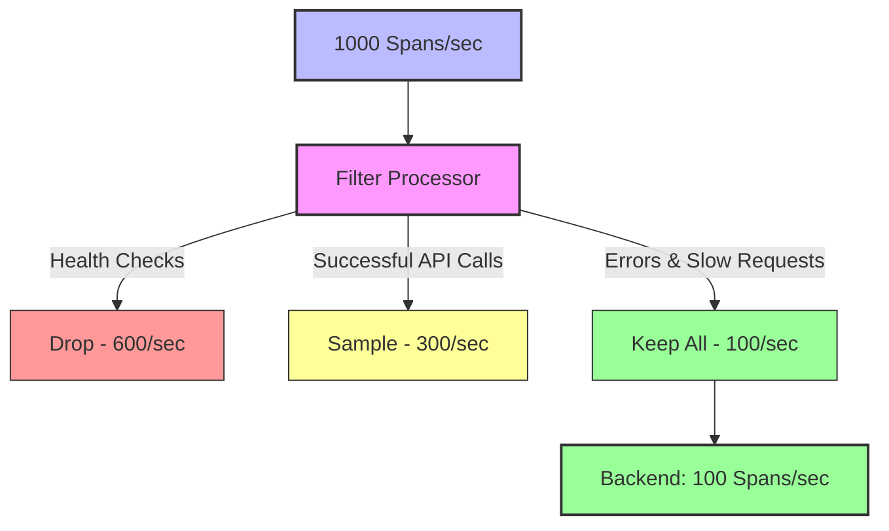

# How to Filter Spans Using OTTL in the OpenTelemetry Collector

Author: [nawazdhandala](https://www.github.com/nawazdhandala)

Tags: OpenTelemetry, Collector, Processors, OTTL, Filtering, Spans, Performance

Description: Master span filtering with OTTL expressions in the OpenTelemetry Collector to reduce data volume, improve performance, and focus on meaningful telemetry.

Filtering spans is a critical capability for managing telemetry costs, improving pipeline performance, and focusing observability efforts on meaningful data. The OpenTelemetry Collector's Filter processor, combined with OTTL (OpenTelemetry Transformation Language) expressions, provides powerful filtering capabilities that can dramatically reduce data volume while preserving essential insights.

## Why Filter Spans

Production systems generate massive volumes of telemetry data, much of which provides limited observability value. Common scenarios requiring span filtering include:

- Health check endpoints generating thousands of identical spans per minute
- Internal service-to-service calls with minimal diagnostic value
- Successful requests in high-throughput APIs where only errors matter
- Debug traces from testing environments accidentally sent to production
- High-cardinality spans that overwhelm storage and query systems

Strategic filtering reduces costs, improves query performance, and ensures observability tools focus on actionable data.



## Basic Filter Configuration

The Filter processor supports both include and exclude patterns. Spans matching include patterns are kept, while those matching exclude patterns are dropped.

Here is a basic configuration filtering health check spans:

```yaml
# Basic span filtering configuration
processors:
  filter:
    # Define spans to exclude
    spans:
      exclude:
        match_type: strict
        span_names:
          - /health
          - /healthz
          - /ping

service:
  pipelines:
    traces:
      receivers: [otlp]
      processors: [filter, batch]
      exporters: [otlp]
```

This configuration drops all spans with names exactly matching the health check endpoints, reducing telemetry volume without losing meaningful data.

## OTTL Expression Filtering

OTTL expressions provide far more flexibility than simple name matching. The `expr` match type enables complex filtering logic based on any span attribute, status, duration, or other properties.

```yaml
# OTTL expression filtering
processors:
  filter:
    spans:
      exclude:
        match_type: expr
        expressions:
          # Drop health check spans
          - name == "/health"
          # Drop successful requests from specific endpoints
          - name == "/api/v1/users" and status.code == STATUS_CODE_OK
          # Drop fast requests (under 10ms)
          - (end_time - start_time) < 10000000
```

OTTL expressions combine conditions using logical operators (`and`, `or`, `not`) and comparison operators (`==`, `!=`, `<`, `<=`, `>`, `>=`).

## Filtering by Attributes

Most filtering decisions depend on span attributes. OTTL provides full access to span attributes through the `attributes` map.

```yaml
# Attribute-based filtering
processors:
  filter:
    spans:
      exclude:
        match_type: expr
        expressions:
          # Drop internal testing traffic
          - attributes["http.user_agent"] == "HealthCheckBot"

          # Drop requests from specific client
          - attributes["client.id"] == "internal-monitoring"

          # Drop spans without important attributes
          - attributes["user.id"] == nil

          # Drop debug spans in production
          - attributes["log.level"] == "debug" and resource.attributes["deployment.environment"] == "production"
```

Attribute-based filtering enables precise control over what telemetry is retained.

## Filtering by HTTP Status

For HTTP services, filtering by status code is a common requirement. Keep error traces while sampling or dropping successful requests.

```yaml
# HTTP status filtering
processors:
  filter:
    spans:
      exclude:
        match_type: expr
        expressions:
          # Drop successful health checks
          - name == "/health" and attributes["http.status_code"] >= 200 and attributes["http.status_code"] < 300

          # Drop redirects
          - attributes["http.status_code"] >= 300 and attributes["http.status_code"] < 400

      # Alternatively, use include to keep only errors
      # include:
      #   match_type: expr
      #   expressions:
      #     - attributes["http.status_code"] >= 400
```

This approach dramatically reduces volume while preserving error traces for debugging.

## Duration-Based Filtering

Filter spans based on duration to focus on slow requests that impact user experience.

```yaml
# Duration-based filtering
processors:
  filter:
    spans:
      # Keep only slow spans
      include:
        match_type: expr
        expressions:
          # Keep spans longer than 1 second (1 billion nanoseconds)
          - (end_time - start_time) > 1000000000

      # Or exclude fast spans
      # exclude:
      #   match_type: expr
      #   expressions:
      #     # Drop spans faster than 10ms
      #     - (end_time - start_time) < 10000000
```

Duration filtering helps identify performance bottlenecks while reducing volume from fast, successful operations.

## Complex Filtering Logic

Combine multiple conditions to implement sophisticated filtering strategies.

```yaml
# Complex filtering logic
processors:
  filter:
    spans:
      exclude:
        match_type: expr
        expressions:
          # Drop fast, successful health checks
          - name == "/health" and (end_time - start_time) < 100000000 and status.code == STATUS_CODE_OK

          # Drop internal API calls that succeeded quickly
          - attributes["http.target"] matches "^/internal/" and attributes["http.status_code"] < 300 and (end_time - start_time) < 50000000

          # Drop GET requests to static assets that succeeded
          - attributes["http.method"] == "GET" and attributes["http.target"] matches "\\.(js|css|png|jpg|gif)$" and attributes["http.status_code"] == 200

      include:
        match_type: expr
        expressions:
          # Always keep errors
          - status.code == STATUS_CODE_ERROR

          # Always keep slow requests
          - (end_time - start_time) > 1000000000

          # Always keep requests from premium customers
          - attributes["customer.tier"] == "premium"
```

Complex logic enables fine-tuned filtering that balances cost reduction with observability requirements.

## Service-Specific Filtering

Different services have different filtering needs. Use service name or other resource attributes to apply service-specific rules.

```yaml
# Service-specific filtering
processors:
  filter:
    spans:
      exclude:
        match_type: expr
        expressions:
          # Drop health checks only from web service
          - name == "/health" and resource.attributes["service.name"] == "web"

          # Drop debug logs only from non-production
          - attributes["log.level"] == "debug" and resource.attributes["deployment.environment"] != "production"

          # Drop fast spans only from API service
          - (end_time - start_time) < 10000000 and resource.attributes["service.name"] == "api"
```

Service-specific filtering ensures each service's unique characteristics are handled appropriately.

## Regular Expression Filtering

Use regular expressions for pattern-based filtering.

```yaml
# Regular expression filtering
processors:
  filter:
    spans:
      exclude:
        match_type: expr
        expressions:
          # Drop all health check variations
          - name matches "^/(health|ping|ready|live)"

          # Drop API versioned endpoint patterns
          - attributes["http.target"] matches "^/api/v[0-9]+/internal"

          # Drop test user traffic
          - attributes["user.email"] matches ".*@test\\.example\\.com$"

          # Drop static file requests
          - attributes["http.target"] matches "\\.(css|js|png|jpg|gif|ico|woff|woff2)$"
```

Regular expressions provide flexible pattern matching for complex filtering scenarios.

## Combining Multiple Filter Processors

Use multiple Filter processor instances for different filtering stages.

```yaml
# Multiple filter processors
processors:
  # First stage: drop obvious noise
  filter/noise:
    spans:
      exclude:
        match_type: expr
        expressions:
          - name == "/health"
          - name == "/metrics"

  # Second stage: keep only interesting spans
  filter/interesting:
    spans:
      include:
        match_type: expr
        expressions:
          # Keep errors
          - status.code == STATUS_CODE_ERROR
          # Keep slow requests
          - (end_time - start_time) > 500000000
          # Keep specific endpoints
          - name matches "^/api/v1/(orders|payments)"

  # Third stage: sample remaining spans
  probabilistic_sampler:
    sampling_percentage: 10

service:
  pipelines:
    traces:
      receivers: [otlp]
      processors:
        - filter/noise
        - filter/interesting
        - probabilistic_sampler
        - batch
      exporters: [otlp]
```

This multi-stage approach first removes noise, then keeps high-value spans, then samples the remainder.

## Filtering Root Spans vs Child Spans

Filter root spans (entry points) differently from child spans (internal operations).

```yaml
# Root span vs child span filtering
processors:
  filter:
    spans:
      exclude:
        match_type: expr
        expressions:
          # Drop fast child spans (internal operations)
          - parent_span_id != "" and (end_time - start_time) < 5000000

          # Drop successful internal operations
          - parent_span_id != "" and status.code == STATUS_CODE_OK and attributes["span.kind"] == "INTERNAL"

      include:
        match_type: expr
        expressions:
          # Always keep root spans (entry points)
          - parent_span_id == ""
```

This preserves complete traces while filtering internal operations that provide limited value.

## Error-Focused Filtering

Focus on errors by keeping error spans and their context while dropping successful operations.

```yaml
# Error-focused filtering
processors:
  filter:
    spans:
      include:
        match_type: expr
        expressions:
          # Keep all errors
          - status.code == STATUS_CODE_ERROR

          # Keep HTTP errors (4xx, 5xx)
          - attributes["http.status_code"] >= 400

          # Keep spans with error in name
          - name matches "(?i)error"

          # Keep spans with exception events
          - events exists and events[0].name == "exception"

          # Keep spans that are parents of errors (requires context)
          - trace_state contains "error=true"
```

Error-focused filtering ensures debugging information is retained while reducing volume from successful operations.

## Sampling Integration

Combine filtering with sampling for comprehensive volume control.

```yaml
# Filtering with sampling
processors:
  # First, filter obvious noise
  filter/noise:
    spans:
      exclude:
        match_type: expr
        expressions:
          - name matches "^/(health|ping|metrics)"

  # Then, separate into high and low priority
  filter/high_priority:
    spans:
      include:
        match_type: expr
        expressions:
          # High priority: errors and slow requests
          - status.code == STATUS_CODE_ERROR or (end_time - start_time) > 1000000000

  # Sample low priority spans
  probabilistic_sampler:
    sampling_percentage: 5

service:
  pipelines:
    # High priority pipeline: no sampling
    traces/high_priority:
      receivers: [otlp]
      processors:
        - filter/noise
        - filter/high_priority
        - batch
      exporters: [otlp/backend]

    # Low priority pipeline: aggressive sampling
    traces/low_priority:
      receivers: [otlp]
      processors:
        - filter/noise
        - probabilistic_sampler
        - batch
      exporters: [otlp/backend]
```

This approach ensures important traces are always kept while aggressively sampling routine operations.

## User-Based Filtering

Filter based on user attributes for multi-tenant applications.

```yaml
# User-based filtering
processors:
  filter:
    spans:
      include:
        match_type: expr
        expressions:
          # Keep all spans for premium users
          - attributes["user.tier"] == "premium"

          # Keep all spans for specific test users during development
          - attributes["user.id"] matches "^test-"

      exclude:
        match_type: expr
        expressions:
          # Drop anonymous user traffic
          - attributes["user.id"] == "anonymous"

          # Drop banned user traffic
          - attributes["user.status"] == "banned"
```

User-based filtering enables different observability levels for different user segments.

## Environment-Based Filtering

Apply different filtering rules per environment.

```yaml
# Environment-based filtering
processors:
  filter:
    spans:
      exclude:
        match_type: expr
        expressions:
          # In production: drop debug spans
          - attributes["log.level"] == "debug" and resource.attributes["deployment.environment"] == "production"

          # In development: keep everything (no exclusions)

          # In staging: drop health checks only
          - name == "/health" and resource.attributes["deployment.environment"] == "staging"
```

Environment-specific filtering ensures appropriate telemetry collection for each deployment stage.

## Performance Impact

Filtering reduces collector CPU, memory, and network usage by processing fewer spans. However, complex OTTL expressions do incur evaluation overhead.

Performance best practices:

1. **Filter early**: Place Filter processors early in the pipeline before expensive operations
2. **Simple expressions first**: Evaluate cheap conditions before expensive regex operations
3. **Avoid redundant evaluation**: Don't check the same condition multiple times
4. **Use strict matching when possible**: Exact string matching is faster than regex

Optimized configuration:

```yaml
# Performance-optimized filtering
processors:
  filter:
    spans:
      exclude:
        match_type: expr
        expressions:
          # Fast checks first
          - name == "/health"
          - name == "/metrics"

          # More expensive checks only if needed
          - name != "/health" and name != "/metrics" and attributes["http.status_code"] < 300 and (end_time - start_time) < 10000000

          # Regex last
          - name != "/health" and attributes["http.target"] matches "\\.(css|js|png)$"
```

## Monitoring Filter Effectiveness

Monitor filtering to understand its impact:

```yaml
service:
  telemetry:
    logs:
      level: info
    metrics:
      level: detailed
      address: 0.0.0.0:8888

  pipelines:
    traces:
      receivers: [otlp]
      processors: [filter, batch]
      exporters: [otlp]
```

Key metrics to monitor:
- Spans received vs spans exported (filter ratio)
- Processing latency
- Dropped span counts by reason
- Resource usage before and after filtering

## Troubleshooting

**Spans unexpectedly dropped**: Review filter expressions carefully. Enable debug logging to see evaluation details. Test expressions against sample data.

**Spans not filtering**: Verify attribute names match exactly (case-sensitive). Check that attributes exist before comparison. Ensure match_type is correct.

**Performance degradation**: Simplify complex expressions. Evaluate fast conditions first. Consider multiple simple filters instead of one complex filter.

**Important spans lost**: Use include patterns instead of exclude when possible. Always keep error spans. Review filter rules regularly against production data.

## Testing Filter Configuration

Test filter configuration before deploying to production:

```yaml
# Test filter configuration locally
receivers:
  otlp:
    protocols:
      grpc:
        endpoint: 0.0.0.0:4317

processors:
  # Your filter configuration
  filter:
    spans:
      exclude:
        match_type: expr
        expressions:
          - name == "/health"

  # Add debug exporter to see what's kept
  debug:
    verbosity: detailed

exporters:
  debug:
    verbosity: detailed

service:
  pipelines:
    traces:
      receivers: [otlp]
      processors: [filter, debug]
      exporters: [debug]
```

Send test data through the configuration and verify the expected spans are kept or dropped.

## Common Filtering Patterns

Here are reusable filtering patterns for common scenarios:

```yaml
# Common filtering patterns
processors:
  # Pattern 1: Keep only errors
  filter/errors_only:
    spans:
      include:
        match_type: expr
        expressions:
          - status.code == STATUS_CODE_ERROR or attributes["http.status_code"] >= 400

  # Pattern 2: Drop health checks
  filter/no_health_checks:
    spans:
      exclude:
        match_type: expr
        expressions:
          - name matches "^/(health|ping|ready|live|metrics)"

  # Pattern 3: Keep slow requests
  filter/slow_only:
    spans:
      include:
        match_type: expr
        expressions:
          - (end_time - start_time) > 1000000000

  # Pattern 4: Drop successful internal calls
  filter/no_internal_success:
    spans:
      exclude:
        match_type: expr
        expressions:
          - attributes["span.kind"] == "INTERNAL" and status.code == STATUS_CODE_OK

  # Pattern 5: Keep production errors, sample everything else
  filter/prod_errors:
    spans:
      include:
        match_type: expr
        expressions:
          - resource.attributes["deployment.environment"] == "production" and status.code == STATUS_CODE_ERROR
```

Combine these patterns based on your specific requirements.

## Related Resources

For more information on telemetry processing and OTTL:

- [How to Write OTTL Statements for the Transform Processor](https://oneuptime.com/blog/post/ottl-statements-transform-processor-opentelemetry-collector/view)
- [How to Configure the Remote Tap Processor](https://oneuptime.com/blog/post/remote-tap-processor-opentelemetry-collector/view)
- [How to Configure the Unroll Processor](https://oneuptime.com/blog/post/unroll-processor-opentelemetry-collector/view)

Filtering spans with OTTL expressions provides powerful control over telemetry volume and costs while preserving observability insights. Start with simple filters for obvious noise like health checks, then add sophisticated logic based on attributes, duration, and status. Always keep error traces, consider multi-stage filtering with sampling, and monitor filter effectiveness to ensure important data is retained. Test filter configurations thoroughly before production deployment, and review rules regularly as application patterns evolve. Strategic filtering reduces costs, improves performance, and focuses observability efforts on data that matters.
