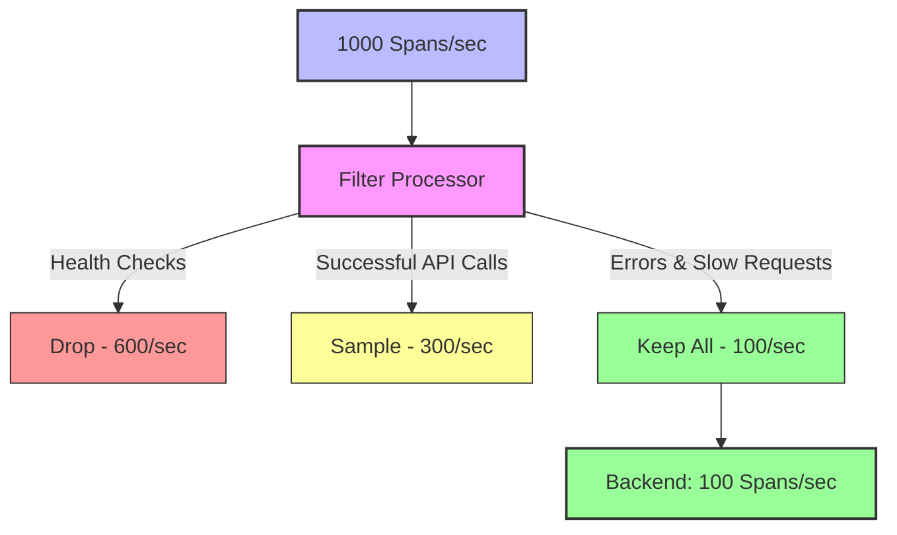

# How to Filter Spans Using OTTL in the OpenTelemetry Collector

Author: [nawazdhandala](https://www.github.com/nawazdhandala)

Tags: OpenTelemetry, Collector, Processor, OTTL, Filtering, Span, Performance

Description: Master span filtering with OTTL expressions in the OpenTelemetry Collector to reduce data volume, improve performance, and focus on meaningful telemetry.

Filtering spans is a critical capability for managing telemetry costs, improving pipeline performance, and focusing observability efforts on meaningful data. The OpenTelemetry Collector's Filter processor, combined with OTTL (OpenTelemetry Transformation Language) expressions, provides powerful filtering capabilities that can dramatically reduce data volume while preserving essential insights.

## Why Filter Spans

Production systems generate massive volumes of telemetry data, much of which provides limited observability value. Common scenarios requiring span filtering include:

- Health check endpoints generating thousands of identical spans per minute
- Internal service-to-service calls with minimal diagnostic value
- Successful requests in high-throughput APIs where only errors matter
- Debug traces from testing environments accidentally sent to production
- High-cardinality spans that overwhelm storage and query systems

Strategic filtering reduces costs, improves query performance, and ensures observability tools focus on actionable data.


```mermaid
graph TD
    A[1000 Spans/sec] --> B[Filter Processor]
    B -->|Health Checks| C[Drop - 600/sec]
    B -->|Successful API Calls| D[Sample - 300/sec]
    B -->|Errors & Slow Requests| E[Keep All - 100/sec]
    E --> F[Backend: 100 Spans/sec]

    style A fill:#bbf,stroke:#333,stroke-width:2px
    style B fill:#f9f,stroke:#333,stroke-width:2px
    style C fill:#f99,stroke:#333,stroke-width:1px
    style D fill:#ff9,stroke:#333,stroke-width:1px
    style E fill:#9f9,stroke:#333,stroke-width:1px
    style F fill:#9f9,stroke:#333,stroke-width:2px
```

## Basic Filter Configuration

The Filter processor drops telemetry when any configured OTTL condition evaluates to true.

Here is a basic configuration filtering health check spans:

```yaml
# Basic span filtering configuration

processors:
  filter:
    # Define spans to drop
    trace_conditions:
      - span.name == "/health"
      - span.name == "/healthz"
      - span.name == "/ping"

service:
  pipelines:
    traces:
      receivers: [otlp]
      processors: [filter, batch]
      exporters: [otlp]
```

This configuration drops all spans with names exactly matching the health check endpoints, reducing telemetry volume without losing meaningful data.

## OTTL Expression Filtering

OTTL expressions provide far more flexibility than simple name matching. The `trace_conditions` setting enables complex filtering logic based on span attributes, status, duration, or other properties.

```yaml
# OTTL expression filtering
processors:
  filter:
    trace_conditions:
      # Drop health check spans
      - span.name == "/health"
      # Drop successful requests from specific endpoints
      - span.name == "/api/v1/users" and span.status.code == STATUS_CODE_OK
      # Drop fast requests (under 10ms)
      - (span.end_time - span.start_time) < Duration("10ms")
```

OTTL expressions combine conditions using logical operators (`and`, `or`, `not`) and comparison operators (`==`, `!=`, `<`, `<=`, `>`, `>=`).

## Filtering by Attributes

Most filtering decisions depend on span attributes. OTTL provides full access to span attributes through the `span.attributes` map.

```yaml
# Attribute-based filtering
processors:
  filter:
    trace_conditions:
      # Drop internal testing traffic
      - span.attributes["user_agent.original"] == "HealthCheckBot"

      # Drop requests from specific client
      - span.attributes["client.id"] == "internal-monitoring"

      # Drop spans without important attributes
      - span.attributes["user.id"] == nil

      # Drop debug spans in production
      - span.attributes["log.level"] == "debug" and resource.attributes["deployment.environment"] == "production"
```

Attribute-based filtering enables precise control over what telemetry is retained.

## Filtering by HTTP Status

For HTTP services, filtering by status code is a common requirement. Keep error traces while sampling or dropping successful requests.

```yaml
# HTTP status filtering
processors:
  filter:
    trace_conditions:
      # Drop successful health checks
      - span.name == "/health" and span.attributes["http.response.status_code"] >= 200 and span.attributes["http.response.status_code"] < 300

      # Drop redirects
      - span.attributes["http.response.status_code"] >= 300 and span.attributes["http.response.status_code"] < 400

      # Alternatively, drop non-errors to keep only errors
      # - span.status.code != STATUS_CODE_ERROR and (span.attributes["http.response.status_code"] == nil or span.attributes["http.response.status_code"] < 400)
```

This approach dramatically reduces volume while preserving error traces for debugging.

## Duration-Based Filtering

Filter spans based on duration to focus on slow requests that impact user experience.

```yaml
# Duration-based filtering
processors:
  filter:
    trace_conditions:
      # Drop spans faster than 1 second
      - (span.end_time - span.start_time) < Duration("1s")

      # Or use a lower threshold
      # - (span.end_time - span.start_time) < Duration("10ms")
```

Duration filtering helps identify performance bottlenecks while reducing volume from fast, successful operations.

## Complex Filtering Logic

Combine multiple conditions to implement sophisticated filtering strategies.

```yaml
# Complex filtering logic
processors:
  filter:
    trace_conditions:
      # Drop fast, successful health checks
      - span.name == "/health" and (span.end_time - span.start_time) < Duration("100ms") and span.status.code == STATUS_CODE_OK

      # Drop internal API calls that succeeded quickly
      - IsMatch(span.attributes["url.path"], "^/internal/") and span.attributes["http.response.status_code"] < 300 and (span.end_time - span.start_time) < Duration("50ms")

      # Drop GET requests to static assets that succeeded
      - span.attributes["http.request.method"] == "GET" and IsMatch(span.attributes["url.path"], "\\.(js|css|png|jpg|gif)$") and span.attributes["http.response.status_code"] == 200

      # Preserve errors, slow requests, and premium customers by only dropping other fast successful spans
      - span.status.code != STATUS_CODE_ERROR and (span.end_time - span.start_time) < Duration("1s") and span.attributes["customer.tier"] != "premium" and (span.attributes["http.response.status_code"] == nil or span.attributes["http.response.status_code"] < 400)
```

Complex logic enables fine-tuned filtering that balances cost reduction with observability requirements.

## Service-Specific Filtering

Different services have different filtering needs. Use service name or other resource attributes to apply service-specific rules.

```yaml
# Service-specific filtering
processors:
  filter:
    trace_conditions:
      # Drop health checks only from web service
      - span.name == "/health" and resource.attributes["service.name"] == "web"

      # Drop debug spans only from non-production
      - span.attributes["log.level"] == "debug" and resource.attributes["deployment.environment"] != "production"

      # Drop fast spans only from API service
      - (span.end_time - span.start_time) < Duration("10ms") and resource.attributes["service.name"] == "api"
```

Service-specific filtering ensures each service's unique characteristics are handled appropriately.

## Regular Expression Filtering

Use regular expressions for pattern-based filtering.

```yaml
# Regular expression filtering
processors:
  filter:
    trace_conditions:
      # Drop all health check variations
      - IsMatch(span.name, "^/(health|ping|ready|live)")

      # Drop API versioned endpoint patterns
      - IsMatch(span.attributes["url.path"], "^/api/v[0-9]+/internal")

      # Drop test user traffic
      - IsMatch(span.attributes["user.email"], ".*@test\\.example\\.com$")

      # Drop static file requests
      - IsMatch(span.attributes["url.path"], "\\.(css|js|png|jpg|gif|ico|woff|woff2)$")
```

Regular expressions provide flexible pattern matching for complex filtering scenarios.

## Combining Multiple Filter Processors

Use multiple Filter processor instances for different filtering stages.

```yaml
# Multiple filter processors
processors:
  # First stage: drop obvious noise
  filter/noise:
    trace_conditions:
      - span.name == "/health"
      - span.name == "/metrics"

  # Second stage: drop less interesting spans
  filter/interesting:
    trace_conditions:
      - span.status.code != STATUS_CODE_ERROR and (span.end_time - span.start_time) <= Duration("500ms") and not IsMatch(span.name, "^/api/v1/(orders|payments)")

  # Third stage: sample remaining spans
  probabilistic_sampler:
    sampling_percentage: 10

service:
  pipelines:
    traces:
      receivers: [otlp]
      processors:
        - filter/noise
        - filter/interesting
        - probabilistic_sampler
        - batch
      exporters: [otlp]
```

This multi-stage approach first removes noise, then drops lower-value spans, then samples the remainder.

## Filtering Root Spans vs Child Spans

Filter root spans (entry points) differently from child spans (internal operations).

```yaml
# Root span vs child span filtering
processors:
  filter:
    trace_conditions:
      # Drop fast child spans (internal operations)
      - span.parent_span_id != SpanID(0x0000000000000000) and (span.end_time - span.start_time) < Duration("5ms")

      # Drop successful internal operations
      - span.parent_span_id != SpanID(0x0000000000000000) and span.status.code == STATUS_CODE_OK and span.kind == SPAN_KIND_INTERNAL
```

This keeps root spans intact while filtering internal operations that provide limited value.

## Error-Focused Filtering

Focus on errors by keeping error spans and their context while dropping successful operations.

```yaml
# Error-focused filtering
processors:
  filter:
    trace_conditions:
      # Drop spans that are not marked as errors
      - span.status.code != STATUS_CODE_ERROR and (span.attributes["http.response.status_code"] == nil or span.attributes["http.response.status_code"] < 400) and not IsMatch(span.name, "(?i)error") and span.trace_state["error"] != "true"
```

Error-focused filtering ensures debugging information is retained while reducing volume from successful operations.

## Sampling Integration

Combine filtering with sampling for comprehensive volume control.

```yaml
# Filtering with sampling
processors:
  # First, filter obvious noise
  filter/noise:
    trace_conditions:
      - IsMatch(span.name, "^/(health|ping|metrics)")

  # Drop low-priority spans from the high-priority pipeline
  filter/high_priority:
    trace_conditions:
      - span.status.code != STATUS_CODE_ERROR and (span.end_time - span.start_time) <= Duration("1s")

  # Drop high-priority spans from the sampled low-priority pipeline
  filter/low_priority:
    trace_conditions:
      - span.status.code == STATUS_CODE_ERROR or (span.end_time - span.start_time) > Duration("1s")

  # Sample low priority spans
  probabilistic_sampler:
    sampling_percentage: 5

service:
  pipelines:
    # High priority pipeline: no sampling
    traces/high_priority:
      receivers: [otlp]
      processors:
        - filter/noise
        - filter/high_priority
        - batch
      exporters: [otlp/backend]

    # Low priority pipeline: aggressive sampling
    traces/low_priority:
      receivers: [otlp]
      processors:
        - filter/noise
        - filter/low_priority
        - probabilistic_sampler
        - batch
      exporters: [otlp/backend]
```

This approach ensures important traces are always kept while aggressively sampling routine operations.

## User-Based Filtering

Filter based on user attributes for multi-tenant applications.

```yaml
# User-based filtering
processors:
  filter:
    trace_conditions:
      # Drop anonymous user traffic
      - span.attributes["user.id"] == "anonymous"

      # Drop banned user traffic
      - span.attributes["user.status"] == "banned"

      # Drop low-tier traffic unless it is a test user during development
      - span.attributes["user.tier"] != "premium" and not IsMatch(span.attributes["user.id"], "^test-")
```

User-based filtering enables different observability levels for different user segments.

## Environment-Based Filtering

Apply different filtering rules per environment.

```yaml
# Environment-based filtering
processors:
  filter:
    trace_conditions:
      # In production: drop debug spans
      - span.attributes["log.level"] == "debug" and resource.attributes["deployment.environment"] == "production"

      # In development: keep everything (no exclusions)

      # In staging: drop health checks only
      - span.name == "/health" and resource.attributes["deployment.environment"] == "staging"
```

Environment-specific filtering ensures appropriate telemetry collection for each deployment stage.

## Performance Impact

Filtering reduces collector CPU, memory, and network usage by processing fewer spans. However, complex OTTL expressions do incur evaluation overhead.

Performance best practices:

1. **Filter early**: Place Filter processors early in the pipeline before expensive operations
2. **Simple expressions first**: Evaluate cheap conditions before expensive regex operations
3. **Avoid redundant evaluation**: Don't check the same condition multiple times
4. **Use strict matching when possible**: Exact string matching is faster than regex

Optimized configuration:

```yaml
# Performance-optimized filtering
processors:
  filter:
    trace_conditions:
      # Fast checks first
      - span.name == "/health"
      - span.name == "/metrics"

      # More expensive checks only if needed
      - span.name != "/health" and span.name != "/metrics" and span.attributes["http.response.status_code"] < 300 and (span.end_time - span.start_time) < Duration("10ms")

      # Regex last
      - span.name != "/health" and IsMatch(span.attributes["url.path"], "\\.(css|js|png)$")
```

## Monitoring Filter Effectiveness

Monitor filtering to understand its impact:

```yaml
service:
  telemetry:
    logs:
      level: info
    metrics:
      level: detailed

  pipelines:
    traces:
      receivers: [otlp]
      processors: [filter, batch]
      exporters: [otlp]
```

Key metrics to monitor:
- Spans received vs spans exported (filter ratio)
- Processing latency
- Processor accepted/refused span counts
- Resource usage before and after filtering

## Troubleshooting

**Spans unexpectedly dropped**: Review filter expressions carefully. Enable debug logging to see evaluation details. Test expressions against sample data.

**Spans not filtering**: Verify attribute names match exactly (case-sensitive). Check that attributes exist before comparison. Ensure the conditions are configured under `trace_conditions`.

**Performance degradation**: Simplify complex expressions. Evaluate fast conditions first. Consider multiple simple filters instead of one complex filter.

**Important spans lost**: Express drop conditions narrowly so error spans and other high-value spans do not match them. Review filter rules regularly against production data.

## Testing Filter Configuration

Test filter configuration before deploying to production:

```yaml
# Test filter configuration locally
receivers:
  otlp:
    protocols:
      grpc:
        endpoint: 0.0.0.0:4317

processors:
  # Your filter configuration
  filter:
    trace_conditions:
      - span.name == "/health"

exporters:
  debug:
    verbosity: detailed

service:
  pipelines:
    traces:
      receivers: [otlp]
      processors: [filter]
      exporters: [debug]
```

Send test data through the configuration and verify the expected spans are kept or dropped.

## Common Filtering Patterns

Here are reusable filtering patterns for common scenarios:

```yaml
# Common filtering patterns
processors:
  # Pattern 1: Keep only errors
  filter/errors_only:
    trace_conditions:
      - span.status.code != STATUS_CODE_ERROR and (span.attributes["http.response.status_code"] == nil or span.attributes["http.response.status_code"] < 400)

  # Pattern 2: Drop health checks
  filter/no_health_checks:
    trace_conditions:
      - IsMatch(span.name, "^/(health|ping|ready|live|metrics)")

  # Pattern 3: Keep slow requests
  filter/slow_only:
    trace_conditions:
      - (span.end_time - span.start_time) <= Duration("1s")

  # Pattern 4: Drop successful internal calls
  filter/no_internal_success:
    trace_conditions:
      - span.kind == SPAN_KIND_INTERNAL and span.status.code == STATUS_CODE_OK

  # Pattern 5: Keep production errors, sample everything else
  filter/prod_errors:
    trace_conditions:
      - resource.attributes["deployment.environment"] != "production" or span.status.code != STATUS_CODE_ERROR
```

Combine these patterns based on your specific requirements.

## Related Resources

For more information on telemetry processing and OTTL:

- [How to Write OTTL Statements for the Transform Processor](https://oneuptime.com/blog/post/2026-02-06-ottl-statements-transform-processor-opentelemetry-collector/view)
- [How to Configure the Remote Tap Processor](https://oneuptime.com/blog/post/2026-02-06-remote-tap-processor-opentelemetry-collector/view)
- [How to Configure the Unroll Processor](https://oneuptime.com/blog/post/2026-02-06-unroll-processor-opentelemetry-collector/view)

Filtering spans with OTTL expressions provides powerful control over telemetry volume and costs while preserving observability insights. Start with simple filters for obvious noise like health checks, then add sophisticated logic based on attributes, duration, and status. Always keep error traces, consider multi-stage filtering with sampling, and monitor filter effectiveness to ensure important data is retained. Test filter configurations thoroughly before production deployment, and review rules regularly as application patterns evolve. Strategic filtering reduces costs, improves performance, and focuses observability efforts on data that matters.
