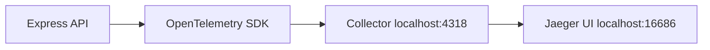

# How to Set Up Your First OpenTelemetry Pipeline in 10 Minutes

Author: [nawazdhandala](https://www.github.com/nawazdhandala)

Tags: OpenTelemetry, Getting Started, Pipeline, OTLP, Tutorial

Description: A step-by-step guide to instrumenting a Node.js application with OpenTelemetry and seeing traces flow to a backend in under 10 minutes.

You've heard about OpenTelemetry and want to try it. You don't need complex infrastructure or deep observability knowledge. This guide gets traces flowing from a simple Node.js application to a backend in minutes, not hours.

We'll build a minimal Express API, add OpenTelemetry instrumentation, run a Collector, and view traces in Jaeger. Everything runs locally with Docker. Once you see it work, you'll understand the core concepts and can expand from there.

## What You'll Build



A simple HTTP server with automatic instrumentation. Every request creates a trace. The SDK exports to a local Collector. The Collector forwards to Jaeger for visualization.

## Prerequisites

You need Node.js (v16+) and Docker installed. That's it.

Verify:

```bash
node --version  # Should show v16 or higher
docker --version  # Any recent version works
```

## Step 1: Create a Simple Express API

Start with a basic API that has a few endpoints and simulates some work.

Create a project directory:

```bash
mkdir otel-quickstart
cd otel-quickstart
npm init -y
```

Install Express:

```bash
npm install express
```

Create `app.js`:

```javascript
const express = require('express');
const app = express();

// Simulate a database query with artificial delay
function queryDatabase(userId) {
  const start = Date.now();
  // Simulate work
  while (Date.now() - start < 50) {}
  return { id: userId, name: 'Test User', email: 'user@example.com' };
}

// Simulate an external API call
function callExternalAPI() {
  const start = Date.now();
  while (Date.now() - start < 30) {}
  return { status: 'ok', data: 'external data' };
}

app.get('/', (req, res) => {
  res.json({ message: 'Hello OpenTelemetry!' });
});

app.get('/users/:id', (req, res) => {
  const userId = req.params.id;
  const user = queryDatabase(userId);
  res.json(user);
});

app.get('/api/data', (req, res) => {
  const dbResult = queryDatabase('123');
  const apiResult = callExternalAPI();
  res.json({ user: dbResult, external: apiResult });
});

const PORT = 3000;
app.listen(PORT, () => {
  console.log(`Server running on http://localhost:${PORT}`);
});
```

Test it:

```bash
node app.js
```

In another terminal:

```bash
curl http://localhost:3000/users/42
```

You should see user data. The app works, but produces no telemetry. Let's fix that.

## Step 2: Start Jaeger and OpenTelemetry Collector

We'll run Jaeger (for viewing traces) and the OpenTelemetry Collector (for receiving and forwarding telemetry) using Docker.

Create `docker-compose.yml`:

```yaml
version: '3.8'

services:
  # Jaeger all-in-one (includes UI and backend)
  jaeger:
    image: jaegertracing/all-in-one:latest
    ports:
      - "16686:16686"  # Jaeger UI
      - "14250:14250"  # gRPC collector
    environment:
      - COLLECTOR_OTLP_ENABLED=true

  # OpenTelemetry Collector
  otel-collector:
    image: otel/opentelemetry-collector:latest
    command: ["--config=/etc/otel-collector-config.yaml"]
    volumes:
      - ./otel-collector-config.yaml:/etc/otel-collector-config.yaml
    ports:
      - "4318:4318"  # OTLP HTTP receiver
      - "4317:4317"  # OTLP gRPC receiver
    depends_on:
      - jaeger
```

Create `otel-collector-config.yaml`:

```yaml
receivers:
  otlp:
    protocols:
      http:
        endpoint: 0.0.0.0:4318
      grpc:
        endpoint: 0.0.0.0:4317

processors:
  batch:
    timeout: 1s
    send_batch_size: 50

exporters:
  # Send to Jaeger
  otlp:
    endpoint: jaeger:4317
    tls:
      insecure: true

  # Also log to console for debugging
  logging:
    verbosity: detailed

service:
  pipelines:
    traces:
      receivers: [otlp]
      processors: [batch]
      exporters: [otlp, logging]
```

Start the infrastructure:

```bash
docker-compose up -d
```

Check that containers are running:

```bash
docker-compose ps
```

Open Jaeger UI at http://localhost:16686. You'll see the interface but no traces yet.

## Step 3: Add OpenTelemetry to Your Application

Install OpenTelemetry packages:

```bash
npm install @opentelemetry/sdk-node \
            @opentelemetry/api \
            @opentelemetry/auto-instrumentations-node \
            @opentelemetry/exporter-trace-otlp-http
```

These packages provide:
- `sdk-node`: Core SDK for Node.js
- `api`: API for creating custom spans
- `auto-instrumentations-node`: Automatic instrumentation for Express, HTTP, etc.
- `exporter-trace-otlp-http`: Exporter that sends traces to Collector via HTTP

Create `tracing.js` (the OpenTelemetry setup):

```javascript
const { NodeSDK } = require('@opentelemetry/sdk-node');
const { getNodeAutoInstrumentations } = require('@opentelemetry/auto-instrumentations-node');
const { OTLPTraceExporter } = require('@opentelemetry/exporter-trace-otlp-http');
const { Resource } = require('@opentelemetry/resources');
const { SemanticResourceAttributes } = require('@opentelemetry/semantic-conventions');

// Define service resource attributes
const resource = new Resource({
  [SemanticResourceAttributes.SERVICE_NAME]: 'otel-quickstart-api',
  [SemanticResourceAttributes.SERVICE_VERSION]: '1.0.0',
});

// Configure trace exporter to send to local Collector
const traceExporter = new OTLPTraceExporter({
  url: 'http://localhost:4318/v1/traces',
});

// Initialize the SDK with auto-instrumentation
const sdk = new NodeSDK({
  resource,
  traceExporter,
  instrumentations: [
    getNodeAutoInstrumentations({
      // Optional: configure instrumentation libraries
      '@opentelemetry/instrumentation-http': {
        ignoreIncomingRequestHook: (req) => {
          // Don't trace health check endpoint
          return req.url === '/health';
        },
      },
    }),
  ],
});

// Start the SDK
sdk.start();

console.log('OpenTelemetry tracing initialized');

// Gracefully shut down the SDK on process exit
process.on('SIGTERM', () => {
  sdk.shutdown()
    .then(() => console.log('Tracing terminated'))
    .catch((error) => console.log('Error terminating tracing', error))
    .finally(() => process.exit(0));
});
```

Update `app.js` to load tracing before anything else. Add this as the very first line:

```javascript
require('./tracing');  // Must be first!

const express = require('express');
// ... rest of the code stays the same
```

The complete `app.js` now looks like:

```javascript
require('./tracing');

const express = require('express');
const app = express();

function queryDatabase(userId) {
  const start = Date.now();
  while (Date.now() - start < 50) {}
  return { id: userId, name: 'Test User', email: 'user@example.com' };
}

function callExternalAPI() {
  const start = Date.now();
  while (Date.now() - start < 30) {}
  return { status: 'ok', data: 'external data' };
}

app.get('/', (req, res) => {
  res.json({ message: 'Hello OpenTelemetry!' });
});

app.get('/users/:id', (req, res) => {
  const userId = req.params.id;
  const user = queryDatabase(userId);
  res.json(user);
});

app.get('/api/data', (req, res) => {
  const dbResult = queryDatabase('123');
  const apiResult = callExternalAPI();
  res.json({ user: dbResult, external: apiResult });
});

const PORT = 3000;
app.listen(PORT, () => {
  console.log(`Server running on http://localhost:${PORT}`);
});
```

## Step 4: Generate Traffic and View Traces

Start your instrumented application:

```bash
node app.js
```

You should see:

```
OpenTelemetry tracing initialized
Server running on http://localhost:3000
```

Generate some requests:

```bash
# Make several requests to different endpoints
curl http://localhost:3000/
curl http://localhost:3000/users/42
curl http://localhost:3000/api/data
curl http://localhost:3000/users/123
```

Open Jaeger UI at http://localhost:16686.

In the service dropdown, select `otel-quickstart-api`. Click "Find Traces". You'll see your traces listed with timing information.

Click on any trace to see the detailed breakdown. You'll see spans for:
- HTTP server handling the request
- Express router processing
- Any middleware execution

The auto-instrumentation captured all of this without manual span creation.

## Step 5: Add Custom Spans for Business Logic

Auto-instrumentation gives you HTTP-level visibility, but you also want to see your business logic. Add custom spans using the OpenTelemetry API.

Update `app.js` to import the tracer:

```javascript
require('./tracing');

const express = require('express');
const { trace } = require('@opentelemetry/api');

// Get a tracer instance
const tracer = trace.getTracer('app-logic', '1.0.0');

const app = express();

// Wrap database query in a span
function queryDatabase(userId) {
  const span = tracer.startSpan('database.query', {
    attributes: {
      'db.operation': 'select',
      'db.user_id': userId,
    }
  });

  const start = Date.now();
  while (Date.now() - start < 50) {}
  const result = { id: userId, name: 'Test User', email: 'user@example.com' };

  span.end();
  return result;
}

// Wrap external API call in a span
function callExternalAPI() {
  const span = tracer.startSpan('external.api.call', {
    attributes: {
      'http.method': 'GET',
      'external.service': 'partner-api',
    }
  });

  const start = Date.now();
  while (Date.now() - start < 30) {}
  const result = { status: 'ok', data: 'external data' };

  span.end();
  return result;
}

// Routes stay the same
app.get('/', (req, res) => {
  res.json({ message: 'Hello OpenTelemetry!' });
});

app.get('/users/:id', (req, res) => {
  const userId = req.params.id;
  const user = queryDatabase(userId);
  res.json(user);
});

app.get('/api/data', (req, res) => {
  const dbResult = queryDatabase('123');
  const apiResult = callExternalAPI();
  res.json({ user: dbResult, external: apiResult });
});

const PORT = 3000;
app.listen(PORT, () => {
  console.log(`Server running on http://localhost:${PORT}`);
});
```

Restart the application and make more requests:

```bash
curl http://localhost:3000/api/data
```

Back in Jaeger UI, find the new trace. You'll now see spans for:
- HTTP request (auto-instrumented)
- `database.query` (custom span)
- `external.api.call` (custom span)

The trace shows the call hierarchy and timing breakdown. You can see how much time each operation took.

## Step 6: Add Context Propagation

When spans are created inside request handlers, they should be children of the HTTP request span. Update the functions to properly propagate context:

```javascript
const { trace, context } = require('@opentelemetry/api');

const tracer = trace.getTracer('app-logic', '1.0.0');

function queryDatabase(userId) {
  // context.active() ensures this span becomes a child of the current span
  return context.with(context.active(), () => {
    const span = tracer.startSpan('database.query', {
      attributes: {
        'db.operation': 'select',
        'db.user_id': userId,
      }
    });

    const start = Date.now();
    while (Date.now() - start < 50) {}
    const result = { id: userId, name: 'Test User', email: 'user@example.com' };

    span.end();
    return result;
  });
}

function callExternalAPI() {
  return context.with(context.active(), () => {
    const span = tracer.startSpan('external.api.call', {
      attributes: {
        'http.method': 'GET',
        'external.service': 'partner-api',
      }
    });

    const start = Date.now();
    while (Date.now() - start < 30) {}
    const result = { status: 'ok', data: 'external data' };

    span.end();
    return result;
  });
}
```

Now traces show proper parent-child relationships. The HTTP span is the root, with database and API call spans as children.

## Troubleshooting Common Issues

**Traces don't appear in Jaeger**

Check the Collector logs:

```bash
docker-compose logs otel-collector
```

Look for errors receiving or exporting data. The logging exporter in the config should show received spans.

**"Connection refused" errors**

Verify Collector is running:

```bash
docker-compose ps otel-collector
```

Check that port 4318 is exposed:

```bash
curl http://localhost:4318/
```

**Application starts but no telemetry**

Verify tracing module loads first. The `require('./tracing')` line must be the very first line in `app.js`.

Check for SDK initialization errors in console output.

**Spans are missing attributes**

Ensure semantic conventions are followed. Check that attributes are set before calling `span.end()`.

## Understanding What You Built

Your pipeline has four stages:

1. **Instrumentation**: SDK auto-instruments Express and HTTP. Your code creates custom spans for business logic.

2. **Collection**: SDK batches spans and exports via OTLP HTTP to `localhost:4318`.

3. **Processing**: Collector receives spans, batches them further, and forwards to Jaeger.

4. **Storage & UI**: Jaeger stores traces and provides a UI for querying and visualization.

This is the standard OpenTelemetry architecture. You can swap any component without changing the others. Want to use OneUptime instead of Jaeger? Just update the Collector config.

## Next Steps

Now that you have a working pipeline, you can:

**Add metrics**: Install `@opentelemetry/sdk-metrics` and export metrics alongside traces.

**Add logs**: Use a structured logging library like Pino with OpenTelemetry context injection.

**Instrument more operations**: Add spans around caching, message queue operations, business workflows.

**Deploy to production**: Replace Jaeger with a production backend like OneUptime. Update the Collector config and you're done.

**Implement sampling**: Add tail sampling in the Collector to keep only interesting traces (errors, slow requests).

**Add distributed tracing**: When calling other services, OpenTelemetry automatically propagates trace context via HTTP headers.

## Production Checklist

Before deploying to production:

1. Change the Collector exporter from Jaeger to your production backend
2. Configure appropriate sampling (don't trace 100% in production)
3. Set `OTEL_SERVICE_NAME` environment variable instead of hardcoding
4. Add error handling around SDK initialization
5. Configure batch sizes based on your request volume
6. Deploy the Collector as a DaemonSet or sidecar in Kubernetes
7. Monitor Collector metrics to ensure it's not dropping data

Here's an improved production-ready `tracing.js`:

```javascript
const { NodeSDK } = require('@opentelemetry/sdk-node');
const { getNodeAutoInstrumentations } = require('@opentelemetry/auto-instrumentations-node');
const { OTLPTraceExporter } = require('@opentelemetry/exporter-trace-otlp-http');
const { Resource } = require('@opentelemetry/resources');
const { SemanticResourceAttributes } = require('@opentelemetry/semantic-conventions');
const { ParentBasedSampler, TraceIdRatioBasedSampler } = require('@opentelemetry/sdk-trace-base');

const resource = new Resource({
  [SemanticResourceAttributes.SERVICE_NAME]: process.env.OTEL_SERVICE_NAME || 'otel-quickstart-api',
  [SemanticResourceAttributes.SERVICE_VERSION]: process.env.SERVICE_VERSION || '1.0.0',
  [SemanticResourceAttributes.DEPLOYMENT_ENVIRONMENT]: process.env.ENVIRONMENT || 'development',
});

const traceExporter = new OTLPTraceExporter({
  url: process.env.OTEL_EXPORTER_OTLP_ENDPOINT || 'http://localhost:4318/v1/traces',
});

const sdk = new NodeSDK({
  resource,
  traceExporter,
  // Sample 10% of traces in production
  sampler: new ParentBasedSampler({
    root: new TraceIdRatioBasedSampler(
      process.env.OTEL_TRACE_SAMPLE_RATE ? parseFloat(process.env.OTEL_TRACE_SAMPLE_RATE) : 0.1
    )
  }),
  instrumentations: [getNodeAutoInstrumentations()],
});

sdk.start();
console.log('OpenTelemetry tracing initialized');

process.on('SIGTERM', () => {
  sdk.shutdown()
    .then(() => console.log('Tracing terminated'))
    .catch((error) => console.log('Error terminating tracing', error))
    .finally(() => process.exit(0));
});
```

Now you can control behavior via environment variables without code changes.

## You're Ready

You've built a complete OpenTelemetry pipeline from scratch. You understand how the SDK, Collector, and backend fit together. You can instrument code both automatically and manually. You know how to troubleshoot when telemetry doesn't flow.

The concepts scale to production. Whether you're running on Kubernetes with hundreds of services or a single monolith, the pattern is the same: instrument, collect, process, visualize.

## Related Reading

- [How to Understand OpenTelemetry Architecture: API, SDK, and Collector Explained Simply](https://oneuptime.com/blog/post/2026-02-06-opentelemetry-architecture-api-sdk-collector/view)
- [What is OpenTelemetry Collector and Why Use One?](https://oneuptime.com/blog/post/2025-09-18-what-is-opentelemetry-collector-and-why-use-one/view)
- [Three Pillars of Observability: Logs, Metrics, Traces](https://oneuptime.com/blog/post/2025-08-20-three-pillars-of-observability-logs-metrics-traces/view)
