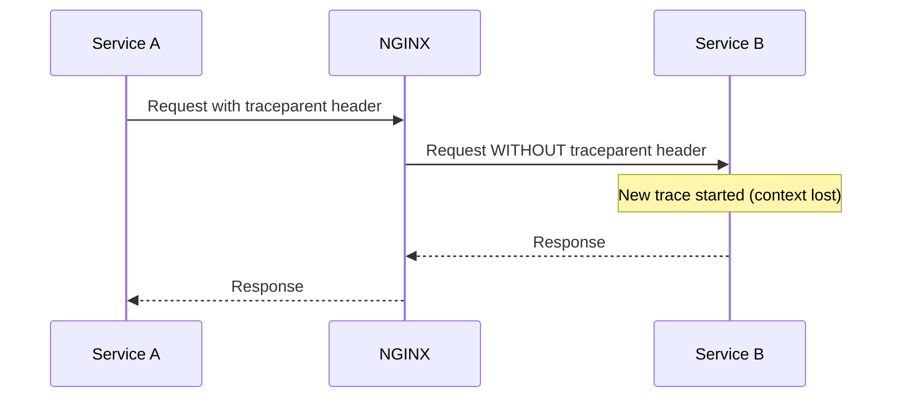
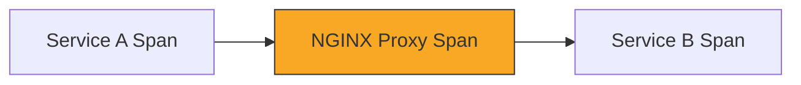

# How to Fix Broken Trace Context When Requests Pass Through NGINX

Author: [nawazdhandala](https://www.github.com/nawazdhandala)

Tags: OpenTelemetry, NGINX, Trace Context, Distributed Tracing, Troubleshooting, W3C TraceContext

Description: Learn how to diagnose and fix broken trace context propagation when HTTP requests pass through NGINX reverse proxies in OpenTelemetry setups.

---

If you have ever set up distributed tracing with OpenTelemetry and found that your traces break into disconnected fragments every time a request passes through NGINX, you are not alone. This is one of the most common issues teams face when adopting OpenTelemetry in environments that use NGINX as a reverse proxy or load balancer. The root cause is almost always that NGINX strips or fails to forward the trace context headers, and the fix is straightforward once you understand what is happening.

## Why NGINX Breaks Trace Context

OpenTelemetry relies on HTTP headers to propagate trace context between services. The W3C TraceContext standard uses two headers for this purpose: `traceparent` and `tracestate`. When Service A calls Service B through NGINX, the expectation is that NGINX passes these headers through untouched so that Service B can continue the same trace.

The problem is that NGINX, by default, does not always forward all headers cleanly. Depending on your configuration, NGINX might drop headers with underscores, ignore certain headers during proxy passes, or simply not include them when constructing the upstream request.

Here is a simplified view of what happens:



The result is that Service A and Service B each generate their own independent traces. Instead of seeing one connected trace that flows through your entire system, you see two separate traces that are impossible to correlate.

## Diagnosing the Problem

Before jumping to a fix, confirm that NGINX is actually the component dropping your headers. You can do this by inspecting the headers that arrive at your downstream service.

Add a simple debug endpoint to your downstream service that logs all incoming headers:

```javascript
// Simple Express endpoint to dump all incoming headers
// Use this temporarily to verify which headers NGINX is forwarding
const express = require('express');
const app = express();

app.get('/debug-headers', (req, res) => {
  // Log every header received by this service
  console.log('Received headers:', JSON.stringify(req.headers, null, 2));

  // Specifically check for trace context headers
  const traceparent = req.headers['traceparent'];
  const tracestate = req.headers['tracestate'];

  console.log('traceparent:', traceparent || 'MISSING');
  console.log('tracestate:', tracestate || 'MISSING');

  res.json({
    traceparent: traceparent || 'MISSING',
    tracestate: tracestate || 'MISSING',
    allHeaders: req.headers
  });
});

app.listen(3000);
```

Then send a request through NGINX with a manually crafted `traceparent` header:

```bash
# Send a request through NGINX with a known traceparent header
# If the downstream service does not receive this header, NGINX is stripping it
curl -H "traceparent: 00-4bf92f3577b34da6a3ce929d0e0e4736-00f067aa0ba902b7-01" \
     http://your-nginx-host/debug-headers
```

If the `traceparent` header shows up as "MISSING" in the response, you have confirmed that NGINX is the culprit.

## The Fix: Forwarding Trace Context Headers

The most common fix is to explicitly configure NGINX to pass trace context headers to upstream services. You need to add `proxy_set_header` directives in your NGINX configuration.

```nginx
# NGINX configuration that properly forwards W3C trace context headers
# Place this in your server or location block

server {
    listen 80;
    server_name api.example.com;

    location / {
        proxy_pass http://backend-service:3000;

        # Forward the W3C traceparent header for distributed tracing
        # The $http_traceparent variable contains the value from the incoming request
        proxy_set_header traceparent $http_traceparent;

        # Forward the W3C tracestate header which carries vendor-specific trace data
        proxy_set_header tracestate $http_tracestate;

        # Also forward B3 headers if you use Zipkin-style propagation
        # These are common in mixed environments during migration
        proxy_set_header X-B3-TraceId $http_x_b3_traceid;
        proxy_set_header X-B3-SpanId $http_x_b3_spanid;
        proxy_set_header X-B3-ParentSpanId $http_x_b3_parentspanid;
        proxy_set_header X-B3-Sampled $http_x_b3_sampled;

        # Standard proxy headers
        proxy_set_header Host $host;
        proxy_set_header X-Real-IP $remote_addr;
        proxy_set_header X-Forwarded-For $proxy_add_x_forwarded_for;
        proxy_set_header X-Forwarded-Proto $scheme;
    }
}
```

The key lines are the `proxy_set_header traceparent` and `proxy_set_header tracestate` directives. These tell NGINX to read the incoming header value (via the `$http_traceparent` variable) and include it in the request sent to the upstream service.

## Handling Underscores in Header Names

One subtle gotcha is that NGINX, by default, ignores headers that contain underscores in their names. While `traceparent` and `tracestate` do not have underscores, some legacy propagation formats or custom headers might. If you are using any custom trace propagation headers that contain underscores, you need to enable underscore support:

```nginx
# Enable headers with underscores in their names
# Place this in the http block of your nginx.conf
http {
    # By default NGINX silently drops headers with underscores
    # This directive tells NGINX to allow them
    underscores_in_headers on;

    server {
        # ... your server configuration
    }
}
```

## Adding NGINX as a Span in Your Traces

Going beyond just forwarding headers, you might want NGINX itself to appear as a span in your traces. The OpenTelemetry NGINX module lets you instrument NGINX so that it creates its own spans and participates in the trace as a first-class citizen.

```nginx
# Load the OpenTelemetry module for NGINX
# This requires installing the otel-nginx module first
load_module modules/otel_ngx_module.so;

http {
    # Configure the OpenTelemetry module
    opentelemetry_config /etc/nginx/otel-nginx.toml;

    server {
        listen 80;

        location / {
            # Enable OpenTelemetry tracing for this location
            opentelemetry on;

            # Set the operation name for spans generated by NGINX
            opentelemetry_operation_name "nginx-proxy";

            # Trust incoming trace context headers
            opentelemetry_trust_incoming_spans on;

            proxy_pass http://backend-service:3000;
        }
    }
}
```

The corresponding TOML configuration file for the module would look like this:

```toml
# otel-nginx.toml - OpenTelemetry configuration for the NGINX module
# This controls where NGINX sends its trace data

exporter = "otlp"

# Configure the OTLP exporter to send traces to your collector
[exporters.otlp]
host = "otel-collector"
port = 4317

# Set the service name so NGINX appears correctly in your trace views
[service]
name = "nginx-proxy"

# Configure the W3C TraceContext propagator
[processor]
batch = true
```

With this setup, your traces will show NGINX as an intermediate span between calling and receiving services:



## Testing the Fix

After applying your configuration changes, reload NGINX and verify that headers now flow through correctly:

```bash
# Reload NGINX configuration without downtime
sudo nginx -s reload

# Test with a manual traceparent header
# The response should now include the traceparent value you sent
curl -v -H "traceparent: 00-4bf92f3577b34da6a3ce929d0e0e4736-00f067aa0ba902b7-01" \
     http://your-nginx-host/debug-headers

# You should see the traceparent header in the response from your debug endpoint
```

You can also verify from your tracing backend. Generate some traffic through your application and check that traces now show connected spans that flow through NGINX rather than being split into separate traces.

## Common Pitfalls to Watch For

There are a few additional situations that can cause trace context to break even after you configure NGINX correctly.

First, if you have multiple NGINX instances in your path (for example, an external load balancer plus an internal reverse proxy), you need to configure header forwarding on every instance. A single misconfigured NGINX in the chain will break the entire trace.

Second, if you are using NGINX with `proxy_redirect` or URL rewriting rules, make sure those rules do not inadvertently affect header handling. Some complex rewrite configurations can cause NGINX to reconstruct requests in ways that drop headers.

Third, if you are using NGINX Plus with a content cache, cached responses might not trigger upstream requests at all, which means no trace context propagation happens for cache hits. Consider adding cache status as a span attribute so you can tell the difference between cache hits and actual upstream calls.

Finally, watch out for header size limits. If your `tracestate` header carries a lot of vendor-specific data, it could exceed NGINX's default header buffer size. You can increase it if needed:

```nginx
# Increase buffer size if tracestate headers are large
# Default is 4k or 8k depending on the platform
proxy_buffer_size 16k;
proxy_buffers 4 16k;

# Also increase the size allowed for incoming request headers
large_client_header_buffers 4 16k;
```

## Wrapping Up

Broken trace context through NGINX is a configuration issue, not a fundamental limitation. The fix boils down to making sure NGINX explicitly forwards the `traceparent` and `tracestate` headers to your upstream services. For a more complete observability story, consider installing the OpenTelemetry NGINX module so that NGINX appears as its own span in your distributed traces. Once properly configured, your traces will flow seamlessly through NGINX just like they do through any other instrumented service in your stack.
