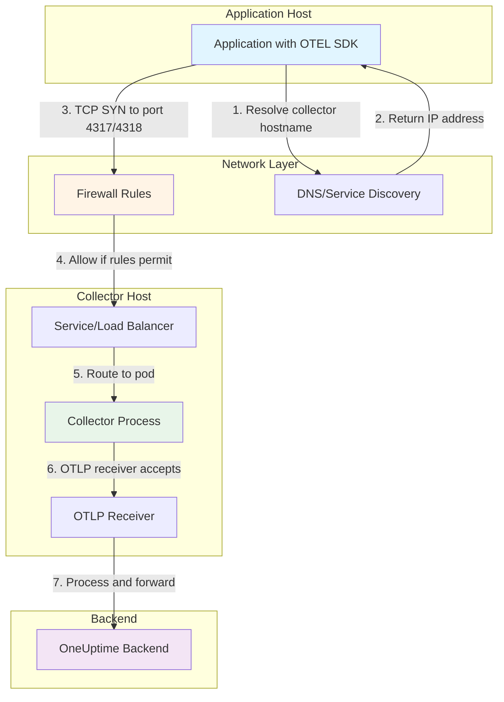

# How to Fix Collector 'Connection Refused' on OTLP Ports

Author: [nawazdhandala](https://www.github.com/nawazdhandala)

Tags: OpenTelemetry, Collector, Troubleshooting, OTLP, Network, Configuration

Description: A practical guide to diagnosing and fixing connection refused errors on OpenTelemetry Collector OTLP ports 4317 and 4318, covering common causes, verification steps, and production-ready solutions.

---

When your application tries to send telemetry to the OpenTelemetry Collector and you see "connection refused" errors on ports 4317 (gRPC) or 4318 (HTTP), it means the Collector isn't listening where your app expects it to be. This is one of the most common issues when setting up OpenTelemetry, but it's straightforward to fix once you understand what to check.

This guide walks through the diagnostic process and provides solutions for different deployment scenarios, from local development to Kubernetes production environments.

---

## Understanding OTLP Ports

The OpenTelemetry Protocol (OTLP) uses two standard ports:

- **Port 4317**: OTLP over gRPC (binary protocol, more efficient)
- **Port 4318**: OTLP over HTTP (easier debugging, works through more proxies)

When you see "connection refused," it means one of these things:

1. The Collector process isn't running
2. The OTLP receiver isn't enabled in the Collector configuration
3. The Collector is listening on a different address (e.g., localhost only)
4. Network policies or firewalls are blocking the ports
5. The Collector crashed during startup due to config errors

---

## Diagnostic Steps

### 1. Check If the Collector Process Is Running

First, verify the Collector process is actually running:

```bash
# On Linux/Mac
ps aux | grep otelcol

# Check process with more details
pgrep -fl otelcol

# On Kubernetes
kubectl get pods -l app=opentelemetry-collector
kubectl logs -l app=opentelemetry-collector --tail=50
```

If the process isn't running, check the startup logs for configuration errors that might have caused it to exit.

### 2. Verify Port Bindings

Check if the Collector is listening on the expected ports:

```bash
# Check all listening ports for the Collector process
netstat -tuln | grep -E '4317|4318'

# Or use lsof (more detailed)
lsof -i :4317
lsof -i :4318

# Or use ss (modern alternative)
ss -tuln | grep -E '4317|4318'
```

Expected output should show:
```
tcp    0    0 0.0.0.0:4317    0.0.0.0:*    LISTEN
tcp    0    0 0.0.0.0:4318    0.0.0.0:*    LISTEN
```

If you see `127.0.0.1:4317` instead of `0.0.0.0:4317`, the Collector is only listening on localhost.

### 3. Test Connectivity

Try connecting to the Collector from the same host and from remote hosts:

```bash
# Test gRPC port (4317)
telnet localhost 4317
# Or using nc (netcat)
nc -zv localhost 4317

# Test HTTP port (4318)
curl -v http://localhost:4318/v1/traces
# Should return 405 Method Not Allowed (which means it's listening)

# From another host (replace collector-host with actual hostname/IP)
telnet collector-host 4317
curl -v http://collector-host:4318/v1/traces
```

### 4. Check Collector Configuration

Look at your Collector's receiver configuration:

```bash
# Find your config file
cat /etc/otelcol/config.yaml
# Or wherever your config is located

# On Kubernetes
kubectl get configmap otel-collector-config -o yaml
```

---

## Common Causes and Fixes

### Cause 1: Receiver Not Enabled

The most common issue is the OTLP receiver isn't configured or enabled.

**Problem Configuration:**
```yaml
receivers:
  # OTLP receiver is commented out or missing
  # otlp:
  #   protocols:
  #     grpc:
  #     http:

service:
  pipelines:
    traces:
      receivers: [otlp]  # Referenced but not defined above!
      exporters: [logging]
```

**Fix:**
```yaml
# Enable OTLP receiver with both protocols
receivers:
  otlp:
    protocols:
      # gRPC on port 4317 (default)
      grpc:
        endpoint: 0.0.0.0:4317  # Listen on all interfaces
      # HTTP on port 4318 (default)
      http:
        endpoint: 0.0.0.0:4318  # Listen on all interfaces

service:
  pipelines:
    traces:
      receivers: [otlp]
      exporters: [logging]
```

### Cause 2: Listening on Localhost Only

By default, some Collector distributions listen on `127.0.0.1` (localhost) instead of `0.0.0.0` (all interfaces).

**Problem Configuration:**
```yaml
receivers:
  otlp:
    protocols:
      grpc:
        endpoint: localhost:4317  # Only accessible from same host
      http:
        endpoint: localhost:4318  # Only accessible from same host
```

**Fix:**
```yaml
receivers:
  otlp:
    protocols:
      grpc:
        # Bind to all interfaces so other containers/hosts can connect
        endpoint: 0.0.0.0:4317
      http:
        endpoint: 0.0.0.0:4318
```

### Cause 3: Port Conflicts

Another process might be using ports 4317 or 4318.

**Diagnosis:**
```bash
# See what's using the ports
lsof -i :4317
lsof -i :4318
```

**Fix Option 1 - Stop Conflicting Process:**
```bash
# Find and stop the conflicting process
kill <pid-of-conflicting-process>
```

**Fix Option 2 - Use Different Ports:**
```yaml
receivers:
  otlp:
    protocols:
      grpc:
        endpoint: 0.0.0.0:14317  # Non-standard port
      http:
        endpoint: 0.0.0.0:14318  # Non-standard port
```

Then update your application's exporter configuration to use the new ports.

### Cause 4: Firewall Blocking Ports

Firewall rules might be blocking the OTLP ports.

**Check Firewall Status:**
```bash
# On Linux with iptables
sudo iptables -L -n | grep -E '4317|4318'

# On Linux with firewalld
sudo firewall-cmd --list-all

# On Ubuntu with ufw
sudo ufw status
```

**Fix - Allow Ports:**
```bash
# Using firewalld
sudo firewall-cmd --permanent --add-port=4317/tcp
sudo firewall-cmd --permanent --add-port=4318/tcp
sudo firewall-cmd --reload

# Using ufw
sudo ufw allow 4317/tcp
sudo ufw allow 4318/tcp

# Using iptables
sudo iptables -A INPUT -p tcp --dport 4317 -j ACCEPT
sudo iptables -A INPUT -p tcp --dport 4318 -j ACCEPT
sudo iptables-save > /etc/iptables/rules.v4
```

### Cause 5: Kubernetes Service Configuration

In Kubernetes, the Service might not be exposing the correct ports.

**Problem Configuration:**
```yaml
apiVersion: v1
kind: Service
metadata:
  name: otel-collector
spec:
  selector:
    app: opentelemetry-collector
  ports:
    - name: metrics
      port: 8888  # Only metrics port exposed
      targetPort: 8888
  # OTLP ports missing!
```

**Fix:**
```yaml
apiVersion: v1
kind: Service
metadata:
  name: otel-collector
spec:
  selector:
    app: opentelemetry-collector
  ports:
    # OTLP gRPC port
    - name: otlp-grpc
      port: 4317
      targetPort: 4317
      protocol: TCP
    # OTLP HTTP port
    - name: otlp-http
      port: 4318
      targetPort: 4318
      protocol: TCP
    # Metrics port for monitoring
    - name: metrics
      port: 8888
      targetPort: 8888
      protocol: TCP
```

---

## Production-Ready Configuration

Here's a complete, production-ready Collector configuration with proper OTLP receiver setup:

```yaml
# receivers: Define how telemetry enters the Collector
receivers:
  otlp:
    protocols:
      # gRPC receiver for high-performance binary protocol
      grpc:
        endpoint: 0.0.0.0:4317        # Listen on all interfaces
        max_recv_msg_size_mib: 16     # Allow up to 16MB messages
        keepalive:
          server_parameters:
            max_connection_idle: 11s  # Close idle connections
            max_connection_age: 30s   # Rotate connections
            time: 30s                 # Keepalive ping interval
            timeout: 5s               # Ping timeout
      # HTTP receiver for easier debugging and proxy compatibility
      http:
        endpoint: 0.0.0.0:4318        # Listen on all interfaces
        cors:
          allowed_origins:
            - http://*                # Allow CORS for browser clients
            - https://*

# processors: Transform and batch telemetry
processors:
  # Batch to reduce network overhead
  batch:
    send_batch_size: 8192
    timeout: 5s
    send_batch_max_size: 16384

  # Protect Collector from memory exhaustion
  memory_limiter:
    limit_mib: 512
    spike_limit_mib: 128
    check_interval: 2s

# exporters: Define where telemetry is sent
exporters:
  # Export to OneUptime backend
  otlphttp:
    endpoint: https://oneuptime.com/otlp
    headers:
      x-oneuptime-token: ${ONEUPTIME_TOKEN}
    retry_on_failure:
      enabled: true
      initial_interval: 5s
      max_interval: 30s
      max_elapsed_time: 300s

  # Debug logging exporter
  logging:
    verbosity: detailed

# extensions: Health checks and monitoring
extensions:
  health_check:
    endpoint: 0.0.0.0:13133  # Health check endpoint
  pprof:
    endpoint: 0.0.0.0:1777   # Profiling endpoint
  zpages:
    endpoint: 0.0.0.0:55679  # Debug zpages

# service: Wire everything together
service:
  extensions: [health_check, pprof, zpages]

  pipelines:
    traces:
      receivers: [otlp]
      processors: [memory_limiter, batch]
      exporters: [otlphttp]

    metrics:
      receivers: [otlp]
      processors: [memory_limiter, batch]
      exporters: [otlphttp]

    logs:
      receivers: [otlp]
      processors: [memory_limiter, batch]
      exporters: [otlphttp]

  # Monitor Collector's own health
  telemetry:
    metrics:
      address: 0.0.0.0:8888  # Prometheus metrics endpoint
```

---

## Kubernetes Deployment Example

Complete Kubernetes manifests for deploying the Collector with proper networking:

```yaml
apiVersion: v1
kind: ConfigMap
metadata:
  name: otel-collector-config
  namespace: observability
data:
  config.yaml: |
    receivers:
      otlp:
        protocols:
          grpc:
            endpoint: 0.0.0.0:4317
          http:
            endpoint: 0.0.0.0:4318

    processors:
      batch:
        timeout: 5s
        send_batch_size: 8192
      memory_limiter:
        limit_mib: 512
        spike_limit_mib: 128

    exporters:
      otlphttp:
        endpoint: https://oneuptime.com/otlp
        headers:
          x-oneuptime-token: ${ONEUPTIME_TOKEN}

    service:
      pipelines:
        traces:
          receivers: [otlp]
          processors: [memory_limiter, batch]
          exporters: [otlphttp]
---
apiVersion: apps/v1
kind: Deployment
metadata:
  name: otel-collector
  namespace: observability
spec:
  replicas: 2
  selector:
    matchLabels:
      app: opentelemetry-collector
  template:
    metadata:
      labels:
        app: opentelemetry-collector
    spec:
      containers:
      - name: otel-collector
        image: otel/opentelemetry-collector-contrib:0.95.0
        ports:
        # OTLP gRPC port
        - containerPort: 4317
          name: otlp-grpc
          protocol: TCP
        # OTLP HTTP port
        - containerPort: 4318
          name: otlp-http
          protocol: TCP
        # Metrics port
        - containerPort: 8888
          name: metrics
          protocol: TCP
        env:
        - name: ONEUPTIME_TOKEN
          valueFrom:
            secretKeyRef:
              name: oneuptime-credentials
              key: token
        volumeMounts:
        - name: config
          mountPath: /etc/otelcol
        # Resource limits prevent OOM
        resources:
          requests:
            memory: "256Mi"
            cpu: "100m"
          limits:
            memory: "512Mi"
            cpu: "500m"
        # Liveness probe checks if Collector is healthy
        livenessProbe:
          httpGet:
            path: /
            port: 13133
          initialDelaySeconds: 10
          periodSeconds: 10
        # Readiness probe checks if Collector is ready to receive traffic
        readinessProbe:
          httpGet:
            path: /
            port: 13133
          initialDelaySeconds: 5
          periodSeconds: 5
      volumes:
      - name: config
        configMap:
          name: otel-collector-config
---
apiVersion: v1
kind: Service
metadata:
  name: otel-collector
  namespace: observability
spec:
  selector:
    app: opentelemetry-collector
  type: ClusterIP
  ports:
  # OTLP gRPC endpoint
  - name: otlp-grpc
    port: 4317
    targetPort: 4317
    protocol: TCP
  # OTLP HTTP endpoint
  - name: otlp-http
    port: 4318
    targetPort: 4318
    protocol: TCP
  # Prometheus metrics
  - name: metrics
    port: 8888
    targetPort: 8888
    protocol: TCP
```

---

## Application Configuration

After fixing the Collector, verify your application is configured to connect to the right endpoint.

**For applications in the same Kubernetes cluster:**
```yaml
# Environment variables for your app
env:
- name: OTEL_EXPORTER_OTLP_ENDPOINT
  value: "http://otel-collector.observability.svc.cluster.local:4318"
- name: OTEL_EXPORTER_OTLP_PROTOCOL
  value: "http/protobuf"
```

**For applications outside Kubernetes:**
```bash
# Using gRPC
export OTEL_EXPORTER_OTLP_ENDPOINT="http://collector-host:4317"
export OTEL_EXPORTER_OTLP_PROTOCOL="grpc"

# Using HTTP
export OTEL_EXPORTER_OTLP_ENDPOINT="http://collector-host:4318"
export OTEL_EXPORTER_OTLP_PROTOCOL="http/protobuf"
```

---

## Testing the Fix

After applying the fix, verify connectivity:

```bash
# Test from application host
curl -v http://otel-collector:4318/v1/traces \
  -H "Content-Type: application/json" \
  -d '{}'
# Should return 400 Bad Request (means it's listening and parsing)

# In Kubernetes, test from a pod
kubectl run test-curl --image=curlimages/curl -i --rm --restart=Never -- \
  curl -v http://otel-collector.observability.svc.cluster.local:4318/v1/traces

# Check Collector logs for received data
kubectl logs -l app=opentelemetry-collector -n observability --tail=20
```

---

## Network Flow Diagram



---

## Related Resources

For more OpenTelemetry Collector troubleshooting:

- [What is OpenTelemetry Collector and Why Use One?](https://oneuptime.com/blog/post/2025-09-18-what-is-opentelemetry-collector-and-why-use-one/view)
- [How to Collect OpenTelemetry Collector Internal Metrics](https://oneuptime.com/blog/post/2025-01-22-how-to-collect-opentelemetry-collector-internal-metrics/view)
- [How to Troubleshoot Collector Pipeline Blocked Errors](https://oneuptime.com/blog/post/2026-02-06-troubleshoot-collector-pipeline-blocked-errors/view)
- [How to Fix "Invalid Configuration" Errors in the OpenTelemetry Collector](https://oneuptime.com/blog/post/2026-02-06-fix-invalid-configuration-errors-collector/view)

---

## Summary

Connection refused errors on OTLP ports are usually caused by:

1. Receiver not enabled in configuration
2. Collector listening on localhost instead of all interfaces
3. Missing Kubernetes Service port mappings
4. Firewall rules blocking traffic
5. Port conflicts with other processes

The fix typically involves ensuring your Collector configuration has the OTLP receiver properly enabled with `endpoint: 0.0.0.0:4317` and `0.0.0.0:4318`, and that your network layer (firewalls, Kubernetes Services) permits traffic to these ports.

Need help managing your OpenTelemetry pipelines? [OneUptime](https://oneuptime.com) provides a production-ready observability platform that works seamlessly with the OpenTelemetry Collector.
