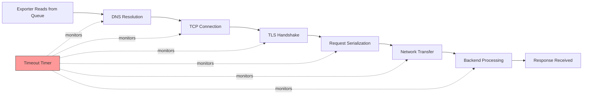

# How to Fix Collector Exporter Timeout Errors

Author: [nawazdhandala](https://www.github.com/nawazdhandala)

Tags: OpenTelemetry, Collector, Troubleshooting, Exporters, Timeout, Performance

Description: Practical guide to diagnosing and resolving timeout errors in OpenTelemetry Collector exporters with configuration examples and optimization techniques.

Exporter timeout errors in the OpenTelemetry Collector disrupt telemetry delivery, causing retries, queue buildup, and potential data loss. When exporters cannot successfully send data to backend systems within configured timeouts, the entire observability pipeline suffers. This guide provides systematic approaches to identify timeout root causes and implement effective solutions.

## Understanding Exporter Timeouts

Exporter timeouts occur when the collector cannot complete a data export operation within the configured time limit. The timeout covers the entire export lifecycle:



Any delay in these stages counts against the timeout. Understanding where time is spent helps you apply the right fix.

## Common Symptoms

Recognize these indicators of exporter timeout problems:

- Logs showing "context deadline exceeded" or "timeout" errors
- Increasing queue depth despite normal traffic
- Metrics showing high failure rates in exporters
- Slow or stalled data delivery to backend systems
- Collector memory usage climbing over time

## Diagnostic Approach

### Step 1: Enable Exporter Debug Logging

Configure detailed logging to see timeout patterns.

```yaml
# otel-collector-config.yaml
service:
  telemetry:
    logs:
      # Enable debug logging
      level: debug
      # Use JSON for structured parsing
      encoding: json
      # Include caller information
      development: true
      # Add initial fields for filtering
      initial_fields:
        service: otel-collector
        component: exporter

exporters:
  otlp:
    endpoint: "backend.observability.svc.cluster.local:4317"
    # Current timeout setting
    timeout: 30s

    sending_queue:
      enabled: true
      queue_size: 10000

  # Add logging exporter to see what's being sent
  logging:
    loglevel: info
    # Sample to reduce log volume
    sampling_initial: 10
    sampling_thereafter: 100

service:
  pipelines:
    traces:
      receivers: [otlp]
      processors: [batch]
      # Include logging exporter temporarily
      exporters: [otlp, logging]
```

Monitor logs for timeout patterns:

```bash
# View timeout errors in real-time
kubectl logs -f deployment/otel-collector -n observability | grep -i timeout

# Count timeout errors in last hour
kubectl logs deployment/otel-collector -n observability --since=1h | \
  grep -c "context deadline exceeded"

# Extract timeout error details
kubectl logs deployment/otel-collector -n observability --since=30m | \
  grep "timeout" | jq -r '.msg, .error, .exporter'
```

### Step 2: Measure Actual Export Duration

Use metrics to understand export timing.

```yaml
# otel-collector-config.yaml
service:
  telemetry:
    metrics:
      # Enable detailed metrics
      level: detailed
      address: 0.0.0.0:8888
```

Query export duration metrics:

```promql
# Export duration histogram (p50, p95, p99)
histogram_quantile(0.50, rate(otelcol_exporter_send_duration_bucket[5m]))
histogram_quantile(0.95, rate(otelcol_exporter_send_duration_bucket[5m]))
histogram_quantile(0.99, rate(otelcol_exporter_send_duration_bucket[5m]))

# Compare timeout rate to total exports
rate(otelcol_exporter_send_failed_spans[5m]) /
  (rate(otelcol_exporter_sent_spans[5m]) + rate(otelcol_exporter_send_failed_spans[5m]))

# Average export duration by exporter
avg(rate(otelcol_exporter_send_duration_sum[5m])) by (exporter)
```

### Step 3: Test Backend Connectivity

Isolate whether the problem is network, backend performance, or configuration.

```bash
# Test from collector pod to backend
kubectl exec -it deployment/otel-collector -n observability -- sh

# Test DNS resolution time
time nslookup backend.observability.svc.cluster.local

# Test TCP connection time
time nc -zv backend.observability.svc.cluster.local 4317

# Test with timeout to simulate exporter behavior
timeout 5s grpcurl -plaintext -d '{}' \
  backend.observability.svc.cluster.local:4317 \
  opentelemetry.proto.collector.trace.v1.TraceService/Export

# Measure full request latency
time grpcurl -plaintext -d '{}' \
  backend.observability.svc.cluster.local:4317 \
  opentelemetry.proto.collector.trace.v1.TraceService/Export
```

## Root Causes and Solutions

### 1. Backend Processing Slowness

When the backend system is slow to process requests, exports timeout even with good network connectivity.

**Diagnosis**: Backend response time exceeds timeout setting.

```bash
# Check backend metrics for processing time
curl -s http://backend.observability.svc.cluster.local:9090/metrics | \
  grep "request_duration"
```

**Solution**: Increase timeout and optimize backend.

```yaml
# otel-collector-config.yaml
exporters:
  otlp:
    endpoint: "backend.observability.svc.cluster.local:4317"

    # Increase timeout to accommodate backend processing
    # Set to p99 backend processing time + 50% buffer
    timeout: 60s

    # Reduce batch size to lower backend processing time per request
    sending_queue:
      enabled: true
      queue_size: 20000
      # Increase consumers for parallel exports
      num_consumers: 20

    # Configure retry with exponential backoff
    retry_on_failure:
      enabled: true
      # Start with short delay
      initial_interval: 1s
      # Cap at reasonable maximum
      max_interval: 30s
      # Give up after 5 minutes total
      max_elapsed_time: 300s

processors:
  batch:
    # Reduce batch size to lower per-request processing time
    timeout: 10s
    send_batch_size: 4096
    send_batch_max_size: 8192

service:
  pipelines:
    traces:
      receivers: [otlp]
      processors: [batch]
      exporters: [otlp]
```

### 2. Network Latency

High network latency between collector and backend consumes timeout budget.

**Diagnosis**: Network round-trip time approaches timeout value.

```bash
# Measure network latency
kubectl exec -it deployment/otel-collector -n observability -- sh -c \
  "ping -c 10 backend.observability.svc.cluster.local"

# Check for packet loss
kubectl exec -it deployment/otel-collector -n observability -- sh -c \
  "mtr -r -c 10 backend.observability.svc.cluster.local"
```

**Solution**: Adjust timeout and use compression.

```yaml
# otel-collector-config.yaml
exporters:
  otlp:
    endpoint: "backend.observability.svc.cluster.local:4317"

    # Set timeout based on measured latency
    # timeout = (p95_network_latency * 2) + backend_processing_time
    timeout: 45s

    # Enable compression to reduce data transfer time
    # gzip: good compression, moderate CPU
    # snappy: fast compression, lower CPU
    # zstd: best compression, higher CPU
    compression: gzip

    # Adjust keep-alive for long-lived connections
    keepalive:
      # Send keep-alive pings to detect dead connections
      time: 30s
      timeout: 10s
      # Allow pings without active streams
      permit_without_stream: true

    tls:
      # Use TLS for security but configure appropriately
      insecure: false
      # Disable TLS verification for internal services (not recommended for prod)
      insecure_skip_verify: false
      # Specify CA cert for faster validation
      ca_file: /etc/ssl/certs/ca-bundle.crt
```

### 3. DNS Resolution Delays

Slow or failing DNS lookups eat into timeout budget before data transfer begins.

**Diagnosis**: High DNS resolution time.

```bash
# Measure DNS lookup time
kubectl exec -it deployment/otel-collector -n observability -- sh -c \
  "time nslookup backend.observability.svc.cluster.local"

# Check DNS configuration
kubectl exec -it deployment/otel-collector -n observability -- cat /etc/resolv.conf
```

**Solution**: Use IP addresses, reduce DNS TTL, or deploy DNS cache.

```yaml
# otel-collector-config.yaml
exporters:
  # Option 1: Use IP address directly (if static)
  otlp/direct:
    endpoint: "10.96.10.15:4317"
    timeout: 30s

  # Option 2: Use endpoint with DNS caching
  otlp/cached:
    endpoint: "backend.observability.svc.cluster.local:4317"
    timeout: 30s
    # gRPC will cache DNS results
    balancer_name: "round_robin"
```

Deploy with optimized DNS configuration:

```yaml
# deployment.yaml
apiVersion: apps/v1
kind: Deployment
metadata:
  name: otel-collector
  namespace: observability
spec:
  template:
    spec:
      # Optimize DNS resolution
      dnsPolicy: ClusterFirst
      dnsConfig:
        options:
        # Reduce number of dots before absolute lookup
        - name: ndots
          value: "1"
        # Reduce DNS timeout
        - name: timeout
          value: "2"
        # Reduce number of attempts
        - name: attempts
          value: "2"

      containers:
      - name: otel-collector
        image: otel/opentelemetry-collector-contrib:0.93.0
        volumeMounts:
        - name: config
          mountPath: /conf

      volumes:
      - name: config
        configMap:
          name: otel-collector-config
```

Alternatively, deploy local DNS cache sidecar:

```yaml
# deployment-with-dns-cache.yaml
apiVersion: apps/v1
kind: Deployment
metadata:
  name: otel-collector
  namespace: observability
spec:
  template:
    spec:
      containers:
      # Local DNS cache
      - name: dns-cache
        image: k8s.gcr.io/dns/k8s-dns-node-cache:1.22.20
        securityContext:
          privileged: true
        ports:
        - containerPort: 53
          name: dns
          protocol: UDP
        livenessProbe:
          httpGet:
            path: /health
            port: 8080
          initialDelaySeconds: 60
          timeoutSeconds: 5

      - name: otel-collector
        image: otel/opentelemetry-collector-contrib:0.93.0
        # Use local DNS cache
        env:
        - name: LOCALDNS
          value: "169.254.20.10"
```

### 4. TLS Handshake Overhead

TLS/SSL handshakes add latency, especially for short-lived connections.

**Diagnosis**: High latency during initial connection establishment.

**Solution**: Reuse connections and optimize TLS settings.

```yaml
# otel-collector-config.yaml
exporters:
  otlp:
    endpoint: "backend.observability.svc.cluster.local:4317"
    timeout: 30s

    tls:
      insecure: false
      # Optimize TLS configuration
      # Use TLS 1.3 for faster handshake
      min_version: "1.3"
      # Specify cipher suites for faster negotiation
      cipher_suites:
      - "TLS_AES_128_GCM_SHA256"
      - "TLS_AES_256_GCM_SHA384"
      # Load certificates once at startup
      ca_file: /etc/ssl/certs/ca-bundle.crt
      cert_file: /etc/ssl/certs/client-cert.pem
      key_file: /etc/ssl/private/client-key.pem

    # Keep connections alive to avoid TLS handshake overhead
    keepalive:
      time: 30s
      timeout: 10s

    # Connection pool settings (if supported by exporter)
    max_idle_conns: 100
    max_idle_conns_per_host: 10
    idle_conn_timeout: 90s
```

### 5. Large Payload Size

Extremely large batches take longer to serialize, transfer, and process.

**Diagnosis**: Export duration correlates with batch size.

```promql
# Check batch size distribution
histogram_quantile(0.95, rate(otelcol_processor_batch_batch_size_trigger_send_bucket[5m]))
```

**Solution**: Reduce batch size and enable compression.

```yaml
# otel-collector-config.yaml
processors:
  batch:
    # Reduce batch timeout to send smaller batches more frequently
    timeout: 5s

    # Reduce batch size to lower serialization time
    send_batch_size: 2048
    send_batch_max_size: 4096

    # Optional: set metadata cardinality limit
    metadata_cardinality_limit: 1000

exporters:
  otlp:
    endpoint: "backend.observability.svc.cluster.local:4317"

    # Increase timeout to handle serialization and transfer
    timeout: 45s

    # Enable compression to reduce transfer time
    compression: gzip

    # Increase max message size if needed
    max_msg_size_mib: 4

    sending_queue:
      enabled: true
      # Smaller batches mean more exports, so increase consumers
      num_consumers: 20
```

### 6. Collector Resource Constraints

CPU throttling or memory pressure slows down export operations.

**Diagnosis**: High CPU usage or memory pressure during exports.

```bash
# Check collector resource usage
kubectl top pod -n observability -l app=otel-collector

# Check for CPU throttling
kubectl describe pod -n observability -l app=otel-collector | grep -A 5 "Limits"
```

**Solution**: Increase resource allocation.

```yaml
# deployment.yaml
apiVersion: apps/v1
kind: Deployment
metadata:
  name: otel-collector
  namespace: observability
spec:
  template:
    spec:
      containers:
      - name: otel-collector
        image: otel/opentelemetry-collector-contrib:0.93.0

        resources:
          requests:
            # Provide sufficient CPU for export operations
            cpu: 2000m
            memory: 2Gi
          limits:
            # Allow burst for export spikes
            cpu: 4000m
            memory: 4Gi

        env:
        # Set Go memory limit to prevent OOM
        - name: GOMEMLIMIT
          value: "3600MiB"
        # Optimize garbage collection
        - name: GOGC
          value: "75"
```

### 7. Backend Connection Pool Exhaustion

When all backend connections are busy, new exports wait, causing timeouts.

**Diagnosis**: Timeout rate increases with export rate.

**Solution**: Scale collectors and increase connection pool.

```yaml
# otel-collector-config.yaml
exporters:
  otlp:
    endpoint: "backend.observability.svc.cluster.local:4317"
    timeout: 30s

    sending_queue:
      enabled: true
      # Increase queue capacity
      queue_size: 30000
      # Significantly increase number of consumers
      # Each consumer maintains separate connection
      num_consumers: 50

    # Configure connection pooling (exporter-specific)
    max_idle_conns: 100
    max_idle_conns_per_host: 50

# Scale collector deployment
---
apiVersion: apps/v1
kind: Deployment
metadata:
  name: otel-collector
  namespace: observability
spec:
  # Increase replicas to distribute load
  replicas: 10

  template:
    spec:
      # Use pod anti-affinity for distribution
      affinity:
        podAntiAffinity:
          preferredDuringSchedulingIgnoredDuringExecution:
          - weight: 100
            podAffinityTerm:
              labelSelector:
                matchLabels:
                  app: otel-collector
              topologyKey: kubernetes.io/hostname
```

### 8. Intermittent Network Issues

Transient network problems cause sporadic timeouts.

**Diagnosis**: Timeouts occur randomly without pattern.

**Solution**: Implement retry logic and circuit breaker pattern.

```yaml
# otel-collector-config.yaml
exporters:
  otlp:
    endpoint: "backend.observability.svc.cluster.local:4317"

    # Set timeout high enough to avoid false failures
    timeout: 45s

    # Aggressive retry configuration
    retry_on_failure:
      enabled: true
      # Start retrying quickly
      initial_interval: 1s
      # Exponential backoff
      randomization_factor: 0.5
      multiplier: 2
      # Cap maximum delay
      max_interval: 30s
      # Keep retrying for 5 minutes
      max_elapsed_time: 300s

    sending_queue:
      enabled: true
      # Large queue to absorb retries
      queue_size: 50000
      num_consumers: 20

# Add health check to detect backend issues
extensions:
  health_check:
    endpoint: 0.0.0.0:13133
    path: /
    check_collector_pipeline:
      enabled: true
      # Check every 5 seconds
      interval: 5s
      # Mark unhealthy after 5 failures
      exporter_failure_threshold: 5

service:
  extensions: [health_check]
```

## Advanced Timeout Strategies

### Per-Exporter Timeout Configuration

Configure different timeouts for different backends based on their characteristics.

```yaml
# otel-collector-config.yaml
exporters:
  # Fast local backend
  otlp/local:
    endpoint: "local-backend.observability.svc.cluster.local:4317"
    timeout: 15s
    compression: none

  # Slower remote backend
  otlp/remote:
    endpoint: "remote-backend.external.com:4317"
    timeout: 90s
    compression: gzip

  # Cloud backend with variable latency
  otlp/cloud:
    endpoint: "cloud-backend.provider.com:4317"
    timeout: 120s
    compression: gzip
    retry_on_failure:
      enabled: true
      max_elapsed_time: 600s

service:
  pipelines:
    traces/local:
      receivers: [otlp]
      processors: [batch]
      exporters: [otlp/local]

    traces/remote:
      receivers: [otlp]
      processors: [batch]
      exporters: [otlp/remote]

    traces/cloud:
      receivers: [otlp]
      processors: [batch]
      exporters: [otlp/cloud]
```

### Adaptive Timeout Using Circuit Breaker

Implement circuit breaker pattern to avoid cascading failures (requires custom extension).

```yaml
# otel-collector-config.yaml
extensions:
  # Hypothetical circuit breaker extension
  circuit_breaker:
    # Open circuit after 5 consecutive failures
    failure_threshold: 5
    # Try again after 30 seconds
    reset_timeout: 30s
    # Consider success after 2 consecutive successes
    success_threshold: 2

exporters:
  otlp:
    endpoint: "backend.observability.svc.cluster.local:4317"
    timeout: 30s

service:
  extensions: [circuit_breaker]
```

### Timeout Monitoring Dashboard

Create Grafana dashboard to track timeout patterns.

```json
{
  "dashboard": {
    "title": "Collector Exporter Timeouts",
    "panels": [
      {
        "title": "Timeout Rate by Exporter",
        "targets": [
          {
            "expr": "sum by (exporter) (rate(otelcol_exporter_send_failed_spans{error=\"timeout\"}[5m]))"
          }
        ]
      },
      {
        "title": "Export Duration vs Timeout",
        "targets": [
          {
            "expr": "histogram_quantile(0.99, rate(otelcol_exporter_send_duration_bucket[5m]))",
            "legendFormat": "p99 duration"
          },
          {
            "expr": "otelcol_exporter_timeout_seconds",
            "legendFormat": "configured timeout"
          }
        ]
      },
      {
        "title": "Timeout Impact on Queue",
        "targets": [
          {
            "expr": "otelcol_exporter_queue_size"
          }
        ]
      }
    ]
  }
}
```

## Timeout Tuning Best Practices

1. **Set timeout to p99 export duration + 50%** buffer for safety
2. **Monitor actual export duration** and adjust timeout accordingly
3. **Use compression** to reduce transfer time for large payloads
4. **Enable retries** with exponential backoff for transient failures
5. **Scale horizontally** rather than increasing timeout indefinitely
6. **Optimize batch size** to balance efficiency and timeout risk
7. **Test timeout scenarios** in staging with network chaos engineering
8. **Document timeout rationale** for future reference
9. **Alert on timeout rate** exceeding acceptable threshold
10. **Review and adjust** timeout settings quarterly based on metrics

## Alerting on Timeout Issues

```yaml
# prometheus-alerts.yaml
groups:
- name: otel-collector-timeout
  interval: 30s
  rules:
  - alert: CollectorExporterTimeoutHigh
    expr: |
      rate(otelcol_exporter_send_failed_spans[5m]) /
      (rate(otelcol_exporter_sent_spans[5m]) + rate(otelcol_exporter_send_failed_spans[5m])) > 0.05
    for: 5m
    labels:
      severity: warning
    annotations:
      summary: "High exporter timeout rate"
      description: |
        Collector {{ $labels.instance }} exporter {{ $labels.exporter }}
        experiencing {{ $value | humanizePercentage }} timeout rate.

  - alert: CollectorExporterDurationNearTimeout
    expr: |
      histogram_quantile(0.95, rate(otelcol_exporter_send_duration_bucket[5m])) /
      otelcol_exporter_timeout_seconds > 0.8
    for: 10m
    labels:
      severity: warning
    annotations:
      summary: "Export duration approaching timeout"
      description: |
        Collector {{ $labels.instance }} exporter {{ $labels.exporter }}
        p95 duration is {{ $value | humanizePercentage }} of timeout setting.
```

## Related Resources

For comprehensive collector troubleshooting:

- [How to Fix Collector Slow Startup in Kubernetes](https://oneuptime.com/blog/post/2026-02-06-fix-collector-slow-startup-kubernetes/view)
- [How to Debug Collector Receiver Connection Drops](https://oneuptime.com/blog/post/2026-02-06-debug-collector-receiver-connection-drops/view)
- [How to Monitor Collector Queue Depth and Backpressure](https://oneuptime.com/blog/post/2026-02-06-monitor-collector-queue-depth-backpressure/view)
- [How to Troubleshoot Multi-Pipeline Routing Issues in the Collector](https://oneuptime.com/blog/post/2026-02-06-troubleshoot-multi-pipeline-routing-issues-collector/view)

Exporter timeout errors stem from various sources: slow backend processing, network latency, DNS issues, TLS overhead, or resource constraints. By measuring actual export duration, identifying bottlenecks, and configuring appropriate timeouts with retry logic, you can build resilient telemetry pipelines that handle real-world conditions reliably.
