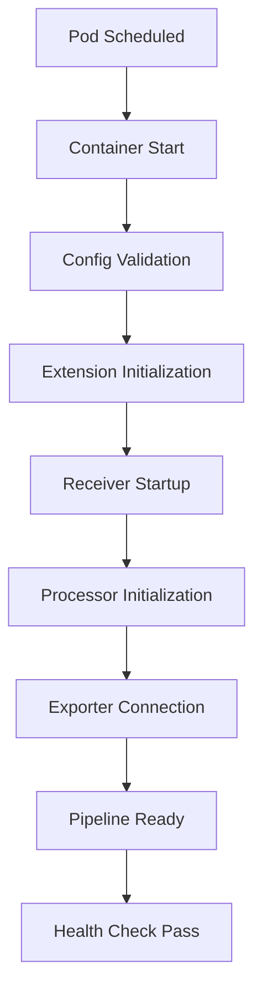

# How to Fix Collector Slow Startup in Kubernetes

Author: [nawazdhandala](https://www.github.com/nawazdhandala)

Tags: OpenTelemetry, Collector, Troubleshooting, Kubernetes, Performance, Deployment

Description: Comprehensive guide to diagnosing and fixing slow OpenTelemetry Collector startup issues in Kubernetes environments with configuration examples and optimization techniques.

When deploying the OpenTelemetry Collector in Kubernetes, slow startup times can cause cascading problems: failed health checks, pod restarts, gaps in observability data, and deployment delays. This guide shows you how to identify the root causes and implement solutions that get your collector pods running smoothly.

## Understanding Collector Startup Phases

The OpenTelemetry Collector goes through several phases during startup:



Each phase can introduce delays. Understanding where your collector spends time is critical to fixing the problem.

## Common Causes of Slow Startup

### 1. Large Configuration Files from ConfigMaps

Large ConfigMaps can take significant time to mount and parse. The collector must validate the entire configuration before starting any components.

### 2. Exporter Connection Timeouts

Exporters try to establish connections during startup. If backend services are slow to respond or unreachable, the collector waits for connection timeouts before proceeding.

### 3. DNS Resolution Delays

In Kubernetes, DNS resolution can be slow, especially for external endpoints. Each exporter endpoint requires DNS resolution during initialization.

### 4. Resource Constraints

CPU and memory limits that are too low force the collector to run slowly, extending startup time significantly.

### 5. Extension Initialization

Extensions like health_check, pprof, and zpages initialize before receivers and exporters. Complex extensions can add startup overhead.

## Diagnostic Techniques

### Enable Debug Logging

Add debug logging to see exactly what the collector does during startup.

```yaml
# otel-collector-config.yaml
service:
  telemetry:
    logs:
      # Enable debug level logging to see startup details
      level: debug
      # Output logs in JSON format for structured analysis
      encoding: json
      # Include caller information to track which component is starting
      initial_fields:
        service: otel-collector

  pipelines:
    traces:
      receivers: [otlp]
      processors: [batch]
      exporters: [otlp]
```

Deploy this configuration and check pod logs:

```bash
# View collector logs with timestamps to measure startup duration
kubectl logs -f deployment/otel-collector -n observability --timestamps
```

Look for these log patterns that indicate slow startup:

- Long gaps between "Starting..." and "Started" messages for components
- DNS resolution errors or timeouts
- Connection refused errors to exporters
- Configuration validation warnings

### Measure Startup Time with Init Containers

Use an init container to establish a baseline and measure actual startup time.

```yaml
# deployment.yaml
apiVersion: apps/v1
kind: Deployment
metadata:
  name: otel-collector
  namespace: observability
spec:
  replicas: 3
  selector:
    matchLabels:
      app: otel-collector
  template:
    metadata:
      labels:
        app: otel-collector
    spec:
      # Init container records the time when pod scheduling completes
      initContainers:
      - name: startup-timer
        image: busybox:1.36
        command: ['sh', '-c', 'echo "Init completed at $(date +%s)" > /timing/init-time']
        volumeMounts:
        - name: timing
          mountPath: /timing

      containers:
      - name: otel-collector
        image: otel/opentelemetry-collector-contrib:0.93.0
        # Record when the main container starts
        command: ['/bin/sh', '-c']
        args:
        - |
          echo "Container started at $(date +%s)" >> /timing/startup-time
          /otelcol-contrib --config=/conf/config.yaml

        volumeMounts:
        - name: config
          mountPath: /conf
        - name: timing
          mountPath: /timing

        # Readiness probe determines when startup is complete
        readinessProbe:
          httpGet:
            path: /
            port: 13133
          # Give collector time to start before first check
          initialDelaySeconds: 10
          periodSeconds: 5
          timeoutSeconds: 3
          successThreshold: 1
          failureThreshold: 3

        # Liveness probe should be more lenient during startup
        livenessProbe:
          httpGet:
            path: /
            port: 13133
          initialDelaySeconds: 30
          periodSeconds: 10
          timeoutSeconds: 5
          failureThreshold: 5

        resources:
          requests:
            # Ensure sufficient resources for fast startup
            cpu: 500m
            memory: 512Mi
          limits:
            cpu: 1000m
            memory: 1Gi

      volumes:
      - name: config
        configMap:
          name: otel-collector-config
      - name: timing
        emptyDir: {}
```

## Solutions and Optimizations

### 1. Optimize Exporter Connection Handling

Configure exporters to handle connection failures gracefully without blocking startup.

```yaml
# otel-collector-config.yaml
exporters:
  otlp:
    # Primary backend endpoint
    endpoint: "otel-backend.observability.svc.cluster.local:4317"

    # Use insecure connection to skip TLS handshake during startup
    # Only use in trusted internal networks
    tls:
      insecure: true

    # Configure timeout to fail fast instead of hanging
    timeout: 5s

    # Configure retry behavior for failed sends (not connection)
    sending_queue:
      # Enable persistent queue to avoid blocking on send failures
      enabled: true
      # Limit queue size to control memory usage
      num_consumers: 10
      queue_size: 5000

    retry_on_failure:
      # Enable retries for transient failures
      enabled: true
      # Start with short delay
      initial_interval: 1s
      # Cap maximum delay
      max_interval: 30s
      # Give up after 5 minutes
      max_elapsed_time: 300s

  # Logging exporter as fallback during development
  logging:
    # Set to info to reduce log volume
    loglevel: info
    # Sample logs to show pipeline is working
    sampling_initial: 5
    sampling_thereafter: 100
```

### 2. Use StatefulSet with Parallel Pod Management

StatefulSets with parallel pod management can start all collector pods simultaneously instead of waiting for each to be ready.

```yaml
# statefulset.yaml
apiVersion: v1
kind: Service
metadata:
  name: otel-collector
  namespace: observability
spec:
  # Headless service for StatefulSet
  clusterIP: None
  selector:
    app: otel-collector
  ports:
  - name: otlp-grpc
    port: 4317
    targetPort: 4317
  - name: otlp-http
    port: 4318
    targetPort: 4318
---
apiVersion: apps/v1
kind: StatefulSet
metadata:
  name: otel-collector
  namespace: observability
spec:
  # Use headless service
  serviceName: otel-collector
  replicas: 3

  # Start all pods in parallel instead of sequential
  podManagementPolicy: Parallel

  selector:
    matchLabels:
      app: otel-collector

  template:
    metadata:
      labels:
        app: otel-collector
    spec:
      # Speed up DNS resolution
      dnsPolicy: ClusterFirst
      dnsConfig:
        options:
        # Reduce DNS timeout
        - name: timeout
          value: "2"
        # Limit DNS attempts
        - name: attempts
          value: "2"
        # Enable DNS caching
        - name: ndots
          value: "1"

      containers:
      - name: otel-collector
        image: otel/opentelemetry-collector-contrib:0.93.0

        env:
        # Set GOMAXPROCS to match CPU limit for optimal performance
        - name: GOMAXPROCS
          value: "2"
        # Disable CGO for faster startup
        - name: CGO_ENABLED
          value: "0"

        ports:
        - name: otlp-grpc
          containerPort: 4317
          protocol: TCP
        - name: otlp-http
          containerPort: 4318
          protocol: TCP
        - name: health
          containerPort: 13133
          protocol: TCP

        volumeMounts:
        - name: config
          mountPath: /conf
          readOnly: true

      volumes:
      - name: config
        configMap:
          name: otel-collector-config
```

### 3. Optimize Configuration Loading

Split large configurations into smaller, focused collectors or use dynamic configuration loading.

```yaml
# otel-collector-config.yaml
# Minimal configuration for fast startup
receivers:
  otlp:
    protocols:
      grpc:
        # Bind to all interfaces
        endpoint: 0.0.0.0:4317
        # Increase max message size if needed
        max_recv_msg_size_mib: 4
      http:
        endpoint: 0.0.0.0:4318

processors:
  # Use batch processor to reduce export frequency
  batch:
    # Send batches every 10 seconds
    timeout: 10s
    # Or when batch reaches 8192 spans
    send_batch_size: 8192
    # Maximum batch size to prevent memory issues
    send_batch_max_size: 16384

  # Memory limiter to prevent OOM
  memory_limiter:
    # Check memory every 1 second
    check_interval: 1s
    # Start refusing data at 80% of limit
    limit_mib: 800
    # Start dropping data at 90% of limit
    spike_limit_mib: 200

extensions:
  # Health check extension for readiness/liveness probes
  health_check:
    endpoint: 0.0.0.0:13133
    # Optional: specific path for health check
    path: "/"
    # Response on success
    check_collector_pipeline:
      enabled: true
      interval: 5s
      exporter_failure_threshold: 5

service:
  # Only include necessary extensions
  extensions: [health_check]

  pipelines:
    traces:
      receivers: [otlp]
      processors: [memory_limiter, batch]
      exporters: [otlp]
```

### 4. Pre-warm DNS Cache

Use a DNS cache sidecar or pre-resolve critical endpoints to eliminate DNS delays.

```yaml
# deployment-with-dns-cache.yaml
apiVersion: apps/v1
kind: Deployment
metadata:
  name: otel-collector
  namespace: observability
spec:
  replicas: 3
  selector:
    matchLabels:
      app: otel-collector
  template:
    metadata:
      labels:
        app: otel-collector
    spec:
      # Share network namespace for DNS cache
      shareProcessNamespace: true

      containers:
      # DNS cache sidecar using dnsmasq
      - name: dns-cache
        image: andyshinn/dnsmasq:2.81
        args:
        # Cache DNS entries
        - --cache-size=1000
        # Set TTL for cached entries
        - --max-cache-ttl=3600
        # Listen on localhost only
        - --listen-address=127.0.0.1
        # Use cluster DNS as upstream
        - --server=10.96.0.10
        ports:
        - name: dns
          containerPort: 53
          protocol: UDP
        resources:
          requests:
            cpu: 50m
            memory: 64Mi
          limits:
            cpu: 100m
            memory: 128Mi

      - name: otel-collector
        image: otel/opentelemetry-collector-contrib:0.93.0

        # Override DNS to use local cache
        dnsPolicy: None
        dnsConfig:
          nameservers:
          - 127.0.0.1
          searches:
          - observability.svc.cluster.local
          - svc.cluster.local
          - cluster.local
          options:
          - name: ndots
            value: "2"

        volumeMounts:
        - name: config
          mountPath: /conf

        resources:
          requests:
            cpu: 500m
            memory: 512Mi
          limits:
            cpu: 1000m
            memory: 1Gi

      volumes:
      - name: config
        configMap:
          name: otel-collector-config
```

### 5. Adjust Resource Requests and Limits

Ensure the collector has sufficient CPU during startup. CPU throttling during initialization significantly increases startup time.

```yaml
# deployment-optimized-resources.yaml
resources:
  requests:
    # Request enough CPU for fast startup
    # Collector needs CPU burst during initialization
    cpu: 1000m
    memory: 512Mi
  limits:
    # Allow higher CPU limit for startup burst
    # Will throttle to request after startup
    cpu: 2000m
    # Set memory limit with headroom
    memory: 1Gi
```

### 6. Use StartupProbe for Long Initialization

Kubernetes StartupProbe (v1.18+) allows different health check behavior during startup versus steady-state operation.

```yaml
# deployment-with-startup-probe.yaml
containers:
- name: otel-collector
  image: otel/opentelemetry-collector-contrib:0.93.0

  # StartupProbe protects slow-starting containers
  startupProbe:
    httpGet:
      path: /
      port: 13133
    # Wait up to 60 seconds for startup (12 * 5s)
    failureThreshold: 12
    periodSeconds: 5
    timeoutSeconds: 3

  # ReadinessProbe takes over after startup succeeds
  readinessProbe:
    httpGet:
      path: /
      port: 13133
    initialDelaySeconds: 0
    periodSeconds: 5
    timeoutSeconds: 2
    successThreshold: 1
    failureThreshold: 3

  # LivenessProbe with strict settings after startup
  livenessProbe:
    httpGet:
      path: /
      port: 13133
    initialDelaySeconds: 0
    periodSeconds: 10
    timeoutSeconds: 3
    failureThreshold: 3
```

## Verification and Monitoring

After implementing optimizations, verify startup time improvements:

```bash
# Monitor pod startup time
kubectl get events -n observability --sort-by='.lastTimestamp' | grep otel-collector

# Check time from Scheduled to Running
kubectl get pods -n observability -l app=otel-collector -w

# View detailed startup logs
kubectl logs -n observability -l app=otel-collector --tail=100 | grep -E "Starting|Started"
```

Create a monitoring dashboard to track collector startup metrics over time. You can expose custom metrics from the collector or use Kubernetes metrics.

## Best Practices Summary

1. **Start with minimal configuration** and add components incrementally
2. **Use parallel pod management** for faster rollouts
3. **Configure short timeouts** for exporters to fail fast
4. **Optimize DNS resolution** with local caching or reduced ndots
5. **Provide sufficient CPU resources** during startup phase
6. **Enable debug logging** temporarily to identify bottlenecks
7. **Use StartupProbe** to separate startup from steady-state health checks
8. **Test configuration changes** in staging before production

## Related Resources

For more information on optimizing OpenTelemetry Collector deployments, check out:

- [How to Monitor Collector Queue Depth and Backpressure](https://oneuptime.com/blog/post/2026-02-06-monitor-collector-queue-depth-backpressure/view)
- [How to Fix Collector Exporter Timeout Errors](https://oneuptime.com/blog/post/2026-02-06-fix-collector-exporter-timeout-errors/view)
- [How to Reduce OpenTelemetry Performance Overhead in Production by 50%](https://oneuptime.com/blog/post/2026-02-06-reduce-opentelemetry-performance-overhead-production/view)

Slow collector startup in Kubernetes is usually caused by a combination of configuration complexity, resource constraints, and network delays. By systematically identifying bottlenecks and applying targeted optimizations, you can reduce startup time from minutes to seconds, ensuring reliable observability pipeline deployments.
