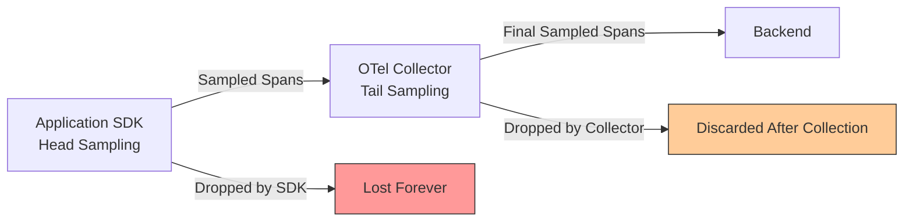
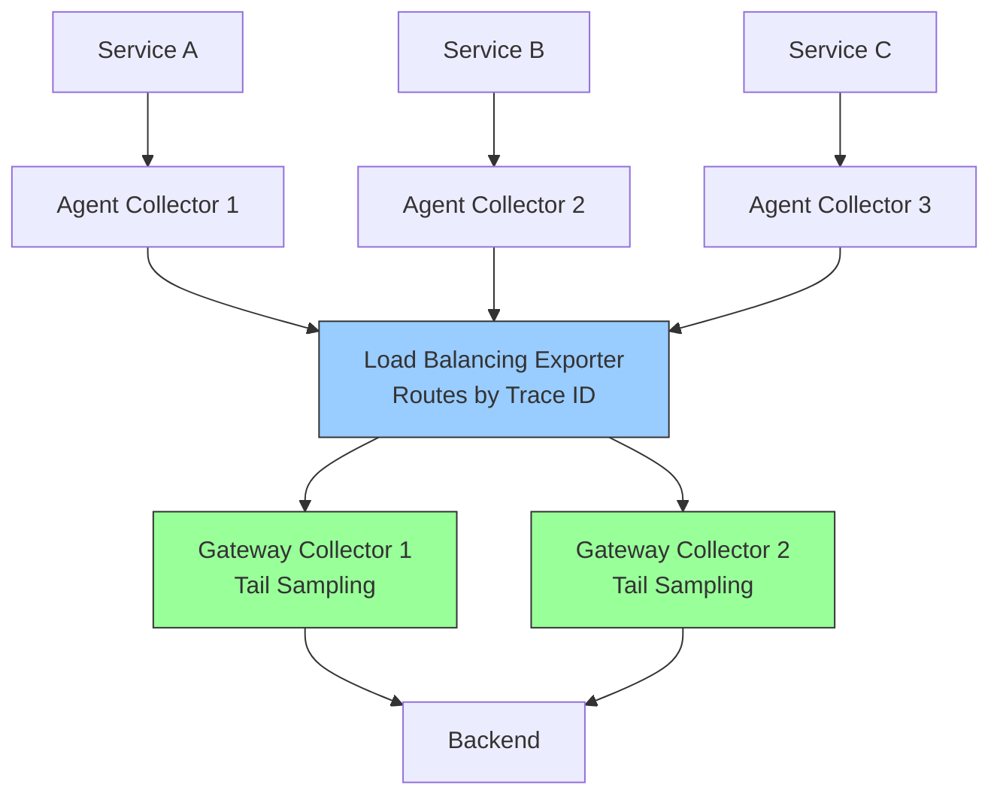

# How to Fix Inconsistent Sampling Between SDKs and Collector

Author: [nawazdhandala](https://www.github.com/nawazdhandala)

Tags: OpenTelemetry, Sampling, Collector, SDK, Tracing, Troubleshooting

Description: Learn how to diagnose and fix inconsistent sampling decisions between OpenTelemetry SDKs and the Collector that cause broken traces and missing spans.

---

Sampling is one of those things in OpenTelemetry that sounds straightforward until it breaks in production. You configure a sample rate in your SDK, set up tail sampling in the Collector, and suddenly you are looking at traces with missing spans, orphaned roots, and incomplete pictures of what actually happened in your system. The root cause is almost always a mismatch between how sampling decisions are being made at different layers.

This post walks through why inconsistent sampling happens, how to detect it, and how to set up a sampling strategy that keeps your traces intact from end to end.

## Why Sampling Inconsistencies Happen

In a typical OpenTelemetry deployment, sampling can happen at two distinct points: inside the SDK (head sampling) and inside the Collector (tail sampling). These two layers operate independently, and if they are not coordinated, they will make conflicting decisions about which spans to keep.



The key problem is this: head sampling in the SDK decides whether to record a span before any meaningful data about the request exists. Tail sampling in the Collector decides after the full trace has been assembled. When both layers are active with conflicting rules, some spans in a trace get dropped by the SDK while other spans in the same trace survive, and you end up with a fragmented view.

## Detecting the Problem

The most obvious symptom is broken traces in your backend. You will see traces where a parent span exists but child spans are missing, or child spans appear without their parent. Another common sign is that your actual ingestion volume does not match what you would expect from your configured sample rates.

Here is a quick way to check. If you have a service A calling service B, and both use a 50% sample rate independently, you might expect 50% of traces to come through. But what actually happens is that each service makes its own coin flip. About 25% of traces will have both spans, 25% will have only the span from A, 25% will have only the span from B, and 25% will be fully dropped. That means half of your "sampled" traces are incomplete.

You can verify this by checking the `otelcol_receiver_accepted_spans` and `otelcol_processor_dropped_spans` metrics on your Collector:

```bash
# Check how many spans the Collector receives vs drops
# A large gap indicates aggressive sampling somewhere in the pipeline
curl -s http://localhost:8888/metrics | grep otelcol_receiver_accepted_spans

# Check tail sampling decisions
curl -s http://localhost:8888/metrics | grep otelcol_processor_dropped_spans
```

If you see a high drop rate at the Collector after already sampling at the SDK level, you are double-sampling and losing more data than intended.

## The Core Principle: Sample Once

The golden rule is to make the sampling decision at exactly one place in the pipeline. You have two valid approaches.

**Approach 1: Head sampling only (SDK-side).** Every SDK uses a consistent sampler, and the Collector passes everything through without additional sampling. This is simpler but less flexible because you cannot make decisions based on the full trace.

**Approach 2: Tail sampling only (Collector-side).** SDKs send 100% of spans to the Collector, and the Collector makes all sampling decisions after assembling complete traces. This is more powerful but requires the Collector to handle the full volume temporarily.

Mixing both without coordination is where things go wrong. Let us look at how to implement each approach correctly.

## Approach 1: Consistent Head Sampling Across SDKs

If you choose head sampling, the critical requirement is that every service in a trace makes the same sampling decision. OpenTelemetry supports this through the `parentbased_traceidratio` sampler, which propagates sampling decisions from parent spans.

Here is how to configure it in a Go service:

```go
package main

import (
    "go.opentelemetry.io/otel"
    "go.opentelemetry.io/otel/sdk/trace"
)

func initTracer() {
    // ParentBased sampler respects the parent span's sampling decision.
    // If there is no parent (root span), it uses TraceIDRatioBased
    // to sample 25% of new traces.
    sampler := trace.ParentBased(
        trace.TraceIDRatioBased(0.25),
    )

    tp := trace.NewTracerProvider(
        trace.WithSampler(sampler),
        // ... exporter configuration
    )
    otel.SetTracerProvider(tp)
}
```

And the equivalent in Python:

```python
from opentelemetry import trace
from opentelemetry.sdk.trace import TracerProvider
from opentelemetry.sdk.trace.sampling import ParentBasedTraceIdRatio

# ParentBasedTraceIdRatio ensures child spans follow
# the parent's sampling decision. New root traces are
# sampled at 25%.
sampler = ParentBasedTraceIdRatio(0.25)

provider = TracerProvider(sampler=sampler)
trace.set_tracer_provider(provider)
```

And in Java:

```java
import io.opentelemetry.sdk.trace.SdkTracerProvider;
import io.opentelemetry.sdk.trace.samplers.Sampler;

// The parentBased sampler checks if the incoming context
// has a sampling decision. If it does, it honors that decision.
// For root spans with no parent, it applies the 25% ratio.
Sampler sampler = Sampler.parentBased(
    Sampler.traceIdRatioBased(0.25)
);

SdkTracerProvider tracerProvider = SdkTracerProvider.builder()
    .setSampler(sampler)
    .build();
```

The `ParentBased` wrapper is essential. Without it, each service would independently decide whether to sample, which is exactly the fragmentation problem we are trying to avoid. With `ParentBased`, the first service in the chain makes the decision, and every downstream service respects it.

When using this approach, your Collector configuration should not include any sampling processors:

```yaml
# Collector config for head-sampling-only approach
# No sampling processors here. The SDK already made the decision.
receivers:
  otlp:
    protocols:
      grpc:
        endpoint: 0.0.0.0:4317

processors:
  # Batch for efficiency, but no sampling
  batch:
    timeout: 5s
    send_batch_size: 512

exporters:
  otlp:
    endpoint: backend.example.com:4317

service:
  pipelines:
    traces:
      receivers: [otlp]
      processors: [batch]
      exporters: [otlp]
```

## Approach 2: Tail Sampling at the Collector

Tail sampling gives you much more control because you can make decisions based on the complete trace. The tradeoff is that SDKs must send everything, and the Collector needs enough memory to buffer complete traces before deciding.

First, configure all SDKs to use the `AlwaysOn` sampler:

```python
from opentelemetry import trace
from opentelemetry.sdk.trace import TracerProvider
from opentelemetry.sdk.trace.sampling import ALWAYS_ON

# Send every span to the Collector. Let the Collector
# decide what to keep after seeing the full trace.
provider = TracerProvider(sampler=ALWAYS_ON)
trace.set_tracer_provider(provider)
```

Then configure tail sampling in the Collector:

```yaml
# Collector config with tail sampling
receivers:
  otlp:
    protocols:
      grpc:
        endpoint: 0.0.0.0:4317

processors:
  # Tail sampling waits for complete traces before deciding.
  # decision_wait is how long to wait for all spans in a trace.
  tail_sampling:
    decision_wait: 30s
    num_traces: 100000
    policies:
      # Always keep traces that contain errors
      - name: errors-policy
        type: status_code
        status_code:
          status_codes:
            - ERROR

      # Always keep traces longer than 2 seconds
      - name: latency-policy
        type: latency
        latency:
          threshold_ms: 2000

      # Sample 10% of remaining normal traces
      - name: probabilistic-policy
        type: probabilistic
        probabilistic:
          sampling_percentage: 10

  batch:
    timeout: 5s
    send_batch_size: 512

exporters:
  otlp:
    endpoint: backend.example.com:4317

service:
  pipelines:
    traces:
      receivers: [otlp]
      processors: [tail_sampling, batch]
      exporters: [otlp]
```

This configuration keeps all error traces and slow traces while sampling 10% of normal traffic. Because the decision happens after all spans arrive, every trace that gets kept is complete.

## The Gateway Pattern for Consistent Tail Sampling

In production, you likely have multiple Collector instances. Tail sampling requires that all spans for a single trace arrive at the same Collector, or the sampling decision will be inconsistent. The solution is a two-tier architecture with a load-balancing exporter.



The agent Collectors use the `loadbalancing` exporter, which hashes the trace ID to consistently route all spans from the same trace to the same gateway:

```yaml
# Agent Collector config with load-balancing exporter
receivers:
  otlp:
    protocols:
      grpc:
        endpoint: 0.0.0.0:4317

exporters:
  # Load balancing exporter routes spans by trace ID.
  # All spans for the same trace go to the same gateway.
  loadbalancing:
    protocol:
      otlp:
        timeout: 10s
    resolver:
      dns:
        hostname: otel-gateway-collector.observability.svc.cluster.local
        port: 4317

service:
  pipelines:
    traces:
      receivers: [otlp]
      exporters: [loadbalancing]
```

The gateway Collectors then run tail sampling as shown in the previous section. This ensures trace completeness even in a distributed Collector deployment.

## Debugging Sampling Mismatches

When you suspect sampling is inconsistent, here are concrete steps to diagnose the issue.

First, check what sampler each SDK is actually using. In most SDKs you can enable debug logging to see sampling decisions:

```bash
# Set environment variable to see SDK sampling decisions
export OTEL_LOG_LEVEL=debug
export OTEL_TRACES_SAMPLER=parentbased_traceidratio
export OTEL_TRACES_SAMPLER_ARG=0.25
```

Second, inspect the `tracestate` and sampling flag on spans arriving at the Collector. The W3C trace context carries sampling information in the `traceparent` header. A sampled trace has the flag set to `01`:

```
traceparent: 00-4bf92f3577b34da6a3ce929d0e0e4736-00f067aa0ba902b7-01
                                                                    ^^
                                                              01 = sampled
                                                              00 = not sampled
```

Third, use the debug exporter on your Collector to log incoming spans and verify they carry consistent sampling flags:

```yaml
# Add debug exporter to inspect incoming spans
exporters:
  debug:
    verbosity: detailed

service:
  pipelines:
    traces:
      receivers: [otlp]
      processors: [batch]
      exporters: [debug, otlp]
```

Look for traces where some spans have `sampled: true` and others have `sampled: false`. That indicates a service in the chain is not using `ParentBased` sampling.

## Common Pitfalls to Avoid

One frequent mistake is configuring a `TraceIDRatioBased` sampler without the `ParentBased` wrapper. Without `ParentBased`, every service flips its own coin, and traces break apart.

Another pitfall is setting different sample rates across services. If Service A uses 50% and Service B uses 25%, the `ParentBased` wrapper will honor the parent decision for child spans, but root spans in Service B that are not called by A will use the 25% rate. This creates uneven representation in your data.

Finally, watch out for environment variable overrides. If you set `OTEL_TRACES_SAMPLER` as an environment variable on some pods but not others, you can inadvertently create sampling inconsistencies. Use a consistent configuration management approach across all services.

## Conclusion

Inconsistent sampling between SDKs and the Collector is one of the most common causes of broken traces in OpenTelemetry deployments. The fix comes down to a simple principle: make sampling decisions at one layer, and make sure that layer has complete information. Use `ParentBased` samplers for head sampling, or send everything to the Collector for tail sampling. If you are running multiple Collector instances, use the load-balancing exporter to ensure trace completeness. Either approach works well when applied consistently, but mixing them without coordination will always lead to fragmented traces.
