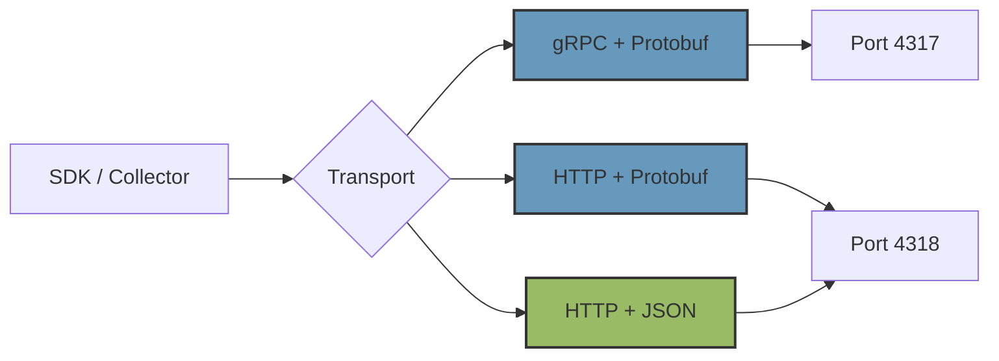
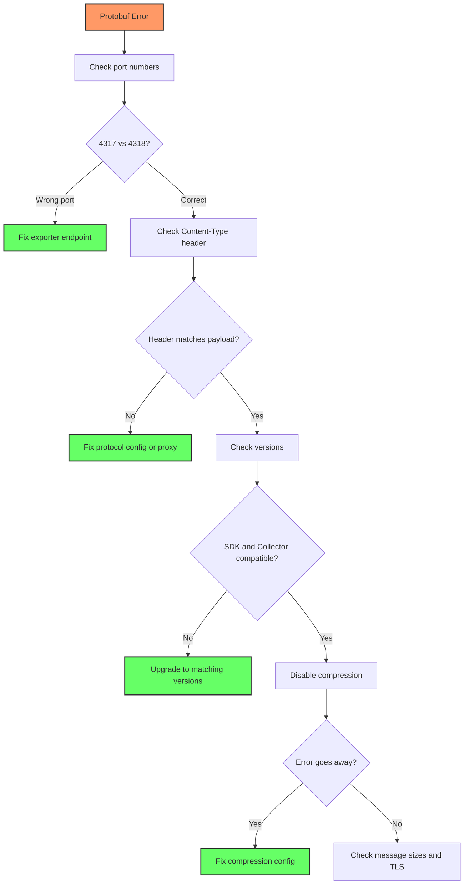

# How to Fix "Invalid Protobuf" Errors in OTLP Export

Author: [nawazdhandala](https://www.github.com/nawazdhandala)

Tags: OpenTelemetry, OTLP, Protobuf, Export, gRPC, HTTP, Troubleshooting, Serialization

Description: Learn how to diagnose and fix invalid protobuf serialization errors when exporting telemetry data via OTLP in OpenTelemetry SDKs and Collector.

---

When you see "invalid protobuf" or "proto: wrong wireframe" errors in your OpenTelemetry export pipeline, something has gone wrong with how your telemetry data is being serialized or how the receiver is interpreting it. These errors can be cryptic and frustrating because they happen at the protocol level, far from your application code. But the causes are usually one of a handful of common misconfigurations.

This post walks through the most frequent causes of protobuf errors in OTLP export, how to identify which one you are dealing with, and how to fix each one.

## Understanding OTLP and Protobuf

OTLP (OpenTelemetry Protocol) is the standard protocol for transmitting telemetry data between OpenTelemetry components. It supports two transport mechanisms: gRPC and HTTP. Both use Protocol Buffers (protobuf) as the serialization format, but the HTTP transport also supports JSON encoding.



The most common source of protobuf errors is a mismatch between what the sender is sending and what the receiver expects. Let us go through each scenario.

## Error 1: Sending HTTP/Protobuf to a gRPC Endpoint

This is the single most common cause. The gRPC port (default 4317) and the HTTP port (default 4318) expect different framing. If you point an HTTP exporter at the gRPC port, the receiver will fail to parse the data.

The error typically looks like this:

```
# Error from the receiver when it gets HTTP data on the gRPC port
rpc error: code = Internal desc = grpc: failed to unmarshal the received message:
proto: cannot parse invalid wire-format data

# Or from the SDK side
Export failed: invalid protobuf message
```

The fix is straightforward. Make sure your exporter configuration matches the receiver's protocol:

```python
# WRONG: Sending HTTP to the gRPC port
from opentelemetry.exporter.otlp.proto.http.trace_exporter import OTLPSpanExporter

# Port 4317 is gRPC, not HTTP
exporter = OTLPSpanExporter(endpoint="http://collector:4317/v1/traces")

# CORRECT: Use the HTTP port for the HTTP exporter
exporter = OTLPSpanExporter(endpoint="http://collector:4318/v1/traces")

# OR: Use the gRPC exporter for the gRPC port
from opentelemetry.exporter.otlp.proto.grpc.trace_exporter import OTLPSpanExporter
exporter = OTLPSpanExporter(endpoint="http://collector:4317")
```

For the Collector, make sure the exporter type matches the target:

```yaml
exporters:
  # gRPC exporter targets port 4317
  otlp/grpc:
    endpoint: backend:4317
    # No /v1/traces path needed for gRPC

  # HTTP exporter targets port 4318
  otlphttp:
    endpoint: http://backend:4318
    # Path is automatically appended: /v1/traces, /v1/metrics, /v1/logs
```

## Error 2: Content-Type Mismatch on HTTP Transport

When using HTTP transport, the Content-Type header tells the receiver how to decode the body. If the header says JSON but the body is protobuf (or vice versa), you get a parsing error.

```
# Error when Content-Type doesn't match the payload format
Failed to unmarshal: proto: syntax error (line 1:1): unexpected token {
```

This often happens when a proxy or load balancer modifies headers, or when environment variables are set incorrectly:

```bash
# Check what content type your exporter is sending
# The OTEL_EXPORTER_OTLP_PROTOCOL env var controls this
export OTEL_EXPORTER_OTLP_PROTOCOL=http/protobuf  # Sends protobuf over HTTP
export OTEL_EXPORTER_OTLP_PROTOCOL=http/json       # Sends JSON over HTTP
export OTEL_EXPORTER_OTLP_PROTOCOL=grpc             # Uses gRPC transport
```

You can verify what is actually being sent by checking the headers:

```bash
# Use curl to send a test request and see what the receiver expects
# This sends an empty ExportTraceServiceRequest as protobuf
curl -v -X POST http://collector:4318/v1/traces \
  -H "Content-Type: application/x-protobuf" \
  -d '' \
  2>&1 | grep -i "content-type"

# Compare with JSON format
curl -v -X POST http://collector:4318/v1/traces \
  -H "Content-Type: application/json" \
  -d '{"resourceSpans":[]}' \
  2>&1 | grep -i "content-type"
```

If you are running behind a reverse proxy like nginx, make sure it is not stripping or modifying the Content-Type header:

```nginx
# nginx config that preserves Content-Type for OTLP
location /v1/ {
    # Pass all headers through unchanged
    proxy_pass http://collector:4318;
    proxy_set_header Content-Type $content_type;
    # Do NOT add default_type or override Content-Type
}
```

## Error 3: Protobuf Version Mismatch

OpenTelemetry's protobuf definitions evolve between versions. If the sender is using a newer proto definition than the receiver supports, or if there are incompatible changes, you will see serialization errors.

```
# Error indicating proto schema mismatch
proto: wrong wireframe type for field
Cannot parse message: unknown field number
```

This typically happens when you upgrade the SDK but not the Collector, or vice versa. Check your versions:

```bash
# Check Collector version
otelcol-contrib --version

# Check SDK versions in Python
pip show opentelemetry-exporter-otlp-proto-grpc opentelemetry-proto

# Check SDK versions in Node.js
npm list @opentelemetry/exporter-trace-otlp-grpc @opentelemetry/otlp-transformer

# Check SDK versions in Java
# Look in your build.gradle or pom.xml for
# io.opentelemetry:opentelemetry-exporter-otlp version
```

The fix is to ensure compatible versions. As a general rule, keep your SDK and Collector within one minor version of each other. The protobuf definitions maintain backward compatibility, so newer receivers can usually handle older senders, but the reverse is not always true.

## Error 4: Corrupted Data in Transit

Sometimes the protobuf data gets corrupted between the sender and receiver. This can happen due to misconfigured TLS, compression issues, or buggy middleware.

To test if compression is the problem, try disabling it:

```python
# Python: Disable compression to test if it is the cause
from opentelemetry.exporter.otlp.proto.grpc.trace_exporter import OTLPSpanExporter

exporter = OTLPSpanExporter(
    endpoint="http://collector:4317",
    # Disable compression to rule out encoding issues
    compression=None,
)
```

```yaml
# Collector: Disable compression on the exporter
exporters:
  otlp:
    endpoint: backend:4317
    # Explicitly set no compression
    compression: none
```

If disabling compression fixes the error, the issue is likely that the receiver does not support the compression algorithm being used, or an intermediary is interfering with the compressed payload.

For TLS issues, verify the certificate chain:

```bash
# Test TLS connection to the collector
openssl s_client -connect collector:4317 -showcerts

# If using self-signed certs, make sure the SDK trusts them
# Python example with custom CA
export OTEL_EXPORTER_OTLP_CERTIFICATE=/path/to/ca.pem
```

## Error 5: Oversized Messages

Protobuf has no built-in size limit, but gRPC does. The default maximum message size in gRPC is 4MB. If you are sending very large batches, they may exceed this limit and fail with what looks like a protobuf error.

```
# Error when message exceeds gRPC size limit
rpc error: code = ResourceExhausted desc = grpc: received message larger than max (5242880 vs 4194304)
```

Fix this by either reducing batch sizes or increasing the gRPC message limit:

```yaml
# Collector receiver: Increase max message size
receivers:
  otlp:
    protocols:
      grpc:
        endpoint: 0.0.0.0:4317
        # Increase max receive message size to 16MB
        max_recv_msg_size_mib: 16

# Also reduce batch sizes to avoid hitting limits
processors:
  batch:
    # Keep batches under 4MB by limiting batch size
    send_batch_size: 256
    send_batch_max_size: 512
```

## A Systematic Debugging Approach

When you encounter a protobuf error and are not sure which of the above causes applies, follow this diagnostic sequence:



You can also use the collector's debug exporter to verify that data is being parsed correctly at the receiver side:

```yaml
# Add a debug exporter to verify data is being received properly
exporters:
  debug:
    # Print the first span from each batch to stdout
    verbosity: basic

service:
  pipelines:
    traces:
      receivers: [otlp]
      processors: [batch]
      # Send to both your real backend and the debug exporter
      exporters: [otlp, debug]
```

If the debug exporter shows valid data, the problem is between the collector and the downstream backend, not between the SDK and the collector.

## Prevention

The best way to avoid protobuf errors is to be explicit about your configuration rather than relying on defaults. Always specify the protocol, port, and content type. Use environment variables consistently across your deployment:

```bash
# Be explicit about everything in your deployment
export OTEL_EXPORTER_OTLP_PROTOCOL=grpc
export OTEL_EXPORTER_OTLP_ENDPOINT=http://collector:4317
export OTEL_EXPORTER_OTLP_COMPRESSION=gzip

# Or for HTTP transport
export OTEL_EXPORTER_OTLP_PROTOCOL=http/protobuf
export OTEL_EXPORTER_OTLP_ENDPOINT=http://collector:4318
export OTEL_EXPORTER_OTLP_COMPRESSION=gzip
```

Keep your SDK and Collector versions in lockstep, and test configuration changes in staging before rolling them out to production. Protobuf errors are almost always configuration problems, and once you know what to look for, they are quick to resolve.
