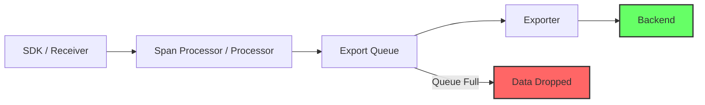
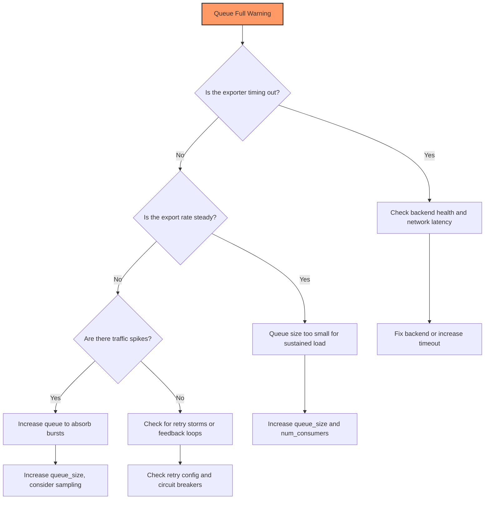

# How to Fix "Max Queue Size Reached" Warnings in OpenTelemetry

Author: [nawazdhandala](https://www.github.com/nawazdhandala)

Tags: OpenTelemetry, Queue, Exporter, Performance, Troubleshooting, Backpressure, Batch Processor

Description: Learn how to diagnose and resolve "max queue size reached" warnings in OpenTelemetry SDKs and Collector by tuning queue sizes, batch processors, and export pipelines.

---

If you have been running OpenTelemetry in production for any length of time, you have probably seen the dreaded "max queue size reached" warning show up in your logs. This message means your telemetry pipeline is dropping data because the exporter cannot keep up with the volume of spans, metrics, or logs being produced. It is one of the most common issues teams encounter when scaling their observability infrastructure, and fixing it requires understanding how the internal queuing mechanism works.

In this post, we will walk through what causes this warning, how to diagnose the root cause, and several strategies for resolving it permanently.

## Understanding the Queue Architecture

OpenTelemetry uses an internal queue between the processing stage and the export stage. When your application generates telemetry data, it flows through a pipeline that looks roughly like this:



The queue acts as a buffer between the producer (your application or the collector's receiver) and the consumer (the exporter sending data to your backend). When the exporter is slower than the producer, the queue fills up. Once it reaches its maximum capacity, new data gets dropped and you see the warning.

The default queue size in most OpenTelemetry SDK implementations is 2048 items. For the Collector's exporter helper, it defaults to 1000 batches. These defaults work fine for moderate workloads but quickly become insufficient under heavy load.

## Reproducing and Identifying the Problem

The warning message typically looks something like this in your logs:

```
# SDK-level warning when the BatchSpanProcessor queue is full
WARN  otel: dropping span, queue is full (maxQueueSize: 2048)

# Collector-level warning from the sending queue
WARN  exporterhelper: dropping data because sending_queue is full
```

Before tuning anything, you should first measure how fast data is being produced and how fast the exporter can drain it. Here is a quick diagnostic script you can run to monitor queue behavior in a Python application:

```python
import logging
import time
from opentelemetry import trace
from opentelemetry.sdk.trace import TracerProvider
from opentelemetry.sdk.trace.export import (
    BatchSpanProcessor,
    ConsoleSpanExporter,
)

# Set up logging to see internal OTel warnings
logging.basicConfig(level=logging.DEBUG)
logger = logging.getLogger("otel.diagnostics")

# Create a tracer provider with a deliberately small queue
# so we can observe the overflow behavior
provider = TracerProvider()
processor = BatchSpanProcessor(
    ConsoleSpanExporter(),
    max_queue_size=10,        # Very small for demonstration
    max_export_batch_size=5,  # Export 5 spans at a time
    schedule_delay_millis=5000,  # Export every 5 seconds
)
provider.add_span_processor(processor)
trace.set_tracer_provider(provider)

tracer = trace.get_tracer("queue-test")

# Generate spans faster than the exporter can drain them
for i in range(100):
    with tracer.start_as_current_span(f"test-span-{i}"):
        pass  # Each span completes immediately

logger.info("Finished generating spans. Check logs for queue warnings.")
```

If you run this, you will see queue overflow warnings almost immediately because we set the queue to only 10 items while generating 100 spans with a 5-second export delay.

## Tuning the SDK BatchSpanProcessor

The most direct fix is increasing the queue size and adjusting the batch processor parameters. Here is a well-tuned configuration for a high-throughput application:

```python
from opentelemetry.sdk.trace.export import BatchSpanProcessor

# Configure the batch processor for high throughput
processor = BatchSpanProcessor(
    exporter,
    # Maximum number of spans the queue can hold
    # Set this based on your peak spans-per-second times
    # the maximum acceptable delay in seconds
    max_queue_size=16384,

    # Number of spans to batch together for each export call
    # Larger batches are more efficient but add latency
    max_export_batch_size=512,

    # How often to flush the queue in milliseconds
    # Lower values reduce latency but increase network calls
    schedule_delay_millis=2000,

    # Timeout for each export call in milliseconds
    # If exports are timing out, this contributes to queue buildup
    export_timeout_millis=30000,
)
```

The same parameters exist in Java, Go, and other SDK implementations. Here is the equivalent in Java:

```java
// Java BatchSpanProcessor with tuned queue settings
BatchSpanProcessor processor = BatchSpanProcessor.builder(exporter)
    // Increase queue capacity to handle burst traffic
    .setMaxQueueSize(16384)
    // Batch more spans per export for better throughput
    .setMaxExportBatchSize(512)
    // Flush every 2 seconds
    .setScheduleDelay(Duration.ofMillis(2000))
    // Allow 30 seconds for each export operation
    .setExporterTimeout(Duration.ofMillis(30000))
    .build();
```

The key insight is that `max_queue_size` should be large enough to absorb traffic spikes, while `max_export_batch_size` and `schedule_delay_millis` control how aggressively the queue is drained.

## Tuning the Collector's Sending Queue

If the warning is coming from the OpenTelemetry Collector rather than the SDK, you need to adjust the exporter's `sending_queue` configuration:

```yaml
# Collector config with tuned sending queue
exporters:
  otlp:
    endpoint: backend.example.com:4317
    # Sending queue sits between processor and network export
    sending_queue:
      # Enable the sending queue (enabled by default)
      enabled: true
      # Number of batches to buffer
      # Each batch can contain hundreds of spans
      num_consumers: 10
      # Maximum number of batches in the queue
      queue_size: 5000
    # Retry configuration for transient failures
    retry_on_failure:
      enabled: true
      initial_interval: 5s
      max_interval: 30s
      max_elapsed_time: 300s

processors:
  batch:
    # Control how data is batched before hitting the exporter
    send_batch_size: 1024
    send_batch_max_size: 2048
    timeout: 2s
```

The `num_consumers` parameter is particularly important. It controls how many concurrent export operations can run simultaneously. If your backend can handle parallel writes, increasing this value dramatically improves throughput.

## Diagnosing the Root Cause

Sometimes the queue fills up not because of configuration, but because of an underlying problem. Here is a systematic approach to finding the real cause:



To gather the data you need for this diagnosis, enable debug logging on the exporter:

```yaml
# Enable verbose logging for the collector service
service:
  telemetry:
    logs:
      # Set to debug to see export timing and queue stats
      level: debug
    metrics:
      # Expose internal metrics on this address
      address: 0.0.0.0:8888
```

Then check the collector's internal metrics. The following Prometheus queries will reveal the queue state:

```promql
# Current queue size (how full is the queue right now)
otelcol_exporter_queue_size

# Number of items that failed to enter the queue (dropped)
rate(otelcol_exporter_enqueue_failed_spans[5m])

# Export latency (is the backend slow?)
histogram_quantile(0.99, rate(otelcol_exporter_send_latency_bucket[5m]))
```

If the export latency is high, the problem is downstream. If the queue size is consistently at its maximum, you need either a larger queue or faster exports.

## Using Persistent Queues for Reliability

For production systems where data loss is unacceptable, the Collector supports persistent queues that survive restarts:

```yaml
exporters:
  otlp:
    endpoint: backend.example.com:4317
    sending_queue:
      enabled: true
      # Use file-based storage instead of in-memory queue
      storage: file_storage/otlp
      queue_size: 10000
      num_consumers: 10

extensions:
  file_storage/otlp:
    # Directory where queue data is persisted to disk
    directory: /var/lib/otelcol/queue
    # Maximum disk space for the queue
    # Prevents filling up the disk if exports are blocked
    compaction:
      on_start: true
      directory: /tmp/otelcol-compaction

service:
  extensions: [file_storage/otlp]
```

Persistent queues write data to disk, so even if the collector crashes or restarts, queued data is not lost. The tradeoff is slightly higher latency due to disk I/O, but for most use cases this is negligible.

## When to Use Sampling Instead

If you have tuned everything and still see queue warnings, it may be time to reduce the volume of data entering the pipeline. Tail-based sampling in the collector lets you keep only the most interesting traces:

```yaml
processors:
  # Tail sampling keeps complete traces that match criteria
  tail_sampling:
    decision_wait: 10s
    policies:
      # Always keep traces with errors
      - name: errors
        type: status_code
        status_code:
          status_codes: [ERROR]
      # Keep only 10% of successful traces
      - name: probabilistic
        type: probabilistic
        probabilistic:
          sampling_percentage: 10
```

This approach can reduce queue pressure by 90% or more while still capturing all the traces that matter for debugging.

## Putting It All Together

The "max queue size reached" warning is fundamentally about the imbalance between production rate and consumption rate. The fix always comes down to one of three strategies: make the queue bigger to absorb bursts, make the consumer faster by tuning export parameters and adding concurrency, or reduce the production rate through sampling.

Start with the diagnostic steps to understand where the bottleneck actually is. Then apply the appropriate fix. In most cases, increasing `queue_size` and `num_consumers` on the Collector, or `max_queue_size` and `max_export_batch_size` on the SDK, resolves the issue entirely. For persistent or recurring problems, add monitoring on the queue metrics so you get alerted before data starts dropping.

The worst thing you can do is ignore the warning. Every time you see "max queue size reached," you are losing telemetry data that could be critical for diagnosing your next production incident.
