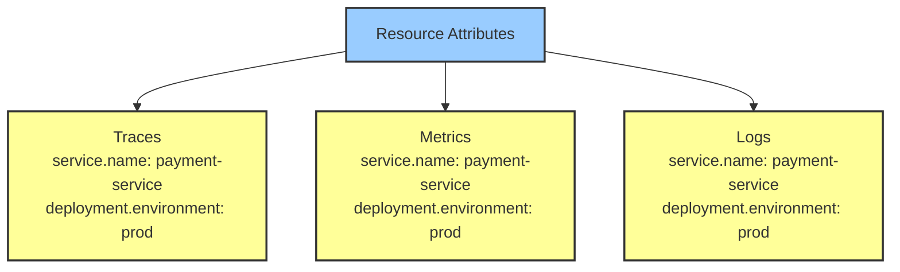

# How to Fix Missing Resource Attributes in OpenTelemetry Telemetry

Author: [nawazdhandala](https://www.github.com/nawazdhandala)

Tags: OpenTelemetry, Resource Attributes, Debugging, Telemetry, Tracing, Metrics, Logs, Configuration

Description: Learn how to diagnose and fix missing resource attributes in OpenTelemetry telemetry data, covering service name, environment, version, and custom attributes across SDKs.

---

Resource attributes in OpenTelemetry describe the entity producing telemetry. They include things like the service name, the deployment environment, the host, and the runtime version. When these attributes are missing, your traces, metrics, and logs show up in your backend without proper identification. You end up with data labeled as "unknown_service" or with no way to filter by environment or version.

This is one of those issues that seems small at first but becomes a real problem in production when you have dozens of services and need to quickly find the traces from a specific deployment. Let us walk through why resource attributes go missing and how to make sure they show up correctly.

## What Resource Attributes Are

A resource in OpenTelemetry is a set of key-value pairs that describe the source of telemetry. The OpenTelemetry specification defines a set of semantic conventions for common attributes:

```
service.name        - The logical name of the service (e.g., "payment-service")
service.version     - The version of the service (e.g., "1.4.2")
service.namespace   - A namespace for the service (e.g., "shop")
deployment.environment - The deployment environment (e.g., "production")
host.name           - The hostname of the machine
process.runtime.name - The runtime (e.g., "CPython", "Node.js")
```

These attributes get attached to every span, metric, and log record your application produces. They are how your observability backend knows which service generated which data.



## The "unknown_service" Problem

The most visible symptom of missing resource attributes is seeing "unknown_service" in your backend. This happens when you do not set `service.name` explicitly:

```python
# Python: This creates an "unknown_service:python" resource
from opentelemetry.sdk.trace import TracerProvider

# No resource specified, so defaults are used
provider = TracerProvider()
# Telemetry will show service.name = "unknown_service:python"
```

The fix is straightforward. Always set a resource with at minimum the service name:

```python
# Python: Properly configured resource with service name
from opentelemetry.sdk.trace import TracerProvider
from opentelemetry.sdk.resources import Resource

resource = Resource.create({
    "service.name": "payment-service",
    "service.version": "1.4.2",
    "deployment.environment": "production"
})

provider = TracerProvider(resource=resource)
```

```javascript
// Node.js: Set resource attributes
const { NodeTracerProvider } = require('@opentelemetry/sdk-trace-node');
const { Resource } = require('@opentelemetry/resources');
const { ATTR_SERVICE_NAME, ATTR_SERVICE_VERSION } = require('@opentelemetry/semantic-conventions');

const resource = new Resource({
    [ATTR_SERVICE_NAME]: 'payment-service',
    [ATTR_SERVICE_VERSION]: '1.4.2',
    'deployment.environment': 'production'
});

const provider = new NodeTracerProvider({ resource });
```

```go
// Go: Set resource attributes
import (
    "go.opentelemetry.io/otel/sdk/resource"
    semconv "go.opentelemetry.io/otel/semconv/v1.24.0"
)

res, err := resource.New(ctx,
    resource.WithAttributes(
        semconv.ServiceName("payment-service"),
        semconv.ServiceVersion("1.4.2"),
        semconv.DeploymentEnvironment("production"),
    ),
)
```

## Using Environment Variables for Resource Attributes

The most flexible way to set resource attributes is through environment variables. This lets you configure them at deployment time without changing code:

```bash
# Set service name and other attributes via environment variables
export OTEL_SERVICE_NAME=payment-service
export OTEL_RESOURCE_ATTRIBUTES=service.version=1.4.2,deployment.environment=production,team=payments
```

These environment variables work across all OpenTelemetry SDKs. The `OTEL_SERVICE_NAME` variable is a shortcut specifically for the service name, while `OTEL_RESOURCE_ATTRIBUTES` accepts a comma-separated list of key=value pairs for everything else.

In Docker and Kubernetes, set these in your deployment configuration:

```yaml
# Kubernetes deployment with resource attributes
apiVersion: apps/v1
kind: Deployment
metadata:
  name: payment-service
spec:
  template:
    spec:
      containers:
        - name: payment-service
          image: payment-service:1.4.2
          env:
            # Service name
            - name: OTEL_SERVICE_NAME
              value: "payment-service"
            # Additional resource attributes
            - name: OTEL_RESOURCE_ATTRIBUTES
              value: >-
                service.version=1.4.2,
                deployment.environment=production,
                k8s.namespace.name=payments,
                k8s.pod.name=$(POD_NAME),
                k8s.node.name=$(NODE_NAME)
            # Inject pod and node names from Kubernetes
            - name: POD_NAME
              valueFrom:
                fieldRef:
                  fieldPath: metadata.name
            - name: NODE_NAME
              valueFrom:
                fieldRef:
                  fieldPath: spec.nodeName
```

## Why Attributes Set in Code Might Not Appear

A common problem is setting resource attributes in code but not seeing them in your telemetry. This usually happens because of one of these reasons.

First, the resource might be created but not passed to the provider:

```python
# BUG: Resource is created but never used
resource = Resource.create({
    "service.name": "payment-service",
    "deployment.environment": "production"
})

# The provider does not receive the resource!
provider = TracerProvider()  # Missing resource=resource
```

```python
# FIX: Pass the resource to the provider
resource = Resource.create({
    "service.name": "payment-service",
    "deployment.environment": "production"
})

provider = TracerProvider(resource=resource)
```

Second, when using auto-instrumentation, you might be creating a provider that overrides the auto-configured one:

```python
# BUG: Auto-instrumentation sets up a provider with env var attributes,
# but then this code creates a NEW provider without them
provider = TracerProvider()  # This replaces the auto-configured provider
trace.set_tracer_provider(provider)
```

```python
# FIX: If using auto-instrumentation, configure via environment variables
# and let the auto-instrumentation handle provider creation
# Do NOT create your own TracerProvider unless you need to

# Or, merge with the default resource:
from opentelemetry.sdk.resources import Resource, OTELResourceDetector

# Detect default attributes and merge with custom ones
resource = Resource.create({
    "service.name": "payment-service",
    "custom.attribute": "my-value"
}).merge(OTELResourceDetector().detect())
```

## Resource Detectors: Automatic Attribute Discovery

OpenTelemetry SDKs include resource detectors that automatically discover attributes about the runtime environment. These are easy to forget, but they add valuable context like host names, container IDs, and cloud provider details.

```python
# Python: Use resource detectors for automatic attribute discovery
from opentelemetry.sdk.resources import Resource, get_aggregated_resources
from opentelemetry.sdk.resources import ProcessResourceDetector, OTELResourceDetector

# Combine manual attributes with auto-detected ones
resource = get_aggregated_resources([
    OTELResourceDetector(),       # Reads OTEL_RESOURCE_ATTRIBUTES env var
    ProcessResourceDetector(),     # Detects process.pid, process.runtime, etc.
], initial_resource=Resource.create({
    "service.name": "payment-service",
    "service.version": "1.4.2"
}))

provider = TracerProvider(resource=resource)
```

```javascript
// Node.js: Enable resource detectors
const { NodeTracerProvider } = require('@opentelemetry/sdk-trace-node');
const { Resource, envDetector, hostDetector, processDetector } = require('@opentelemetry/resources');
const { ATTR_SERVICE_NAME } = require('@opentelemetry/semantic-conventions');

// Detect host, process, and environment attributes automatically
const detectedResource = await Resource.detect({
    detectors: [envDetector, hostDetector, processDetector]
});

// Merge with your explicit attributes
const resource = new Resource({
    [ATTR_SERVICE_NAME]: 'payment-service'
}).merge(detectedResource);

const provider = new NodeTracerProvider({ resource });
```

For cloud environments, there are specialized detectors:

```python
# Python: Cloud-specific resource detectors
# pip install opentelemetry-resource-detector-aws

from opentelemetry.resource.detector.aws import AwsEc2ResourceDetector, AwsEcsResourceDetector

# These auto-detect cloud.provider, cloud.region, host.id, etc.
resource = get_aggregated_resources([
    AwsEc2ResourceDetector(),
    AwsEcsResourceDetector(),
    OTELResourceDetector(),
], initial_resource=Resource.create({
    "service.name": "payment-service"
}))
```

## Debugging Missing Attributes

When attributes are not showing up, use the debug exporter or console exporter to see exactly what resource attributes are attached to your telemetry:

```python
# Python: Use ConsoleSpanExporter to inspect resource attributes
from opentelemetry.sdk.trace.export import ConsoleSpanExporter, SimpleSpanProcessor

# Add a console exporter alongside your real exporter
provider.add_span_processor(SimpleSpanProcessor(ConsoleSpanExporter()))

# This prints spans to stdout including all resource attributes:
# {
#     "name": "process-payment",
#     "context": { ... },
#     "resource": {
#         "service.name": "payment-service",
#         "service.version": "1.4.2",
#         "deployment.environment": "production",
#         "process.pid": 12345,
#         "host.name": "web-01"
#     }
# }
```

```bash
# Using otel-cli to test what the collector receives
# This sends a test span and shows what resource attributes are included
otel-cli span \
    --service "test-service" \
    --name "test-span" \
    --endpoint http://localhost:4317 \
    --verbose
```

## Collector-Side Resource Processing

Even if your SDK sends the right resource attributes, the collector might be stripping them. Check your collector configuration for processors that modify resources:

```yaml
# Collector config: resource processor can add, update, or delete attributes
processors:
  # This processor modifies resource attributes
  resource:
    attributes:
      # Make sure you are not accidentally deleting attributes
      - key: deployment.environment
        value: production
        action: upsert    # upsert adds or updates

      # CAREFUL: 'delete' action removes the attribute!
      # - key: host.name
      #   action: delete

  # The attributes processor modifies SPAN attributes, not resource attributes
  # Do not confuse the two
  attributes:
    actions:
      - key: http.url
        action: delete

service:
  pipelines:
    traces:
      receivers: [otlp]
      processors: [resource, attributes, batch]
      exporters: [otlp]
```

You can also use the collector to add resource attributes that the SDK does not set, which is useful for infrastructure-level metadata:

```yaml
# Add cluster and region information at the collector level
processors:
  resource:
    attributes:
      - key: k8s.cluster.name
        value: "us-east-1-prod"
        action: insert    # insert only adds if not already present
      - key: cloud.region
        value: "us-east-1"
        action: insert
```

## Common Pitfalls Summary

Here are the most common reasons resource attributes go missing, collected in one place:

1. Not setting `service.name` at all, resulting in "unknown_service"
2. Creating a Resource but forgetting to pass it to the TracerProvider
3. Auto-instrumentation creating one provider while your code creates another
4. Environment variables with typos in attribute names
5. The collector's resource processor accidentally deleting attributes
6. Not using resource detectors for automatic host/process/cloud attributes
7. Setting attributes on spans instead of on the resource (span attributes and resource attributes are different things)

That last point is worth emphasizing. Resource attributes describe the service and are the same for every span. Span attributes describe the individual operation and vary per span. If you are setting `service.version` as a span attribute, it will not show up in the resource section of your backend.

```python
# WRONG: Setting resource-level info as a span attribute
with tracer.start_as_current_span("process-payment") as span:
    span.set_attribute("service.version", "1.4.2")  # This is a span attribute!

# RIGHT: Set it on the resource
resource = Resource.create({
    "service.version": "1.4.2"  # This goes on the resource
})
```

## Conclusion

Missing resource attributes in OpenTelemetry telemetry usually come from one of a handful of configuration mistakes: not setting attributes at all, not passing the resource to the provider, or confusing span attributes with resource attributes. The best practice is to set the critical attributes (`service.name`, `service.version`, `deployment.environment`) through environment variables so they can be configured at deployment time, and use resource detectors to automatically pick up runtime and infrastructure attributes. Always verify your resource attributes by checking the console exporter output before deploying to production.
