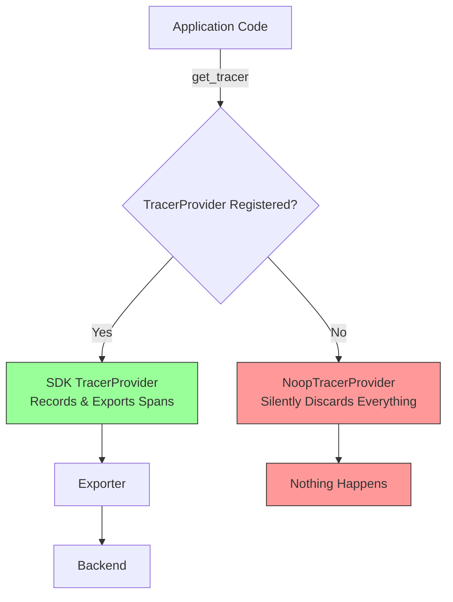

# How to Fix "No Tracer Provider Configured" Warnings in OpenTelemetry

Author: [nawazdhandala](https://www.github.com/nawazdhandala)

Tags: OpenTelemetry, TracerProvider, Configuration, SDK, Tracing, Troubleshooting

Description: Learn why OpenTelemetry shows "No TracerProvider configured" warnings and how to properly initialize the TracerProvider in every major language.

---

You added OpenTelemetry to your application, deployed it, and instead of traces flowing to your backend, you see this in the logs:

```
Warning: No TracerProvider configured, using NoopTracerProvider. All tracing operations will be no-ops.
```

This is one of the most common first-encounter issues with OpenTelemetry, and it means your application is running with a do-nothing tracer that silently discards every span. The good news is that the fix is always the same pattern: you need to create a TracerProvider, configure it with an exporter, and register it as the global provider. This post covers exactly how to do that in every major language, along with the subtle mistakes that cause the warning to persist even after you think you have fixed it.

## Why This Warning Appears

OpenTelemetry separates the tracing API from the tracing SDK by design. The API package provides the `Tracer` and `Span` interfaces that your application code uses. The SDK package provides the actual implementation that records spans and exports them. When you call `tracer.start_span()` without having registered an SDK TracerProvider, the API falls back to a NoopTracerProvider that does nothing.

This separation exists so that library authors can instrument their code with the OpenTelemetry API without forcing a dependency on the SDK. Application owners then bring in the SDK and configure it. But if you forget the configuration step, everything stays in noop mode.



## Fix for Python

In Python, the warning appears when you use `opentelemetry-api` without configuring `opentelemetry-sdk`. Here is the minimal working setup:

```python
from opentelemetry import trace
from opentelemetry.sdk.trace import TracerProvider
from opentelemetry.sdk.trace.export import BatchSpanExporter
from opentelemetry.exporter.otlp.proto.grpc.trace_exporter import OTLPSpanExporter

# Step 1: Create an exporter that sends spans to your backend.
# This uses OTLP over gRPC to a Collector on localhost.
exporter = OTLPSpanExporter(
    endpoint="localhost:4317",
    insecure=True,
)

# Step 2: Create a TracerProvider and add the exporter.
# BatchSpanExporter batches spans for efficient export.
provider = TracerProvider()
provider.add_span_processor(BatchSpanExporter(exporter))

# Step 3: Register the provider as the global TracerProvider.
# This is the critical step that most people miss.
trace.set_tracer_provider(provider)

# Now get a tracer and create spans as normal
tracer = trace.get_tracer("my-service")
with tracer.start_as_current_span("my-operation"):
    print("This span will be exported!")
```

The most common mistake in Python is calling `trace.get_tracer()` before `trace.set_tracer_provider()`. The order matters. If you get a tracer before the provider is set, that tracer is bound to the NoopTracerProvider and will remain a noop even after you register the real provider.

```python
# Wrong order: tracer is created before provider is registered
tracer = trace.get_tracer("my-service")  # Gets a NoopTracer!
trace.set_tracer_provider(provider)       # Too late for the tracer above

# Right order: register provider first
trace.set_tracer_provider(provider)
tracer = trace.get_tracer("my-service")  # Gets a real Tracer
```

Actually, this was fixed in recent versions of the Python SDK. In newer versions, `get_tracer()` returns a proxy that delegates to whatever provider is registered at the time of use. But if you are on an older version, the order matters. Check your version:

```bash
# Check your opentelemetry-api version
pip show opentelemetry-api | grep Version
```

## Fix for JavaScript/Node.js

In Node.js, the warning looks like:

```
@opentelemetry/api: Registered a noop TracerProvider because a real one was not configured.
```

Here is the correct initialization:

```javascript
const { NodeSDK } = require('@opentelemetry/sdk-node');
const { OTLPTraceExporter } = require('@opentelemetry/exporter-trace-otlp-grpc');
const { getNodeAutoInstrumentations } = require('@opentelemetry/auto-instrumentations-node');

// Create the SDK instance with an exporter and instrumentations.
// The NodeSDK handles TracerProvider registration automatically.
const sdk = new NodeSDK({
    traceExporter: new OTLPTraceExporter({
        url: 'http://localhost:4317',
    }),
    instrumentations: [getNodeAutoInstrumentations()],
});

// Start the SDK. This registers the TracerProvider globally.
// This must be called before any other code that uses tracing.
sdk.start();

// Handle graceful shutdown
process.on('SIGTERM', () => {
    sdk.shutdown()
        .then(() => console.log('SDK shut down successfully'))
        .catch((err) => console.error('Error shutting down SDK', err))
        .finally(() => process.exit(0));
});
```

The critical detail in Node.js is that `sdk.start()` must be called before any code that creates spans or imports instrumented libraries. In practice, this means the SDK initialization should be the very first thing in your entry point file, or better yet, loaded via the `--require` flag:

```bash
# Load the tracing setup before your application code.
# This ensures the TracerProvider is registered before any
# instrumented library is imported.
node --require ./tracing.js app.js
```

If you use ES modules, the `--import` flag is needed instead:

```bash
# For ES modules, use --import instead of --require
node --import ./tracing.mjs app.mjs
```

A common mistake is putting the SDK initialization in a module that gets imported after other modules have already called `trace.getTracer()`. By the time the SDK starts, those modules already have noop tracers.

## Fix for Go

In Go, the warning is more subtle. There is no log message by default. Instead, your spans simply do not appear. The noop behavior is the default, and you have to explicitly set up the provider:

```go
package main

import (
    "context"
    "log"

    "go.opentelemetry.io/otel"
    "go.opentelemetry.io/otel/exporters/otlp/otlptrace/otlptracegrpc"
    "go.opentelemetry.io/otel/sdk/resource"
    "go.opentelemetry.io/otel/sdk/trace"
    semconv "go.opentelemetry.io/otel/semconv/v1.24.0"
)

func initTracer() (func(context.Context) error, error) {
    ctx := context.Background()

    // Step 1: Create the OTLP exporter
    exporter, err := otlptracegrpc.New(ctx,
        otlptracegrpc.WithEndpoint("localhost:4317"),
        otlptracegrpc.WithInsecure(),
    )
    if err != nil {
        return nil, err
    }

    // Step 2: Create a resource describing this service
    res, err := resource.New(ctx,
        resource.WithAttributes(
            semconv.ServiceName("my-service"),
            semconv.ServiceVersion("1.0.0"),
        ),
    )
    if err != nil {
        return nil, err
    }

    // Step 3: Create the TracerProvider with the exporter and resource
    tp := trace.NewTracerProvider(
        trace.WithBatcher(exporter),
        trace.WithResource(res),
    )

    // Step 4: Register as the global TracerProvider.
    // Without this line, otel.Tracer() returns a noop tracer.
    otel.SetTracerProvider(tp)

    // Return a shutdown function for graceful cleanup
    return tp.Shutdown, nil
}

func main() {
    shutdown, err := initTracer()
    if err != nil {
        log.Fatalf("Failed to initialize tracer: %v", err)
    }
    defer shutdown(context.Background())

    // Now otel.Tracer() returns a working tracer
    tracer := otel.Tracer("my-service")
    ctx, span := tracer.Start(context.Background(), "my-operation")
    defer span.End()

    doWork(ctx)
}
```

The missing `otel.SetTracerProvider(tp)` call is the most common cause of silent noop behavior in Go. The compiler will not complain, the application will run fine, and you will just never see any traces.

## Fix for Java

In Java, the warning typically appears as:

```
[otel.javaagent] No TracerProvider configured. Traces will not be exported.
```

If you are using the Java agent for auto-instrumentation, the agent handles provider setup automatically. The warning usually means the agent is not properly attached:

```bash
# Make sure the agent JAR is passed as a javaagent argument.
# The agent configures the TracerProvider automatically.
java -javaagent:/path/to/opentelemetry-javaagent.jar \
     -Dotel.service.name=my-service \
     -Dotel.exporter.otlp.endpoint=http://localhost:4317 \
     -jar myapp.jar
```

For manual instrumentation without the agent:

```java
import io.opentelemetry.api.OpenTelemetry;
import io.opentelemetry.api.GlobalOpenTelemetry;
import io.opentelemetry.sdk.OpenTelemetrySdk;
import io.opentelemetry.sdk.trace.SdkTracerProvider;
import io.opentelemetry.sdk.trace.export.BatchSpanProcessor;
import io.opentelemetry.exporter.otlp.trace.OtlpGrpcSpanExporter;
import io.opentelemetry.sdk.resources.Resource;
import io.opentelemetry.semconv.ResourceAttributes;

public class TracingConfig {
    public static OpenTelemetry initTracing() {
        // Step 1: Create the OTLP exporter
        OtlpGrpcSpanExporter exporter = OtlpGrpcSpanExporter.builder()
            .setEndpoint("http://localhost:4317")
            .build();

        // Step 2: Create the TracerProvider with the exporter
        SdkTracerProvider tracerProvider = SdkTracerProvider.builder()
            .addSpanProcessor(BatchSpanProcessor.builder(exporter).build())
            .setResource(Resource.getDefault().toBuilder()
                .put(ResourceAttributes.SERVICE_NAME, "my-service")
                .build())
            .build();

        // Step 3: Build the OpenTelemetry instance and register it globally
        OpenTelemetrySdk sdk = OpenTelemetrySdk.builder()
            .setTracerProvider(tracerProvider)
            .buildAndRegisterGlobal();

        return sdk;
    }
}
```

The `buildAndRegisterGlobal()` method is what registers the provider. If you use `build()` instead, the provider is created but not registered globally, and any code using `GlobalOpenTelemetry.getTracer()` will still get a noop.

## Fix for .NET

In .NET, the warning may appear as:

```
No TracerProvider is registered. Install and configure the OpenTelemetry SDK to enable tracing.
```

The setup uses the builder pattern:

```csharp
using OpenTelemetry;
using OpenTelemetry.Trace;
using OpenTelemetry.Resources;

// In your Program.cs or Startup.cs
var tracerProvider = Sdk.CreateTracerProviderBuilder()
    .SetResourceBuilder(ResourceBuilder.CreateDefault()
        .AddService("my-service", serviceVersion: "1.0.0"))
    // Add the OTLP exporter
    .AddOtlpExporter(options =>
    {
        options.Endpoint = new Uri("http://localhost:4317");
    })
    // Add auto-instrumentation for ASP.NET Core
    .AddAspNetCoreInstrumentation()
    // Add auto-instrumentation for HttpClient
    .AddHttpClientInstrumentation()
    .Build();

// The Build() call registers the provider.
// Make sure to dispose it on application shutdown.
```

For ASP.NET Core applications using dependency injection:

```csharp
// In Program.cs with the new minimal hosting model
var builder = WebApplication.CreateBuilder(args);

// Add OpenTelemetry tracing to the service collection.
// This registers the TracerProvider with DI and ensures
// it is available throughout the application lifecycle.
builder.Services.AddOpenTelemetry()
    .WithTracing(tracing =>
    {
        tracing
            .SetResourceBuilder(ResourceBuilder.CreateDefault()
                .AddService("my-service"))
            .AddAspNetCoreInstrumentation()
            .AddHttpClientInstrumentation()
            .AddOtlpExporter();
    });

var app = builder.Build();
app.Run();
```

## Common Cross-Language Mistakes

Regardless of the language, these patterns cause the noop warning:

**Installing only the API package.** The API intentionally works without the SDK, but it falls back to noop mode. You need both:

```bash
# Python: need both api and sdk
pip install opentelemetry-api opentelemetry-sdk

# Node.js: need both api and sdk-node
npm install @opentelemetry/api @opentelemetry/sdk-node

# Go: need both api and sdk modules
go get go.opentelemetry.io/otel
go get go.opentelemetry.io/otel/sdk
```

**Registering the provider in the wrong place.** If your initialization code runs after instrumented code has already created tracers, you may get noop behavior. Always initialize the TracerProvider as early as possible in your application startup.

**Environment variable misconfiguration.** Some setups rely on environment variables to configure the SDK. If the variables are missing or wrong, the SDK may not initialize:

```bash
# These environment variables configure the OTLP exporter.
# If OTEL_TRACES_EXPORTER is set to "none", no traces will be exported.
export OTEL_TRACES_EXPORTER="otlp"
export OTEL_EXPORTER_OTLP_ENDPOINT="http://localhost:4317"
export OTEL_SERVICE_NAME="my-service"

# Verify variables are set correctly
env | grep OTEL
```

**Shutdown before flush.** If your application exits before the BatchSpanExporter has a chance to flush, spans are lost. Always call shutdown or flush:

```python
from opentelemetry import trace

provider = trace.get_tracer_provider()

# Before exiting, force flush any pending spans
# and shut down the provider cleanly
provider.force_flush()
provider.shutdown()
```

## Verifying the Fix

After configuring the TracerProvider, verify that traces are actually flowing. The simplest check is to use a console exporter alongside your real exporter during debugging:

```python
from opentelemetry import trace
from opentelemetry.sdk.trace import TracerProvider
from opentelemetry.sdk.trace.export import (
    BatchSpanExporter,
    ConsoleSpanExporter,
    SimpleSpanProcessor,
)
from opentelemetry.exporter.otlp.proto.grpc.trace_exporter import OTLPSpanExporter

provider = TracerProvider()

# Add a console exporter to see spans printed to stdout.
# This confirms the TracerProvider is working even if the
# OTLP exporter has connectivity issues.
provider.add_span_processor(SimpleSpanProcessor(ConsoleSpanExporter()))

# Add the real OTLP exporter for production use
provider.add_span_processor(BatchSpanExporter(
    OTLPSpanExporter(endpoint="localhost:4317", insecure=True)
))

trace.set_tracer_provider(provider)

tracer = trace.get_tracer("verification")
with tracer.start_as_current_span("test-span"):
    print("If you see span output above this line, tracing is working.")
```

If the console shows span output, your TracerProvider is configured correctly. If spans appear in the console but not in your backend, the issue is with the exporter or network, not with the provider setup.

## Conclusion

The "No TracerProvider configured" warning always means the same thing: the OpenTelemetry SDK has not been initialized and registered as the global provider. The fix follows the same three-step pattern in every language: create an exporter, build a TracerProvider with that exporter, and register it globally before any tracing code runs. Once you have internalized this pattern, you will recognize and fix this warning in seconds. The key is to make sure initialization happens early enough and that you have both the API and SDK packages installed.
