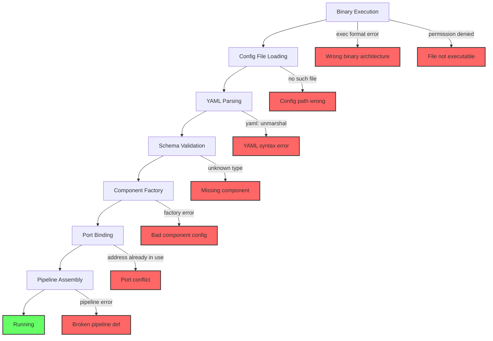

# How to Fix OpenTelemetry Collector Crashing on Startup

Author: [nawazdhandala](https://www.github.com/nawazdhandala)

Tags: OpenTelemetry, Collector, Crash, Startup, Configuration, Debugging, Kubernetes, Docker

Description: A complete troubleshooting guide for fixing OpenTelemetry Collector crashes on startup, covering configuration errors, port conflicts, permission issues, and resource limits.

---

Few things are more frustrating than a Collector that crashes immediately on startup. You deploy it, it exits within seconds, and the logs give you an error message that may or may not point you in the right direction. The good news is that startup crashes follow a small number of patterns, and once you know what to look for, you can fix most of them in minutes.

This guide covers the most common reasons the OpenTelemetry Collector crashes on startup and provides concrete steps to resolve each one.

## Quick Triage: Where Did It Crash?

The first step is to determine how far the Collector got before crashing. The startup sequence has distinct phases, and the error message tells you which phase failed:



Check the logs immediately after the crash. In Kubernetes, use `kubectl logs` with the `--previous` flag to see logs from the crashed container:

```bash
# Get logs from the most recently crashed collector pod
kubectl logs -n monitoring otel-collector-0 --previous

# For Docker containers
docker logs otel-collector

# For systemd services
journalctl -u otel-collector -n 50 --no-pager
```

## Crash 1: YAML Configuration Syntax Errors

YAML is notoriously sensitive to indentation and formatting. A single wrong indent or a misplaced colon can prevent the Collector from starting.

```yaml
# BROKEN: Indentation is wrong for the processors section
receivers:
  otlp:
    protocols:
      grpc:
        endpoint: 0.0.0.0:4317

processors:
  batch:
  timeout: 10s          # ERROR: This should be indented under batch
  send_batch_size: 100  # ERROR: Same here

exporters:
  debug: {}

service:
  pipelines:
    traces:
      receivers: [otlp]
      processors: [batch]
      exporters: [debug]
```

The error message will say something like:

```
Error: cannot unmarshal the configuration: yaml: line 9: mapping values are not allowed in this context
```

The fix is to correct the indentation:

```yaml
# FIXED: Proper nesting under the batch processor
processors:
  batch:
    # These settings must be indented under batch
    timeout: 10s
    send_batch_size: 100
```

You can validate your YAML before deploying:

```bash
# Validate YAML syntax (does not check OTel schema, just YAML structure)
python3 -c "import yaml; yaml.safe_load(open('config.yaml'))" && echo "YAML OK"

# Use the collector's built-in validation
otelcol-contrib validate --config=config.yaml

# For Kubernetes ConfigMaps, validate before applying
kubectl create configmap otel-config \
  --from-file=config.yaml \
  --dry-run=client -o yaml | kubectl apply --dry-run=server -f -
```

## Crash 2: Unknown Component Type

If you reference a receiver, processor, exporter, or extension that is not compiled into your Collector binary, it will crash with an "unknown type" error.

```
Error: failed to get config: cannot unmarshal the configuration:
unknown type: "prometheusremotewrite" for id: "prometheusremotewrite"
```

This happens frequently when you switch between the core Collector (`otelcol`) and the contrib distribution (`otelcol-contrib`). The core distribution includes only a small set of components, while contrib includes hundreds.

```bash
# List all components available in your binary
otelcol-contrib components

# Check if a specific component is available
otelcol-contrib components | grep -i prometheus

# If you need the contrib distribution but have the core:
# Docker: Use the contrib image
# FROM otel/opentelemetry-collector-contrib:latest
# Instead of:
# FROM otel/opentelemetry-collector:latest
```

If you are building a custom Collector with the OpenTelemetry Collector Builder (ocb), make sure all required components are in your builder manifest:

```yaml
# builder-config.yaml for ocb
dist:
  name: custom-otelcol
  output_path: ./build

receivers:
  - gomod: go.opentelemetry.io/collector/receiver/otlpreceiver v0.96.0
  # Add any other receivers you reference in your config

exporters:
  - gomod: go.opentelemetry.io/collector/exporter/otlpexporter v0.96.0
  # Make sure every exporter in your config is listed here
  - gomod: github.com/open-telemetry/opentelemetry-collector-contrib/exporter/prometheusremotewriteexporter v0.96.0

processors:
  - gomod: go.opentelemetry.io/collector/processor/batchprocessor v0.96.0
```

## Crash 3: Port Already in Use

The Collector binds to several ports by default (4317 for gRPC, 4318 for HTTP, 8888 for internal metrics, and sometimes 13133 for health check). If any of these ports are already taken, it crashes.

```
Error: failed to start receivers: listen tcp 0.0.0.0:4317: bind: address already in use
```

Find out what is using the port:

```bash
# Find the process using port 4317
sudo lsof -i :4317
# Or with ss
sudo ss -tlnp | grep 4317

# On Kubernetes, this usually means another collector pod is still running
# or the previous pod hasn't fully terminated
kubectl get pods -n monitoring | grep otel

# Check if the port is bound inside a container
kubectl exec -n monitoring otel-collector-0 -- ss -tlnp
```

Solutions:

```yaml
# Option 1: Change the ports in your config
receivers:
  otlp:
    protocols:
      grpc:
        # Use a non-default port
        endpoint: 0.0.0.0:14317
      http:
        endpoint: 0.0.0.0:14318

service:
  telemetry:
    metrics:
      # Move internal metrics to a different port
      address: 0.0.0.0:18888
```

```yaml
# Option 2: In Kubernetes, ensure proper pod termination
apiVersion: apps/v1
kind: Deployment
spec:
  template:
    spec:
      # Give the previous pod time to fully terminate
      terminationGracePeriodSeconds: 30
      containers:
        - name: otel-collector
          # Add a preStop hook to drain connections
          lifecycle:
            preStop:
              exec:
                command: ["/bin/sh", "-c", "sleep 5"]
```

## Crash 4: Insufficient Permissions

The Collector may need specific system permissions, especially when using receivers that access host metrics, log files, or network interfaces.

```
Error: failed to start receivers: open /var/log/syslog: permission denied
Error: failed to start receivers: error creating metric reader: operation not permitted
```

In Docker, make sure the container has the right capabilities:

```yaml
# docker-compose.yml with proper permissions
services:
  otel-collector:
    image: otel/opentelemetry-collector-contrib:latest
    volumes:
      - ./config.yaml:/etc/otelcol-contrib/config.yaml
      # Mount host paths that receivers need to read
      - /var/log:/var/log:ro
      - /proc:/host/proc:ro
      - /sys:/host/sys:ro
    # Run as root if needed for host metrics (not ideal)
    user: "0:0"
    # Or add specific capabilities
    cap_add:
      - SYS_PTRACE    # For process metrics
      - NET_RAW        # For network receivers
```

In Kubernetes, use a SecurityContext:

```yaml
# Kubernetes pod spec with security context
containers:
  - name: otel-collector
    securityContext:
      # Run as root only if absolutely necessary
      runAsUser: 0
      # Or use specific capabilities
      capabilities:
        add:
          - SYS_PTRACE
    volumeMounts:
      - name: hostfs
        mountPath: /hostfs
        readOnly: true
volumes:
  - name: hostfs
    hostPath:
      path: /
```

## Crash 5: Out of Memory During Startup

If the Collector is configured with many receivers, processors, or large lookup tables, it might run out of memory before it finishes initializing.

```
# OOM killed in Kubernetes
State:          Terminated
Reason:         OOMKilled
Exit Code:      137

# OOM killed by the Linux kernel
dmesg | grep -i "otelcol.*oom"
```

The fix depends on the cause. If it is a genuinely large configuration:

```yaml
# Kubernetes: Increase memory limits
containers:
  - name: otel-collector
    resources:
      requests:
        memory: 512Mi
        cpu: 200m
      limits:
        # Set memory limit high enough for initialization
        # The collector may need 2-3x its steady-state memory during startup
        memory: 2Gi
        cpu: "1"
```

If the memory usage seems unreasonable for your configuration, check for processors that load large datasets at startup:

```yaml
# These processors can use significant memory at startup:

# The groupbyattrs processor buffers data
processors:
  groupbyattrs:
    keys: [service.name]
    # Reduce buffer if memory is tight

# The filter processor with complex regex patterns
  filter:
    traces:
      span:
        - 'attributes["http.url"] matches "very-complex-regex-pattern"'

# The transform processor with many statements
  transform:
    trace_statements:
      - context: span
        statements:
          # Many transform statements increase startup memory
```

## Crash 6: Configuration Environment Variable Issues

If your configuration uses environment variables that are not set, the Collector will crash:

```yaml
# Config referencing env vars
exporters:
  otlp:
    endpoint: ${OTEL_BACKEND_ENDPOINT}
    headers:
      Authorization: "Bearer ${OTEL_AUTH_TOKEN}"
```

```
Error: cannot resolve config: environment variable "OTEL_BACKEND_ENDPOINT" is not set
```

Verify your environment variables are available:

```bash
# Check if the env var is set in the container
kubectl exec -n monitoring otel-collector-0 -- env | grep OTEL

# For Docker, check the compose file or run command
docker inspect otel-collector | jq '.[0].Config.Env'

# Use default values in the config as a fallback
# The ${VAR:-default} syntax provides a default if VAR is unset
```

```yaml
# Config with safe defaults
exporters:
  otlp:
    # Use a default endpoint if the env var is not set
    endpoint: ${OTEL_BACKEND_ENDPOINT:-localhost:4317}
    headers:
      Authorization: "Bearer ${OTEL_AUTH_TOKEN:-}"
```

## A Pre-Deployment Checklist

Before deploying or updating your Collector, run through this checklist to catch startup issues before they happen:

```bash
# 1. Validate the configuration file
otelcol-contrib validate --config=config.yaml

# 2. Check that all referenced components exist in the binary
otelcol-contrib components | grep -c "receiver"

# 3. Test with dry-run if your deployment tool supports it
helm template otel-collector ./chart | kubectl apply --dry-run=server -f -

# 4. Verify environment variables are set
env | grep OTEL

# 5. Check port availability
ss -tlnp | grep -E '4317|4318|8888|13133'

# 6. Verify file permissions for any mounted volumes
ls -la /etc/otelcol-contrib/config.yaml
```

Most Collector startup crashes are configuration issues that can be caught before deployment. Build validation into your CI/CD pipeline and you will rarely encounter these problems in production.
