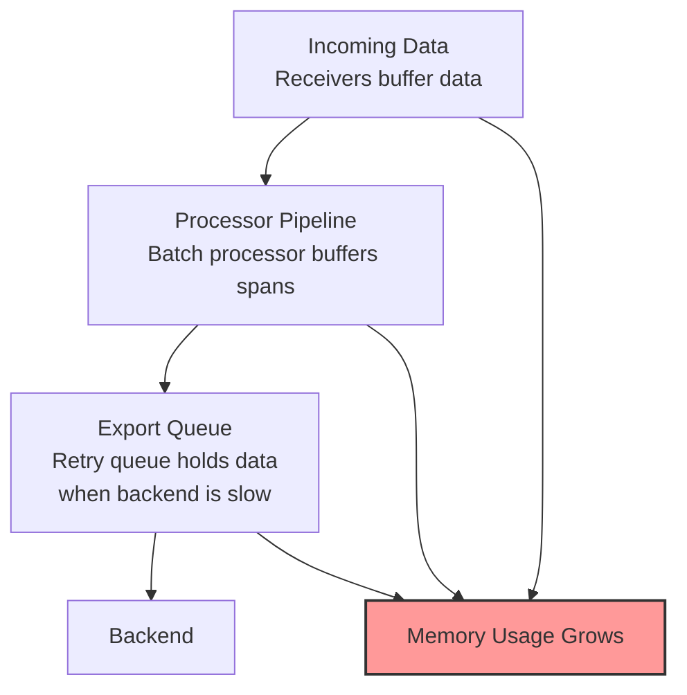

# How to Fix OpenTelemetry Collector OOM Killed Errors in Kubernetes

Author: [nawazdhandala](https://www.github.com/nawazdhandala)

Tags: OpenTelemetry, Collector, Kubernetes, OOM, Memory, Troubleshooting

Description: A step-by-step guide to diagnosing and fixing OpenTelemetry Collector OOMKilled errors in Kubernetes by tuning memory limits, processors, and queue settings.

Your OpenTelemetry Collector pod keeps restarting. You check `kubectl describe pod` and there it is: `OOMKilled`. The container exceeded its memory limit and Kubernetes terminated it. This is one of the most common operational issues when running the collector in Kubernetes, and it can cause data loss, pipeline downtime, and alert fatigue from constant restarts.

This guide walks through why the collector runs out of memory and how to fix it with proper resource limits, memory limiting processors, and pipeline tuning.

## Understanding Why the Collector Gets OOM Killed

Kubernetes enforces memory limits on containers. When a container exceeds its limit, the kernel's OOM killer terminates the process immediately. There is no graceful shutdown, no chance to flush data, and no warning.

The OpenTelemetry Collector can consume memory in several places:



Each of these components holds data in memory. Under high load or when the backend is slow, all three can grow simultaneously, pushing memory usage past the Kubernetes limit.

## Step 1: Check Current Memory Usage and Limits

Start by examining the current state of the collector pod:

```bash
# Check pod status and recent events
kubectl describe pod -n observability -l app=otel-collector | grep -A 10 "State\|Limits\|Last State"

# Check current memory usage
kubectl top pod -n observability -l app=otel-collector

# Check the memory limit configured in the deployment
kubectl get deployment -n observability otel-collector -o jsonpath='{.spec.template.spec.containers[0].resources}' | jq .
```

Typical output when OOM is occurring:

```
Last State:     Terminated
  Reason:       OOMKilled
  Exit Code:    137
  Started:      Fri, 06 Feb 2026 08:00:00 UTC
  Finished:     Fri, 06 Feb 2026 08:15:32 UTC
```

Exit code 137 specifically means the process was killed by SIGKILL due to an out-of-memory condition.

## Step 2: Configure the Memory Limiter Processor

The memory limiter processor is the single most important defense against OOM kills. It monitors the collector's memory usage and starts refusing data before memory reaches the Kubernetes limit. This gives the collector time to flush existing data and prevents the hard OOM kill.

```yaml
# Collector configuration with memory limiter
processors:
  # Memory limiter must be the FIRST processor in the pipeline
  # It checks memory on every batch and refuses new data when limits are hit
  memory_limiter:
    # How often to check memory usage
    check_interval: 1s
    # Hard limit: refuse all data above this threshold
    # Set to ~80% of the Kubernetes memory limit
    limit_mib: 1600
    # Spike limit: extra buffer for sudden traffic spikes
    # Difference between limit_mib and spike_limit_mib is the soft limit
    # Soft limit = 1600 - 400 = 1200 MiB (start refusing at this point)
    spike_limit_mib: 400

  batch:
    timeout: 5s
    send_batch_size: 256

receivers:
  otlp:
    protocols:
      grpc:
        endpoint: 0.0.0.0:4317
      http:
        endpoint: 0.0.0.0:4318

exporters:
  otlp:
    endpoint: backend.example.com:4317

service:
  pipelines:
    traces:
      receivers: [otlp]
      # memory_limiter MUST come first in the processor list
      processors: [memory_limiter, batch]
      exporters: [otlp]

    metrics:
      receivers: [otlp]
      processors: [memory_limiter, batch]
      exporters: [otlp]

    logs:
      receivers: [otlp]
      processors: [memory_limiter, batch]
      exporters: [otlp]
```

The relationship between the Kubernetes limit and the memory limiter settings is critical. Here is how to calculate them:

```
Kubernetes memory limit:   2000 MiB (set in deployment spec)
memory_limiter limit_mib:  1600 MiB (80% of Kubernetes limit)
memory_limiter spike_limit: 400 MiB (buffer for spikes)
Soft limit (triggers GC):  1200 MiB (limit_mib - spike_limit_mib)
```

The 20% gap between the Kubernetes limit and the memory limiter's hard limit accounts for memory used by the Go runtime, internal data structures, and other overhead that the memory limiter does not track.

## Step 3: Set Proper Kubernetes Resource Limits

The Kubernetes deployment must have both resource requests and limits configured:

```yaml
# Kubernetes deployment with proper resource configuration
apiVersion: apps/v1
kind: Deployment
metadata:
  name: otel-collector
  namespace: observability
spec:
  replicas: 2
  selector:
    matchLabels:
      app: otel-collector
  template:
    metadata:
      labels:
        app: otel-collector
    spec:
      containers:
      - name: otel-collector
        image: otel/opentelemetry-collector-contrib:latest
        args:
          - "--config=/etc/otel-collector/config.yaml"
        resources:
          requests:
            # Request is what the scheduler uses for placement
            # Set to expected average usage
            memory: 1Gi
            cpu: 500m
          limits:
            # Limit is the hard ceiling enforced by the kernel
            # OOM kill happens when this is exceeded
            memory: 2Gi
            cpu: "1"
        volumeMounts:
          - name: config
            mountPath: /etc/otel-collector
      volumes:
        - name: config
          configMap:
            name: otel-collector-config
```

Setting the request lower than the limit allows the pod to burst during traffic spikes while keeping the scheduler honest about cluster capacity. But the gap should not be too large, as overcommitting memory across many pods can cause node-level OOM issues.

## Step 4: Tune the Batch Processor

The batch processor accumulates data in memory before sending it. Large batch sizes or long timeouts mean more data sitting in memory at any given time.

```yaml
processors:
  memory_limiter:
    check_interval: 1s
    limit_mib: 1600
    spike_limit_mib: 400

  # Tune batch processor to reduce memory footprint
  batch:
    # Send a batch after this many items, regardless of timeout
    # Smaller batch sizes reduce peak memory usage
    send_batch_size: 256
    # Maximum time to wait before sending a batch
    # Shorter timeouts flush data sooner, reducing memory pressure
    timeout: 5s
    # Maximum number of items in a single batch
    # This caps the upper bound of batch memory usage
    send_batch_max_size: 512
```

If you are seeing OOM kills, try reducing `send_batch_size` and `timeout`. Each pending batch holds data in memory, so fewer items per batch and shorter wait times directly reduce memory consumption.

Compare memory profiles with different batch settings:

```
# High memory usage configuration
send_batch_size: 8192
timeout: 30s
# Each batch can hold up to 8192 spans in memory
# With 30s timeout, data accumulates for a long time

# Lower memory usage configuration
send_batch_size: 256
timeout: 5s
# Each batch holds at most 256 spans
# Data is flushed every 5 seconds at most
```

## Step 5: Control the Export Queue Size

The exporter's sending queue is another major source of memory growth. When the backend is slow or unreachable, the queue fills up with unsent data. By default, the queue can grow quite large.

```yaml
exporters:
  otlp:
    endpoint: backend.example.com:4317

    # Control the sending queue to prevent unbounded memory growth
    sending_queue:
      # Enable the sending queue
      enabled: true
      # Maximum number of batches in the queue
      # Each batch can be up to send_batch_max_size items
      # Total queued items = num_consumers * queue_size
      queue_size: 100
      # Number of goroutines sending data from the queue
      num_consumers: 4

    # Retry settings affect how long failed data stays in memory
    retry_on_failure:
      enabled: true
      # Initial wait before retrying a failed export
      initial_interval: 5s
      # Maximum wait between retries
      max_interval: 30s
      # Total time to keep retrying before dropping data
      # Shorter elapsed time means less data accumulates during outages
      max_elapsed_time: 120s
```

The memory impact of the queue depends on queue_size and the size of each batch. If each batch is 256 spans averaging 2 KB each, and the queue holds 100 batches:

```
Memory for queue = 100 batches * 256 spans * 2 KB = ~50 MB
```

That is manageable, but with larger batches or a bigger queue, it can easily grow to hundreds of megabytes. During a backend outage, the queue fills to capacity and stays full until the backend recovers or the max_elapsed_time passes.

## Step 6: Use the Go Memory Limit Environment Variable

Starting with Go 1.19, you can set a soft memory limit that makes the garbage collector more aggressive about freeing memory before the process hits the Kubernetes limit:

```yaml
# Add GOMEMLIMIT to the collector container
apiVersion: apps/v1
kind: Deployment
metadata:
  name: otel-collector
  namespace: observability
spec:
  template:
    spec:
      containers:
      - name: otel-collector
        image: otel/opentelemetry-collector-contrib:latest
        env:
          # GOMEMLIMIT tells the Go runtime to try to keep memory below this value
          # Set to ~90% of the Kubernetes memory limit
          # This is a complement to the memory_limiter processor, not a replacement
          - name: GOMEMLIMIT
            value: "1800MiB"
          # Optional: set GOGC to control GC frequency
          # Lower values mean more frequent GC (less memory, more CPU)
          - name: GOGC
            value: "80"
        resources:
          requests:
            memory: 1Gi
          limits:
            memory: 2Gi
```

GOMEMLIMIT and the memory limiter processor serve different purposes. The memory limiter stops accepting new data when memory is high. GOMEMLIMIT makes the garbage collector work harder to free existing allocations. Together, they provide two layers of protection against OOM kills.

## Step 7: Scale Horizontally Instead of Vertically

If a single collector instance keeps running out of memory even with tuning, the workload may simply be too large for one pod. Scaling horizontally spreads the load across multiple collectors.

```yaml
# Use a Deployment with multiple replicas behind a Service
apiVersion: apps/v1
kind: Deployment
metadata:
  name: otel-collector
  namespace: observability
spec:
  # Multiple replicas distribute the load
  replicas: 3
  selector:
    matchLabels:
      app: otel-collector
  template:
    metadata:
      labels:
        app: otel-collector
    spec:
      containers:
      - name: otel-collector
        image: otel/opentelemetry-collector-contrib:latest
        args:
          - "--config=/etc/otel-collector/config.yaml"
        resources:
          requests:
            memory: 512Mi
          limits:
            memory: 1Gi
---
# Service distributes incoming OTLP traffic across replicas
apiVersion: v1
kind: Service
metadata:
  name: otel-collector
  namespace: observability
spec:
  selector:
    app: otel-collector
  ports:
    - name: otlp-grpc
      port: 4317
      targetPort: 4317
    - name: otlp-http
      port: 4318
      targetPort: 4318
```

Three collectors with 1 GiB limits each provide more total capacity than a single collector with 3 GiB. They also provide redundancy: if one pod restarts, the other two continue accepting data.

For trace-specific workloads, be aware that horizontal scaling can cause a single trace's spans to land on different collector instances. This is fine if each collector exports to the same backend, which reassembles traces by trace ID.

## Step 8: Monitor Memory to Catch Issues Early

Set up monitoring and alerting so you catch memory pressure before it causes OOM kills:

```yaml
# Prometheus alerting rule for collector memory
apiVersion: monitoring.coreos.com/v1
kind: PrometheusRule
metadata:
  name: otel-collector-alerts
  namespace: observability
spec:
  groups:
  - name: otel-collector
    rules:
    # Alert when memory usage exceeds 80% of limit
    - alert: CollectorMemoryHigh
      expr: |
        container_memory_working_set_bytes{
          namespace="observability",
          container="otel-collector"
        } / container_spec_memory_limit_bytes{
          namespace="observability",
          container="otel-collector"
        } > 0.8
      for: 5m
      labels:
        severity: warning
      annotations:
        summary: "OTel Collector memory usage above 80%"
        description: "Collector {{ $labels.pod }} is using {{ $value | humanizePercentage }} of its memory limit."

    # Alert on OOM kills
    - alert: CollectorOOMKilled
      expr: |
        kube_pod_container_status_last_terminated_reason{
          namespace="observability",
          container="otel-collector",
          reason="OOMKilled"
        } == 1
      labels:
        severity: critical
      annotations:
        summary: "OTel Collector was OOM killed"
```

These alerts give you time to take action before the collector crashes.

## Quick Reference: Memory Settings Cheat Sheet

Here is a reference table for memory settings based on your Kubernetes memory limit:

```
K8s Limit | GOMEMLIMIT | limit_mib | spike_limit_mib | Soft Limit
----------|------------|-----------|-----------------|----------
512 MiB   | 460 MiB    | 400       | 100             | 300 MiB
1 GiB     | 920 MiB    | 800       | 200             | 600 MiB
2 GiB     | 1800 MiB   | 1600      | 400             | 1200 MiB
4 GiB     | 3600 MiB   | 3200      | 800             | 2400 MiB
```

The pattern is:
- GOMEMLIMIT: 90% of K8s limit
- limit_mib: 80% of K8s limit
- spike_limit_mib: 25% of limit_mib
- Soft limit: limit_mib minus spike_limit_mib

## Conclusion

OOM kills in the OpenTelemetry Collector are preventable. The core strategy is layered defense: the memory limiter processor stops accepting new data before memory gets critical, the batch processor and export queue are sized to limit in-memory buffering, GOMEMLIMIT makes the Go garbage collector more aggressive, and Kubernetes resource limits provide the final safety net. By tuning these settings together and monitoring memory usage proactively, you can run the collector reliably without unexpected restarts.
