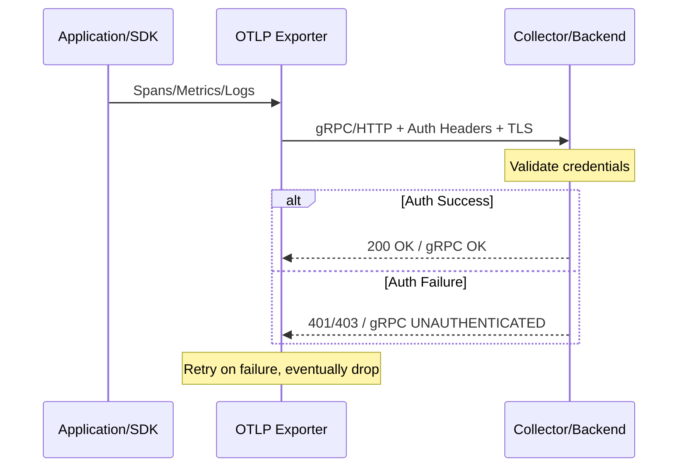

# How to Fix OpenTelemetry Exporter Authentication Failures

Author: [nawazdhandala](https://www.github.com/nawazdhandala)

Tags: OpenTelemetry, Exporter, Authentication, TLS, Troubleshooting, Security

Description: Diagnose and resolve common authentication failures in OpenTelemetry exporters, including TLS errors, token issues, and header misconfiguration.

---

Authentication failures in OpenTelemetry exporters are one of the most frustrating issues to debug because they often manifest as silent data loss. Your application keeps running, spans get created, but nothing shows up in your backend. The exporter quietly fails, retries a few times, and eventually drops the data. This post covers the most common authentication failure modes and how to fix each one.

## How Exporter Authentication Works

Before troubleshooting, it helps to understand the authentication flow. When an OpenTelemetry exporter sends data to a backend, it typically uses one of three mechanisms: TLS client certificates, bearer tokens in HTTP headers, or API keys passed as metadata. The OTLP exporter supports all of these, and the specific mechanism depends on your backend.



## Detecting Authentication Failures

The first challenge is knowing that authentication is failing at all. By default, most SDKs log exporter errors at a warning level, and many production deployments have warning logs turned off or drowned out by noise.

Enable debug logging in your SDK to see exporter errors:

```python
import logging

# Enable debug logging for the OpenTelemetry exporter.
# This will show every export attempt and its result,
# including authentication errors.
logging.basicConfig(level=logging.DEBUG)
logger = logging.getLogger("opentelemetry.exporter.otlp")
logger.setLevel(logging.DEBUG)
```

In Go, you can set the environment variable:

```bash
# Enable verbose gRPC logging to see auth failures
export GRPC_GO_LOG_SEVERITY_LEVEL=info
export GRPC_GO_LOG_VERBOSITY_LEVEL=99
export OTEL_LOG_LEVEL=debug
```

On the Collector side, check the logs for authentication-related errors:

```bash
# Common error patterns to look for in Collector logs
# These indicate the Collector cannot authenticate with the backend
# "rpc error: code = Unauthenticated"
# "failed to export: 401 Unauthorized"
# "certificate signed by unknown authority"
# "x509: certificate has expired"
```

You can also check the Collector's internal metrics for export failures:

```bash
# Check for failed exports due to auth issues
curl -s http://localhost:8888/metrics | grep otelcol_exporter_send_failed
```

A steadily increasing count on `otelcol_exporter_send_failed_spans` or the equivalent metric for logs and metrics is a strong indicator of persistent authentication problems.

## Fix 1: TLS Certificate Issues

TLS certificate problems are the single most common authentication failure. They come in several flavors.

**Expired certificates.** This is straightforward but easy to miss. Check the certificate expiry:

```bash
# Check when a certificate expires
# Replace with the path to your actual certificate file
openssl x509 -enddate -noout -in /etc/otel/certs/client.crt

# Check the server certificate directly
echo | openssl s_client -connect backend.example.com:4317 2>/dev/null | \
  openssl x509 -noout -dates
```

**Unknown certificate authority.** The exporter does not trust the CA that signed the backend's certificate. This is common with internal CAs or self-signed certificates.

For the OTLP exporter in the Collector, provide the CA certificate:

```yaml
# Collector exporter config with custom CA certificate
exporters:
  otlp:
    endpoint: backend.example.com:4317
    tls:
      # Path to the CA certificate that signed the backend's cert.
      # The Collector will use this to verify the backend's identity.
      ca_file: /etc/otel/certs/ca.crt

      # If the backend also requires client certificate auth,
      # provide the client cert and key as well.
      cert_file: /etc/otel/certs/client.crt
      key_file: /etc/otel/certs/client.key
```

In a Python SDK exporter:

```python
from opentelemetry.exporter.otlp.proto.grpc.trace_exporter import OTLPSpanExporter
import grpc
import ssl

# Load the custom CA certificate for verifying the backend
with open("/etc/otel/certs/ca.crt", "rb") as f:
    ca_cert = f.read()

# Create SSL credentials with the custom CA.
# This tells the gRPC client to trust certificates signed by this CA.
credentials = grpc.ssl_channel_credentials(root_certificates=ca_cert)

exporter = OTLPSpanExporter(
    endpoint="backend.example.com:4317",
    credentials=credentials,
)
```

In Go:

```go
package main

import (
    "crypto/tls"
    "crypto/x509"
    "os"
    "google.golang.org/grpc/credentials"
    "go.opentelemetry.io/otel/exporters/otlp/otlptrace/otlptracegrpc"
)

func createExporter() (*otlptracegrpc.Exporter, error) {
    // Load the CA certificate
    caCert, err := os.ReadFile("/etc/otel/certs/ca.crt")
    if err != nil {
        return nil, err
    }

    // Create a certificate pool and add the CA cert
    certPool := x509.NewCertPool()
    certPool.AppendCertsFromPEM(caCert)

    // Configure TLS with the custom CA
    tlsConfig := &tls.Config{
        RootCAs: certPool,
    }

    creds := credentials.NewTLS(tlsConfig)

    return otlptracegrpc.New(
        context.Background(),
        otlptracegrpc.WithEndpoint("backend.example.com:4317"),
        otlptracegrpc.WithTLSCredentials(creds),
    )
}
```

**Certificate hostname mismatch.** The hostname in the certificate does not match the endpoint you are connecting to. This happens when you connect by IP address but the certificate was issued for a DNS name, or when you use an internal hostname that does not match the certificate's Subject Alternative Names.

```bash
# Check what hostnames a certificate is valid for
openssl x509 -in /etc/otel/certs/server.crt -noout -text | grep -A 1 "Subject Alternative Name"

# Example output:
# X509v3 Subject Alternative Name:
#     DNS:backend.example.com, DNS:*.example.com, IP:10.0.1.50
```

If the hostname does not match, you have two options: fix the endpoint to use the correct hostname, or regenerate the certificate with the correct SANs.

As a temporary workaround during development (never in production), you can skip TLS verification:

```yaml
# DEVELOPMENT ONLY: Skip TLS verification
# Never use this in production. It disables all certificate checks.
exporters:
  otlp:
    endpoint: backend.example.com:4317
    tls:
      insecure_skip_verify: true
```

## Fix 2: Bearer Token and API Key Issues

Many observability backends require an API key or bearer token for authentication. These are typically sent as gRPC metadata or HTTP headers.

For the Collector, configure authentication headers in the exporter:

```yaml
# Collector exporter with API key authentication
exporters:
  otlp:
    endpoint: backend.example.com:4317
    headers:
      # The exact header name depends on your backend.
      # Common patterns include:
      #   Authorization: Bearer <token>
      #   x-api-key: <key>
      #   api-key: <key>
      Authorization: "Bearer your-api-token-here"
```

For the HTTP protocol variant:

```yaml
# OTLP HTTP exporter with API key
exporters:
  otlphttp:
    endpoint: https://backend.example.com
    headers:
      # HTTP exporters use the same header format
      x-api-key: "your-api-key-here"
```

In the Python SDK:

```python
from opentelemetry.exporter.otlp.proto.grpc.trace_exporter import OTLPSpanExporter

# Pass authentication headers directly to the exporter.
# Headers are sent with every export request.
exporter = OTLPSpanExporter(
    endpoint="backend.example.com:4317",
    headers=(("authorization", "Bearer your-api-token-here"),),
)
```

Or via environment variables, which works for any SDK:

```bash
# Set authentication headers via environment variable.
# Format: key=value pairs separated by commas.
# These headers are included in every OTLP export request.
export OTEL_EXPORTER_OTLP_HEADERS="authorization=Bearer your-api-token-here"

# For HTTP endpoints
export OTEL_EXPORTER_OTLP_ENDPOINT="https://backend.example.com"
export OTEL_EXPORTER_OTLP_PROTOCOL="http/protobuf"
```

**Common token mistakes to check:**

The token has extra whitespace or newline characters. This happens frequently when reading tokens from files or environment variables:

```bash
# Wrong: this captures a trailing newline
export OTEL_EXPORTER_OTLP_HEADERS="authorization=Bearer $(cat /etc/otel/token)"

# Right: use tr to strip the newline
export OTEL_EXPORTER_OTLP_HEADERS="authorization=Bearer $(cat /etc/otel/token | tr -d '\n')"
```

The token has expired. Many backends issue tokens with a TTL. If your Collector has been running for days, the token may have expired:

```bash
# Decode a JWT token to check expiry (requires jq)
echo "your-jwt-token" | cut -d. -f2 | base64 -d 2>/dev/null | jq '.exp | todate'
```

## Fix 3: Protocol Mismatch (gRPC vs HTTP)

A surprisingly common authentication failure happens when the exporter uses gRPC but the backend expects HTTP, or vice versa. This does not always produce a clear error message. Sometimes it looks like an authentication failure because the backend cannot parse the incoming request at all.

```yaml
# Wrong: using gRPC exporter to talk to an HTTP-only endpoint
exporters:
  otlp:
    endpoint: https://backend.example.com/v1/traces  # This is an HTTP URL
    # The OTLP gRPC exporter will try to establish a gRPC connection
    # to this URL and fail with confusing errors

# Right: use otlphttp for HTTP endpoints
exporters:
  otlphttp:
    endpoint: https://backend.example.com
    # The HTTP exporter will POST to /v1/traces, /v1/metrics, /v1/logs
```

On the SDK side, make sure you import the correct exporter:

```python
# For gRPC backends (port 4317 by default)
from opentelemetry.exporter.otlp.proto.grpc.trace_exporter import OTLPSpanExporter

grpc_exporter = OTLPSpanExporter(
    endpoint="backend.example.com:4317",
)

# For HTTP backends (port 4318 by default)
from opentelemetry.exporter.otlp.proto.http.trace_exporter import OTLPSpanExporter

http_exporter = OTLPSpanExporter(
    endpoint="https://backend.example.com:4318",
)
```

## Fix 4: Collector Authentication Extensions

If you are running the OpenTelemetry Collector and need to authenticate with a backend that uses OAuth2 or other token-based protocols, use the built-in authentication extensions rather than hardcoding tokens:

```yaml
# Collector config with OAuth2 client credentials flow
extensions:
  oauth2client:
    # The Collector will automatically request and refresh tokens
    client_id: "your-client-id"
    client_secret: "your-client-secret"
    token_url: "https://auth.example.com/oauth/token"
    scopes: ["telemetry:write"]
    # Timeout for token requests
    timeout: 10s

receivers:
  otlp:
    protocols:
      grpc:
        endpoint: 0.0.0.0:4317

exporters:
  otlp:
    endpoint: backend.example.com:4317
    # Reference the auth extension for this exporter.
    # The extension handles token acquisition and renewal.
    auth:
      authenticator: oauth2client

service:
  extensions: [oauth2client]
  pipelines:
    traces:
      receivers: [otlp]
      exporters: [otlp]
```

This approach handles token refresh automatically, which eliminates the expired token problem entirely.

For bearer token authentication with a static token from a file:

```yaml
# Collector config with bearer token from file
extensions:
  bearertokenauth:
    # Read token from a file. The extension watches the file
    # for changes and automatically updates the token.
    filename: /etc/otel/token

receivers:
  otlp:
    protocols:
      grpc:
        endpoint: 0.0.0.0:4317

exporters:
  otlp:
    endpoint: backend.example.com:4317
    auth:
      authenticator: bearertokenauth

service:
  extensions: [bearertokenauth]
  pipelines:
    traces:
      receivers: [otlp]
      exporters: [otlp]
```

## Fix 5: Network and Proxy Issues Masquerading as Auth Failures

Sometimes what looks like an authentication failure is actually a network issue. A corporate proxy, service mesh sidecar, or network policy might be intercepting the connection and returning its own authentication challenge.

To rule this out, test connectivity from the same network context as your application or Collector:

```bash
# Test basic connectivity to the backend
# If this times out, you have a network issue, not an auth issue
nc -zv backend.example.com 4317

# Test gRPC connectivity with grpcurl
grpcurl -insecure backend.example.com:4317 list

# Test HTTP connectivity with curl
curl -v https://backend.example.com:4318/v1/traces \
  -H "Content-Type: application/x-protobuf" \
  -H "Authorization: Bearer your-token" \
  -d ''
```

If you are running in Kubernetes with a service mesh like Istio, the mesh's mTLS might conflict with the exporter's TLS configuration:

```yaml
# When running behind Istio, the sidecar handles mTLS.
# The exporter should use plaintext to the sidecar,
# and the sidecar encrypts the connection.
exporters:
  otlp:
    endpoint: backend.example.com:4317
    tls:
      # Disable TLS because the Istio sidecar handles it
      insecure: true
```

## A Systematic Debugging Checklist

When you encounter an authentication failure, work through this list in order:

1. Enable debug logging on the exporter to see the actual error message.
2. Check if you can reach the backend at all (network connectivity).
3. Verify the protocol matches (gRPC vs HTTP).
4. Check TLS certificates for expiry, CA trust, and hostname matching.
5. Verify authentication credentials (tokens, API keys, headers).
6. Check for trailing whitespace or newlines in credential values.
7. Test with a known-good credential from a tool like `grpcurl` or `curl`.
8. Check if a proxy or service mesh is intercepting the connection.

Most authentication failures fall into one of these categories, and working through them systematically will get you to the root cause faster than guessing.

## Conclusion

OpenTelemetry exporter authentication failures are frustrating because they often fail silently. The key to fixing them quickly is enabling debug logging so you can see the actual error, then systematically checking TLS configuration, credentials, and network connectivity. Use the Collector's built-in authentication extensions for token management whenever possible, and always verify your protocol choice matches what the backend expects. With proper observability into the exporter itself, authentication issues become straightforward to diagnose and resolve.
