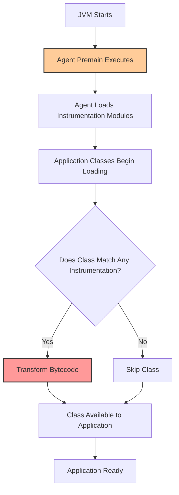

# How to Fix OpenTelemetry Java Agent Slow Startup and High Cold Start Latency

Author: [nawazdhandala](https://www.github.com/nawazdhandala)

Tags: OpenTelemetry, Java, Performance, JVM, Cold Start, Instrumentation, Troubleshooting

Description: Learn how to diagnose and fix slow startup times caused by the OpenTelemetry Java agent, including JVM tuning and selective instrumentation strategies.

---

If you have ever attached the OpenTelemetry Java agent to a production service and watched the startup time balloon from 3 seconds to 15 or more, you are not alone. The Java agent performs bytecode manipulation at class load time, and depending on your application size and configuration, this can add serious latency to cold starts. This is especially painful in serverless environments, Kubernetes pods with aggressive readiness probes, or any deployment where fast startup matters.

This guide walks through the root causes of slow startup with the OpenTelemetry Java agent and provides concrete fixes that you can apply today.

## Why the Java Agent Slows Down Startup

The OpenTelemetry Java agent uses bytecode instrumentation to automatically capture traces, metrics, and logs from your application. When the JVM loads a class, the agent intercepts it, checks if any instrumentation modules match, and rewrites the bytecode if needed. This happens for every single class your application loads.

The cost adds up in a few ways:

- Class scanning and matching runs against hundreds of instrumentation modules
- Bytecode transformation requires parsing and rewriting class files
- The agent itself loads a significant number of classes during initialization
- Reflection and annotation scanning add overhead during the matching phase

Here is what the startup flow looks like:



The bottleneck is in steps C through F. The more instrumentation modules loaded and the more classes your application has, the longer this takes.

## Measuring the Actual Impact

Before you start optimizing, measure the baseline. Add these JVM flags to quantify class loading time:

```bash
# Run your application with class loading statistics enabled
# -verbose:class prints each class as it loads
# -Xlog:class+load logs class loading with timestamps
java -verbose:class \
     -Xlog:class+load=info:file=classload.log:time \
     -javaagent:opentelemetry-javaagent.jar \
     -jar your-application.jar
```

You can also measure startup time directly by comparing with and without the agent:

```bash
# Measure startup time without agent
# time reports wall clock, user CPU, and system CPU time
time java -jar your-application.jar --check-startup

# Measure startup time with agent
# Same application, same flags, but with the agent attached
time java -javaagent:opentelemetry-javaagent.jar \
     -jar your-application.jar --check-startup
```

If the difference is more than a few seconds, the following optimizations will help.

## Fix 1: Disable Unused Instrumentation Modules

The single most effective optimization is disabling instrumentation modules you do not need. The agent ships with instrumentation for dozens of libraries. If your application only uses Spring Web and JDBC, there is no reason to load instrumentation for gRPC, Kafka, Lettuce, and everything else.

```bash
# Disable specific instrumentations that your application does not use
# Each -Dotel.instrumentation.[name].enabled=false flag prevents
# that module from loading and matching against classes
java -javaagent:opentelemetry-javaagent.jar \
     -Dotel.instrumentation.kafka.enabled=false \
     -Dotel.instrumentation.grpc.enabled=false \
     -Dotel.instrumentation.lettuce.enabled=false \
     -Dotel.instrumentation.mongo.enabled=false \
     -Dotel.instrumentation.elasticsearch.enabled=false \
     -Dotel.instrumentation.rabbitmq.enabled=false \
     -Dotel.instrumentation.aws-sdk.enabled=false \
     -jar your-application.jar
```

A more aggressive approach is to disable everything and only enable what you need:

```bash
# Disable all instrumentations first, then selectively enable
# This is the fastest approach because it minimizes class matching
java -javaagent:opentelemetry-javaagent.jar \
     -Dotel.instrumentation.common.default-enabled=false \
     -Dotel.instrumentation.spring-web.enabled=true \
     -Dotel.instrumentation.spring-webmvc.enabled=true \
     -Dotel.instrumentation.jdbc.enabled=true \
     -Dotel.instrumentation.hikaricp.enabled=true \
     -Dotel.instrumentation.logback-appender.enabled=true \
     -jar your-application.jar
```

This approach typically reduces startup overhead by 50 to 70 percent because the agent skips the matching phase for all disabled modules.

## Fix 2: Use Lazy Attachment with the Agent

Starting with recent versions of the Java agent, you can configure lazy class transformation. Instead of transforming classes eagerly at load time, the agent can defer some work:

```properties
# otel-agent.properties
# Configure the agent to use lazy attachment where possible
# This defers bytecode transformation until first use
otel.javaagent.experimental.early-start=false

# Reduce initial instrumentation scope
# Only instrument classes as they are actually used
otel.javaagent.experimental.lazy-attach=true
```

```bash
# Pass the properties file to the agent
java -javaagent:opentelemetry-javaagent.jar \
     -Dotel.javaagent.configuration-file=otel-agent.properties \
     -jar your-application.jar
```

Note that lazy attachment is experimental and may not work with all instrumentation modules. Test thoroughly in a staging environment before deploying to production.

## Fix 3: JVM Tuning for Faster Class Loading

The JVM itself has options that can speed up class loading, which directly impacts agent startup time:

```bash
# JVM flags to optimize class loading and agent performance
java -javaagent:opentelemetry-javaagent.jar \
     -XX:+UseCompressedOops \
     -XX:+UseCompressedClassPointers \
     -XX:TieredStopAtLevel=1 \
     -XX:+UseSerialGC \
     -Xms256m \
     -Xmx256m \
     -jar your-application.jar
```

Here is what each flag does:

- `-XX:TieredStopAtLevel=1` stops JIT compilation at the first tier, which speeds up startup at the cost of peak throughput. This is ideal for serverless or short-lived processes.
- `-XX:+UseSerialGC` avoids GC thread startup overhead. Good for small heap sizes during initialization.
- `-Xms256m` and `-Xmx256m` set a fixed heap size, avoiding the cost of heap resizing during startup.

For long-running services where you want both fast startup and good steady-state performance, use CDS (Class Data Sharing):

```bash
# Step 1: Create a class list by running the application briefly
# This records which classes are loaded during startup
java -javaagent:opentelemetry-javaagent.jar \
     -XX:DumpLoadedClassList=classes.lst \
     -jar your-application.jar --check-startup

# Step 2: Create a shared archive from the class list
# This pre-processes and stores class metadata for reuse
java -javaagent:opentelemetry-javaagent.jar \
     -Xshare:dump \
     -XX:SharedClassListFile=classes.lst \
     -XX:SharedArchiveFile=app-cds.jsa \
     -jar your-application.jar --check-startup

# Step 3: Use the shared archive for subsequent starts
# Class loading reads from the pre-processed archive instead of JAR files
java -javaagent:opentelemetry-javaagent.jar \
     -Xshare:on \
     -XX:SharedArchiveFile=app-cds.jsa \
     -jar your-application.jar
```

CDS can reduce startup time by 20 to 40 percent because the JVM reads pre-processed class metadata from a memory-mapped file instead of parsing JAR files.

## Fix 4: Switch to Manual Instrumentation for Critical Paths

If automatic instrumentation overhead is unacceptable, you can switch to manual instrumentation for your most important code paths and skip the agent entirely:

```java
// build.gradle - add OpenTelemetry SDK dependencies instead of using the agent
// These libraries add no startup overhead because there is no bytecode manipulation
dependencies {
    implementation 'io.opentelemetry:opentelemetry-api:1.36.0'
    implementation 'io.opentelemetry:opentelemetry-sdk:1.36.0'
    implementation 'io.opentelemetry:opentelemetry-exporter-otlp:1.36.0'
    implementation 'io.opentelemetry:opentelemetry-sdk-extension-autoconfigure:1.36.0'
}
```

```java
// TracingConfig.java
// Initialize the OpenTelemetry SDK programmatically
// This avoids the agent entirely, eliminating bytecode transformation overhead
import io.opentelemetry.api.OpenTelemetry;
import io.opentelemetry.sdk.OpenTelemetrySdk;
import io.opentelemetry.sdk.trace.SdkTracerProvider;
import io.opentelemetry.sdk.trace.export.BatchSpanProcessor;
import io.opentelemetry.exporter.otlp.trace.OtlpGrpcSpanExporter;

public class TracingConfig {

    public static OpenTelemetry initialize() {
        // Configure the OTLP exporter to send spans to the collector
        OtlpGrpcSpanExporter exporter = OtlpGrpcSpanExporter.builder()
                .setEndpoint("http://otel-collector:4317")
                .build();

        // Batch processor groups spans for efficient export
        SdkTracerProvider tracerProvider = SdkTracerProvider.builder()
                .addSpanProcessor(BatchSpanProcessor.builder(exporter).build())
                .build();

        // Build and register the SDK globally
        return OpenTelemetrySdk.builder()
                .setTracerProvider(tracerProvider)
                .buildAndRegisterGlobal();
    }
}
```

```java
// OrderService.java
// Manually instrument specific methods that matter for observability
// This gives you full control over what gets traced
import io.opentelemetry.api.GlobalOpenTelemetry;
import io.opentelemetry.api.trace.Span;
import io.opentelemetry.api.trace.Tracer;

public class OrderService {

    private static final Tracer tracer =
            GlobalOpenTelemetry.getTracer("order-service", "1.0.0");

    public Order processOrder(OrderRequest request) {
        // Create a span only for this specific business operation
        Span span = tracer.spanBuilder("processOrder")
                .setAttribute("order.type", request.getType())
                .startSpan();

        try {
            Order order = createOrder(request);
            span.setAttribute("order.id", order.getId());
            return order;
        } catch (Exception e) {
            span.recordException(e);
            throw e;
        } finally {
            span.end();
        }
    }
}
```

Manual instrumentation adds zero startup overhead. The tradeoff is that you only get traces for code you explicitly instrument, so you lose the automatic coverage of HTTP handlers, database calls, and library internals that the agent provides.

## Fix 5: Use a Hybrid Approach

The best solution for many teams is a hybrid: use the agent for automatic library instrumentation but keep the module list minimal, and add manual spans for business logic:

```bash
# Hybrid approach: minimal agent + manual instrumentation
# Only enable the agent for libraries that are hard to instrument manually
java -javaagent:opentelemetry-javaagent.jar \
     -Dotel.instrumentation.common.default-enabled=false \
     -Dotel.instrumentation.spring-webmvc.enabled=true \
     -Dotel.instrumentation.jdbc.enabled=true \
     -Dotel.instrumentation.logback-appender.enabled=true \
     -Dotel.service.name=order-service \
     -Dotel.exporter.otlp.endpoint=http://otel-collector:4317 \
     -jar your-application.jar
```

This gives you automatic HTTP and database instrumentation with minimal startup cost, plus whatever custom spans you add in your business code.

## Monitoring Startup Time in Production

Once you have applied optimizations, track startup time as a metric:

```java
// StartupMetrics.java
// Record application startup duration as a metric
// This lets you track startup time trends over deployments
import io.opentelemetry.api.GlobalOpenTelemetry;
import io.opentelemetry.api.metrics.LongHistogram;
import io.opentelemetry.api.metrics.Meter;

public class StartupMetrics {

    public static void recordStartupTime(long startTimeMs) {
        Meter meter = GlobalOpenTelemetry.getMeter("startup-metrics");

        // Create a histogram to record startup duration
        LongHistogram startupDuration = meter
                .histogramBuilder("app.startup.duration")
                .setDescription("Application startup time in milliseconds")
                .setUnit("ms")
                .ofLongs()
                .build();

        long duration = System.currentTimeMillis() - startTimeMs;
        startupDuration.record(duration);
    }
}
```

## Summary of Optimization Impact

Here is a rough guide to what each optimization buys you:

| Optimization | Startup Reduction | Tradeoff |
|---|---|---|
| Disable unused modules | 50-70% | Need to maintain explicit module list |
| CDS shared archive | 20-40% | Extra build step to generate archive |
| JVM tiered compilation | 15-30% | Lower peak throughput |
| Manual instrumentation | 90-100% | No automatic library coverage |
| Hybrid approach | 60-80% | Best balance for most teams |

Start with disabling unused instrumentation modules. That alone will fix the problem for most applications. If you need sub-second startup in a serverless or scale-to-zero environment, consider switching to manual instrumentation or the hybrid approach with CDS.

The key insight is that the OpenTelemetry Java agent was designed for comprehensive observability, not minimal startup time. By trimming it to only what you need, you can get both good observability and acceptable startup performance.
